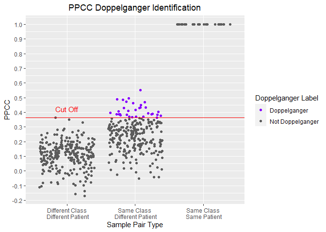
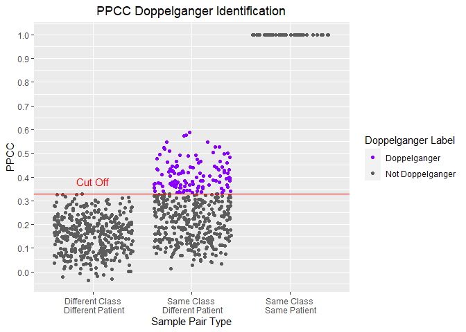
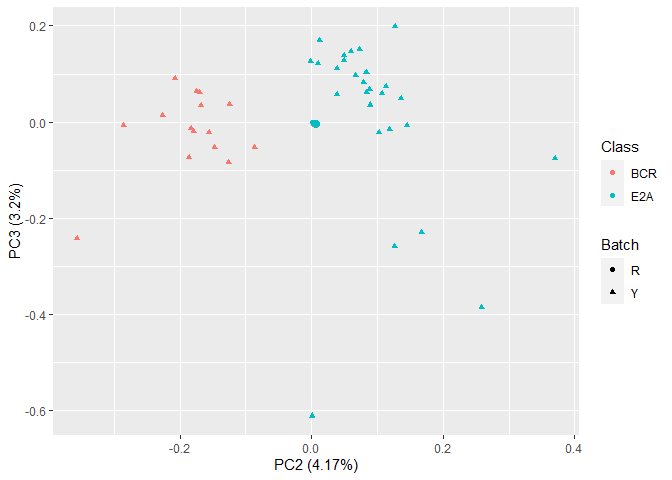
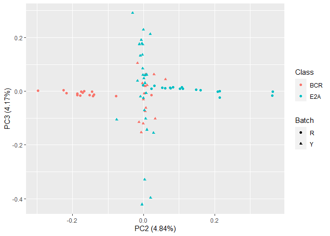

The Doppelganger Effect in Biomedical Data sets
================
Wang Li Rong

# 3\. Exploring the ALL (Acute Lymphocytic Leukemia) Datasets

## 0\) Import packages

File paths

``` r
data_dir = "../data"
cleaned_data_dir = "../cleaned_data"
images_dir = "../images"
planning_data_dir = "../planning_data"
experiment_plans_dir = "../experiment_plans"
```

Load functions for pre-processing and analysis:

``` r
functions_dir = "../functions"
source(file.path(functions_dir,"preprocessing_functions.R"))
source(file.path(functions_dir,"analysis_functions.R"))
source(file.path(functions_dir,"planning_functions.R"))
source(file.path(functions_dir,"process_vectors.R"))
source(file.path(functions_dir,"process_lists.R"))
```

## 1\) Importing the Datsets

AllenData/ Ross et al. - 15 BCR - 18 E2A

``` r
all_r = getDataFile(
  filename = file.path(data_dir, "Subtype-AllenData.csv"),
  affy_attribute = "affy_hg_u133a",
  batch_name = "R")
all_r_meta = getMetaDataDataframe(df = all_r,
                                  batch_name = "R")
```

MaryData/Yeoh et al. - 15 BCR - 27 E2A

``` r
all_y = getDataFile(
  filename = file.path(data_dir, "Subtype-MaryData.csv"),
  affy_attribute = "affy_hg_u95av2",
  batch_name = "Y")
all_y_meta = getMetaDataDataframe(df = all_y,
                                  batch_name = "Y")
```

## 2\) Finding Doppelgangers

### a) Within Ross et Al.

``` r
doppel_all_r = getPPCCDoppelgangers(all_r, 
                                    all_r_meta,
                                    do_min_max = TRUE)
```

    ## [1] "1. No batch correction since there is only 1 batch..."
    ## [1] "- Data is min-max normalized"
    ## [1] "2. Calculating PPCC between samples of the same dataset..."
    ##   |                                                                              |=                                                                     |   1%  |                                                                              |                                                                      |   0%  |                                                                              |                                                                      |   1%  |                                                                              |=                                                                     |   1%  |                                                                              |=                                                                     |   2%  |                                                                              |==                                                                    |   2%  |                                                                              |==                                                                    |   3%  |                                                                              |==                                                                    |   4%  |                                                                              |===                                                                   |   4%  |                                                                              |===                                                                   |   5%  |                                                                              |====                                                                  |   5%  |                                                                              |====                                                                  |   6%  |                                                                              |=====                                                                 |   7%  |                                                                              |=====                                                                 |   8%  |                                                                              |======                                                                |   8%  |                                                                              |======                                                                |   9%  |                                                                              |=======                                                               |   9%  |                                                                              |=======                                                               |  10%  |                                                                              |=======                                                               |  11%  |                                                                              |========                                                              |  11%  |                                                                              |========                                                              |  12%  |                                                                              |=========                                                             |  12%  |                                                                              |=========                                                             |  13%  |                                                                              |=========                                                             |  14%  |                                                                              |==========                                                            |  14%  |                                                                              |==========                                                            |  15%  |                                                                              |===========                                                           |  15%  |                                                                              |===========                                                           |  16%  |                                                                              |============                                                          |  17%  |                                                                              |============                                                          |  18%  |                                                                              |=============                                                         |  18%  |                                                                              |=============                                                         |  19%  |                                                                              |==============                                                        |  19%  |                                                                              |==============                                                        |  20%  |                                                                              |==============                                                        |  21%  |                                                                              |===============                                                       |  21%  |                                                                              |===============                                                       |  22%  |                                                                              |================                                                      |  22%  |                                                                              |================                                                      |  23%  |                                                                              |================                                                      |  24%  |                                                                              |=================                                                     |  24%  |                                                                              |=================                                                     |  25%  |                                                                              |==================                                                    |  25%  |                                                                              |==================                                                    |  26%  |                                                                              |===================                                                   |  27%  |                                                                              |===================                                                   |  28%  |                                                                              |====================                                                  |  28%  |                                                                              |====================                                                  |  29%  |                                                                              |=====================                                                 |  29%  |                                                                              |=====================                                                 |  30%  |                                                                              |=====================                                                 |  31%  |                                                                              |======================                                                |  31%  |                                                                              |======================                                                |  32%  |                                                                              |=======================                                               |  32%  |                                                                              |=======================                                               |  33%  |                                                                              |=======================                                               |  34%  |                                                                              |========================                                              |  34%  |                                                                              |========================                                              |  35%  |                                                                              |=========================                                             |  35%  |                                                                              |=========================                                             |  36%  |                                                                              |==========================                                            |  37%  |                                                                              |==========================                                            |  38%  |                                                                              |===========================                                           |  38%  |                                                                              |===========================                                           |  39%  |                                                                              |============================                                          |  39%  |                                                                              |============================                                          |  40%  |                                                                              |============================                                          |  41%  |                                                                              |=============================                                         |  41%  |                                                                              |=============================                                         |  42%  |                                                                              |==============================                                        |  42%  |                                                                              |==============================                                        |  43%  |                                                                              |===============================                                       |  44%  |                                                                              |===============================                                       |  45%  |                                                                              |================================                                      |  45%  |                                                                              |================================                                      |  46%  |                                                                              |=================================                                     |  47%  |                                                                              |=================================                                     |  48%  |                                                                              |==================================                                    |  48%  |                                                                              |==================================                                    |  49%  |                                                                              |===================================                                   |  49%  |                                                                              |===================================                                   |  50%  |                                                                              |===================================                                   |  51%  |                                                                              |====================================                                  |  51%  |                                                                              |====================================                                  |  52%  |                                                                              |=====================================                                 |  52%  |                                                                              |=====================================                                 |  53%  |                                                                              |======================================                                |  54%  |                                                                              |======================================                                |  55%  |                                                                              |=======================================                               |  55%  |                                                                              |=======================================                               |  56%  |                                                                              |========================================                              |  57%  |                                                                              |========================================                              |  58%  |                                                                              |=========================================                             |  58%  |                                                                              |=========================================                             |  59%  |                                                                              |==========================================                            |  59%  |                                                                              |==========================================                            |  60%  |                                                                              |==========================================                            |  61%  |                                                                              |===========================================                           |  61%  |                                                                              |===========================================                           |  62%  |                                                                              |============================================                          |  62%  |                                                                              |============================================                          |  63%  |                                                                              |=============================================                         |  64%  |                                                                              |=============================================                         |  65%  |                                                                              |==============================================                        |  65%  |                                                                              |==============================================                        |  66%  |                                                                              |===============================================                       |  66%  |                                                                              |===============================================                       |  67%  |                                                                              |===============================================                       |  68%  |                                                                              |================================================                      |  68%  |                                                                              |================================================                      |  69%  |                                                                              |=================================================                     |  69%  |                                                                              |=================================================                     |  70%  |                                                                              |=================================================                     |  71%  |                                                                              |==================================================                    |  71%  |                                                                              |==================================================                    |  72%  |                                                                              |===================================================                   |  72%  |                                                                              |===================================================                   |  73%  |                                                                              |====================================================                  |  74%  |                                                                              |====================================================                  |  75%  |                                                                              |=====================================================                 |  75%  |                                                                              |=====================================================                 |  76%  |                                                                              |======================================================                |  76%  |                                                                              |======================================================                |  77%  |                                                                              |======================================================                |  78%  |                                                                              |=======================================================               |  78%  |                                                                              |=======================================================               |  79%  |                                                                              |========================================================              |  79%  |                                                                              |========================================================              |  80%  |                                                                              |========================================================              |  81%  |                                                                              |=========================================================             |  81%  |                                                                              |=========================================================             |  82%  |                                                                              |==========================================================            |  82%  |                                                                              |==========================================================            |  83%  |                                                                              |===========================================================           |  84%  |                                                                              |===========================================================           |  85%  |                                                                              |============================================================          |  85%  |                                                                              |============================================================          |  86%  |                                                                              |=============================================================         |  86%  |                                                                              |=============================================================         |  87%  |                                                                              |=============================================================         |  88%  |                                                                              |==============================================================        |  88%  |                                                                              |==============================================================        |  89%  |                                                                              |===============================================================       |  89%  |                                                                              |===============================================================       |  90%  |                                                                              |===============================================================       |  91%  |                                                                              |================================================================      |  91%  |                                                                              |================================================================      |  92%  |                                                                              |=================================================================     |  92%  |                                                                              |=================================================================     |  93%  |                                                                              |==================================================================    |  94%  |                                                                              |==================================================================    |  95%  |                                                                              |===================================================================   |  95%  |                                                                              |===================================================================   |  96%  |                                                                              |====================================================================  |  96%  |                                                                              |====================================================================  |  97%  |                                                                              |====================================================================  |  98%  |                                                                              |===================================================================== |  98%  |                                                                              |===================================================================== |  99%  |                                                                              |======================================================================|  99%  |                                                                              |======================================================================| 100%
    ## [1] "3. Labelling Sample Pairs according to their Class and Patient Similarities..."
    ## [1] "4. Calculating PPCC cut off to identify PPCC data doppelgangers..."
    ## [1] "5. Identifying PPCC data doppelgangers..."

``` r
visualisePPCCDoppelgangers(doppel_all_r)
```

<!-- --> 32 Doppelgangers
within Ross et al.

``` r
table(doppel_all_r$PPCC_df$DoppelgangerLabel)
```

    ## 
    ##     Doppelganger Not Doppelganger 
    ##               32              529

### b) Within Yeoh et al.

``` r
doppel_y = getPPCCDoppelgangers(all_y, 
                                all_y_meta,
                                do_min_max = TRUE)
```

    ## [1] "1. No batch correction since there is only 1 batch..."
    ## [1] "- Data is min-max normalized"
    ## [1] "2. Calculating PPCC between samples of the same dataset..."
    ##   |                                                                              |=                                                                     |   1%  |                                                                              |                                                                      |   0%  |                                                                              |                                                                      |   1%  |                                                                              |=                                                                     |   1%  |                                                                              |=                                                                     |   2%  |                                                                              |==                                                                    |   2%  |                                                                              |==                                                                    |   3%  |                                                                              |==                                                                    |   4%  |                                                                              |===                                                                   |   4%  |                                                                              |===                                                                   |   5%  |                                                                              |====                                                                  |   5%  |                                                                              |====                                                                  |   6%  |                                                                              |=====                                                                 |   7%  |                                                                              |=====                                                                 |   8%  |                                                                              |======                                                                |   8%  |                                                                              |======                                                                |   9%  |                                                                              |=======                                                               |   9%  |                                                                              |=======                                                               |  10%  |                                                                              |=======                                                               |  11%  |                                                                              |========                                                              |  11%  |                                                                              |========                                                              |  12%  |                                                                              |=========                                                             |  12%  |                                                                              |=========                                                             |  13%  |                                                                              |=========                                                             |  14%  |                                                                              |==========                                                            |  14%  |                                                                              |==========                                                            |  15%  |                                                                              |===========                                                           |  15%  |                                                                              |===========                                                           |  16%  |                                                                              |============                                                          |  17%  |                                                                              |============                                                          |  18%  |                                                                              |=============                                                         |  18%  |                                                                              |=============                                                         |  19%  |                                                                              |==============                                                        |  19%  |                                                                              |==============                                                        |  20%  |                                                                              |==============                                                        |  21%  |                                                                              |===============                                                       |  21%  |                                                                              |===============                                                       |  22%  |                                                                              |================                                                      |  22%  |                                                                              |================                                                      |  23%  |                                                                              |=================                                                     |  24%  |                                                                              |=================                                                     |  25%  |                                                                              |==================                                                    |  25%  |                                                                              |==================                                                    |  26%  |                                                                              |===================                                                   |  26%  |                                                                              |===================                                                   |  27%  |                                                                              |===================                                                   |  28%  |                                                                              |====================                                                  |  28%  |                                                                              |====================                                                  |  29%  |                                                                              |=====================                                                 |  29%  |                                                                              |=====================                                                 |  30%  |                                                                              |=====================                                                 |  31%  |                                                                              |======================                                                |  31%  |                                                                              |======================                                                |  32%  |                                                                              |=======================                                               |  32%  |                                                                              |=======================                                               |  33%  |                                                                              |=======================                                               |  34%  |                                                                              |========================                                              |  34%  |                                                                              |========================                                              |  35%  |                                                                              |=========================                                             |  35%  |                                                                              |=========================                                             |  36%  |                                                                              |==========================                                            |  36%  |                                                                              |==========================                                            |  37%  |                                                                              |==========================                                            |  38%  |                                                                              |===========================                                           |  38%  |                                                                              |===========================                                           |  39%  |                                                                              |============================                                          |  39%  |                                                                              |============================                                          |  40%  |                                                                              |============================                                          |  41%  |                                                                              |=============================                                         |  41%  |                                                                              |=============================                                         |  42%  |                                                                              |==============================                                        |  42%  |                                                                              |==============================                                        |  43%  |                                                                              |==============================                                        |  44%  |                                                                              |===============================                                       |  44%  |                                                                              |===============================                                       |  45%  |                                                                              |================================                                      |  45%  |                                                                              |================================                                      |  46%  |                                                                              |=================================                                     |  47%  |                                                                              |=================================                                     |  48%  |                                                                              |==================================                                    |  48%  |                                                                              |==================================                                    |  49%  |                                                                              |===================================                                   |  49%  |                                                                              |===================================                                   |  50%  |                                                                              |===================================                                   |  51%  |                                                                              |====================================                                  |  51%  |                                                                              |====================================                                  |  52%  |                                                                              |=====================================                                 |  52%  |                                                                              |=====================================                                 |  53%  |                                                                              |======================================                                |  54%  |                                                                              |======================================                                |  55%  |                                                                              |=======================================                               |  55%  |                                                                              |=======================================                               |  56%  |                                                                              |========================================                              |  56%  |                                                                              |========================================                              |  57%  |                                                                              |========================================                              |  58%  |                                                                              |=========================================                             |  58%  |                                                                              |=========================================                             |  59%  |                                                                              |==========================================                            |  59%  |                                                                              |==========================================                            |  60%  |                                                                              |==========================================                            |  61%  |                                                                              |===========================================                           |  61%  |                                                                              |===========================================                           |  62%  |                                                                              |============================================                          |  62%  |                                                                              |============================================                          |  63%  |                                                                              |============================================                          |  64%  |                                                                              |=============================================                         |  64%  |                                                                              |=============================================                         |  65%  |                                                                              |==============================================                        |  65%  |                                                                              |==============================================                        |  66%  |                                                                              |===============================================                       |  66%  |                                                                              |===============================================                       |  67%  |                                                                              |===============================================                       |  68%  |                                                                              |================================================                      |  68%  |                                                                              |================================================                      |  69%  |                                                                              |=================================================                     |  69%  |                                                                              |=================================================                     |  70%  |                                                                              |=================================================                     |  71%  |                                                                              |==================================================                    |  71%  |                                                                              |==================================================                    |  72%  |                                                                              |===================================================                   |  72%  |                                                                              |===================================================                   |  73%  |                                                                              |===================================================                   |  74%  |                                                                              |====================================================                  |  74%  |                                                                              |====================================================                  |  75%  |                                                                              |=====================================================                 |  75%  |                                                                              |=====================================================                 |  76%  |                                                                              |======================================================                |  77%  |                                                                              |======================================================                |  78%  |                                                                              |=======================================================               |  78%  |                                                                              |=======================================================               |  79%  |                                                                              |========================================================              |  79%  |                                                                              |========================================================              |  80%  |                                                                              |========================================================              |  81%  |                                                                              |=========================================================             |  81%  |                                                                              |=========================================================             |  82%  |                                                                              |==========================================================            |  82%  |                                                                              |==========================================================            |  83%  |                                                                              |===========================================================           |  84%  |                                                                              |===========================================================           |  85%  |                                                                              |============================================================          |  85%  |                                                                              |============================================================          |  86%  |                                                                              |=============================================================         |  86%  |                                                                              |=============================================================         |  87%  |                                                                              |=============================================================         |  88%  |                                                                              |==============================================================        |  88%  |                                                                              |==============================================================        |  89%  |                                                                              |===============================================================       |  89%  |                                                                              |===============================================================       |  90%  |                                                                              |===============================================================       |  91%  |                                                                              |================================================================      |  91%  |                                                                              |================================================================      |  92%  |                                                                              |=================================================================     |  92%  |                                                                              |=================================================================     |  93%  |                                                                              |==================================================================    |  94%  |                                                                              |==================================================================    |  95%  |                                                                              |===================================================================   |  95%  |                                                                              |===================================================================   |  96%  |                                                                              |====================================================================  |  96%  |                                                                              |====================================================================  |  97%  |                                                                              |====================================================================  |  98%  |                                                                              |===================================================================== |  98%  |                                                                              |===================================================================== |  99%  |                                                                              |======================================================================|  99%  |                                                                              |======================================================================| 100%
    ## [1] "3. Labelling Sample Pairs according to their Class and Patient Similarities..."
    ## [1] "4. Calculating PPCC cut off to identify PPCC data doppelgangers..."
    ## [1] "5. Identifying PPCC data doppelgangers..."

``` r
visualisePPCCDoppelgangers(doppel_y)
```

<!-- -->

There are 121 Doppelgangers in Yeoh et al.

``` r
table(doppel_y$PPCC_df$DoppelgangerLabel)
```

    ## 
    ##     Doppelganger Not Doppelganger 
    ##              121              782

### c) Between Ross and Yeoh

``` r
shared_variables_all =  intersect(
                          rownames(all_r),
                          rownames(all_y))
all = data.frame(cbind(all_r[shared_variables_all,],
                       all_y[shared_variables_all,]))
all_meta = data.frame(rbind(all_r_meta, all_y_meta))
doppel_ry = getPPCCDoppelgangers(all, 
                                 all_meta,
                                 do_min_max = TRUE)
```

    ## [1] "1. Batch correcting the 2 data sets with sva:ComBat..."

    ## Found2batches

    ## Adjusting for0covariate(s) or covariate level(s)

    ## Standardizing Data across genes

    ## Fitting L/S model and finding priors

    ## Finding parametric adjustments

    ## Adjusting the Data

    ## [1] "- Data is min-max normalized"
    ## [1] "2. Calculating PPCC between samples of each batch..."
    ##   |                                                                              |=                                                                     |   1%  |                                                                              |                                                                      |   0%  |                                                                              |                                                                      |   1%  |                                                                              |=                                                                     |   1%  |                                                                              |=                                                                     |   2%  |                                                                              |==                                                                    |   2%  |                                                                              |==                                                                    |   3%  |                                                                              |==                                                                    |   4%  |                                                                              |===                                                                   |   4%  |                                                                              |===                                                                   |   5%  |                                                                              |====                                                                  |   5%  |                                                                              |====                                                                  |   6%  |                                                                              |=====                                                                 |   6%  |                                                                              |=====                                                                 |   7%  |                                                                              |=====                                                                 |   8%  |                                                                              |======                                                                |   8%  |                                                                              |======                                                                |   9%  |                                                                              |=======                                                               |   9%  |                                                                              |=======                                                               |  10%  |                                                                              |=======                                                               |  11%  |                                                                              |========                                                              |  11%  |                                                                              |========                                                              |  12%  |                                                                              |=========                                                             |  12%  |                                                                              |=========                                                             |  13%  |                                                                              |=========                                                             |  14%  |                                                                              |==========                                                            |  14%  |                                                                              |==========                                                            |  15%  |                                                                              |===========                                                           |  15%  |                                                                              |===========                                                           |  16%  |                                                                              |============                                                          |  16%  |                                                                              |============                                                          |  17%  |                                                                              |============                                                          |  18%  |                                                                              |=============                                                         |  18%  |                                                                              |=============                                                         |  19%  |                                                                              |==============                                                        |  19%  |                                                                              |==============                                                        |  20%  |                                                                              |==============                                                        |  21%  |                                                                              |===============                                                       |  21%  |                                                                              |===============                                                       |  22%  |                                                                              |================                                                      |  22%  |                                                                              |================                                                      |  23%  |                                                                              |================                                                      |  24%  |                                                                              |=================                                                     |  24%  |                                                                              |=================                                                     |  25%  |                                                                              |==================                                                    |  25%  |                                                                              |==================                                                    |  26%  |                                                                              |===================                                                   |  26%  |                                                                              |===================                                                   |  27%  |                                                                              |===================                                                   |  28%  |                                                                              |====================                                                  |  28%  |                                                                              |====================                                                  |  29%  |                                                                              |=====================                                                 |  29%  |                                                                              |=====================                                                 |  30%  |                                                                              |=====================                                                 |  31%  |                                                                              |======================                                                |  31%  |                                                                              |======================                                                |  32%  |                                                                              |=======================                                               |  32%  |                                                                              |=======================                                               |  33%  |                                                                              |=======================                                               |  34%  |                                                                              |========================                                              |  34%  |                                                                              |========================                                              |  35%  |                                                                              |=========================                                             |  35%  |                                                                              |=========================                                             |  36%  |                                                                              |==========================                                            |  36%  |                                                                              |==========================                                            |  37%  |                                                                              |==========================                                            |  38%  |                                                                              |===========================                                           |  38%  |                                                                              |===========================                                           |  39%  |                                                                              |============================                                          |  39%  |                                                                              |============================                                          |  40%  |                                                                              |============================                                          |  41%  |                                                                              |=============================                                         |  41%  |                                                                              |=============================                                         |  42%  |                                                                              |==============================                                        |  42%  |                                                                              |==============================                                        |  43%  |                                                                              |==============================                                        |  44%  |                                                                              |===============================                                       |  44%  |                                                                              |===============================                                       |  45%  |                                                                              |================================                                      |  45%  |                                                                              |================================                                      |  46%  |                                                                              |=================================                                     |  46%  |                                                                              |=================================                                     |  47%  |                                                                              |=================================                                     |  48%  |                                                                              |==================================                                    |  48%  |                                                                              |==================================                                    |  49%  |                                                                              |===================================                                   |  49%  |                                                                              |===================================                                   |  50%  |                                                                              |===================================                                   |  51%  |                                                                              |====================================                                  |  51%  |                                                                              |====================================                                  |  52%  |                                                                              |=====================================                                 |  52%  |                                                                              |=====================================                                 |  53%  |                                                                              |=====================================                                 |  54%  |                                                                              |======================================                                |  54%  |                                                                              |======================================                                |  55%  |                                                                              |=======================================                               |  55%  |                                                                              |=======================================                               |  56%  |                                                                              |========================================                              |  56%  |                                                                              |========================================                              |  57%  |                                                                              |========================================                              |  58%  |                                                                              |=========================================                             |  58%  |                                                                              |=========================================                             |  59%  |                                                                              |==========================================                            |  59%  |                                                                              |==========================================                            |  60%  |                                                                              |==========================================                            |  61%  |                                                                              |===========================================                           |  61%  |                                                                              |===========================================                           |  62%  |                                                                              |============================================                          |  62%  |                                                                              |============================================                          |  63%  |                                                                              |============================================                          |  64%  |                                                                              |=============================================                         |  64%  |                                                                              |=============================================                         |  65%  |                                                                              |==============================================                        |  65%  |                                                                              |==============================================                        |  66%  |                                                                              |===============================================                       |  66%  |                                                                              |===============================================                       |  67%  |                                                                              |===============================================                       |  68%  |                                                                              |================================================                      |  68%  |                                                                              |================================================                      |  69%  |                                                                              |=================================================                     |  69%  |                                                                              |=================================================                     |  70%  |                                                                              |=================================================                     |  71%  |                                                                              |==================================================                    |  71%  |                                                                              |==================================================                    |  72%  |                                                                              |===================================================                   |  72%  |                                                                              |===================================================                   |  73%  |                                                                              |===================================================                   |  74%  |                                                                              |====================================================                  |  74%  |                                                                              |====================================================                  |  75%  |                                                                              |=====================================================                 |  75%  |                                                                              |=====================================================                 |  76%  |                                                                              |======================================================                |  76%  |                                                                              |======================================================                |  77%  |                                                                              |======================================================                |  78%  |                                                                              |=======================================================               |  78%  |                                                                              |=======================================================               |  79%  |                                                                              |========================================================              |  79%  |                                                                              |========================================================              |  80%  |                                                                              |========================================================              |  81%  |                                                                              |=========================================================             |  81%  |                                                                              |=========================================================             |  82%  |                                                                              |==========================================================            |  82%  |                                                                              |==========================================================            |  83%  |                                                                              |==========================================================            |  84%  |                                                                              |===========================================================           |  84%  |                                                                              |===========================================================           |  85%  |                                                                              |============================================================          |  85%  |                                                                              |============================================================          |  86%  |                                                                              |=============================================================         |  86%  |                                                                              |=============================================================         |  87%  |                                                                              |=============================================================         |  88%  |                                                                              |==============================================================        |  88%  |                                                                              |==============================================================        |  89%  |                                                                              |===============================================================       |  89%  |                                                                              |===============================================================       |  90%  |                                                                              |===============================================================       |  91%  |                                                                              |================================================================      |  91%  |                                                                              |================================================================      |  92%  |                                                                              |=================================================================     |  92%  |                                                                              |=================================================================     |  93%  |                                                                              |=================================================================     |  94%  |                                                                              |==================================================================    |  94%  |                                                                              |==================================================================    |  95%  |                                                                              |===================================================================   |  95%  |                                                                              |===================================================================   |  96%  |                                                                              |====================================================================  |  96%  |                                                                              |====================================================================  |  97%  |                                                                              |====================================================================  |  98%  |                                                                              |===================================================================== |  98%  |                                                                              |===================================================================== |  99%  |                                                                              |======================================================================|  99%  |                                                                              |======================================================================| 100%
    ## [1] "3. Labelling Sample Pairs according to their Class and Patient Similarities..."
    ## [1] "4. Calculating PPCC cut off to identify PPCC data doppelgangers..."
    ## [1] "5. Identifying PPCC data doppelgangers..."

Only 41 Doppelgangers between AllenData and MaryData.

``` r
table(doppel_ry$PPCC_df$DoppelgangerLabel)
```

    ## 
    ##     Doppelganger Not Doppelganger 
    ##               41             1345

``` r
doppel_ry$PPCC_df[doppel_ry$PPCC_df$DoppelgangerLabel=="Doppelganger",]
```

    ##       Sample1  Sample2      PPCC                   ClassPatient
    ## 697   E2A_2_R E2A_10_Y 0.3914720 Same Class\n Different Patient
    ## 699   E2A_2_R E2A_12_Y 0.3902952 Same Class\n Different Patient
    ## 714   E2A_2_R E2A_27_Y 0.3817644 Same Class\n Different Patient
    ## 739   E2A_3_R E2A_10_Y 0.3860189 Same Class\n Different Patient
    ## 741   E2A_3_R E2A_12_Y 0.3972606 Same Class\n Different Patient
    ## 756   E2A_3_R E2A_27_Y 0.3876014 Same Class\n Different Patient
    ## 825   E2A_5_R E2A_12_Y 0.3813805 Same Class\n Different Patient
    ## 840   E2A_5_R E2A_27_Y 0.3870358 Same Class\n Different Patient
    ## 904   E2A_7_R  E2A_7_Y 0.3821347 Same Class\n Different Patient
    ## 905   E2A_7_R  E2A_8_Y 0.3860236 Same Class\n Different Patient
    ## 907   E2A_7_R E2A_10_Y 0.4273773 Same Class\n Different Patient
    ## 909   E2A_7_R E2A_12_Y 0.4258869 Same Class\n Different Patient
    ## 912   E2A_7_R E2A_15_Y 0.3834384 Same Class\n Different Patient
    ## 913   E2A_7_R E2A_16_Y 0.3886298 Same Class\n Different Patient
    ## 914   E2A_7_R E2A_17_Y 0.3879344 Same Class\n Different Patient
    ## 916   E2A_7_R E2A_19_Y 0.4005646 Same Class\n Different Patient
    ## 920   E2A_7_R E2A_23_Y 0.4132039 Same Class\n Different Patient
    ## 924   E2A_7_R E2A_27_Y 0.4425949 Same Class\n Different Patient
    ## 1033 E2A_10_R E2A_10_Y 0.3920929 Same Class\n Different Patient
    ## 1035 E2A_10_R E2A_12_Y 0.3993564 Same Class\n Different Patient
    ## 1050 E2A_10_R E2A_27_Y 0.4105501 Same Class\n Different Patient
    ## 1117 E2A_12_R E2A_10_Y 0.3948426 Same Class\n Different Patient
    ## 1119 E2A_12_R E2A_12_Y 0.3996207 Same Class\n Different Patient
    ## 1126 E2A_12_R E2A_19_Y 0.3874952 Same Class\n Different Patient
    ## 1130 E2A_12_R E2A_23_Y 0.3901931 Same Class\n Different Patient
    ## 1134 E2A_12_R E2A_27_Y 0.4094322 Same Class\n Different Patient
    ## 1161 E2A_13_R E2A_12_Y 0.3842332 Same Class\n Different Patient
    ## 1176 E2A_13_R E2A_27_Y 0.3927358 Same Class\n Different Patient
    ## 1201 E2A_14_R E2A_10_Y 0.4133755 Same Class\n Different Patient
    ## 1203 E2A_14_R E2A_12_Y 0.4068530 Same Class\n Different Patient
    ## 1210 E2A_14_R E2A_19_Y 0.3911902 Same Class\n Different Patient
    ## 1214 E2A_14_R E2A_23_Y 0.3898939 Same Class\n Different Patient
    ## 1218 E2A_14_R E2A_27_Y 0.4161495 Same Class\n Different Patient
    ## 1243 E2A_15_R E2A_10_Y 0.3887894 Same Class\n Different Patient
    ## 1245 E2A_15_R E2A_12_Y 0.3830259 Same Class\n Different Patient
    ## 1256 E2A_15_R E2A_23_Y 0.3846469 Same Class\n Different Patient
    ## 1260 E2A_15_R E2A_27_Y 0.3983428 Same Class\n Different Patient
    ## 1369 E2A_18_R E2A_10_Y 0.3840491 Same Class\n Different Patient
    ## 1371 E2A_18_R E2A_12_Y 0.3950949 Same Class\n Different Patient
    ## 1382 E2A_18_R E2A_23_Y 0.3835257 Same Class\n Different Patient
    ## 1386 E2A_18_R E2A_27_Y 0.4059714 Same Class\n Different Patient
    ##      DoppelgangerLabel
    ## 697       Doppelganger
    ## 699       Doppelganger
    ## 714       Doppelganger
    ## 739       Doppelganger
    ## 741       Doppelganger
    ## 756       Doppelganger
    ## 825       Doppelganger
    ## 840       Doppelganger
    ## 904       Doppelganger
    ## 905       Doppelganger
    ## 907       Doppelganger
    ## 909       Doppelganger
    ## 912       Doppelganger
    ## 913       Doppelganger
    ## 914       Doppelganger
    ## 916       Doppelganger
    ## 920       Doppelganger
    ## 924       Doppelganger
    ## 1033      Doppelganger
    ## 1035      Doppelganger
    ## 1050      Doppelganger
    ## 1117      Doppelganger
    ## 1119      Doppelganger
    ## 1126      Doppelganger
    ## 1130      Doppelganger
    ## 1134      Doppelganger
    ## 1161      Doppelganger
    ## 1176      Doppelganger
    ## 1201      Doppelganger
    ## 1203      Doppelganger
    ## 1210      Doppelganger
    ## 1214      Doppelganger
    ## 1218      Doppelganger
    ## 1243      Doppelganger
    ## 1245      Doppelganger
    ## 1256      Doppelganger
    ## 1260      Doppelganger
    ## 1369      Doppelganger
    ## 1371      Doppelganger
    ## 1382      Doppelganger
    ## 1386      Doppelganger

``` r
doppel_ry$cut_off
```

    ## [1] 0.3813782

``` r
visualisePPCCDoppelgangers(doppel_ry)
```

<!-- --> \#\# 3) Batch
Imbalance on Doppelganger Identification

Since sva:Combat is used in the doppelgangerIdentifier and batch
imbalance affects the efficacy of batch correction, we will now be
exploring the impacts of batch imbalance on doppelgangerIdentifiers
performance.

Ross and Yeoh do not have the same sample size. To test the impact of
batch imbalance, we test the case with imbalance (the previous result)
and the case with no imbalance (oversampling of Ross).

``` r
table(all_meta$Batch)
```

    ## 
    ##  R  Y 
    ## 33 42

### a) If we do not balance the batches before doppelganger identification

We identify 41 doppelgangers can seen in the previous section.

### b) If we balance the batches before we identify doppelgangers

We will now over sample Ross

``` r
oversample = oversample_batch(all, all_meta)
all_over = oversample$raw_data
all_meta_over = oversample$meta_data
table(all_meta_over$Class, all_meta_over$Batch)
```

    ##      
    ##        R  Y
    ##   BCR 19 15
    ##   E2A 23 27

``` r
doppel_ry_over = getPPCCDoppelgangers(all_over, 
                                      all_meta_over,
                                      do_min_max = TRUE)
```

    ## [1] "1. Batch correcting the 2 data sets with sva:ComBat..."

    ## Found2batches

    ## Adjusting for0covariate(s) or covariate level(s)

    ## Standardizing Data across genes

    ## Fitting L/S model and finding priors

    ## Finding parametric adjustments

    ## Adjusting the Data

    ## [1] "- Data is min-max normalized"
    ## [1] "2. Calculating PPCC between samples of each batch..."
    ##   |                                                                              |=                                                                     |   1%  |                                                                              |                                                                      |   0%  |                                                                              |                                                                      |   1%  |                                                                              |=                                                                     |   1%  |                                                                              |=                                                                     |   2%  |                                                                              |==                                                                    |   2%  |                                                                              |==                                                                    |   3%  |                                                                              |==                                                                    |   4%  |                                                                              |===                                                                   |   4%  |                                                                              |===                                                                   |   5%  |                                                                              |====                                                                  |   5%  |                                                                              |====                                                                  |   6%  |                                                                              |=====                                                                 |   6%  |                                                                              |=====                                                                 |   7%  |                                                                              |=====                                                                 |   8%  |                                                                              |======                                                                |   8%  |                                                                              |======                                                                |   9%  |                                                                              |=======                                                               |   9%  |                                                                              |=======                                                               |  10%  |                                                                              |=======                                                               |  11%  |                                                                              |========                                                              |  11%  |                                                                              |========                                                              |  12%  |                                                                              |=========                                                             |  12%  |                                                                              |=========                                                             |  13%  |                                                                              |=========                                                             |  14%  |                                                                              |==========                                                            |  14%  |                                                                              |==========                                                            |  15%  |                                                                              |===========                                                           |  15%  |                                                                              |===========                                                           |  16%  |                                                                              |============                                                          |  16%  |                                                                              |============                                                          |  17%  |                                                                              |============                                                          |  18%  |                                                                              |=============                                                         |  18%  |                                                                              |=============                                                         |  19%  |                                                                              |==============                                                        |  19%  |                                                                              |==============                                                        |  20%  |                                                                              |==============                                                        |  21%  |                                                                              |===============                                                       |  21%  |                                                                              |===============                                                       |  22%  |                                                                              |================                                                      |  22%  |                                                                              |================                                                      |  23%  |                                                                              |================                                                      |  24%  |                                                                              |=================                                                     |  24%  |                                                                              |=================                                                     |  25%  |                                                                              |==================                                                    |  25%  |                                                                              |==================                                                    |  26%  |                                                                              |===================                                                   |  26%  |                                                                              |===================                                                   |  27%  |                                                                              |===================                                                   |  28%  |                                                                              |====================                                                  |  28%  |                                                                              |====================                                                  |  29%  |                                                                              |=====================                                                 |  29%  |                                                                              |=====================                                                 |  30%  |                                                                              |=====================                                                 |  31%  |                                                                              |======================                                                |  31%  |                                                                              |======================                                                |  32%  |                                                                              |=======================                                               |  32%  |                                                                              |=======================                                               |  33%  |                                                                              |=======================                                               |  34%  |                                                                              |========================                                              |  34%  |                                                                              |========================                                              |  35%  |                                                                              |=========================                                             |  35%  |                                                                              |=========================                                             |  36%  |                                                                              |==========================                                            |  36%  |                                                                              |==========================                                            |  37%  |                                                                              |==========================                                            |  38%  |                                                                              |===========================                                           |  38%  |                                                                              |===========================                                           |  39%  |                                                                              |============================                                          |  39%  |                                                                              |============================                                          |  40%  |                                                                              |============================                                          |  41%  |                                                                              |=============================                                         |  41%  |                                                                              |=============================                                         |  42%  |                                                                              |==============================                                        |  42%  |                                                                              |==============================                                        |  43%  |                                                                              |==============================                                        |  44%  |                                                                              |===============================                                       |  44%  |                                                                              |===============================                                       |  45%  |                                                                              |================================                                      |  45%  |                                                                              |================================                                      |  46%  |                                                                              |=================================                                     |  46%  |                                                                              |=================================                                     |  47%  |                                                                              |=================================                                     |  48%  |                                                                              |==================================                                    |  48%  |                                                                              |==================================                                    |  49%  |                                                                              |===================================                                   |  49%  |                                                                              |===================================                                   |  50%  |                                                                              |===================================                                   |  51%  |                                                                              |====================================                                  |  51%  |                                                                              |====================================                                  |  52%  |                                                                              |=====================================                                 |  52%  |                                                                              |=====================================                                 |  53%  |                                                                              |=====================================                                 |  54%  |                                                                              |======================================                                |  54%  |                                                                              |======================================                                |  55%  |                                                                              |=======================================                               |  55%  |                                                                              |=======================================                               |  56%  |                                                                              |========================================                              |  56%  |                                                                              |========================================                              |  57%  |                                                                              |========================================                              |  58%  |                                                                              |=========================================                             |  58%  |                                                                              |=========================================                             |  59%  |                                                                              |==========================================                            |  59%  |                                                                              |==========================================                            |  60%  |                                                                              |==========================================                            |  61%  |                                                                              |===========================================                           |  61%  |                                                                              |===========================================                           |  62%  |                                                                              |============================================                          |  62%  |                                                                              |============================================                          |  63%  |                                                                              |============================================                          |  64%  |                                                                              |=============================================                         |  64%  |                                                                              |=============================================                         |  65%  |                                                                              |==============================================                        |  65%  |                                                                              |==============================================                        |  66%  |                                                                              |===============================================                       |  66%  |                                                                              |===============================================                       |  67%  |                                                                              |===============================================                       |  68%  |                                                                              |================================================                      |  68%  |                                                                              |================================================                      |  69%  |                                                                              |=================================================                     |  69%  |                                                                              |=================================================                     |  70%  |                                                                              |=================================================                     |  71%  |                                                                              |==================================================                    |  71%  |                                                                              |==================================================                    |  72%  |                                                                              |===================================================                   |  72%  |                                                                              |===================================================                   |  73%  |                                                                              |===================================================                   |  74%  |                                                                              |====================================================                  |  74%  |                                                                              |====================================================                  |  75%  |                                                                              |=====================================================                 |  75%  |                                                                              |=====================================================                 |  76%  |                                                                              |======================================================                |  76%  |                                                                              |======================================================                |  77%  |                                                                              |======================================================                |  78%  |                                                                              |=======================================================               |  78%  |                                                                              |=======================================================               |  79%  |                                                                              |========================================================              |  79%  |                                                                              |========================================================              |  80%  |                                                                              |========================================================              |  81%  |                                                                              |=========================================================             |  81%  |                                                                              |=========================================================             |  82%  |                                                                              |==========================================================            |  82%  |                                                                              |==========================================================            |  83%  |                                                                              |==========================================================            |  84%  |                                                                              |===========================================================           |  84%  |                                                                              |===========================================================           |  85%  |                                                                              |============================================================          |  85%  |                                                                              |============================================================          |  86%  |                                                                              |=============================================================         |  86%  |                                                                              |=============================================================         |  87%  |                                                                              |=============================================================         |  88%  |                                                                              |==============================================================        |  88%  |                                                                              |==============================================================        |  89%  |                                                                              |===============================================================       |  89%  |                                                                              |===============================================================       |  90%  |                                                                              |===============================================================       |  91%  |                                                                              |================================================================      |  91%  |                                                                              |================================================================      |  92%  |                                                                              |=================================================================     |  92%  |                                                                              |=================================================================     |  93%  |                                                                              |=================================================================     |  94%  |                                                                              |==================================================================    |  94%  |                                                                              |==================================================================    |  95%  |                                                                              |===================================================================   |  95%  |                                                                              |===================================================================   |  96%  |                                                                              |====================================================================  |  96%  |                                                                              |====================================================================  |  97%  |                                                                              |====================================================================  |  98%  |                                                                              |===================================================================== |  98%  |                                                                              |===================================================================== |  99%  |                                                                              |======================================================================|  99%  |                                                                              |======================================================================| 100%
    ## [1] "3. Labelling Sample Pairs according to their Class and Patient Similarities..."
    ## [1] "4. Calculating PPCC cut off to identify PPCC data doppelgangers..."
    ## [1] "5. Identifying PPCC data doppelgangers..."

Remove extra pairs

``` r
doppel_ry_over = remove_all_dup(doppel_ry_over)
```

When batches are balanced, 22 doppelgangers were identified.

``` r
table(doppel_ry_over$PPCC_df$DoppelgangerLabel)
```

    ## 
    ##     Doppelganger Not Doppelganger 
    ##               22             1364

No additional doppelgangers were identified after batch balancing

``` r
dfSetDifference(
  doppel_ry_over$PPCC_df
  [doppel_ry_over$PPCC_df$DoppelgangerLabel=="Doppelganger",],
  doppel_ry$PPCC_df
  [doppel_ry$PPCC_df$DoppelgangerLabel=="Doppelganger",]
  )
```

    ## [1] Sample1           Sample2           PPCC              ClassPatient     
    ## [5] DoppelgangerLabel
    ## <0 rows> (or 0-length row.names)

19 more doppelgangers were identified in the batch imbalance case

``` r
dfSetDifference(
  doppel_ry$PPCC_df
  [doppel_ry$PPCC_df$DoppelgangerLabel=="Doppelganger",],
  doppel_ry_over$PPCC_df
  [doppel_ry_over$PPCC_df$DoppelgangerLabel=="Doppelganger",]
)
```

    ##       Sample1  Sample2      PPCC                   ClassPatient
    ## 697   E2A_2_R E2A_10_Y 0.3914720 Same Class\n Different Patient
    ## 699   E2A_2_R E2A_12_Y 0.3902952 Same Class\n Different Patient
    ## 714   E2A_2_R E2A_27_Y 0.3817644 Same Class\n Different Patient
    ## 739   E2A_3_R E2A_10_Y 0.3860189 Same Class\n Different Patient
    ## 756   E2A_3_R E2A_27_Y 0.3876014 Same Class\n Different Patient
    ## 904   E2A_7_R  E2A_7_Y 0.3821347 Same Class\n Different Patient
    ## 905   E2A_7_R  E2A_8_Y 0.3860236 Same Class\n Different Patient
    ## 912   E2A_7_R E2A_15_Y 0.3834384 Same Class\n Different Patient
    ## 913   E2A_7_R E2A_16_Y 0.3886298 Same Class\n Different Patient
    ## 914   E2A_7_R E2A_17_Y 0.3879344 Same Class\n Different Patient
    ## 1033 E2A_10_R E2A_10_Y 0.3920929 Same Class\n Different Patient
    ## 1117 E2A_12_R E2A_10_Y 0.3948426 Same Class\n Different Patient
    ## 1119 E2A_12_R E2A_12_Y 0.3996207 Same Class\n Different Patient
    ## 1126 E2A_12_R E2A_19_Y 0.3874952 Same Class\n Different Patient
    ## 1130 E2A_12_R E2A_23_Y 0.3901931 Same Class\n Different Patient
    ## 1161 E2A_13_R E2A_12_Y 0.3842332 Same Class\n Different Patient
    ## 1176 E2A_13_R E2A_27_Y 0.3927358 Same Class\n Different Patient
    ## 1210 E2A_14_R E2A_19_Y 0.3911902 Same Class\n Different Patient
    ## 1214 E2A_14_R E2A_23_Y 0.3898939 Same Class\n Different Patient
    ##      DoppelgangerLabel
    ## 697       Doppelganger
    ## 699       Doppelganger
    ## 714       Doppelganger
    ## 739       Doppelganger
    ## 756       Doppelganger
    ## 904       Doppelganger
    ## 905       Doppelganger
    ## 912       Doppelganger
    ## 913       Doppelganger
    ## 914       Doppelganger
    ## 1033      Doppelganger
    ## 1117      Doppelganger
    ## 1119      Doppelganger
    ## 1126      Doppelganger
    ## 1130      Doppelganger
    ## 1161      Doppelganger
    ## 1176      Doppelganger
    ## 1210      Doppelganger
    ## 1214      Doppelganger

``` r
visualisePPCCDoppelgangers(doppel_ry_over)
```

<!-- -->

``` r
summary(doppel_ry$PPCC_df$PPCC)
```

    ##    Min. 1st Qu.  Median    Mean 3rd Qu.    Max. 
    ## 0.07458 0.20361 0.25245 0.25128 0.30055 0.44259

``` r
summary(doppel_ry_over$PPCC_df$PPCC)
```

    ##    Min. 1st Qu.  Median    Mean 3rd Qu.    Max. 
    ## 0.06873 0.19521 0.24274 0.24177 0.28824 0.42931

When batches were balanced before doppelganger identification, PPCC
decreased slightly.

### c) Batch imbalance on batch correction efficacy

``` r
if (!"ggfortify" %in% installed.packages()){
  install.packages("ggfortify")
}
library(ggfortify)
```

    ## Warning: package 'ggfortify' was built under R version 4.0.5

#### Before Batch Correction

``` r
pca_res = prcomp(t(all), scale. = TRUE)
autoplot(x=1, y=2, pca_res, data = all_meta, colour = 'Class', shape="Batch")
```

<!-- -->

``` r
autoplot(x=2, y=3, pca_res, data = all_meta, colour = 'Class', shape="Batch")
```

<!-- -->

#### With batch imbalance

``` r
pca_res = prcomp(t(doppel_ry$Processed_data), scale. = TRUE)
autoplot(x=1, y=2, pca_res, data = all_meta, colour = 'Class', shape="Batch")
```

<!-- -->

``` r
autoplot(x=2, y=3, pca_res, data = all_meta, colour = 'Class', shape="Batch")
```

<!-- -->

#### Without batch imbalance

``` r
pca_res = prcomp(t(doppel_ry_over$Processed_data), scale. = TRUE)
autoplot(x=1, y=2, pca_res, data = all_meta, colour = 'Class', shape="Batch")
```

<!-- -->

``` r
autoplot(x=2, y=3, pca_res, data = all_meta, colour = 'Class', shape="Batch")
```

<!-- -->

Output information from above into excel for planning purposes.

``` r
output_cross_batch_planning_xlsx(
  meta_data_df = all_meta,
  doppel_results_bal = doppel_ry_over,
  doppel_results_unbal = doppel_ry,
  filename = "all_planning.xlsx"
)
```

    ## [1] "0. Load openxlsx library"
    ## [1] "1. Preprocessing data"
    ## [1] " a. Preprocess meta data df"
    ## [1] " b. Convert balanced doppelganger to easy to view df"
    ## [1] " c. Convert unbalanced doppelganger to easy to view df"
    ## [1] " d. Get doppelgangers in balanced but not in unbalanced"
    ## [1] " e. Get doppelgangers in unbalanced but not in balanced"
    ## [1] " f. Get doppel and non_doppel samples for each data set"
    ## [1] "  - Data set: R"
    ## [1] "  - Data set: Y"
    ## [1] " g. Get additional doppel samples in bal and unbal case"
    ## [1] "2. Creating workbook"
    ## [1] "3. Saving workbook"

## 4\) Testing the doppelganger effect of identified doppelgangers

Here we examine the inflationary effects of the doppelganger identified
in the balanced case

``` r
veri_results_all = verifyDoppelgangers(
  file.path(experiment_plans_dir, "all_experiment_plan.csv"),
  doppel_ry_over$Processed_data,
  all_meta,
  do_batch_corr = FALSE,
  size_of_val_set = 10,
  k=7
)
```

    ## [1] "1. Preprocessing data..."
    ## [1] "- Skip batch correction"
    ## [1] "- Carrying out min-max normalisation"
    ## [1] "2. Generating Feature Sets..."
    ## [1] "3. Loading Experiment Plan..."
    ## [1] "4. Training KNN models..."
    ##   |                                                                              |=                                                                     |   1%  |                                                                              |=                                                                     |   2%  |                                                                              |==                                                                    |   3%  |                                                                              |====                                                                  |   5%  |                                                                              |=====                                                                 |   7%  |                                                                              |======                                                                |   8%  |                                                                              |=======                                                               |  10%  |                                                                              |========                                                              |  12%  |                                                                              |=========                                                             |  13%  |                                                                              |==========                                                            |  15%  |                                                                              |============                                                          |  17%  |                                                                              |=============                                                         |  18%  |                                                                              |==============                                                        |  20%  |                                                                              |===============                                                       |  22%  |                                                                              |================                                                      |  23%  |                                                                              |==================                                                    |  25%  |                                                                              |===================                                                   |  27%  |                                                                              |====================                                                  |  28%  |                                                                              |=====================                                                 |  30%  |                                                                              |======================                                                |  32%  |                                                                              |=======================                                               |  33%  |                                                                              |========================                                              |  35%  |                                                                              |==========================                                            |  37%  |                                                                              |===========================                                           |  38%  |                                                                              |============================                                          |  40%  |                                                                              |=============================                                         |  42%  |                                                                              |==============================                                        |  43%  |                                                                              |================================                                      |  45%  |                                                                              |=================================                                     |  47%  |                                                                              |==================================                                    |  48%  |                                                                              |===================================                                   |  50%  |                                                                              |====================================                                  |  52%  |                                                                              |=====================================                                 |  53%  |                                                                              |=======================================                               |  55%  |                                                                              |========================================                              |  57%  |                                                                              |=========================================                             |  58%  |                                                                              |==========================================                            |  60%  |                                                                              |===========================================                           |  62%  |                                                                              |============================================                          |  63%  |                                                                              |==============================================                        |  65%  |                                                                              |===============================================                       |  67%  |                                                                              |================================================                      |  68%  |                                                                              |=================================================                     |  70%  |                                                                              |==================================================                    |  72%  |                                                                              |===================================================                   |  73%  |                                                                              |====================================================                  |  75%  |                                                                              |======================================================                |  77%  |                                                                              |=======================================================               |  78%  |                                                                              |========================================================              |  80%  |                                                                              |=========================================================             |  82%  |                                                                              |==========================================================            |  83%  |                                                                              |============================================================          |  85%  |                                                                              |=============================================================         |  87%  |                                                                              |==============================================================        |  88%  |                                                                              |===============================================================       |  90%  |                                                                              |================================================================      |  92%  |                                                                              |=================================================================     |  93%  |                                                                              |==================================================================    |  95%  |                                                                              |====================================================================  |  97%  |                                                                              |===================================================================== |  98%  |                                                                              |======================================================================| 100%

``` r
originalTrainValidNames =  c("Doppel_0", "Doppel_2", "Doppel_4", "Doppel_5","Pos_Con_5", "Neg_Con")

newTrainValidNames =  c("0 Doppel", "2 Doppel","4 Doppel", "5 Doppel","Pos Con 5", "Neg Con")

visualiseVerificationResults(veri_results_all,
                originalTrainValidNames,
                newTrainValidNames)
```

<!-- -->

``` r
check_veri_stats(
  meta_data_df = all_meta,
  veri_results = veri_results_all,
  doppel_results = doppel_ry_over
)
```

    ##           train_BCR train_E2A valid_BCR valid_E2A num_doppel_pairs
    ## Doppel_0         15        15         5         5                0
    ## Doppel_2         15        15         5         5                3
    ## Doppel_4         15        15         5         5               10
    ## Doppel_5         15        15         5         5               11
    ## Pos_Con_5        15        15         5         5                0
    ##           num_valid_doppel_samples
    ## Doppel_0                         0
    ## Doppel_2                         2
    ## Doppel_4                         4
    ## Doppel_5                         5
    ## Pos_Con_5                        0

Here we examine the inflationary effects of additional doppelgangers
identified in the unbalanced case.

``` r
veri_results_all_add = verifyDoppelgangers(
  file.path(experiment_plans_dir, "all_experiment_plan_additional.csv"),
  doppel_ry_over$Processed_data,
  all_meta,
  do_batch_corr = FALSE,
  size_of_val_set = 10,
  k=7
)
```

    ## [1] "1. Preprocessing data..."
    ## [1] "- Skip batch correction"
    ## [1] "- Carrying out min-max normalisation"
    ## [1] "2. Generating Feature Sets..."
    ## [1] "3. Loading Experiment Plan..."
    ## [1] "4. Training KNN models..."
    ##   |                                                                              |=                                                                     |   1%  |                                                                              |=                                                                     |   2%  |                                                                              |===                                                                   |   4%  |                                                                              |====                                                                  |   6%  |                                                                              |======                                                                |   8%  |                                                                              |=======                                                               |  10%  |                                                                              |=========                                                             |  12%  |                                                                              |==========                                                            |  15%  |                                                                              |============                                                          |  17%  |                                                                              |=============                                                         |  19%  |                                                                              |===============                                                       |  21%  |                                                                              |================                                                      |  23%  |                                                                              |==================                                                    |  25%  |                                                                              |===================                                                   |  27%  |                                                                              |====================                                                  |  29%  |                                                                              |======================                                                |  31%  |                                                                              |=======================                                               |  33%  |                                                                              |=========================                                             |  35%  |                                                                              |==========================                                            |  38%  |                                                                              |============================                                          |  40%  |                                                                              |=============================                                         |  42%  |                                                                              |===============================                                       |  44%  |                                                                              |================================                                      |  46%  |                                                                              |==================================                                    |  48%  |                                                                              |===================================                                   |  50%  |                                                                              |====================================                                  |  52%  |                                                                              |======================================                                |  54%  |                                                                              |=======================================                               |  56%  |                                                                              |=========================================                             |  58%  |                                                                              |==========================================                            |  60%  |                                                                              |============================================                          |  62%  |                                                                              |=============================================                         |  65%  |                                                                              |===============================================                       |  67%  |                                                                              |================================================                      |  69%  |                                                                              |==================================================                    |  71%  |                                                                              |===================================================                   |  73%  |                                                                              |====================================================                  |  75%  |                                                                              |======================================================                |  77%  |                                                                              |=======================================================               |  79%  |                                                                              |=========================================================             |  81%  |                                                                              |==========================================================            |  83%  |                                                                              |============================================================          |  85%  |                                                                              |=============================================================         |  88%  |                                                                              |===============================================================       |  90%  |                                                                              |================================================================      |  92%  |                                                                              |==================================================================    |  94%  |                                                                              |===================================================================   |  96%  |                                                                              |===================================================================== |  98%  |                                                                              |======================================================================| 100%

``` r
originalTrainValidNames_add =  c("Doppel_0", "E2A_2_R", "E2A_13_R", "Pos_Con_1", "Neg_Con")

newTrainValidNames_add =  c("0 Doppel", "E2A_2_R\n(Unbal)","E2A_13_R\n(Unbal)", "Pos Con 1", "Neg Con")

visualiseVerificationResults(veri_results_all_add,
                originalTrainValidNames_add,
                newTrainValidNames_add)
```

<!-- -->

``` r
check_veri_stats(
  meta_data_df = all_meta,
  veri_results = veri_results_all_add,
  doppel_results = doppel_ry
)
```

    ##           train_BCR train_E2A valid_BCR valid_E2A num_doppel_pairs
    ## Doppel_0         15        15         5         5                3
    ## E2A_2_R          15        15         5         5                3
    ## E2A_13_R         15        15         5         5                5
    ## Pos_Con_1        15        15         5         5                3
    ##           num_valid_doppel_samples
    ## Doppel_0                         1
    ## E2A_2_R                          1
    ## E2A_13_R                         2
    ## Pos_Con_1                        1

``` r
check_veri_stats(
  meta_data_df = all_meta,
  veri_results = veri_results_all_add,
  doppel_results = doppel_ry_over
)
```

    ##           train_BCR train_E2A valid_BCR valid_E2A num_doppel_pairs
    ## Doppel_0         15        15         5         5                0
    ## E2A_2_R          15        15         5         5                0
    ## E2A_13_R         15        15         5         5                0
    ## Pos_Con_1        15        15         5         5                0
    ##           num_valid_doppel_samples
    ## Doppel_0                         0
    ## E2A_2_R                          0
    ## E2A_13_R                         0
    ## Pos_Con_1                        0
