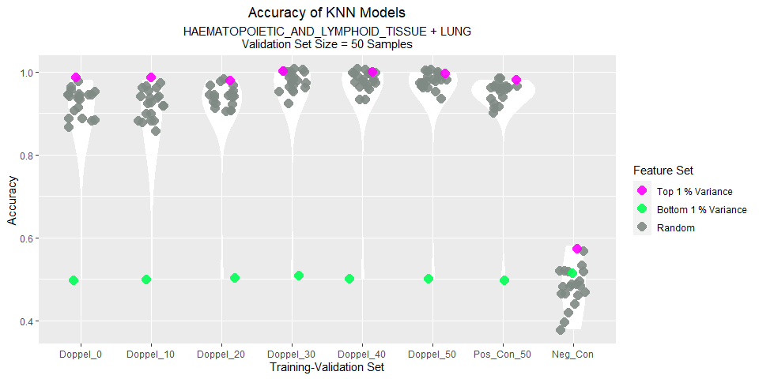
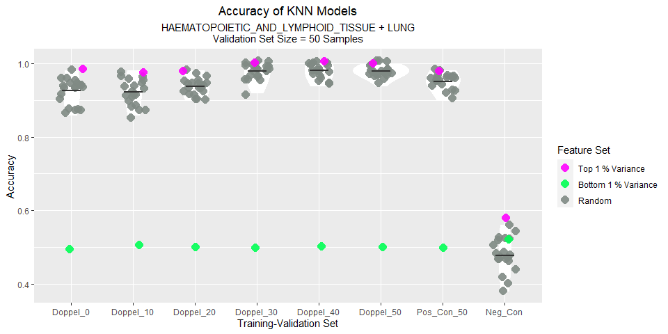
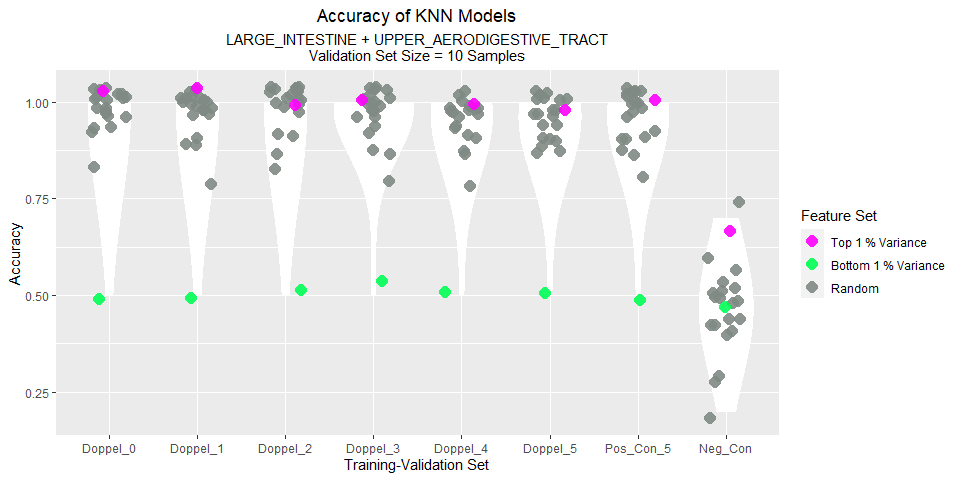
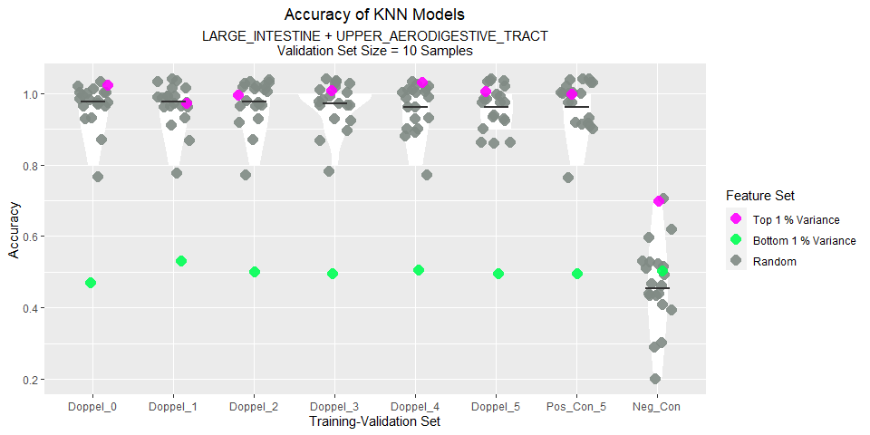
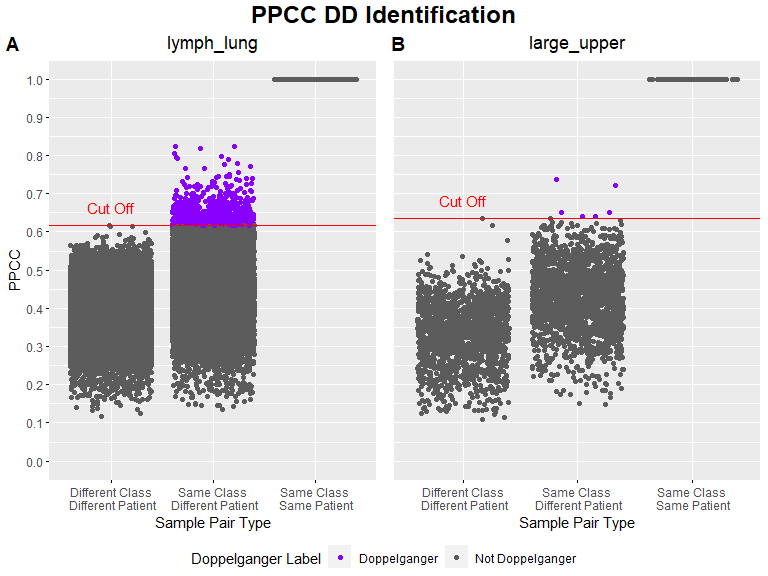

Exploring Doppelgangers in the CCLE Dataset
================
Wang Li Rong

# 0. Importing Libraries and Useful Functions

## a) Importing libraries

``` r
if (!("doppelgangerIdentifier" %in% installed.packages())){
  install.packages('devtools')
  library(devtools)
  install_github('lr98769/doppelgangerIdentifier')
}
library("doppelgangerIdentifier")
if (!("openxlsx") %in% installed.packages()){
  install.packages('openxlsx')
}
library(openxlsx)
```

## b) Importing Functions

``` r
functions_dir = "../functions"
source(file.path(functions_dir, "process_dataframes.R"))
source(file.path(functions_dir, "process_vectors.R"))
source(file.path(functions_dir, "process_lists.R"))
source(file.path(functions_dir,"analysis_functions.R"))
source(file.path(functions_dir, "output_functions.R"))
source(file.path(functions_dir, "planning_functions.R"))
source(file.path(functions_dir,"visualisation_code.R"))
```

## c) File Paths

``` r
dataset_url = "https://depmap.org/portal/download/api/download?file_name=ccle%2Fccle_2019%2FCCLE_RNAseq_rsem_genes_tpm_20180929.txt.gz&bucket=depmap-external-downloads"

dataset_dir = "../data"
processed_dataset_dir = "../cleaned_data"
planning_data_dir = "../planning_data"
experiment_plans_dir = "../experiment_plans"
images_dir = "../images"

dataset_filepath = file.path(dataset_dir, "CCLE_RNAseq_rsem_genes_tpm_20180929.txt.gz")

processed_ccle_filepath = file.path(processed_dataset_dir, 
                                    "ccle.rds")
processed_ccle_meta_filepath = file.path(processed_dataset_dir, 
                                    "ccle_meta.rds")

processed_lymph_lung_filepath = file.path(processed_dataset_dir,
                                          "lymph_lung.rds")
processed_lymph_lung_meta_filepath = file.path(processed_dataset_dir,
                                          "lymph_lung_meta.rds")
planning_data_lymph_lung_filepath = file.path(planning_data_dir,
                                              "lymph_lung_plan.xlsx")
ex_plan_lymph_lung_xlsx_filepath = file.path(experiment_plans_dir,
                                        "lymph_lung_ex_plan.xlsx")
ex_plan_lymph_lung_csv_filepath = file.path(experiment_plans_dir,
                                        "lymph_lung_ex_plan.csv")

processed_large_upper_filepath = file.path(processed_dataset_dir,
                                          "large_upper.rds")
processed_large_upper_meta_filepath = file.path(processed_dataset_dir,
                                          "large_upper_meta.rds")
planning_data_large_upper_filepath = file.path(planning_data_dir,
                                              "large_upper_plan.xlsx")
ex_plan_large_upper_xlsx_filepath = file.path(experiment_plans_dir,
                                        "large_upper_ex_plan.xlsx")
ex_plan_large_upper_csv_filepath = file.path(experiment_plans_dir,
                                        "large_upper_ex_plan.csv")

ddi_image_filepath= file.path(images_dir, "ccle_ddi.tiff")
dv_image_filepath= file.path(images_dir, "ccle_dv.tiff")
```

# d) Ensure directories and the proper files have been downloaded

``` r
directories = c(
  dataset_dir, processed_dataset_dir, planning_data_dir, 
  experiment_plans_dir, images_dir
)
for (directory in directories){
  if (!file.exists(directory)){
    dir.create(directory)
  }
}
if (!file.exists(dataset_filepath)){
  download.file(dataset_url, dataset_filepath, mode = "wb")
}
```

# 1. Importing the Dataset

Data Set Statistics: - 57820 Genes - 1019 Samples

``` r
if (!file.exists(processed_ccle_filepath)){
  ccle = read.table(dataset_filepath, row.names = 1)
  ccle = set_first_row_as_header(ccle)
  ccle$transcript_ids = NULL
  ccle[] = lapply(ccle,as.numeric)
  saveRDS(ccle, processed_ccle_filepath)
} else {
  ccle = readRDS(processed_ccle_filepath)
}
```

Getting meta data for CCLE

``` r
if (!file.exists(processed_ccle_meta_filepath)){
  ccle_meta = generate_meta_data(ccle)
  saveRDS(ccle_meta, processed_ccle_meta_filepath)
} else {
  ccle_meta = readRDS(processed_ccle_meta_filepath)
}
```

Analysing classes in CCLE

``` r
View(table(ccle_meta$Class))
```

# 2. Finding PPCC Doppelgangers Within CCLE

We chose 2 sets of cancer pairs to look for doppelgangers.

## a) “Haematopoietic and Lymphoid Tissue” and “Lung” Cancer

This cancer pair was chosen for its large size.

There are 173 HAEMATOPOIETIC_AND_LYMPHOID_TISSUE samples and 188 LUNG
samples.

``` r
if (!file.exists(processed_lymph_lung_meta_filepath)){
  lymph_lung_meta = ccle_meta[ccle_meta$Class %in% c("HAEMATOPOIETIC_AND_LYMPHOID_TISSUE","LUNG"),]
  saveRDS(lymph_lung_meta, processed_lymph_lung_meta_filepath)
} else {
  lymph_lung_meta = readRDS(processed_lymph_lung_meta_filepath)
}

if (!file.exists(processed_lymph_lung_filepath)){
  lymph_lung = ccle[, row.names(lymph_lung_meta)]
  saveRDS(lymph_lung, processed_lymph_lung_filepath)
} else {
  lymph_lung = readRDS(processed_lymph_lung_filepath)
}
table(lymph_lung_meta$Class)
```

    ## 
    ## HAEMATOPOIETIC_AND_LYMPHOID_TISSUE                               LUNG 
    ##                                173                                188

Let’s observe if there are any doppelgangers within this data.

``` r
start_time = Sys.time()
lymph_lung_doppel = getPPCCDoppelgangers(
  raw_data = lymph_lung,
  meta_data = lymph_lung_meta,
  do_batch_corr = FALSE,
  do_min_max = TRUE
)
```

    ## [1] "1. No batch correction since there is only 1 batch..."
    ## [1] "- Data is min-max normalized"
    ## [1] "2. Calculating PPCC between samples of the same dataset..."
    ##   |                                                                              |=                                                                     |   1%  |                                                                              |                                                                      |   0%  |                                                                              |                                                                      |   1%  |                                                                              |=                                                                     |   1%  |                                                                              |=                                                                     |   2%  |                                                                              |==                                                                    |   2%  |                                                                              |==                                                                    |   3%  |                                                                              |==                                                                    |   4%  |                                                                              |===                                                                   |   4%  |                                                                              |===                                                                   |   5%  |                                                                              |====                                                                  |   5%  |                                                                              |====                                                                  |   6%  |                                                                              |=====                                                                 |   6%  |                                                                              |=====                                                                 |   7%  |                                                                              |=====                                                                 |   8%  |                                                                              |======                                                                |   8%  |                                                                              |======                                                                |   9%  |                                                                              |=======                                                               |   9%  |                                                                              |=======                                                               |  10%  |                                                                              |=======                                                               |  11%  |                                                                              |========                                                              |  11%  |                                                                              |========                                                              |  12%  |                                                                              |=========                                                             |  12%  |                                                                              |=========                                                             |  13%  |                                                                              |=========                                                             |  14%  |                                                                              |==========                                                            |  14%  |                                                                              |==========                                                            |  15%  |                                                                              |===========                                                           |  15%  |                                                                              |===========                                                           |  16%  |                                                                              |============                                                          |  16%  |                                                                              |============                                                          |  17%  |                                                                              |============                                                          |  18%  |                                                                              |=============                                                         |  18%  |                                                                              |=============                                                         |  19%  |                                                                              |==============                                                        |  19%  |                                                                              |==============                                                        |  20%  |                                                                              |==============                                                        |  21%  |                                                                              |===============                                                       |  21%  |                                                                              |===============                                                       |  22%  |                                                                              |================                                                      |  22%  |                                                                              |================                                                      |  23%  |                                                                              |================                                                      |  24%  |                                                                              |=================                                                     |  24%  |                                                                              |=================                                                     |  25%  |                                                                              |==================                                                    |  25%  |                                                                              |==================                                                    |  26%  |                                                                              |===================                                                   |  26%  |                                                                              |===================                                                   |  27%  |                                                                              |===================                                                   |  28%  |                                                                              |====================                                                  |  28%  |                                                                              |====================                                                  |  29%  |                                                                              |=====================                                                 |  29%  |                                                                              |=====================                                                 |  30%  |                                                                              |=====================                                                 |  31%  |                                                                              |======================                                                |  31%  |                                                                              |======================                                                |  32%  |                                                                              |=======================                                               |  32%  |                                                                              |=======================                                               |  33%  |                                                                              |=======================                                               |  34%  |                                                                              |========================                                              |  34%  |                                                                              |========================                                              |  35%  |                                                                              |=========================                                             |  35%  |                                                                              |=========================                                             |  36%  |                                                                              |==========================                                            |  36%  |                                                                              |==========================                                            |  37%  |                                                                              |==========================                                            |  38%  |                                                                              |===========================                                           |  38%  |                                                                              |===========================                                           |  39%  |                                                                              |============================                                          |  39%  |                                                                              |============================                                          |  40%  |                                                                              |============================                                          |  41%  |                                                                              |=============================                                         |  41%  |                                                                              |=============================                                         |  42%  |                                                                              |==============================                                        |  42%  |                                                                              |==============================                                        |  43%  |                                                                              |==============================                                        |  44%  |                                                                              |===============================                                       |  44%  |                                                                              |===============================                                       |  45%  |                                                                              |================================                                      |  45%  |                                                                              |================================                                      |  46%  |                                                                              |=================================                                     |  46%  |                                                                              |=================================                                     |  47%  |                                                                              |=================================                                     |  48%  |                                                                              |==================================                                    |  48%  |                                                                              |==================================                                    |  49%  |                                                                              |===================================                                   |  49%  |                                                                              |===================================                                   |  50%  |                                                                              |===================================                                   |  51%  |                                                                              |====================================                                  |  51%  |                                                                              |====================================                                  |  52%  |                                                                              |=====================================                                 |  52%  |                                                                              |=====================================                                 |  53%  |                                                                              |=====================================                                 |  54%  |                                                                              |======================================                                |  54%  |                                                                              |======================================                                |  55%  |                                                                              |=======================================                               |  55%  |                                                                              |=======================================                               |  56%  |                                                                              |========================================                              |  56%  |                                                                              |========================================                              |  57%  |                                                                              |========================================                              |  58%  |                                                                              |=========================================                             |  58%  |                                                                              |=========================================                             |  59%  |                                                                              |==========================================                            |  59%  |                                                                              |==========================================                            |  60%  |                                                                              |==========================================                            |  61%  |                                                                              |===========================================                           |  61%  |                                                                              |===========================================                           |  62%  |                                                                              |============================================                          |  62%  |                                                                              |============================================                          |  63%  |                                                                              |============================================                          |  64%  |                                                                              |=============================================                         |  64%  |                                                                              |=============================================                         |  65%  |                                                                              |==============================================                        |  65%  |                                                                              |==============================================                        |  66%  |                                                                              |===============================================                       |  66%  |                                                                              |===============================================                       |  67%  |                                                                              |===============================================                       |  68%  |                                                                              |================================================                      |  68%  |                                                                              |================================================                      |  69%  |                                                                              |=================================================                     |  69%  |                                                                              |=================================================                     |  70%  |                                                                              |=================================================                     |  71%  |                                                                              |==================================================                    |  71%  |                                                                              |==================================================                    |  72%  |                                                                              |===================================================                   |  72%  |                                                                              |===================================================                   |  73%  |                                                                              |===================================================                   |  74%  |                                                                              |====================================================                  |  74%  |                                                                              |====================================================                  |  75%  |                                                                              |=====================================================                 |  75%  |                                                                              |=====================================================                 |  76%  |                                                                              |======================================================                |  76%  |                                                                              |======================================================                |  77%  |                                                                              |======================================================                |  78%  |                                                                              |=======================================================               |  78%  |                                                                              |=======================================================               |  79%  |                                                                              |========================================================              |  79%  |                                                                              |========================================================              |  80%  |                                                                              |========================================================              |  81%  |                                                                              |=========================================================             |  81%  |                                                                              |=========================================================             |  82%  |                                                                              |==========================================================            |  82%  |                                                                              |==========================================================            |  83%  |                                                                              |==========================================================            |  84%  |                                                                              |===========================================================           |  84%  |                                                                              |===========================================================           |  85%  |                                                                              |============================================================          |  85%  |                                                                              |============================================================          |  86%  |                                                                              |=============================================================         |  86%  |                                                                              |=============================================================         |  87%  |                                                                              |=============================================================         |  88%  |                                                                              |==============================================================        |  88%  |                                                                              |==============================================================        |  89%  |                                                                              |===============================================================       |  89%  |                                                                              |===============================================================       |  90%  |                                                                              |===============================================================       |  91%  |                                                                              |================================================================      |  91%  |                                                                              |================================================================      |  92%  |                                                                              |=================================================================     |  92%  |                                                                              |=================================================================     |  93%  |                                                                              |=================================================================     |  94%  |                                                                              |==================================================================    |  94%  |                                                                              |==================================================================    |  95%  |                                                                              |===================================================================   |  95%  |                                                                              |===================================================================   |  96%  |                                                                              |====================================================================  |  96%  |                                                                              |====================================================================  |  97%  |                                                                              |====================================================================  |  98%  |                                                                              |===================================================================== |  98%  |                                                                              |===================================================================== |  99%  |                                                                              |======================================================================|  99%  |                                                                              |======================================================================| 100%
    ## [1] "3. Labelling Sample Pairs according to their Class and Patient Similarities..."
    ## [1] "4. Calculating PPCC cut off to identify PPCC data doppelgangers..."
    ## [1] "5. Identifying PPCC data doppelgangers..."

``` r
end_time = Sys.time()
end_time - start_time
```

    ## Time difference of 3.233721 mins

``` r
visualisePPCCDoppelgangers(lymph_lung_doppel) + ggtitle(label="PPCC Doppelganger Identification", subtitle="HAEMATOPOIETIC_AND_LYMPHOID_TISSUE + LUNG") + theme(plot.subtitle = element_text(hjust = 0.5))
```

<!-- -->

``` r
# There are 692 Doppelgangers
table(lymph_lung_doppel$PPCC_df$DoppelgangerLabel)
```

    ## 
    ##     Doppelganger Not Doppelganger 
    ##              692            64649

``` r
# There are 181 samples with at least 1 other doppelganger partner
lymph_lung_doppelganger_df = lymph_lung_doppel$PPCC_df[
  lymph_lung_doppel$PPCC_df$DoppelgangerLabel == "Doppelganger",]
length(union(lymph_lung_doppelganger_df$Sample1,
             lymph_lung_doppelganger_df$Sample2))
```

    ## [1] 181

``` r
lymph_lung_doppelganger_df
```

    ##                                              Sample1
    ## 22         ALLSIL_HAEMATOPOIETIC_AND_LYMPHOID_TISSUE
    ## 92           BL70_HAEMATOPOIETIC_AND_LYMPHOID_TISSUE
    ## 104          BL70_HAEMATOPOIETIC_AND_LYMPHOID_TISSUE
    ## 176                                       CALU1_LUNG
    ## 254           CI1_HAEMATOPOIETIC_AND_LYMPHOID_TISSUE
    ## 263           CI1_HAEMATOPOIETIC_AND_LYMPHOID_TISSUE
    ## 266           CI1_HAEMATOPOIETIC_AND_LYMPHOID_TISSUE
    ## 267           CI1_HAEMATOPOIETIC_AND_LYMPHOID_TISSUE
    ## 593                                      CORL95_LUNG
    ## 609         DAUDI_HAEMATOPOIETIC_AND_LYMPHOID_TISSUE
    ## 612         DAUDI_HAEMATOPOIETIC_AND_LYMPHOID_TISSUE
    ## 618         DAUDI_HAEMATOPOIETIC_AND_LYMPHOID_TISSUE
    ## 774                                      DMS153_LUNG
    ## 1003        DOHH2_HAEMATOPOIETIC_AND_LYMPHOID_TISSUE
    ## 1004        DOHH2_HAEMATOPOIETIC_AND_LYMPHOID_TISSUE
    ## 1007        DOHH2_HAEMATOPOIETIC_AND_LYMPHOID_TISSUE
    ## 1013        DOHH2_HAEMATOPOIETIC_AND_LYMPHOID_TISSUE
    ## 1025        DOHH2_HAEMATOPOIETIC_AND_LYMPHOID_TISSUE
    ## 1098          EB1_HAEMATOPOIETIC_AND_LYMPHOID_TISSUE
    ## 1334          EM2_HAEMATOPOIETIC_AND_LYMPHOID_TISSUE
    ## 1339          EM2_HAEMATOPOIETIC_AND_LYMPHOID_TISSUE
    ## 1340          EM2_HAEMATOPOIETIC_AND_LYMPHOID_TISSUE
    ## 1349          EM2_HAEMATOPOIETIC_AND_LYMPHOID_TISSUE
    ## 1392         EOL1_HAEMATOPOIETIC_AND_LYMPHOID_TISSUE
    ## 1401         EOL1_HAEMATOPOIETIC_AND_LYMPHOID_TISSUE
    ## 1423         EOL1_HAEMATOPOIETIC_AND_LYMPHOID_TISSUE
    ## 1430         EOL1_HAEMATOPOIETIC_AND_LYMPHOID_TISSUE
    ## 1541         GA10_HAEMATOPOIETIC_AND_LYMPHOID_TISSUE
    ## 1553         GA10_HAEMATOPOIETIC_AND_LYMPHOID_TISSUE
    ## 1554         GA10_HAEMATOPOIETIC_AND_LYMPHOID_TISSUE
    ## 1557         GA10_HAEMATOPOIETIC_AND_LYMPHOID_TISSUE
    ## 1563         GA10_HAEMATOPOIETIC_AND_LYMPHOID_TISSUE
    ## 1575         GA10_HAEMATOPOIETIC_AND_LYMPHOID_TISSUE
    ## 1585         GA10_HAEMATOPOIETIC_AND_LYMPHOID_TISSUE
    ## 1592         GA10_HAEMATOPOIETIC_AND_LYMPHOID_TISSUE
    ## 1593         GA10_HAEMATOPOIETIC_AND_LYMPHOID_TISSUE
    ## 1676    GRANTA519_HAEMATOPOIETIC_AND_LYMPHOID_TISSUE
    ## 1709    GRANTA519_HAEMATOPOIETIC_AND_LYMPHOID_TISSUE
    ## 2015                                    HCC1438_LUNG
    ## 2085                                      HCC15_LUNG
    ## 2706                                     HCC364_LUNG
    ## 2720                                     HCC364_LUNG
    ## 2768                                     HCC364_LUNG
    ## 2842                                     HCC366_LUNG
    ## 3022                                     HCC461_LUNG
    ## 3077                                     HCC461_LUNG
    ## 3402                                     HCC827_LUNG
    ## 3474                                      HCC95_LUNG
    ## 3827          HEL_HAEMATOPOIETIC_AND_LYMPHOID_TISSUE
    ## 4100                                      HOP62_LUNG
    ## 4114                                      HOP62_LUNG
    ## 4169                                      HOP62_LUNG
    ## 4173                                      HOP62_LUNG
    ## 4285       HPBALL_HAEMATOPOIETIC_AND_LYMPHOID_TISSUE
    ## 4382       HS611T_HAEMATOPOIETIC_AND_LYMPHOID_TISSUE
    ## 4384       HS611T_HAEMATOPOIETIC_AND_LYMPHOID_TISSUE
    ## 4385       HS611T_HAEMATOPOIETIC_AND_LYMPHOID_TISSUE
    ## 4394       HS611T_HAEMATOPOIETIC_AND_LYMPHOID_TISSUE
    ## 4418       HS611T_HAEMATOPOIETIC_AND_LYMPHOID_TISSUE
    ## 4427       HS611T_HAEMATOPOIETIC_AND_LYMPHOID_TISSUE
    ## 4472           HT_HAEMATOPOIETIC_AND_LYMPHOID_TISSUE
    ## 4478           HT_HAEMATOPOIETIC_AND_LYMPHOID_TISSUE
    ## 4479           HT_HAEMATOPOIETIC_AND_LYMPHOID_TISSUE
    ## 4488           HT_HAEMATOPOIETIC_AND_LYMPHOID_TISSUE
    ## 4501           HT_HAEMATOPOIETIC_AND_LYMPHOID_TISSUE
    ## 4521           HT_HAEMATOPOIETIC_AND_LYMPHOID_TISSUE
    ## 4559           HT_HAEMATOPOIETIC_AND_LYMPHOID_TISSUE
    ## 4571        HUNS1_HAEMATOPOIETIC_AND_LYMPHOID_TISSUE
    ## 4583        HUNS1_HAEMATOPOIETIC_AND_LYMPHOID_TISSUE
    ## 4616        HUNS1_HAEMATOPOIETIC_AND_LYMPHOID_TISSUE
    ## 4654        HUNS1_HAEMATOPOIETIC_AND_LYMPHOID_TISSUE
    ## 4655        HUNS1_HAEMATOPOIETIC_AND_LYMPHOID_TISSUE
    ## 4760        HUT78_HAEMATOPOIETIC_AND_LYMPHOID_TISSUE
    ## 4776        HUT78_HAEMATOPOIETIC_AND_LYMPHOID_TISSUE
    ## 4847        HUT78_HAEMATOPOIETIC_AND_LYMPHOID_TISSUE
    ## 4848        HUT78_HAEMATOPOIETIC_AND_LYMPHOID_TISSUE
    ## 4849        HUT78_HAEMATOPOIETIC_AND_LYMPHOID_TISSUE
    ## 5357          JM1_HAEMATOPOIETIC_AND_LYMPHOID_TISSUE
    ## 5363          JM1_HAEMATOPOIETIC_AND_LYMPHOID_TISSUE
    ## 5369          JM1_HAEMATOPOIETIC_AND_LYMPHOID_TISSUE
    ## 5370          JM1_HAEMATOPOIETIC_AND_LYMPHOID_TISSUE
    ## 5412          JM1_HAEMATOPOIETIC_AND_LYMPHOID_TISSUE
    ## 5451          JM1_HAEMATOPOIETIC_AND_LYMPHOID_TISSUE
    ## 6200    KARPAS422_HAEMATOPOIETIC_AND_LYMPHOID_TISSUE
    ## 6442      KASUMI2_HAEMATOPOIETIC_AND_LYMPHOID_TISSUE
    ## 6793         KE37_HAEMATOPOIETIC_AND_LYMPHOID_TISSUE
    ## 6891         KE37_HAEMATOPOIETIC_AND_LYMPHOID_TISSUE
    ## 6914         KE97_HAEMATOPOIETIC_AND_LYMPHOID_TISSUE
    ## 6999         KE97_HAEMATOPOIETIC_AND_LYMPHOID_TISSUE
    ## 7028          KG1_HAEMATOPOIETIC_AND_LYMPHOID_TISSUE
    ## 7111          KG1_HAEMATOPOIETIC_AND_LYMPHOID_TISSUE
    ## 7119          KG1_HAEMATOPOIETIC_AND_LYMPHOID_TISSUE
    ## 7136          KG1_HAEMATOPOIETIC_AND_LYMPHOID_TISSUE
    ## 8777        KMS34_HAEMATOPOIETIC_AND_LYMPHOID_TISSUE
    ## 9001         KO52_HAEMATOPOIETIC_AND_LYMPHOID_TISSUE
    ## 9026         KO52_HAEMATOPOIETIC_AND_LYMPHOID_TISSUE
    ## 9030         KO52_HAEMATOPOIETIC_AND_LYMPHOID_TISSUE
    ## 9266        KU812_HAEMATOPOIETIC_AND_LYMPHOID_TISSUE
    ## 9299        KU812_HAEMATOPOIETIC_AND_LYMPHOID_TISSUE
    ## 10224                                      LC1F_LUNG
    ## 10520                                 LCLC97TM1_LUNG
    ## 10738       LOUCY_HAEMATOPOIETIC_AND_LYMPHOID_TISSUE
    ## 10850       LOUCY_HAEMATOPOIETIC_AND_LYMPHOID_TISSUE
    ## 11805        M07E_HAEMATOPOIETIC_AND_LYMPHOID_TISSUE
    ## 11867        M07E_HAEMATOPOIETIC_AND_LYMPHOID_TISSUE
    ## 11868        M07E_HAEMATOPOIETIC_AND_LYMPHOID_TISSUE
    ## 11871        M07E_HAEMATOPOIETIC_AND_LYMPHOID_TISSUE
    ## 11897        M07E_HAEMATOPOIETIC_AND_LYMPHOID_TISSUE
    ## 11900        M07E_HAEMATOPOIETIC_AND_LYMPHOID_TISSUE
    ## 11917        M07E_HAEMATOPOIETIC_AND_LYMPHOID_TISSUE
    ## 11923        M07E_HAEMATOPOIETIC_AND_LYMPHOID_TISSUE
    ## 11946       MC116_HAEMATOPOIETIC_AND_LYMPHOID_TISSUE
    ## 11948       MC116_HAEMATOPOIETIC_AND_LYMPHOID_TISSUE
    ## 11949       MC116_HAEMATOPOIETIC_AND_LYMPHOID_TISSUE
    ## 11958       MC116_HAEMATOPOIETIC_AND_LYMPHOID_TISSUE
    ## 11982       MC116_HAEMATOPOIETIC_AND_LYMPHOID_TISSUE
    ## 11991       MC116_HAEMATOPOIETIC_AND_LYMPHOID_TISSUE
    ## 12029       MC116_HAEMATOPOIETIC_AND_LYMPHOID_TISSUE
    ## 12030       MC116_HAEMATOPOIETIC_AND_LYMPHOID_TISSUE
    ## 12031       MC116_HAEMATOPOIETIC_AND_LYMPHOID_TISSUE
    ## 12033       MC116_HAEMATOPOIETIC_AND_LYMPHOID_TISSUE
    ## 12039       MC116_HAEMATOPOIETIC_AND_LYMPHOID_TISSUE
    ## 12257        MEC1_HAEMATOPOIETIC_AND_LYMPHOID_TISSUE
    ## 12269        MEC1_HAEMATOPOIETIC_AND_LYMPHOID_TISSUE
    ## 12293        MEC1_HAEMATOPOIETIC_AND_LYMPHOID_TISSUE
    ## 12340        MEC1_HAEMATOPOIETIC_AND_LYMPHOID_TISSUE
    ## 12341        MEC1_HAEMATOPOIETIC_AND_LYMPHOID_TISSUE
    ## 12342        MEC1_HAEMATOPOIETIC_AND_LYMPHOID_TISSUE
    ## 12344        MEC1_HAEMATOPOIETIC_AND_LYMPHOID_TISSUE
    ## 12401        MEC1_HAEMATOPOIETIC_AND_LYMPHOID_TISSUE
    ## 12539       MEG01_HAEMATOPOIETIC_AND_LYMPHOID_TISSUE
    ## 12562    MHHCALL2_HAEMATOPOIETIC_AND_LYMPHOID_TISSUE
    ## 12568    MHHCALL2_HAEMATOPOIETIC_AND_LYMPHOID_TISSUE
    ## 12617    MHHCALL2_HAEMATOPOIETIC_AND_LYMPHOID_TISSUE
    ## 12655    MHHCALL2_HAEMATOPOIETIC_AND_LYMPHOID_TISSUE
    ## 12665    MHHCALL2_HAEMATOPOIETIC_AND_LYMPHOID_TISSUE
    ## 12675    MHHCALL2_HAEMATOPOIETIC_AND_LYMPHOID_TISSUE
    ## 12721    MHHCALL3_HAEMATOPOIETIC_AND_LYMPHOID_TISSUE
    ## 12727    MHHCALL3_HAEMATOPOIETIC_AND_LYMPHOID_TISSUE
    ## 12824    MHHCALL3_HAEMATOPOIETIC_AND_LYMPHOID_TISSUE
    ## 12834    MHHCALL3_HAEMATOPOIETIC_AND_LYMPHOID_TISSUE
    ## 12879    MHHCALL3_HAEMATOPOIETIC_AND_LYMPHOID_TISSUE
    ## 12881    MHHCALL4_HAEMATOPOIETIC_AND_LYMPHOID_TISSUE
    ## 12887    MHHCALL4_HAEMATOPOIETIC_AND_LYMPHOID_TISSUE
    ## 12984    MHHCALL4_HAEMATOPOIETIC_AND_LYMPHOID_TISSUE
    ## 12994    MHHCALL4_HAEMATOPOIETIC_AND_LYMPHOID_TISSUE
    ## 13039    MHHCALL4_HAEMATOPOIETIC_AND_LYMPHOID_TISSUE
    ## 13040    MHHCALL4_HAEMATOPOIETIC_AND_LYMPHOID_TISSUE
    ## 13048        MINO_HAEMATOPOIETIC_AND_LYMPHOID_TISSUE
    ## 13054        MINO_HAEMATOPOIETIC_AND_LYMPHOID_TISSUE
    ## 13055        MINO_HAEMATOPOIETIC_AND_LYMPHOID_TISSUE
    ## 13064        MINO_HAEMATOPOIETIC_AND_LYMPHOID_TISSUE
    ## 13097        MINO_HAEMATOPOIETIC_AND_LYMPHOID_TISSUE
    ## 13135        MINO_HAEMATOPOIETIC_AND_LYMPHOID_TISSUE
    ## 13136        MINO_HAEMATOPOIETIC_AND_LYMPHOID_TISSUE
    ## 13137        MINO_HAEMATOPOIETIC_AND_LYMPHOID_TISSUE
    ## 13139        MINO_HAEMATOPOIETIC_AND_LYMPHOID_TISSUE
    ## 13145        MINO_HAEMATOPOIETIC_AND_LYMPHOID_TISSUE
    ## 13196        MINO_HAEMATOPOIETIC_AND_LYMPHOID_TISSUE
    ## 13198        MINO_HAEMATOPOIETIC_AND_LYMPHOID_TISSUE
    ## 13200        MINO_HAEMATOPOIETIC_AND_LYMPHOID_TISSUE
    ## 13202        MINO_HAEMATOPOIETIC_AND_LYMPHOID_TISSUE
    ## 13216          MJ_HAEMATOPOIETIC_AND_LYMPHOID_TISSUE
    ## 13219          MJ_HAEMATOPOIETIC_AND_LYMPHOID_TISSUE
    ## 13226          MJ_HAEMATOPOIETIC_AND_LYMPHOID_TISSUE
    ## 13259          MJ_HAEMATOPOIETIC_AND_LYMPHOID_TISSUE
    ## 13291          MJ_HAEMATOPOIETIC_AND_LYMPHOID_TISSUE
    ## 13297          MJ_HAEMATOPOIETIC_AND_LYMPHOID_TISSUE
    ## 13299          MJ_HAEMATOPOIETIC_AND_LYMPHOID_TISSUE
    ## 13301          MJ_HAEMATOPOIETIC_AND_LYMPHOID_TISSUE
    ## 13358          MJ_HAEMATOPOIETIC_AND_LYMPHOID_TISSUE
    ## 13365          MJ_HAEMATOPOIETIC_AND_LYMPHOID_TISSUE
    ## 13490        MM1S_HAEMATOPOIETIC_AND_LYMPHOID_TISSUE
    ## 13497        MM1S_HAEMATOPOIETIC_AND_LYMPHOID_TISSUE
    ## 13498        MM1S_HAEMATOPOIETIC_AND_LYMPHOID_TISSUE
    ## 13538      MOLM13_HAEMATOPOIETIC_AND_LYMPHOID_TISSUE
    ## 13583      MOLM13_HAEMATOPOIETIC_AND_LYMPHOID_TISSUE
    ## 13831      MOLM16_HAEMATOPOIETIC_AND_LYMPHOID_TISSUE
    ## 13849      MOLM16_HAEMATOPOIETIC_AND_LYMPHOID_TISSUE
    ## 13913       MOLM6_HAEMATOPOIETIC_AND_LYMPHOID_TISSUE
    ## 13914       MOLM6_HAEMATOPOIETIC_AND_LYMPHOID_TISSUE
    ## 13918       MOLM6_HAEMATOPOIETIC_AND_LYMPHOID_TISSUE
    ## 13951       MOLM6_HAEMATOPOIETIC_AND_LYMPHOID_TISSUE
    ## 13976       MOLM6_HAEMATOPOIETIC_AND_LYMPHOID_TISSUE
    ## 13980       MOLM6_HAEMATOPOIETIC_AND_LYMPHOID_TISSUE
    ## 13995       MOLM6_HAEMATOPOIETIC_AND_LYMPHOID_TISSUE
    ## 14017       MOLM6_HAEMATOPOIETIC_AND_LYMPHOID_TISSUE
    ## 14542      MOLT16_HAEMATOPOIETIC_AND_LYMPHOID_TISSUE
    ## 14633      MOLT16_HAEMATOPOIETIC_AND_LYMPHOID_TISSUE
    ## 14652      MOLT16_HAEMATOPOIETIC_AND_LYMPHOID_TISSUE
    ## 14713       MOLT3_HAEMATOPOIETIC_AND_LYMPHOID_TISSUE
    ## 14811       MOLT3_HAEMATOPOIETIC_AND_LYMPHOID_TISSUE
    ## 14823       MOLT3_HAEMATOPOIETIC_AND_LYMPHOID_TISSUE
    ## 14877       MOLT3_HAEMATOPOIETIC_AND_LYMPHOID_TISSUE
    ## 15043    MONOMAC1_HAEMATOPOIETIC_AND_LYMPHOID_TISSUE
    ## 15103    MONOMAC6_HAEMATOPOIETIC_AND_LYMPHOID_TISSUE
    ## 15104    MONOMAC6_HAEMATOPOIETIC_AND_LYMPHOID_TISSUE
    ## 15216    MONOMAC6_HAEMATOPOIETIC_AND_LYMPHOID_TISSUE
    ## 15224    MONOMAC6_HAEMATOPOIETIC_AND_LYMPHOID_TISSUE
    ## 15735       MUTZ5_HAEMATOPOIETIC_AND_LYMPHOID_TISSUE
    ## 15736       MUTZ5_HAEMATOPOIETIC_AND_LYMPHOID_TISSUE
    ## 15737       MUTZ5_HAEMATOPOIETIC_AND_LYMPHOID_TISSUE
    ## 15918       MV411_HAEMATOPOIETIC_AND_LYMPHOID_TISSUE
    ## 15926       MV411_HAEMATOPOIETIC_AND_LYMPHOID_TISSUE
    ## 15932      NALM19_HAEMATOPOIETIC_AND_LYMPHOID_TISSUE
    ## 15938      NALM19_HAEMATOPOIETIC_AND_LYMPHOID_TISSUE
    ## 15954      NALM19_HAEMATOPOIETIC_AND_LYMPHOID_TISSUE
    ## 15987      NALM19_HAEMATOPOIETIC_AND_LYMPHOID_TISSUE
    ## 16035      NALM19_HAEMATOPOIETIC_AND_LYMPHOID_TISSUE
    ## 16045      NALM19_HAEMATOPOIETIC_AND_LYMPHOID_TISSUE
    ## 16066      NALM19_HAEMATOPOIETIC_AND_LYMPHOID_TISSUE
    ## 16090      NALM19_HAEMATOPOIETIC_AND_LYMPHOID_TISSUE
    ## 16091      NALM19_HAEMATOPOIETIC_AND_LYMPHOID_TISSUE
    ## 16092      NALM19_HAEMATOPOIETIC_AND_LYMPHOID_TISSUE
    ## 16093      NALM19_HAEMATOPOIETIC_AND_LYMPHOID_TISSUE
    ## 16108      NALM19_HAEMATOPOIETIC_AND_LYMPHOID_TISSUE
    ## 16111       NALM1_HAEMATOPOIETIC_AND_LYMPHOID_TISSUE
    ## 16117       NALM1_HAEMATOPOIETIC_AND_LYMPHOID_TISSUE
    ## 16224       NALM1_HAEMATOPOIETIC_AND_LYMPHOID_TISSUE
    ## 16269       NALM1_HAEMATOPOIETIC_AND_LYMPHOID_TISSUE
    ## 16270       NALM1_HAEMATOPOIETIC_AND_LYMPHOID_TISSUE
    ## 16271       NALM1_HAEMATOPOIETIC_AND_LYMPHOID_TISSUE
    ## 16282       NALM1_HAEMATOPOIETIC_AND_LYMPHOID_TISSUE
    ## 16287       NALM1_HAEMATOPOIETIC_AND_LYMPHOID_TISSUE
    ## 16289       NALM1_HAEMATOPOIETIC_AND_LYMPHOID_TISSUE
    ## 16291       NALM6_HAEMATOPOIETIC_AND_LYMPHOID_TISSUE
    ## 16404       NALM6_HAEMATOPOIETIC_AND_LYMPHOID_TISSUE
    ## 16449       NALM6_HAEMATOPOIETIC_AND_LYMPHOID_TISSUE
    ## 16450       NALM6_HAEMATOPOIETIC_AND_LYMPHOID_TISSUE
    ## 16451       NALM6_HAEMATOPOIETIC_AND_LYMPHOID_TISSUE
    ## 16469       NALM6_HAEMATOPOIETIC_AND_LYMPHOID_TISSUE
    ## 16470       NALM6_HAEMATOPOIETIC_AND_LYMPHOID_TISSUE
    ## 16484     NAMALWA_HAEMATOPOIETIC_AND_LYMPHOID_TISSUE
    ## 16485     NAMALWA_HAEMATOPOIETIC_AND_LYMPHOID_TISSUE
    ## 16494     NAMALWA_HAEMATOPOIETIC_AND_LYMPHOID_TISSUE
    ## 16516     NAMALWA_HAEMATOPOIETIC_AND_LYMPHOID_TISSUE
    ## 16527     NAMALWA_HAEMATOPOIETIC_AND_LYMPHOID_TISSUE
    ## 16565     NAMALWA_HAEMATOPOIETIC_AND_LYMPHOID_TISSUE
    ## 16566     NAMALWA_HAEMATOPOIETIC_AND_LYMPHOID_TISSUE
    ## 16575     NAMALWA_HAEMATOPOIETIC_AND_LYMPHOID_TISSUE
    ## 16626     NAMALWA_HAEMATOPOIETIC_AND_LYMPHOID_TISSUE
    ## 16628     NAMALWA_HAEMATOPOIETIC_AND_LYMPHOID_TISSUE
    ## 16633     NAMALWA_HAEMATOPOIETIC_AND_LYMPHOID_TISSUE
    ## 16661         NB4_HAEMATOPOIETIC_AND_LYMPHOID_TISSUE
    ## 16666         NB4_HAEMATOPOIETIC_AND_LYMPHOID_TISSUE
    ## 16667         NB4_HAEMATOPOIETIC_AND_LYMPHOID_TISSUE
    ## 16676         NB4_HAEMATOPOIETIC_AND_LYMPHOID_TISSUE
    ## 16705         NB4_HAEMATOPOIETIC_AND_LYMPHOID_TISSUE
    ## 16709         NB4_HAEMATOPOIETIC_AND_LYMPHOID_TISSUE
    ## 16751         NB4_HAEMATOPOIETIC_AND_LYMPHOID_TISSUE
    ## 16807         NB4_HAEMATOPOIETIC_AND_LYMPHOID_TISSUE
    ## 16815         NB4_HAEMATOPOIETIC_AND_LYMPHOID_TISSUE
    ## 16816         NB4_HAEMATOPOIETIC_AND_LYMPHOID_TISSUE
    ## 16818         NB4_HAEMATOPOIETIC_AND_LYMPHOID_TISSUE
    ## 16827         NB4_HAEMATOPOIETIC_AND_LYMPHOID_TISSUE
    ## 16835         NB4_HAEMATOPOIETIC_AND_LYMPHOID_TISSUE
    ## 17828                                  NCIH1299_LUNG
    ## 20745                                  NCIH1618_LUNG
    ## 20892                                  NCIH1618_LUNG
    ## 20894                                  NCIH1618_LUNG
    ## 20903                                  NCIH1618_LUNG
    ## 22428                                  NCIH1703_LUNG
    ## 22429                                  NCIH1703_LUNG
    ## 22555                                  NCIH1703_LUNG
    ## 22882                                  NCIH1755_LUNG
    ## 23077                                  NCIH1781_LUNG
    ## 23225                                  NCIH1792_LUNG
    ## 24719                                  NCIH1876_LUNG
    ## 24735                                  NCIH1876_LUNG
    ## 25457                                  NCIH1963_LUNG
    ## 25498                                  NCIH1963_LUNG
    ## 25610                                  NCIH1963_LUNG
    ## 25613                                  NCIH1963_LUNG
    ## 25622                                  NCIH1963_LUNG
    ## 25629                                  NCIH1963_LUNG
    ## 25647                                  NCIH1963_LUNG
    ## 25897                                  NCIH1975_LUNG
    ## 25945                                  NCIH1975_LUNG
    ## 25952                                  NCIH1975_LUNG
    ## 25960                                  NCIH1975_LUNG
    ## 26334                                  NCIH2009_LUNG
    ## 26340                                  NCIH2023_LUNG
    ## 26527                                  NCIH2023_LUNG
    ## 26549                                  NCIH2023_LUNG
    ## 27698                                  NCIH2077_LUNG
    ## 28285                                  NCIH2087_LUNG
    ## 28348                                  NCIH2087_LUNG
    ## 28423                                  NCIH2087_LUNG
    ## 28480                                   NCIH209_LUNG
    ## 28627                                   NCIH209_LUNG
    ## 28628                                   NCIH209_LUNG
    ## 28629                                   NCIH209_LUNG
    ## 28638                                   NCIH209_LUNG
    ## 28645                                   NCIH209_LUNG
    ## 28660                                   NCIH209_LUNG
    ## 28663                                   NCIH209_LUNG
    ## 28667                                   NCIH209_LUNG
    ## 31394                                   NCIH226_LUNG
    ## 31645                                  NCIH2286_LUNG
    ## 31700                                  NCIH2286_LUNG
    ## 31777                                  NCIH2286_LUNG
    ## 31815                                  NCIH2286_LUNG
    ## 31838                                  NCIH2286_LUNG
    ## 31840                                  NCIH2286_LUNG
    ## 31952                                  NCIH2291_LUNG
    ## 32459                                  NCIH2347_LUNG
    ## 32463                                  NCIH2347_LUNG
    ## 32465                                  NCIH2347_LUNG
    ## 32467                                  NCIH2347_LUNG
    ## 32530                                  NCIH2347_LUNG
    ## 32605                                  NCIH2347_LUNG
    ## 32623                                  NCIH2347_LUNG
    ## 32638                                  NCIH2347_LUNG
    ## 32829                                    NCIH23_LUNG
    ## 32852                                    NCIH23_LUNG
    ## 32892                                    NCIH23_LUNG
    ## 32963                                  NCIH2405_LUNG
    ## 33485                                  NCIH2882_LUNG
    ## 34406                                  NCIH3122_LUNG
    ## 34788                                  NCIH3255_LUNG
    ## 34931                                  NCIH3255_LUNG
    ## 35483                                   NCIH441_LUNG
    ## 35783                                   NCIH460_LUNG
    ## 37159                                   NCIH526_LUNG
    ## 37740                                   NCIH647_LUNG
    ## 37766                                   NCIH647_LUNG
    ## 37889                                   NCIH647_LUNG
    ## 41093        NCO2_HAEMATOPOIETIC_AND_LYMPHOID_TISSUE
    ## 41177        NCO2_HAEMATOPOIETIC_AND_LYMPHOID_TISSUE
    ## 41183        NCO2_HAEMATOPOIETIC_AND_LYMPHOID_TISSUE
    ## 41195        NCO2_HAEMATOPOIETIC_AND_LYMPHOID_TISSUE
    ## 41207        NCO2_HAEMATOPOIETIC_AND_LYMPHOID_TISSUE
    ## 41501       NOMO1_HAEMATOPOIETIC_AND_LYMPHOID_TISSUE
    ## 41928      NUDUL1_HAEMATOPOIETIC_AND_LYMPHOID_TISSUE
    ## 41961      NUDUL1_HAEMATOPOIETIC_AND_LYMPHOID_TISSUE
    ## 42009      NUDUL1_HAEMATOPOIETIC_AND_LYMPHOID_TISSUE
    ## 42067      NUDUL1_HAEMATOPOIETIC_AND_LYMPHOID_TISSUE
    ## 42087      NUDUL1_HAEMATOPOIETIC_AND_LYMPHOID_TISSUE
    ## 42248     OCIAML2_HAEMATOPOIETIC_AND_LYMPHOID_TISSUE
    ## 42360     OCIAML2_HAEMATOPOIETIC_AND_LYMPHOID_TISSUE
    ## 42368     OCIAML2_HAEMATOPOIETIC_AND_LYMPHOID_TISSUE
    ## 42369     OCIAML2_HAEMATOPOIETIC_AND_LYMPHOID_TISSUE
    ## 42483     OCIAML2_HAEMATOPOIETIC_AND_LYMPHOID_TISSUE
    ## 42943     OCIAML5_HAEMATOPOIETIC_AND_LYMPHOID_TISSUE
    ## 42945     OCIAML5_HAEMATOPOIETIC_AND_LYMPHOID_TISSUE
    ## 43069     OCIAML5_HAEMATOPOIETIC_AND_LYMPHOID_TISSUE
    ## 43072     OCILY19_HAEMATOPOIETIC_AND_LYMPHOID_TISSUE
    ## 43206     OCILY19_HAEMATOPOIETIC_AND_LYMPHOID_TISSUE
    ## 43230     OCILY19_HAEMATOPOIETIC_AND_LYMPHOID_TISSUE
    ## 43232     OCILY19_HAEMATOPOIETIC_AND_LYMPHOID_TISSUE
    ## 43248     OCILY19_HAEMATOPOIETIC_AND_LYMPHOID_TISSUE
    ## 43250     OCILY19_HAEMATOPOIETIC_AND_LYMPHOID_TISSUE
    ## 43251     OCILY19_HAEMATOPOIETIC_AND_LYMPHOID_TISSUE
    ## 45149        OPM2_HAEMATOPOIETIC_AND_LYMPHOID_TISSUE
    ## 45157 P12ICHIKAWA_HAEMATOPOIETIC_AND_LYMPHOID_TISSUE
    ## 45175 P12ICHIKAWA_HAEMATOPOIETIC_AND_LYMPHOID_TISSUE
    ## 45243 P12ICHIKAWA_HAEMATOPOIETIC_AND_LYMPHOID_TISSUE
    ## 45248 P12ICHIKAWA_HAEMATOPOIETIC_AND_LYMPHOID_TISSUE
    ## 45254 P12ICHIKAWA_HAEMATOPOIETIC_AND_LYMPHOID_TISSUE
    ## 45255 P12ICHIKAWA_HAEMATOPOIETIC_AND_LYMPHOID_TISSUE
    ## 45267 P12ICHIKAWA_HAEMATOPOIETIC_AND_LYMPHOID_TISSUE
    ## 45297 P12ICHIKAWA_HAEMATOPOIETIC_AND_LYMPHOID_TISSUE
    ## 45309 P12ICHIKAWA_HAEMATOPOIETIC_AND_LYMPHOID_TISSUE
    ## 45310 P12ICHIKAWA_HAEMATOPOIETIC_AND_LYMPHOID_TISSUE
    ## 45311 P12ICHIKAWA_HAEMATOPOIETIC_AND_LYMPHOID_TISSUE
    ## 45320 P12ICHIKAWA_HAEMATOPOIETIC_AND_LYMPHOID_TISSUE
    ## 45321 P12ICHIKAWA_HAEMATOPOIETIC_AND_LYMPHOID_TISSUE
    ## 45322 P12ICHIKAWA_HAEMATOPOIETIC_AND_LYMPHOID_TISSUE
    ## 45329 P12ICHIKAWA_HAEMATOPOIETIC_AND_LYMPHOID_TISSUE
    ## 45330 P12ICHIKAWA_HAEMATOPOIETIC_AND_LYMPHOID_TISSUE
    ## 45331 P12ICHIKAWA_HAEMATOPOIETIC_AND_LYMPHOID_TISSUE
    ## 45625      P31FUJ_HAEMATOPOIETIC_AND_LYMPHOID_TISSUE
    ## 45760       P3HR1_HAEMATOPOIETIC_AND_LYMPHOID_TISSUE
    ## 45766       P3HR1_HAEMATOPOIETIC_AND_LYMPHOID_TISSUE
    ## 45767       P3HR1_HAEMATOPOIETIC_AND_LYMPHOID_TISSUE
    ## 45776       P3HR1_HAEMATOPOIETIC_AND_LYMPHOID_TISSUE
    ## 45788       P3HR1_HAEMATOPOIETIC_AND_LYMPHOID_TISSUE
    ## 45789       P3HR1_HAEMATOPOIETIC_AND_LYMPHOID_TISSUE
    ## 45798       P3HR1_HAEMATOPOIETIC_AND_LYMPHOID_TISSUE
    ## 45800       P3HR1_HAEMATOPOIETIC_AND_LYMPHOID_TISSUE
    ## 45809       P3HR1_HAEMATOPOIETIC_AND_LYMPHOID_TISSUE
    ## 45847       P3HR1_HAEMATOPOIETIC_AND_LYMPHOID_TISSUE
    ## 45848       P3HR1_HAEMATOPOIETIC_AND_LYMPHOID_TISSUE
    ## 45849       P3HR1_HAEMATOPOIETIC_AND_LYMPHOID_TISSUE
    ## 45851       P3HR1_HAEMATOPOIETIC_AND_LYMPHOID_TISSUE
    ## 45857       P3HR1_HAEMATOPOIETIC_AND_LYMPHOID_TISSUE
    ## 45908       P3HR1_HAEMATOPOIETIC_AND_LYMPHOID_TISSUE
    ## 45910       P3HR1_HAEMATOPOIETIC_AND_LYMPHOID_TISSUE
    ## 45912       P3HR1_HAEMATOPOIETIC_AND_LYMPHOID_TISSUE
    ## 45914       P3HR1_HAEMATOPOIETIC_AND_LYMPHOID_TISSUE
    ## 45915       P3HR1_HAEMATOPOIETIC_AND_LYMPHOID_TISSUE
    ## 45916       P3HR1_HAEMATOPOIETIC_AND_LYMPHOID_TISSUE
    ## 45932       P3HR1_HAEMATOPOIETIC_AND_LYMPHOID_TISSUE
    ## 45935       P3HR1_HAEMATOPOIETIC_AND_LYMPHOID_TISSUE
    ## 45936       P3HR1_HAEMATOPOIETIC_AND_LYMPHOID_TISSUE
    ## 46043       P3HR1_HAEMATOPOIETIC_AND_LYMPHOID_TISSUE
    ## 46054       P3HR1_HAEMATOPOIETIC_AND_LYMPHOID_TISSUE
    ## 46664                                       PC9_LUNG
    ## 46672        PEER_HAEMATOPOIETIC_AND_LYMPHOID_TISSUE
    ## 46678        PEER_HAEMATOPOIETIC_AND_LYMPHOID_TISSUE
    ## 46679        PEER_HAEMATOPOIETIC_AND_LYMPHOID_TISSUE
    ## 46688        PEER_HAEMATOPOIETIC_AND_LYMPHOID_TISSUE
    ## 46721        PEER_HAEMATOPOIETIC_AND_LYMPHOID_TISSUE
    ## 46763        PEER_HAEMATOPOIETIC_AND_LYMPHOID_TISSUE
    ## 46812        PEER_HAEMATOPOIETIC_AND_LYMPHOID_TISSUE
    ## 46827        PEER_HAEMATOPOIETIC_AND_LYMPHOID_TISSUE
    ## 46828        PEER_HAEMATOPOIETIC_AND_LYMPHOID_TISSUE
    ## 46837        PEER_HAEMATOPOIETIC_AND_LYMPHOID_TISSUE
    ## 46844        PEER_HAEMATOPOIETIC_AND_LYMPHOID_TISSUE
    ## 46847        PEER_HAEMATOPOIETIC_AND_LYMPHOID_TISSUE
    ## 46848        PEER_HAEMATOPOIETIC_AND_LYMPHOID_TISSUE
    ## 46966        PEER_HAEMATOPOIETIC_AND_LYMPHOID_TISSUE
    ## 46968        PEER_HAEMATOPOIETIC_AND_LYMPHOID_TISSUE
    ## 46978       PF382_HAEMATOPOIETIC_AND_LYMPHOID_TISSUE
    ## 47076       PF382_HAEMATOPOIETIC_AND_LYMPHOID_TISSUE
    ## 47088       PF382_HAEMATOPOIETIC_AND_LYMPHOID_TISSUE
    ## 47142       PF382_HAEMATOPOIETIC_AND_LYMPHOID_TISSUE
    ## 47143       PF382_HAEMATOPOIETIC_AND_LYMPHOID_TISSUE
    ## 47272       PF382_HAEMATOPOIETIC_AND_LYMPHOID_TISSUE
    ## 47301    PFEIFFER_HAEMATOPOIETIC_AND_LYMPHOID_TISSUE
    ## 47639        PL21_HAEMATOPOIETIC_AND_LYMPHOID_TISSUE
    ## 47759        PL21_HAEMATOPOIETIC_AND_LYMPHOID_TISSUE
    ## 47760        PL21_HAEMATOPOIETIC_AND_LYMPHOID_TISSUE
    ## 47877        PL21_HAEMATOPOIETIC_AND_LYMPHOID_TISSUE
    ## 47879        PL21_HAEMATOPOIETIC_AND_LYMPHOID_TISSUE
    ## 47888        PL21_HAEMATOPOIETIC_AND_LYMPHOID_TISSUE
    ## 48206        RAJI_HAEMATOPOIETIC_AND_LYMPHOID_TISSUE
    ## 48212        RAJI_HAEMATOPOIETIC_AND_LYMPHOID_TISSUE
    ## 48218        RAJI_HAEMATOPOIETIC_AND_LYMPHOID_TISSUE
    ## 48219        RAJI_HAEMATOPOIETIC_AND_LYMPHOID_TISSUE
    ## 48228        RAJI_HAEMATOPOIETIC_AND_LYMPHOID_TISSUE
    ## 48240        RAJI_HAEMATOPOIETIC_AND_LYMPHOID_TISSUE
    ## 48250        RAJI_HAEMATOPOIETIC_AND_LYMPHOID_TISSUE
    ## 48252        RAJI_HAEMATOPOIETIC_AND_LYMPHOID_TISSUE
    ## 48257        RAJI_HAEMATOPOIETIC_AND_LYMPHOID_TISSUE
    ## 48261        RAJI_HAEMATOPOIETIC_AND_LYMPHOID_TISSUE
    ## 48299        RAJI_HAEMATOPOIETIC_AND_LYMPHOID_TISSUE
    ## 48300        RAJI_HAEMATOPOIETIC_AND_LYMPHOID_TISSUE
    ## 48301        RAJI_HAEMATOPOIETIC_AND_LYMPHOID_TISSUE
    ## 48303        RAJI_HAEMATOPOIETIC_AND_LYMPHOID_TISSUE
    ## 48309        RAJI_HAEMATOPOIETIC_AND_LYMPHOID_TISSUE
    ## 48360        RAJI_HAEMATOPOIETIC_AND_LYMPHOID_TISSUE
    ## 48362        RAJI_HAEMATOPOIETIC_AND_LYMPHOID_TISSUE
    ## 48364        RAJI_HAEMATOPOIETIC_AND_LYMPHOID_TISSUE
    ## 48367        RAJI_HAEMATOPOIETIC_AND_LYMPHOID_TISSUE
    ## 48368        RAJI_HAEMATOPOIETIC_AND_LYMPHOID_TISSUE
    ## 48384        RAJI_HAEMATOPOIETIC_AND_LYMPHOID_TISSUE
    ## 48387        RAJI_HAEMATOPOIETIC_AND_LYMPHOID_TISSUE
    ## 48388        RAJI_HAEMATOPOIETIC_AND_LYMPHOID_TISSUE
    ## 48495        RAJI_HAEMATOPOIETIC_AND_LYMPHOID_TISSUE
    ## 48508        RAJI_HAEMATOPOIETIC_AND_LYMPHOID_TISSUE
    ## 48511        RAJI_HAEMATOPOIETIC_AND_LYMPHOID_TISSUE
    ## 48513        RAJI_HAEMATOPOIETIC_AND_LYMPHOID_TISSUE
    ## 48517      RCHACV_HAEMATOPOIETIC_AND_LYMPHOID_TISSUE
    ## 48523      RCHACV_HAEMATOPOIETIC_AND_LYMPHOID_TISSUE
    ## 48529      RCHACV_HAEMATOPOIETIC_AND_LYMPHOID_TISSUE
    ## 48530      RCHACV_HAEMATOPOIETIC_AND_LYMPHOID_TISSUE
    ## 48539      RCHACV_HAEMATOPOIETIC_AND_LYMPHOID_TISSUE
    ## 48572      RCHACV_HAEMATOPOIETIC_AND_LYMPHOID_TISSUE
    ## 48630      RCHACV_HAEMATOPOIETIC_AND_LYMPHOID_TISSUE
    ## 48651      RCHACV_HAEMATOPOIETIC_AND_LYMPHOID_TISSUE
    ## 48675      RCHACV_HAEMATOPOIETIC_AND_LYMPHOID_TISSUE
    ## 48676      RCHACV_HAEMATOPOIETIC_AND_LYMPHOID_TISSUE
    ## 48677      RCHACV_HAEMATOPOIETIC_AND_LYMPHOID_TISSUE
    ## 48693      RCHACV_HAEMATOPOIETIC_AND_LYMPHOID_TISSUE
    ## 48695      RCHACV_HAEMATOPOIETIC_AND_LYMPHOID_TISSUE
    ## 48696      RCHACV_HAEMATOPOIETIC_AND_LYMPHOID_TISSUE
    ## 48810      RCHACV_HAEMATOPOIETIC_AND_LYMPHOID_TISSUE
    ## 48822      RCHACV_HAEMATOPOIETIC_AND_LYMPHOID_TISSUE
    ## 48827      RCHACV_HAEMATOPOIETIC_AND_LYMPHOID_TISSUE
    ## 48851        REC1_HAEMATOPOIETIC_AND_LYMPHOID_TISSUE
    ## 48990        REC1_HAEMATOPOIETIC_AND_LYMPHOID_TISSUE
    ## 49139        REC1_HAEMATOPOIETIC_AND_LYMPHOID_TISSUE
    ## 49142         REH_HAEMATOPOIETIC_AND_LYMPHOID_TISSUE
    ## 49148         REH_HAEMATOPOIETIC_AND_LYMPHOID_TISSUE
    ## 49154         REH_HAEMATOPOIETIC_AND_LYMPHOID_TISSUE
    ## 49164         REH_HAEMATOPOIETIC_AND_LYMPHOID_TISSUE
    ## 49197         REH_HAEMATOPOIETIC_AND_LYMPHOID_TISSUE
    ## 49235         REH_HAEMATOPOIETIC_AND_LYMPHOID_TISSUE
    ## 49236         REH_HAEMATOPOIETIC_AND_LYMPHOID_TISSUE
    ## 49237         REH_HAEMATOPOIETIC_AND_LYMPHOID_TISSUE
    ## 49239         REH_HAEMATOPOIETIC_AND_LYMPHOID_TISSUE
    ## 49245         REH_HAEMATOPOIETIC_AND_LYMPHOID_TISSUE
    ## 49255         REH_HAEMATOPOIETIC_AND_LYMPHOID_TISSUE
    ## 49296         REH_HAEMATOPOIETIC_AND_LYMPHOID_TISSUE
    ## 49300         REH_HAEMATOPOIETIC_AND_LYMPHOID_TISSUE
    ## 49301         REH_HAEMATOPOIETIC_AND_LYMPHOID_TISSUE
    ## 49302         REH_HAEMATOPOIETIC_AND_LYMPHOID_TISSUE
    ## 49303         REH_HAEMATOPOIETIC_AND_LYMPHOID_TISSUE
    ## 49318         REH_HAEMATOPOIETIC_AND_LYMPHOID_TISSUE
    ## 49320         REH_HAEMATOPOIETIC_AND_LYMPHOID_TISSUE
    ## 49321         REH_HAEMATOPOIETIC_AND_LYMPHOID_TISSUE
    ## 49322         REH_HAEMATOPOIETIC_AND_LYMPHOID_TISSUE
    ## 49323         REH_HAEMATOPOIETIC_AND_LYMPHOID_TISSUE
    ## 49324         REH_HAEMATOPOIETIC_AND_LYMPHOID_TISSUE
    ## 49442         REH_HAEMATOPOIETIC_AND_LYMPHOID_TISSUE
    ## 49444         REH_HAEMATOPOIETIC_AND_LYMPHOID_TISSUE
    ## 49447         REH_HAEMATOPOIETIC_AND_LYMPHOID_TISSUE
    ## 49452         REH_HAEMATOPOIETIC_AND_LYMPHOID_TISSUE
    ## 49453         REH_HAEMATOPOIETIC_AND_LYMPHOID_TISSUE
    ## 49535                                 RERFLCAD1_LUNG
    ## 49600                                 RERFLCAD1_LUNG
    ## 49693                                 RERFLCAD1_LUNG
    ## 49710                                 RERFLCAD1_LUNG
    ## 49719                                 RERFLCAD1_LUNG
    ## 49721                                 RERFLCAD1_LUNG
    ## 50788                                  RERFLCMS_LUNG
    ## 50913                                  RERFLCMS_LUNG
    ## 50935                                  RERFLCMS_LUNG
    ## 50951                                  RERFLCMS_LUNG
    ## 51373         RI1_HAEMATOPOIETIC_AND_LYMPHOID_TISSUE
    ## 51374         RI1_HAEMATOPOIETIC_AND_LYMPHOID_TISSUE
    ## 51383         RI1_HAEMATOPOIETIC_AND_LYMPHOID_TISSUE
    ## 51461         RI1_HAEMATOPOIETIC_AND_LYMPHOID_TISSUE
    ## 51495         RI1_HAEMATOPOIETIC_AND_LYMPHOID_TISSUE
    ## 51522         RI1_HAEMATOPOIETIC_AND_LYMPHOID_TISSUE
    ## 51542         RI1_HAEMATOPOIETIC_AND_LYMPHOID_TISSUE
    ## 51671         RI1_HAEMATOPOIETIC_AND_LYMPHOID_TISSUE
    ## 51672         RI1_HAEMATOPOIETIC_AND_LYMPHOID_TISSUE
    ## 51694          RL_HAEMATOPOIETIC_AND_LYMPHOID_TISSUE
    ## 51704          RL_HAEMATOPOIETIC_AND_LYMPHOID_TISSUE
    ## 51717          RL_HAEMATOPOIETIC_AND_LYMPHOID_TISSUE
    ## 51775          RL_HAEMATOPOIETIC_AND_LYMPHOID_TISSUE
    ## 51776          RL_HAEMATOPOIETIC_AND_LYMPHOID_TISSUE
    ## 51836          RL_HAEMATOPOIETIC_AND_LYMPHOID_TISSUE
    ## 51838          RL_HAEMATOPOIETIC_AND_LYMPHOID_TISSUE
    ## 51843          RL_HAEMATOPOIETIC_AND_LYMPHOID_TISSUE
    ## 51863          RL_HAEMATOPOIETIC_AND_LYMPHOID_TISSUE
    ## 51984          RL_HAEMATOPOIETIC_AND_LYMPHOID_TISSUE
    ## 51992          RL_HAEMATOPOIETIC_AND_LYMPHOID_TISSUE
    ## 52333    RPMI8402_HAEMATOPOIETIC_AND_LYMPHOID_TISSUE
    ## 52431    RPMI8402_HAEMATOPOIETIC_AND_LYMPHOID_TISSUE
    ## 52443    RPMI8402_HAEMATOPOIETIC_AND_LYMPHOID_TISSUE
    ## 52498    RPMI8402_HAEMATOPOIETIC_AND_LYMPHOID_TISSUE
    ## 52627    RPMI8402_HAEMATOPOIETIC_AND_LYMPHOID_TISSUE
    ## 52632    RPMI8402_HAEMATOPOIETIC_AND_LYMPHOID_TISSUE
    ## 52633    RPMI8402_HAEMATOPOIETIC_AND_LYMPHOID_TISSUE
    ## 53957         SEM_HAEMATOPOIETIC_AND_LYMPHOID_TISSUE
    ## 53963         SEM_HAEMATOPOIETIC_AND_LYMPHOID_TISSUE
    ## 53979         SEM_HAEMATOPOIETIC_AND_LYMPHOID_TISSUE
    ## 54012         SEM_HAEMATOPOIETIC_AND_LYMPHOID_TISSUE
    ## 54050         SEM_HAEMATOPOIETIC_AND_LYMPHOID_TISSUE
    ## 54051         SEM_HAEMATOPOIETIC_AND_LYMPHOID_TISSUE
    ## 54054         SEM_HAEMATOPOIETIC_AND_LYMPHOID_TISSUE
    ## 54060         SEM_HAEMATOPOIETIC_AND_LYMPHOID_TISSUE
    ## 54070         SEM_HAEMATOPOIETIC_AND_LYMPHOID_TISSUE
    ## 54091         SEM_HAEMATOPOIETIC_AND_LYMPHOID_TISSUE
    ## 54110         SEM_HAEMATOPOIETIC_AND_LYMPHOID_TISSUE
    ## 54111         SEM_HAEMATOPOIETIC_AND_LYMPHOID_TISSUE
    ## 54115         SEM_HAEMATOPOIETIC_AND_LYMPHOID_TISSUE
    ## 54116         SEM_HAEMATOPOIETIC_AND_LYMPHOID_TISSUE
    ## 54117         SEM_HAEMATOPOIETIC_AND_LYMPHOID_TISSUE
    ## 54118         SEM_HAEMATOPOIETIC_AND_LYMPHOID_TISSUE
    ## 54130         SEM_HAEMATOPOIETIC_AND_LYMPHOID_TISSUE
    ## 54133         SEM_HAEMATOPOIETIC_AND_LYMPHOID_TISSUE
    ## 54135         SEM_HAEMATOPOIETIC_AND_LYMPHOID_TISSUE
    ## 54136         SEM_HAEMATOPOIETIC_AND_LYMPHOID_TISSUE
    ## 54137         SEM_HAEMATOPOIETIC_AND_LYMPHOID_TISSUE
    ## 54139         SEM_HAEMATOPOIETIC_AND_LYMPHOID_TISSUE
    ## 54257         SEM_HAEMATOPOIETIC_AND_LYMPHOID_TISSUE
    ## 54259         SEM_HAEMATOPOIETIC_AND_LYMPHOID_TISSUE
    ## 54262         SEM_HAEMATOPOIETIC_AND_LYMPHOID_TISSUE
    ## 54267         SEM_HAEMATOPOIETIC_AND_LYMPHOID_TISSUE
    ## 54268         SEM_HAEMATOPOIETIC_AND_LYMPHOID_TISSUE
    ## 54270         SEM_HAEMATOPOIETIC_AND_LYMPHOID_TISSUE
    ## 54421        SET2_HAEMATOPOIETIC_AND_LYMPHOID_TISSUE
    ## 54439        SET2_HAEMATOPOIETIC_AND_LYMPHOID_TISSUE
    ## 54451        SET2_HAEMATOPOIETIC_AND_LYMPHOID_TISSUE
    ## 54954       SIGM5_HAEMATOPOIETIC_AND_LYMPHOID_TISSUE
    ## 54959       SIGM5_HAEMATOPOIETIC_AND_LYMPHOID_TISSUE
    ## 54960       SIGM5_HAEMATOPOIETIC_AND_LYMPHOID_TISSUE
    ## 54969       SIGM5_HAEMATOPOIETIC_AND_LYMPHOID_TISSUE
    ## 54998       SIGM5_HAEMATOPOIETIC_AND_LYMPHOID_TISSUE
    ## 54999       SIGM5_HAEMATOPOIETIC_AND_LYMPHOID_TISSUE
    ## 55002       SIGM5_HAEMATOPOIETIC_AND_LYMPHOID_TISSUE
    ## 55108       SIGM5_HAEMATOPOIETIC_AND_LYMPHOID_TISSUE
    ## 55111       SIGM5_HAEMATOPOIETIC_AND_LYMPHOID_TISSUE
    ## 55119       SIGM5_HAEMATOPOIETIC_AND_LYMPHOID_TISSUE
    ## 55120       SIGM5_HAEMATOPOIETIC_AND_LYMPHOID_TISSUE
    ## 55124       SIGM5_HAEMATOPOIETIC_AND_LYMPHOID_TISSUE
    ## 55129       SIGM5_HAEMATOPOIETIC_AND_LYMPHOID_TISSUE
    ## 55237       SIGM5_HAEMATOPOIETIC_AND_LYMPHOID_TISSUE
    ## 55239       SIGM5_HAEMATOPOIETIC_AND_LYMPHOID_TISSUE
    ## 55255       SIGM5_HAEMATOPOIETIC_AND_LYMPHOID_TISSUE
    ## 55257       SIGM5_HAEMATOPOIETIC_AND_LYMPHOID_TISSUE
    ## 55619        SKM1_HAEMATOPOIETIC_AND_LYMPHOID_TISSUE
    ## 55634        SKM1_HAEMATOPOIETIC_AND_LYMPHOID_TISSUE
    ## 55663        SKM1_HAEMATOPOIETIC_AND_LYMPHOID_TISSUE
    ## 55664        SKM1_HAEMATOPOIETIC_AND_LYMPHOID_TISSUE
    ## 55745        SKM1_HAEMATOPOIETIC_AND_LYMPHOID_TISSUE
    ## 55773        SKM1_HAEMATOPOIETIC_AND_LYMPHOID_TISSUE
    ## 55776        SKM1_HAEMATOPOIETIC_AND_LYMPHOID_TISSUE
    ## 55778        SKM1_HAEMATOPOIETIC_AND_LYMPHOID_TISSUE
    ## 55784        SKM1_HAEMATOPOIETIC_AND_LYMPHOID_TISSUE
    ## 55785        SKM1_HAEMATOPOIETIC_AND_LYMPHOID_TISSUE
    ## 55789        SKM1_HAEMATOPOIETIC_AND_LYMPHOID_TISSUE
    ## 55794        SKM1_HAEMATOPOIETIC_AND_LYMPHOID_TISSUE
    ## 55899        SKM1_HAEMATOPOIETIC_AND_LYMPHOID_TISSUE
    ## 55902        SKM1_HAEMATOPOIETIC_AND_LYMPHOID_TISSUE
    ## 55904        SKM1_HAEMATOPOIETIC_AND_LYMPHOID_TISSUE
    ## 55913        SKM1_HAEMATOPOIETIC_AND_LYMPHOID_TISSUE
    ## 55920        SKM1_HAEMATOPOIETIC_AND_LYMPHOID_TISSUE
    ## 55923        SKM1_HAEMATOPOIETIC_AND_LYMPHOID_TISSUE
    ## 55940        SKM1_HAEMATOPOIETIC_AND_LYMPHOID_TISSUE
    ## 55943        SKM1_HAEMATOPOIETIC_AND_LYMPHOID_TISSUE
    ## 56623       SKNO1_HAEMATOPOIETIC_AND_LYMPHOID_TISSUE
    ## 56702       SKNO1_HAEMATOPOIETIC_AND_LYMPHOID_TISSUE
    ## 56729       SKNO1_HAEMATOPOIETIC_AND_LYMPHOID_TISSUE
    ## 56732       SKNO1_HAEMATOPOIETIC_AND_LYMPHOID_TISSUE
    ## 56735       SKNO1_HAEMATOPOIETIC_AND_LYMPHOID_TISSUE
    ## 56750       SKNO1_HAEMATOPOIETIC_AND_LYMPHOID_TISSUE
    ## 56752       SKNO1_HAEMATOPOIETIC_AND_LYMPHOID_TISSUE
    ## 56770       SKNO1_HAEMATOPOIETIC_AND_LYMPHOID_TISSUE
    ## 56778       SKNO1_HAEMATOPOIETIC_AND_LYMPHOID_TISSUE
    ## 56799       SKNO1_HAEMATOPOIETIC_AND_LYMPHOID_TISSUE
    ## 56922       SKNO1_HAEMATOPOIETIC_AND_LYMPHOID_TISSUE
    ## 56927       SKNO1_HAEMATOPOIETIC_AND_LYMPHOID_TISSUE
    ## 56930       SKNO1_HAEMATOPOIETIC_AND_LYMPHOID_TISSUE
    ## 57208                                       SQ1_LUNG
    ## 58125     SUDHL10_HAEMATOPOIETIC_AND_LYMPHOID_TISSUE
    ## 58273     SUDHL10_HAEMATOPOIETIC_AND_LYMPHOID_TISSUE
    ## 58292     SUDHL10_HAEMATOPOIETIC_AND_LYMPHOID_TISSUE
    ## 58698      SUDHL4_HAEMATOPOIETIC_AND_LYMPHOID_TISSUE
    ## 58808      SUDHL4_HAEMATOPOIETIC_AND_LYMPHOID_TISSUE
    ## 58956      SUDHL4_HAEMATOPOIETIC_AND_LYMPHOID_TISSUE
    ## 58975      SUDHL4_HAEMATOPOIETIC_AND_LYMPHOID_TISSUE
    ## 58994      SUDHL4_HAEMATOPOIETIC_AND_LYMPHOID_TISSUE
    ## 59091      SUDHL5_HAEMATOPOIETIC_AND_LYMPHOID_TISSUE
    ## 59151      SUDHL5_HAEMATOPOIETIC_AND_LYMPHOID_TISSUE
    ## 59299      SUDHL5_HAEMATOPOIETIC_AND_LYMPHOID_TISSUE
    ## 59307      SUDHL5_HAEMATOPOIETIC_AND_LYMPHOID_TISSUE
    ## 59434      SUDHL6_HAEMATOPOIETIC_AND_LYMPHOID_TISSUE
    ## 59435      SUDHL6_HAEMATOPOIETIC_AND_LYMPHOID_TISSUE
    ## 59495      SUDHL6_HAEMATOPOIETIC_AND_LYMPHOID_TISSUE
    ## 59502      SUDHL6_HAEMATOPOIETIC_AND_LYMPHOID_TISSUE
    ## 59643      SUDHL6_HAEMATOPOIETIC_AND_LYMPHOID_TISSUE
    ## 59651      SUDHL6_HAEMATOPOIETIC_AND_LYMPHOID_TISSUE
    ## 60032      SUPB15_HAEMATOPOIETIC_AND_LYMPHOID_TISSUE
    ## 60038      SUPB15_HAEMATOPOIETIC_AND_LYMPHOID_TISSUE
    ## 60135      SUPB15_HAEMATOPOIETIC_AND_LYMPHOID_TISSUE
    ## 60145      SUPB15_HAEMATOPOIETIC_AND_LYMPHOID_TISSUE
    ## 60190      SUPB15_HAEMATOPOIETIC_AND_LYMPHOID_TISSUE
    ## 60191      SUPB15_HAEMATOPOIETIC_AND_LYMPHOID_TISSUE
    ## 60192      SUPB15_HAEMATOPOIETIC_AND_LYMPHOID_TISSUE
    ## 60193      SUPB15_HAEMATOPOIETIC_AND_LYMPHOID_TISSUE
    ## 60208      SUPB15_HAEMATOPOIETIC_AND_LYMPHOID_TISSUE
    ## 60210      SUPB15_HAEMATOPOIETIC_AND_LYMPHOID_TISSUE
    ## 60211      SUPB15_HAEMATOPOIETIC_AND_LYMPHOID_TISSUE
    ## 60212      SUPB15_HAEMATOPOIETIC_AND_LYMPHOID_TISSUE
    ## 60334      SUPB15_HAEMATOPOIETIC_AND_LYMPHOID_TISSUE
    ## 60345      SUPB15_HAEMATOPOIETIC_AND_LYMPHOID_TISSUE
    ## 60360      SUPB15_HAEMATOPOIETIC_AND_LYMPHOID_TISSUE
    ## 61082       SUPT1_HAEMATOPOIETIC_AND_LYMPHOID_TISSUE
    ## 61179       SUPT1_HAEMATOPOIETIC_AND_LYMPHOID_TISSUE
    ## 61237       SUPT1_HAEMATOPOIETIC_AND_LYMPHOID_TISSUE
    ## 61376       SUPT1_HAEMATOPOIETIC_AND_LYMPHOID_TISSUE
    ## 61381       SUPT1_HAEMATOPOIETIC_AND_LYMPHOID_TISSUE
    ## 61389       SUPT1_HAEMATOPOIETIC_AND_LYMPHOID_TISSUE
    ## 61444                                    SW1271_LUNG
    ## 61487                                    SW1271_LUNG
    ## 61503                                    SW1271_LUNG
    ## 61516                                    SW1271_LUNG
    ## 61576                                    SW1271_LUNG
    ## 61614                                    SW1271_LUNG
    ## 61637                                    SW1271_LUNG
    ## 61677                                    SW1271_LUNG
    ## 62202                                     SW900_LUNG
    ## 62206                                     SW900_LUNG
    ## 62208                                     SW900_LUNG
    ## 62273                                     SW900_LUNG
    ## 62348                                     SW900_LUNG
    ## 62366                                     SW900_LUNG
    ## 62383                                     SW900_LUNG
    ## 62443                                     SW900_LUNG
    ## 62842       TALL1_HAEMATOPOIETIC_AND_LYMPHOID_TISSUE
    ## 63007       TALL1_HAEMATOPOIETIC_AND_LYMPHOID_TISSUE
    ## 63136       TALL1_HAEMATOPOIETIC_AND_LYMPHOID_TISSUE
    ## 63326         TF1_HAEMATOPOIETIC_AND_LYMPHOID_TISSUE
    ## 63344         TF1_HAEMATOPOIETIC_AND_LYMPHOID_TISSUE
    ## 63356         TF1_HAEMATOPOIETIC_AND_LYMPHOID_TISSUE
    ## 63837        THP1_HAEMATOPOIETIC_AND_LYMPHOID_TISSUE
    ## 63880        THP1_HAEMATOPOIETIC_AND_LYMPHOID_TISSUE
    ## 63959      TOLEDO_HAEMATOPOIETIC_AND_LYMPHOID_TISSUE
    ## 64007      TOLEDO_HAEMATOPOIETIC_AND_LYMPHOID_TISSUE
    ## 64065      TOLEDO_HAEMATOPOIETIC_AND_LYMPHOID_TISSUE
    ## 64206      TOLEDO_HAEMATOPOIETIC_AND_LYMPHOID_TISSUE
    ## 64250      TOLEDO_HAEMATOPOIETIC_AND_LYMPHOID_TISSUE
    ## 64253      TOLEDO_HAEMATOPOIETIC_AND_LYMPHOID_TISSUE
    ## 64785        U937_HAEMATOPOIETIC_AND_LYMPHOID_TISSUE
    ## 64794        U937_HAEMATOPOIETIC_AND_LYMPHOID_TISSUE
    ## 64922        U937_HAEMATOPOIETIC_AND_LYMPHOID_TISSUE
    ## 64954        U937_HAEMATOPOIETIC_AND_LYMPHOID_TISSUE
    ##                                              Sample2      PPCC
    ## 22            697_HAEMATOPOIETIC_AND_LYMPHOID_TISSUE 0.6191346
    ## 92            697_HAEMATOPOIETIC_AND_LYMPHOID_TISSUE 0.6209155
    ## 104          BL41_HAEMATOPOIETIC_AND_LYMPHOID_TISSUE 0.8045973
    ## 176                                        A549_LUNG 0.6183282
    ## 254           697_HAEMATOPOIETIC_AND_LYMPHOID_TISSUE 0.6260575
    ## 263          BCP1_HAEMATOPOIETIC_AND_LYMPHOID_TISSUE 0.6342857
    ## 266          BL41_HAEMATOPOIETIC_AND_LYMPHOID_TISSUE 0.7932384
    ## 267          BL70_HAEMATOPOIETIC_AND_LYMPHOID_TISSUE 0.7886145
    ## 593                                      CORL47_LUNG 0.6264972
    ## 609          BL70_HAEMATOPOIETIC_AND_LYMPHOID_TISSUE 0.6570943
    ## 612          CA46_HAEMATOPOIETIC_AND_LYMPHOID_TISSUE 0.6499225
    ## 618           CI1_HAEMATOPOIETIC_AND_LYMPHOID_TISSUE 0.6380519
    ## 774                                      CORL88_LUNG 0.6339240
    ## 1003         BL41_HAEMATOPOIETIC_AND_LYMPHOID_TISSUE 0.6793040
    ## 1004         BL70_HAEMATOPOIETIC_AND_LYMPHOID_TISSUE 0.7343875
    ## 1007         CA46_HAEMATOPOIETIC_AND_LYMPHOID_TISSUE 0.6250450
    ## 1013          CI1_HAEMATOPOIETIC_AND_LYMPHOID_TISSUE 0.6994063
    ## 1025        DAUDI_HAEMATOPOIETIC_AND_LYMPHOID_TISSUE 0.7194804
    ## 1098         CA46_HAEMATOPOIETIC_AND_LYMPHOID_TISSUE 0.6410697
    ## 1334       AML193_HAEMATOPOIETIC_AND_LYMPHOID_TISSUE 0.6574394
    ## 1339         BL41_HAEMATOPOIETIC_AND_LYMPHOID_TISSUE 0.6279841
    ## 1340         BL70_HAEMATOPOIETIC_AND_LYMPHOID_TISSUE 0.6295542
    ## 1349          CI1_HAEMATOPOIETIC_AND_LYMPHOID_TISSUE 0.6588961
    ## 1392         BL70_HAEMATOPOIETIC_AND_LYMPHOID_TISSUE 0.6453248
    ## 1401          CI1_HAEMATOPOIETIC_AND_LYMPHOID_TISSUE 0.6371109
    ## 1423        DOHH2_HAEMATOPOIETIC_AND_LYMPHOID_TISSUE 0.6201224
    ## 1430          EM2_HAEMATOPOIETIC_AND_LYMPHOID_TISSUE 0.6997959
    ## 1541          697_HAEMATOPOIETIC_AND_LYMPHOID_TISSUE 0.6387353
    ## 1553         BL41_HAEMATOPOIETIC_AND_LYMPHOID_TISSUE 0.8234838
    ## 1554         BL70_HAEMATOPOIETIC_AND_LYMPHOID_TISSUE 0.8243443
    ## 1557         CA46_HAEMATOPOIETIC_AND_LYMPHOID_TISSUE 0.6382478
    ## 1563          CI1_HAEMATOPOIETIC_AND_LYMPHOID_TISSUE 0.7968098
    ## 1575        DAUDI_HAEMATOPOIETIC_AND_LYMPHOID_TISSUE 0.6707552
    ## 1585        DOHH2_HAEMATOPOIETIC_AND_LYMPHOID_TISSUE 0.7249105
    ## 1592          EM2_HAEMATOPOIETIC_AND_LYMPHOID_TISSUE 0.6444273
    ## 1593         EOL1_HAEMATOPOIETIC_AND_LYMPHOID_TISSUE 0.6381846
    ## 1676          CI1_HAEMATOPOIETIC_AND_LYMPHOID_TISSUE 0.6301927
    ## 1709         GA10_HAEMATOPOIETIC_AND_LYMPHOID_TISSUE 0.6381989
    ## 2015                                    HCC1359_LUNG 0.6721585
    ## 2085                                       A549_LUNG 0.6536315
    ## 2706                                       A549_LUNG 0.6194182
    ## 2720                                      CALU1_LUNG 0.6591343
    ## 2768                                    HCC2108_LUNG 0.6340374
    ## 2842                                    HCC2108_LUNG 0.6304634
    ## 3022                                      CALU1_LUNG 0.6894111
    ## 3077                                     HCC364_LUNG 0.6738991
    ## 3402                                  HCC827GR5_LUNG 0.6238718
    ## 3474                                    HCC2814_LUNG 0.6593247
    ## 3827      HEL9217_HAEMATOPOIETIC_AND_LYMPHOID_TISSUE 0.7710391
    ## 4100                                       A549_LUNG 0.6293425
    ## 4114                                      CALU1_LUNG 0.6655867
    ## 4169                                     HCC364_LUNG 0.6464459
    ## 4173                                     HCC461_LUNG 0.6740759
    ## 4285       ALLSIL_HAEMATOPOIETIC_AND_LYMPHOID_TISSUE 0.6432842
    ## 4382         BDCM_HAEMATOPOIETIC_AND_LYMPHOID_TISSUE 0.6769372
    ## 4384         BL41_HAEMATOPOIETIC_AND_LYMPHOID_TISSUE 0.6256581
    ## 4385         BL70_HAEMATOPOIETIC_AND_LYMPHOID_TISSUE 0.6165878
    ## 4394          CI1_HAEMATOPOIETIC_AND_LYMPHOID_TISSUE 0.6964541
    ## 4418          EB1_HAEMATOPOIETIC_AND_LYMPHOID_TISSUE 0.6887661
    ## 4427         GA10_HAEMATOPOIETIC_AND_LYMPHOID_TISSUE 0.6324426
    ## 4472       ALLSIL_HAEMATOPOIETIC_AND_LYMPHOID_TISSUE 0.6200890
    ## 4478         BL41_HAEMATOPOIETIC_AND_LYMPHOID_TISSUE 0.6604629
    ## 4479         BL70_HAEMATOPOIETIC_AND_LYMPHOID_TISSUE 0.6534253
    ## 4488          CI1_HAEMATOPOIETIC_AND_LYMPHOID_TISSUE 0.6780749
    ## 4501           DB_HAEMATOPOIETIC_AND_LYMPHOID_TISSUE 0.6278734
    ## 4521         GA10_HAEMATOPOIETIC_AND_LYMPHOID_TISSUE 0.6515011
    ## 4559       HS611T_HAEMATOPOIETIC_AND_LYMPHOID_TISSUE 0.7033226
    ## 4571         BDCM_HAEMATOPOIETIC_AND_LYMPHOID_TISSUE 0.6715442
    ## 4583          CI1_HAEMATOPOIETIC_AND_LYMPHOID_TISSUE 0.6835694
    ## 4616         GA10_HAEMATOPOIETIC_AND_LYMPHOID_TISSUE 0.6190343
    ## 4654       HS611T_HAEMATOPOIETIC_AND_LYMPHOID_TISSUE 0.6880052
    ## 4655           HT_HAEMATOPOIETIC_AND_LYMPHOID_TISSUE 0.6332454
    ## 4760       ALLSIL_HAEMATOPOIETIC_AND_LYMPHOID_TISSUE 0.6699980
    ## 4776          CI1_HAEMATOPOIETIC_AND_LYMPHOID_TISSUE 0.6355455
    ## 4847       HS611T_HAEMATOPOIETIC_AND_LYMPHOID_TISSUE 0.6431428
    ## 4848           HT_HAEMATOPOIETIC_AND_LYMPHOID_TISSUE 0.6319549
    ## 4849        HUNS1_HAEMATOPOIETIC_AND_LYMPHOID_TISSUE 0.6355407
    ## 5357          697_HAEMATOPOIETIC_AND_LYMPHOID_TISSUE 0.6194832
    ## 5363       ALLSIL_HAEMATOPOIETIC_AND_LYMPHOID_TISSUE 0.6259748
    ## 5369         BL41_HAEMATOPOIETIC_AND_LYMPHOID_TISSUE 0.6493216
    ## 5370         BL70_HAEMATOPOIETIC_AND_LYMPHOID_TISSUE 0.6278302
    ## 5412         GA10_HAEMATOPOIETIC_AND_LYMPHOID_TISSUE 0.6725806
    ## 5451           HT_HAEMATOPOIETIC_AND_LYMPHOID_TISSUE 0.6305768
    ## 6200           HT_HAEMATOPOIETIC_AND_LYMPHOID_TISSUE 0.6516056
    ## 6442          697_HAEMATOPOIETIC_AND_LYMPHOID_TISSUE 0.6626187
    ## 6793       ALLSIL_HAEMATOPOIETIC_AND_LYMPHOID_TISSUE 0.6630660
    ## 6891       JURKAT_HAEMATOPOIETIC_AND_LYMPHOID_TISSUE 0.6424916
    ## 6914         BDCM_HAEMATOPOIETIC_AND_LYMPHOID_TISSUE 0.6628128
    ## 6999        HUNS1_HAEMATOPOIETIC_AND_LYMPHOID_TISSUE 0.6491202
    ## 7028       ALLSIL_HAEMATOPOIETIC_AND_LYMPHOID_TISSUE 0.6393898
    ## 7111        HNT34_HAEMATOPOIETIC_AND_LYMPHOID_TISSUE 0.6450406
    ## 7119        HUT78_HAEMATOPOIETIC_AND_LYMPHOID_TISSUE 0.6285216
    ## 7136      KASUMI6_HAEMATOPOIETIC_AND_LYMPHOID_TISSUE 0.6218440
    ## 8777      KMS28BM_HAEMATOPOIETIC_AND_LYMPHOID_TISSUE 0.6428904
    ## 9001        HNT34_HAEMATOPOIETIC_AND_LYMPHOID_TISSUE 0.6226664
    ## 9026      KASUMI6_HAEMATOPOIETIC_AND_LYMPHOID_TISSUE 0.6742897
    ## 9030          KG1_HAEMATOPOIETIC_AND_LYMPHOID_TISSUE 0.6620790
    ## 9266      HEL9217_HAEMATOPOIETIC_AND_LYMPHOID_TISSUE 0.6275963
    ## 9299          KG1_HAEMATOPOIETIC_AND_LYMPHOID_TISSUE 0.6219845
    ## 10224                                   HCC2814_LUNG 0.6262271
    ## 10520                                     HCC78_LUNG 0.6193208
    ## 10738      ALLSIL_HAEMATOPOIETIC_AND_LYMPHOID_TISSUE 0.6528483
    ## 10850         KG1_HAEMATOPOIETIC_AND_LYMPHOID_TISSUE 0.6269428
    ## 11805         CMK_HAEMATOPOIETIC_AND_LYMPHOID_TISSUE 0.6189872
    ## 11867     HEL9217_HAEMATOPOIETIC_AND_LYMPHOID_TISSUE 0.6323944
    ## 11868         HEL_HAEMATOPOIETIC_AND_LYMPHOID_TISSUE 0.6301765
    ## 11871       HNT34_HAEMATOPOIETIC_AND_LYMPHOID_TISSUE 0.6215014
    ## 11897       KCL22_HAEMATOPOIETIC_AND_LYMPHOID_TISSUE 0.6228514
    ## 11900         KG1_HAEMATOPOIETIC_AND_LYMPHOID_TISSUE 0.6283856
    ## 11917       KU812_HAEMATOPOIETIC_AND_LYMPHOID_TISSUE 0.6922373
    ## 11923      LAMA84_HAEMATOPOIETIC_AND_LYMPHOID_TISSUE 0.6202313
    ## 11946        BDCM_HAEMATOPOIETIC_AND_LYMPHOID_TISSUE 0.6221707
    ## 11948        BL41_HAEMATOPOIETIC_AND_LYMPHOID_TISSUE 0.6732218
    ## 11949        BL70_HAEMATOPOIETIC_AND_LYMPHOID_TISSUE 0.6646049
    ## 11958         CI1_HAEMATOPOIETIC_AND_LYMPHOID_TISSUE 0.6734962
    ## 11982         EB1_HAEMATOPOIETIC_AND_LYMPHOID_TISSUE 0.6474503
    ## 11991        GA10_HAEMATOPOIETIC_AND_LYMPHOID_TISSUE 0.6662551
    ## 12029      HS611T_HAEMATOPOIETIC_AND_LYMPHOID_TISSUE 0.7063904
    ## 12030          HT_HAEMATOPOIETIC_AND_LYMPHOID_TISSUE 0.7059345
    ## 12031       HUNS1_HAEMATOPOIETIC_AND_LYMPHOID_TISSUE 0.6651101
    ## 12033       HUT78_HAEMATOPOIETIC_AND_LYMPHOID_TISSUE 0.6364793
    ## 12039         JM1_HAEMATOPOIETIC_AND_LYMPHOID_TISSUE 0.6384644
    ## 12257        BDCM_HAEMATOPOIETIC_AND_LYMPHOID_TISSUE 0.7077317
    ## 12269         CI1_HAEMATOPOIETIC_AND_LYMPHOID_TISSUE 0.6413759
    ## 12293         EB1_HAEMATOPOIETIC_AND_LYMPHOID_TISSUE 0.6768162
    ## 12340      HS611T_HAEMATOPOIETIC_AND_LYMPHOID_TISSUE 0.7079840
    ## 12341          HT_HAEMATOPOIETIC_AND_LYMPHOID_TISSUE 0.6203114
    ## 12342       HUNS1_HAEMATOPOIETIC_AND_LYMPHOID_TISSUE 0.6765591
    ## 12344       HUT78_HAEMATOPOIETIC_AND_LYMPHOID_TISSUE 0.6270619
    ## 12401       MC116_HAEMATOPOIETIC_AND_LYMPHOID_TISSUE 0.6706169
    ## 12539       KU812_HAEMATOPOIETIC_AND_LYMPHOID_TISSUE 0.6704398
    ## 12562         697_HAEMATOPOIETIC_AND_LYMPHOID_TISSUE 0.6591233
    ## 12568      ALLSIL_HAEMATOPOIETIC_AND_LYMPHOID_TISSUE 0.6440257
    ## 12617        GA10_HAEMATOPOIETIC_AND_LYMPHOID_TISSUE 0.6197936
    ## 12655      HS611T_HAEMATOPOIETIC_AND_LYMPHOID_TISSUE 0.6278326
    ## 12665         JM1_HAEMATOPOIETIC_AND_LYMPHOID_TISSUE 0.6318747
    ## 12675     KASUMI2_HAEMATOPOIETIC_AND_LYMPHOID_TISSUE 0.6716830
    ## 12721         697_HAEMATOPOIETIC_AND_LYMPHOID_TISSUE 0.6778972
    ## 12727      ALLSIL_HAEMATOPOIETIC_AND_LYMPHOID_TISSUE 0.6209717
    ## 12824         JM1_HAEMATOPOIETIC_AND_LYMPHOID_TISSUE 0.6220787
    ## 12834     KASUMI2_HAEMATOPOIETIC_AND_LYMPHOID_TISSUE 0.7514455
    ## 12879    MHHCALL2_HAEMATOPOIETIC_AND_LYMPHOID_TISSUE 0.7310689
    ## 12881         697_HAEMATOPOIETIC_AND_LYMPHOID_TISSUE 0.6390767
    ## 12887      ALLSIL_HAEMATOPOIETIC_AND_LYMPHOID_TISSUE 0.6502503
    ## 12984         JM1_HAEMATOPOIETIC_AND_LYMPHOID_TISSUE 0.6227067
    ## 12994     KASUMI2_HAEMATOPOIETIC_AND_LYMPHOID_TISSUE 0.6916084
    ## 13039    MHHCALL2_HAEMATOPOIETIC_AND_LYMPHOID_TISSUE 0.7413679
    ## 13040    MHHCALL3_HAEMATOPOIETIC_AND_LYMPHOID_TISSUE 0.7463238
    ## 13048      ALLSIL_HAEMATOPOIETIC_AND_LYMPHOID_TISSUE 0.6221533
    ## 13054        BL41_HAEMATOPOIETIC_AND_LYMPHOID_TISSUE 0.7193301
    ## 13055        BL70_HAEMATOPOIETIC_AND_LYMPHOID_TISSUE 0.6867007
    ## 13064         CI1_HAEMATOPOIETIC_AND_LYMPHOID_TISSUE 0.7220233
    ## 13097        GA10_HAEMATOPOIETIC_AND_LYMPHOID_TISSUE 0.7171764
    ## 13135      HS611T_HAEMATOPOIETIC_AND_LYMPHOID_TISSUE 0.6816347
    ## 13136          HT_HAEMATOPOIETIC_AND_LYMPHOID_TISSUE 0.6567911
    ## 13137       HUNS1_HAEMATOPOIETIC_AND_LYMPHOID_TISSUE 0.6589668
    ## 13139       HUT78_HAEMATOPOIETIC_AND_LYMPHOID_TISSUE 0.6524339
    ## 13145         JM1_HAEMATOPOIETIC_AND_LYMPHOID_TISSUE 0.6955349
    ## 13196       MC116_HAEMATOPOIETIC_AND_LYMPHOID_TISSUE 0.6765790
    ## 13198        MEC1_HAEMATOPOIETIC_AND_LYMPHOID_TISSUE 0.6560890
    ## 13200    MHHCALL2_HAEMATOPOIETIC_AND_LYMPHOID_TISSUE 0.6462943
    ## 13202    MHHCALL4_HAEMATOPOIETIC_AND_LYMPHOID_TISSUE 0.6304412
    ## 13216        BL41_HAEMATOPOIETIC_AND_LYMPHOID_TISSUE 0.6281293
    ## 13219       C8166_HAEMATOPOIETIC_AND_LYMPHOID_TISSUE 0.6325938
    ## 13226         CI1_HAEMATOPOIETIC_AND_LYMPHOID_TISSUE 0.6810296
    ## 13259        GA10_HAEMATOPOIETIC_AND_LYMPHOID_TISSUE 0.6243186
    ## 13291          HH_HAEMATOPOIETIC_AND_LYMPHOID_TISSUE 0.6172594
    ## 13297      HS611T_HAEMATOPOIETIC_AND_LYMPHOID_TISSUE 0.6340967
    ## 13299       HUNS1_HAEMATOPOIETIC_AND_LYMPHOID_TISSUE 0.6567641
    ## 13301       HUT78_HAEMATOPOIETIC_AND_LYMPHOID_TISSUE 0.6597228
    ## 13358       MC116_HAEMATOPOIETIC_AND_LYMPHOID_TISSUE 0.6261191
    ## 13365        MINO_HAEMATOPOIETIC_AND_LYMPHOID_TISSUE 0.6488817
    ## 13490       KMS11_HAEMATOPOIETIC_AND_LYMPHOID_TISSUE 0.6267385
    ## 13497     KMS28BM_HAEMATOPOIETIC_AND_LYMPHOID_TISSUE 0.6220501
    ## 13498       KMS34_HAEMATOPOIETIC_AND_LYMPHOID_TISSUE 0.6354954
    ## 13538      AML193_HAEMATOPOIETIC_AND_LYMPHOID_TISSUE 0.6173348
    ## 13583        EOL1_HAEMATOPOIETIC_AND_LYMPHOID_TISSUE 0.6178579
    ## 13831       KU812_HAEMATOPOIETIC_AND_LYMPHOID_TISSUE 0.6377984
    ## 13849        M07E_HAEMATOPOIETIC_AND_LYMPHOID_TISSUE 0.6416039
    ## 13913         EM2_HAEMATOPOIETIC_AND_LYMPHOID_TISSUE 0.6681129
    ## 13914        EOL1_HAEMATOPOIETIC_AND_LYMPHOID_TISSUE 0.6669837
    ## 13918        GDM1_HAEMATOPOIETIC_AND_LYMPHOID_TISSUE 0.6182249
    ## 13951       HNT34_HAEMATOPOIETIC_AND_LYMPHOID_TISSUE 0.6449345
    ## 13976     KASUMI6_HAEMATOPOIETIC_AND_LYMPHOID_TISSUE 0.6217843
    ## 13980         KG1_HAEMATOPOIETIC_AND_LYMPHOID_TISSUE 0.6181773
    ## 13995        KO52_HAEMATOPOIETIC_AND_LYMPHOID_TISSUE 0.6621427
    ## 14017         ME1_HAEMATOPOIETIC_AND_LYMPHOID_TISSUE 0.6519768
    ## 14542      ALLSIL_HAEMATOPOIETIC_AND_LYMPHOID_TISSUE 0.6389524
    ## 14633       HUT78_HAEMATOPOIETIC_AND_LYMPHOID_TISSUE 0.6229915
    ## 14652        KE37_HAEMATOPOIETIC_AND_LYMPHOID_TISSUE 0.6761004
    ## 14713      ALLSIL_HAEMATOPOIETIC_AND_LYMPHOID_TISSUE 0.6723933
    ## 14811      JURKAT_HAEMATOPOIETIC_AND_LYMPHOID_TISSUE 0.6361945
    ## 14823        KE37_HAEMATOPOIETIC_AND_LYMPHOID_TISSUE 0.6579626
    ## 14877      MOLT16_HAEMATOPOIETIC_AND_LYMPHOID_TISSUE 0.6668855
    ## 15043      MOLM13_HAEMATOPOIETIC_AND_LYMPHOID_TISSUE 0.6532851
    ## 15103         EM2_HAEMATOPOIETIC_AND_LYMPHOID_TISSUE 0.6470037
    ## 15104        EOL1_HAEMATOPOIETIC_AND_LYMPHOID_TISSUE 0.6260489
    ## 15216      MOLM13_HAEMATOPOIETIC_AND_LYMPHOID_TISSUE 0.6485015
    ## 15224    MONOMAC1_HAEMATOPOIETIC_AND_LYMPHOID_TISSUE 0.6744733
    ## 15735    MHHCALL2_HAEMATOPOIETIC_AND_LYMPHOID_TISSUE 0.6645316
    ## 15736    MHHCALL3_HAEMATOPOIETIC_AND_LYMPHOID_TISSUE 0.6603841
    ## 15737    MHHCALL4_HAEMATOPOIETIC_AND_LYMPHOID_TISSUE 0.7412743
    ## 15918      MOLM13_HAEMATOPOIETIC_AND_LYMPHOID_TISSUE 0.7136437
    ## 15926    MONOMAC1_HAEMATOPOIETIC_AND_LYMPHOID_TISSUE 0.6186785
    ## 15932         697_HAEMATOPOIETIC_AND_LYMPHOID_TISSUE 0.6734329
    ## 15938      ALLSIL_HAEMATOPOIETIC_AND_LYMPHOID_TISSUE 0.6559424
    ## 15954         CI1_HAEMATOPOIETIC_AND_LYMPHOID_TISSUE 0.6233709
    ## 15987        GA10_HAEMATOPOIETIC_AND_LYMPHOID_TISSUE 0.6228026
    ## 16035         JM1_HAEMATOPOIETIC_AND_LYMPHOID_TISSUE 0.6307615
    ## 16045     KASUMI2_HAEMATOPOIETIC_AND_LYMPHOID_TISSUE 0.6599539
    ## 16066       KOPN8_HAEMATOPOIETIC_AND_LYMPHOID_TISSUE 0.6681019
    ## 16090    MHHCALL2_HAEMATOPOIETIC_AND_LYMPHOID_TISSUE 0.7296700
    ## 16091    MHHCALL3_HAEMATOPOIETIC_AND_LYMPHOID_TISSUE 0.7189105
    ## 16092    MHHCALL4_HAEMATOPOIETIC_AND_LYMPHOID_TISSUE 0.7178004
    ## 16093        MINO_HAEMATOPOIETIC_AND_LYMPHOID_TISSUE 0.6392485
    ## 16108       MUTZ5_HAEMATOPOIETIC_AND_LYMPHOID_TISSUE 0.6734772
    ## 16111         697_HAEMATOPOIETIC_AND_LYMPHOID_TISSUE 0.6407391
    ## 16117      ALLSIL_HAEMATOPOIETIC_AND_LYMPHOID_TISSUE 0.6175484
    ## 16224     KASUMI2_HAEMATOPOIETIC_AND_LYMPHOID_TISSUE 0.6695597
    ## 16269    MHHCALL2_HAEMATOPOIETIC_AND_LYMPHOID_TISSUE 0.7267984
    ## 16270    MHHCALL3_HAEMATOPOIETIC_AND_LYMPHOID_TISSUE 0.7409916
    ## 16271    MHHCALL4_HAEMATOPOIETIC_AND_LYMPHOID_TISSUE 0.7653985
    ## 16282       MOLT3_HAEMATOPOIETIC_AND_LYMPHOID_TISSUE 0.6312157
    ## 16287       MUTZ5_HAEMATOPOIETIC_AND_LYMPHOID_TISSUE 0.7000153
    ## 16289      NALM19_HAEMATOPOIETIC_AND_LYMPHOID_TISSUE 0.7001720
    ## 16291         697_HAEMATOPOIETIC_AND_LYMPHOID_TISSUE 0.6190218
    ## 16404     KASUMI2_HAEMATOPOIETIC_AND_LYMPHOID_TISSUE 0.6213418
    ## 16449    MHHCALL2_HAEMATOPOIETIC_AND_LYMPHOID_TISSUE 0.6602605
    ## 16450    MHHCALL3_HAEMATOPOIETIC_AND_LYMPHOID_TISSUE 0.6635012
    ## 16451    MHHCALL4_HAEMATOPOIETIC_AND_LYMPHOID_TISSUE 0.6655701
    ## 16469      NALM19_HAEMATOPOIETIC_AND_LYMPHOID_TISSUE 0.6421348
    ## 16470       NALM1_HAEMATOPOIETIC_AND_LYMPHOID_TISSUE 0.6789371
    ## 16484        BL41_HAEMATOPOIETIC_AND_LYMPHOID_TISSUE 0.7027498
    ## 16485        BL70_HAEMATOPOIETIC_AND_LYMPHOID_TISSUE 0.6954405
    ## 16494         CI1_HAEMATOPOIETIC_AND_LYMPHOID_TISSUE 0.6920400
    ## 16516       DOHH2_HAEMATOPOIETIC_AND_LYMPHOID_TISSUE 0.6224945
    ## 16527        GA10_HAEMATOPOIETIC_AND_LYMPHOID_TISSUE 0.6993275
    ## 16565      HS611T_HAEMATOPOIETIC_AND_LYMPHOID_TISSUE 0.6266530
    ## 16566          HT_HAEMATOPOIETIC_AND_LYMPHOID_TISSUE 0.6183481
    ## 16575         JM1_HAEMATOPOIETIC_AND_LYMPHOID_TISSUE 0.6423707
    ## 16626       MC116_HAEMATOPOIETIC_AND_LYMPHOID_TISSUE 0.6909178
    ## 16628        MEC1_HAEMATOPOIETIC_AND_LYMPHOID_TISSUE 0.6309020
    ## 16633        MINO_HAEMATOPOIETIC_AND_LYMPHOID_TISSUE 0.6843450
    ## 16661      AML193_HAEMATOPOIETIC_AND_LYMPHOID_TISSUE 0.6164838
    ## 16666        BL41_HAEMATOPOIETIC_AND_LYMPHOID_TISSUE 0.6498703
    ## 16667        BL70_HAEMATOPOIETIC_AND_LYMPHOID_TISSUE 0.6318532
    ## 16676         CI1_HAEMATOPOIETIC_AND_LYMPHOID_TISSUE 0.6651345
    ## 16705         EM2_HAEMATOPOIETIC_AND_LYMPHOID_TISSUE 0.6508694
    ## 16709        GA10_HAEMATOPOIETIC_AND_LYMPHOID_TISSUE 0.6361873
    ## 16751       HUT78_HAEMATOPOIETIC_AND_LYMPHOID_TISSUE 0.6264621
    ## 16807        M07E_HAEMATOPOIETIC_AND_LYMPHOID_TISSUE 0.6199949
    ## 16815        MINO_HAEMATOPOIETIC_AND_LYMPHOID_TISSUE 0.6646584
    ## 16816          MJ_HAEMATOPOIETIC_AND_LYMPHOID_TISSUE 0.6195684
    ## 16818      MOLM13_HAEMATOPOIETIC_AND_LYMPHOID_TISSUE 0.6261053
    ## 16827    MONOMAC6_HAEMATOPOIETIC_AND_LYMPHOID_TISSUE 0.6345262
    ## 16835     NAMALWA_HAEMATOPOIETIC_AND_LYMPHOID_TISSUE 0.6362616
    ## 17828                                   HCC1359_LUNG 0.6219054
    ## 20745                                    DMS153_LUNG 0.6295553
    ## 20892                                  NCIH1105_LUNG 0.6362142
    ## 20894                                  NCIH1184_LUNG 0.6466039
    ## 20903                                  NCIH1436_LUNG 0.6526005
    ## 22428                                   HCC1359_LUNG 0.6268610
    ## 22429                                   HCC1438_LUNG 0.6267713
    ## 22555                                  NCIH1299_LUNG 0.6468813
    ## 22882                                     HOP62_LUNG 0.6340212
    ## 23077                                   HCC2935_LUNG 0.6183942
    ## 23225                                      A549_LUNG 0.6237640
    ## 24719                                  NCIH1184_LUNG 0.6240104
    ## 24735                                  NCIH1618_LUNG 0.6614693
    ## 25457                                    CORL47_LUNG 0.6313813
    ## 25498                                     HCC33_LUNG 0.6173213
    ## 25610                                  NCIH1092_LUNG 0.6441875
    ## 25613                                  NCIH1184_LUNG 0.6367072
    ## 25622                                  NCIH1436_LUNG 0.6360463
    ## 25629                                  NCIH1618_LUNG 0.6644506
    ## 25647                                  NCIH1876_LUNG 0.6323322
    ## 25897                                     CALU1_LUNG 0.6234678
    ## 25945                                   HCC2108_LUNG 0.6194847
    ## 25952                                    HCC364_LUNG 0.6279761
    ## 25960                                    HCC827_LUNG 0.6305198
    ## 26334                                  NCIH1975_LUNG 0.6177777
    ## 26340                                      A549_LUNG 0.6528602
    ## 26527                                  NCIH1355_LUNG 0.6494949
    ## 26549                                  NCIH1755_LUNG 0.6286014
    ## 27698                                  NCIH1581_LUNG 0.6786551
    ## 28285                                    HCC827_LUNG 0.6393439
    ## 28348                                 LCLC97TM1_LUNG 0.6518472
    ## 28423                                  NCIH1838_LUNG 0.6267856
    ## 28480                                    DMS153_LUNG 0.6276045
    ## 28627                                  NCIH1105_LUNG 0.6218314
    ## 28628                                  NCIH1155_LUNG 0.6199941
    ## 28629                                  NCIH1184_LUNG 0.6373276
    ## 28638                                  NCIH1436_LUNG 0.6497213
    ## 28645                                  NCIH1618_LUNG 0.6880587
    ## 28660                                  NCIH1836_LUNG 0.6169353
    ## 28663                                  NCIH1876_LUNG 0.6196348
    ## 28667                                  NCIH1963_LUNG 0.6606018
    ## 31394                                     CALU1_LUNG 0.6177569
    ## 31645                                     CALU1_LUNG 0.6172366
    ## 31700                                    HCC364_LUNG 0.6197504
    ## 31777                                      LU99_LUNG 0.6248331
    ## 31815                                  NCIH1299_LUNG 0.6212677
    ## 31838                                  NCIH1703_LUNG 0.6209218
    ## 31840                                  NCIH1755_LUNG 0.6266676
    ## 31952                                    HCC364_LUNG 0.6185833
    ## 32459                                    HCC364_LUNG 0.6520495
    ## 32463                                    HCC461_LUNG 0.6194816
    ## 32465                                     HCC78_LUNG 0.6178719
    ## 32467                                    HCC827_LUNG 0.6179811
    ## 32530                                 LCLC97TM1_LUNG 0.6346659
    ## 32605                                  NCIH1838_LUNG 0.6298355
    ## 32623                                  NCIH2087_LUNG 0.6322064
    ## 32638                                  NCIH2291_LUNG 0.6772005
    ## 32829                                  NCIH1299_LUNG 0.6264379
    ## 32852                                  NCIH1703_LUNG 0.6257528
    ## 32892                                  NCIH2286_LUNG 0.6241493
    ## 32963                                   HCC2108_LUNG 0.6280887
    ## 33485                                    HCC364_LUNG 0.6166811
    ## 34406                                  NCIH1781_LUNG 0.6266620
    ## 34788                                   HCC2935_LUNG 0.6772856
    ## 34931                                  NCIH1781_LUNG 0.6525573
    ## 35483                                  NCIH2087_LUNG 0.6172134
    ## 35783                                      A549_LUNG 0.6381320
    ## 37159                                   CORL311_LUNG 0.6221509
    ## 37740                                     HCC15_LUNG 0.6232829
    ## 37766                                     HOP62_LUNG 0.6373550
    ## 37889                                  NCIH1755_LUNG 0.6269290
    ## 41093         EM2_HAEMATOPOIETIC_AND_LYMPHOID_TISSUE 0.6280726
    ## 41177       KU812_HAEMATOPOIETIC_AND_LYMPHOID_TISSUE 0.6550058
    ## 41183      LAMA84_HAEMATOPOIETIC_AND_LYMPHOID_TISSUE 0.6424086
    ## 41195        M07E_HAEMATOPOIETIC_AND_LYMPHOID_TISSUE 0.6680376
    ## 41207      MOLM16_HAEMATOPOIETIC_AND_LYMPHOID_TISSUE 0.6336636
    ## 41501    MONOMAC1_HAEMATOPOIETIC_AND_LYMPHOID_TISSUE 0.6537400
    ## 41928         CI1_HAEMATOPOIETIC_AND_LYMPHOID_TISSUE 0.6224506
    ## 41961        GA10_HAEMATOPOIETIC_AND_LYMPHOID_TISSUE 0.6490076
    ## 42009         JM1_HAEMATOPOIETIC_AND_LYMPHOID_TISSUE 0.6263189
    ## 42067        MINO_HAEMATOPOIETIC_AND_LYMPHOID_TISSUE 0.6546241
    ## 42087     NAMALWA_HAEMATOPOIETIC_AND_LYMPHOID_TISSUE 0.6235078
    ## 42248        EOL1_HAEMATOPOIETIC_AND_LYMPHOID_TISSUE 0.6220933
    ## 42360      MOLM13_HAEMATOPOIETIC_AND_LYMPHOID_TISSUE 0.6473082
    ## 42368    MONOMAC1_HAEMATOPOIETIC_AND_LYMPHOID_TISSUE 0.6679801
    ## 42369    MONOMAC6_HAEMATOPOIETIC_AND_LYMPHOID_TISSUE 0.6297788
    ## 42483       NOMO1_HAEMATOPOIETIC_AND_LYMPHOID_TISSUE 0.6183897
    ## 42943      MOLM13_HAEMATOPOIETIC_AND_LYMPHOID_TISSUE 0.6305047
    ## 42945       MOLM6_HAEMATOPOIETIC_AND_LYMPHOID_TISSUE 0.6340964
    ## 43069     OCIAML2_HAEMATOPOIETIC_AND_LYMPHOID_TISSUE 0.6649176
    ## 43072         697_HAEMATOPOIETIC_AND_LYMPHOID_TISSUE 0.6297011
    ## 43206       KOPN8_HAEMATOPOIETIC_AND_LYMPHOID_TISSUE 0.6180293
    ## 43230    MHHCALL2_HAEMATOPOIETIC_AND_LYMPHOID_TISSUE 0.6264518
    ## 43232    MHHCALL4_HAEMATOPOIETIC_AND_LYMPHOID_TISSUE 0.6462782
    ## 43248       MUTZ5_HAEMATOPOIETIC_AND_LYMPHOID_TISSUE 0.6466631
    ## 43250      NALM19_HAEMATOPOIETIC_AND_LYMPHOID_TISSUE 0.6384538
    ## 43251       NALM1_HAEMATOPOIETIC_AND_LYMPHOID_TISSUE 0.6397750
    ## 45149        OPM1_HAEMATOPOIETIC_AND_LYMPHOID_TISSUE 0.6983490
    ## 45157      ALLSIL_HAEMATOPOIETIC_AND_LYMPHOID_TISSUE 0.7265354
    ## 45175       CMLT1_HAEMATOPOIETIC_AND_LYMPHOID_TISSUE 0.6210008
    ## 45243      HPBALL_HAEMATOPOIETIC_AND_LYMPHOID_TISSUE 0.6385007
    ## 45248       HUT78_HAEMATOPOIETIC_AND_LYMPHOID_TISSUE 0.6357686
    ## 45254         JM1_HAEMATOPOIETIC_AND_LYMPHOID_TISSUE 0.6202858
    ## 45255      JURKAT_HAEMATOPOIETIC_AND_LYMPHOID_TISSUE 0.6556321
    ## 45267        KE37_HAEMATOPOIETIC_AND_LYMPHOID_TISSUE 0.7182793
    ## 45297       LOUCY_HAEMATOPOIETIC_AND_LYMPHOID_TISSUE 0.6267685
    ## 45309    MHHCALL2_HAEMATOPOIETIC_AND_LYMPHOID_TISSUE 0.6359633
    ## 45310    MHHCALL3_HAEMATOPOIETIC_AND_LYMPHOID_TISSUE 0.6258702
    ## 45311    MHHCALL4_HAEMATOPOIETIC_AND_LYMPHOID_TISSUE 0.6369862
    ## 45320      MOLT13_HAEMATOPOIETIC_AND_LYMPHOID_TISSUE 0.6378606
    ## 45321      MOLT16_HAEMATOPOIETIC_AND_LYMPHOID_TISSUE 0.6704644
    ## 45322       MOLT3_HAEMATOPOIETIC_AND_LYMPHOID_TISSUE 0.7088420
    ## 45329      NALM19_HAEMATOPOIETIC_AND_LYMPHOID_TISSUE 0.6347836
    ## 45330       NALM1_HAEMATOPOIETIC_AND_LYMPHOID_TISSUE 0.6413050
    ## 45331       NALM6_HAEMATOPOIETIC_AND_LYMPHOID_TISSUE 0.6190176
    ## 45625    MONOMAC6_HAEMATOPOIETIC_AND_LYMPHOID_TISSUE 0.6173046
    ## 45760      ALLSIL_HAEMATOPOIETIC_AND_LYMPHOID_TISSUE 0.6260419
    ## 45766        BL41_HAEMATOPOIETIC_AND_LYMPHOID_TISSUE 0.7308222
    ## 45767        BL70_HAEMATOPOIETIC_AND_LYMPHOID_TISSUE 0.7289873
    ## 45776         CI1_HAEMATOPOIETIC_AND_LYMPHOID_TISSUE 0.7554731
    ## 45788       DAUDI_HAEMATOPOIETIC_AND_LYMPHOID_TISSUE 0.6558191
    ## 45789          DB_HAEMATOPOIETIC_AND_LYMPHOID_TISSUE 0.6211774
    ## 45798       DOHH2_HAEMATOPOIETIC_AND_LYMPHOID_TISSUE 0.6810772
    ## 45800         EB1_HAEMATOPOIETIC_AND_LYMPHOID_TISSUE 0.6386530
    ## 45809        GA10_HAEMATOPOIETIC_AND_LYMPHOID_TISSUE 0.7373314
    ## 45847      HS611T_HAEMATOPOIETIC_AND_LYMPHOID_TISSUE 0.7173805
    ## 45848          HT_HAEMATOPOIETIC_AND_LYMPHOID_TISSUE 0.7389146
    ## 45849       HUNS1_HAEMATOPOIETIC_AND_LYMPHOID_TISSUE 0.6604823
    ## 45851       HUT78_HAEMATOPOIETIC_AND_LYMPHOID_TISSUE 0.6369757
    ## 45857         JM1_HAEMATOPOIETIC_AND_LYMPHOID_TISSUE 0.6764782
    ## 45908       MC116_HAEMATOPOIETIC_AND_LYMPHOID_TISSUE 0.7215250
    ## 45910        MEC1_HAEMATOPOIETIC_AND_LYMPHOID_TISSUE 0.6273101
    ## 45912    MHHCALL2_HAEMATOPOIETIC_AND_LYMPHOID_TISSUE 0.6379846
    ## 45914    MHHCALL4_HAEMATOPOIETIC_AND_LYMPHOID_TISSUE 0.6251655
    ## 45915        MINO_HAEMATOPOIETIC_AND_LYMPHOID_TISSUE 0.7016298
    ## 45916          MJ_HAEMATOPOIETIC_AND_LYMPHOID_TISSUE 0.6370827
    ## 45932      NALM19_HAEMATOPOIETIC_AND_LYMPHOID_TISSUE 0.6366168
    ## 45935     NAMALWA_HAEMATOPOIETIC_AND_LYMPHOID_TISSUE 0.6821278
    ## 45936         NB4_HAEMATOPOIETIC_AND_LYMPHOID_TISSUE 0.6365934
    ## 46043      NUDUL1_HAEMATOPOIETIC_AND_LYMPHOID_TISSUE 0.6308914
    ## 46054 P12ICHIKAWA_HAEMATOPOIETIC_AND_LYMPHOID_TISSUE 0.6250628
    ## 46664                                      PC14_LUNG 0.7451006
    ## 46672      ALLSIL_HAEMATOPOIETIC_AND_LYMPHOID_TISSUE 0.6943841
    ## 46678        BL41_HAEMATOPOIETIC_AND_LYMPHOID_TISSUE 0.6383777
    ## 46679        BL70_HAEMATOPOIETIC_AND_LYMPHOID_TISSUE 0.6267697
    ## 46688         CI1_HAEMATOPOIETIC_AND_LYMPHOID_TISSUE 0.6515063
    ## 46721        GA10_HAEMATOPOIETIC_AND_LYMPHOID_TISSUE 0.6368807
    ## 46763       HUT78_HAEMATOPOIETIC_AND_LYMPHOID_TISSUE 0.6329474
    ## 46812       LOUCY_HAEMATOPOIETIC_AND_LYMPHOID_TISSUE 0.6191779
    ## 46827        MINO_HAEMATOPOIETIC_AND_LYMPHOID_TISSUE 0.6680284
    ## 46828          MJ_HAEMATOPOIETIC_AND_LYMPHOID_TISSUE 0.6200489
    ## 46837       MOLT3_HAEMATOPOIETIC_AND_LYMPHOID_TISSUE 0.6202864
    ## 46844      NALM19_HAEMATOPOIETIC_AND_LYMPHOID_TISSUE 0.6223236
    ## 46847     NAMALWA_HAEMATOPOIETIC_AND_LYMPHOID_TISSUE 0.6208809
    ## 46848         NB4_HAEMATOPOIETIC_AND_LYMPHOID_TISSUE 0.6371824
    ## 46966 P12ICHIKAWA_HAEMATOPOIETIC_AND_LYMPHOID_TISSUE 0.6611884
    ## 46968       P3HR1_HAEMATOPOIETIC_AND_LYMPHOID_TISSUE 0.6221208
    ## 46978      ALLSIL_HAEMATOPOIETIC_AND_LYMPHOID_TISSUE 0.6311546
    ## 47076      JURKAT_HAEMATOPOIETIC_AND_LYMPHOID_TISSUE 0.6897022
    ## 47088        KE37_HAEMATOPOIETIC_AND_LYMPHOID_TISSUE 0.6907149
    ## 47142      MOLT16_HAEMATOPOIETIC_AND_LYMPHOID_TISSUE 0.6222695
    ## 47143       MOLT3_HAEMATOPOIETIC_AND_LYMPHOID_TISSUE 0.7077913
    ## 47272 P12ICHIKAWA_HAEMATOPOIETIC_AND_LYMPHOID_TISSUE 0.7265294
    ## 47301         CI1_HAEMATOPOIETIC_AND_LYMPHOID_TISSUE 0.6284783
    ## 47639        EOL1_HAEMATOPOIETIC_AND_LYMPHOID_TISSUE 0.6698688
    ## 47759    MONOMAC1_HAEMATOPOIETIC_AND_LYMPHOID_TISSUE 0.6291935
    ## 47760    MONOMAC6_HAEMATOPOIETIC_AND_LYMPHOID_TISSUE 0.6287790
    ## 47877     OCIAML2_HAEMATOPOIETIC_AND_LYMPHOID_TISSUE 0.6398674
    ## 47879     OCIAML5_HAEMATOPOIETIC_AND_LYMPHOID_TISSUE 0.6220774
    ## 47888      P31FUJ_HAEMATOPOIETIC_AND_LYMPHOID_TISSUE 0.6482907
    ## 48206         697_HAEMATOPOIETIC_AND_LYMPHOID_TISSUE 0.6360635
    ## 48212      ALLSIL_HAEMATOPOIETIC_AND_LYMPHOID_TISSUE 0.6212205
    ## 48218        BL41_HAEMATOPOIETIC_AND_LYMPHOID_TISSUE 0.7775732
    ## 48219        BL70_HAEMATOPOIETIC_AND_LYMPHOID_TISSUE 0.7649172
    ## 48228         CI1_HAEMATOPOIETIC_AND_LYMPHOID_TISSUE 0.8187005
    ## 48240       DAUDI_HAEMATOPOIETIC_AND_LYMPHOID_TISSUE 0.6425238
    ## 48250       DOHH2_HAEMATOPOIETIC_AND_LYMPHOID_TISSUE 0.6814578
    ## 48252         EB1_HAEMATOPOIETIC_AND_LYMPHOID_TISSUE 0.6168098
    ## 48257         EM2_HAEMATOPOIETIC_AND_LYMPHOID_TISSUE 0.6334988
    ## 48261        GA10_HAEMATOPOIETIC_AND_LYMPHOID_TISSUE 0.7788581
    ## 48299      HS611T_HAEMATOPOIETIC_AND_LYMPHOID_TISSUE 0.6961428
    ## 48300          HT_HAEMATOPOIETIC_AND_LYMPHOID_TISSUE 0.7247647
    ## 48301       HUNS1_HAEMATOPOIETIC_AND_LYMPHOID_TISSUE 0.6970048
    ## 48303       HUT78_HAEMATOPOIETIC_AND_LYMPHOID_TISSUE 0.6435379
    ## 48309         JM1_HAEMATOPOIETIC_AND_LYMPHOID_TISSUE 0.6470366
    ## 48360       MC116_HAEMATOPOIETIC_AND_LYMPHOID_TISSUE 0.7238718
    ## 48362        MEC1_HAEMATOPOIETIC_AND_LYMPHOID_TISSUE 0.6477093
    ## 48364    MHHCALL2_HAEMATOPOIETIC_AND_LYMPHOID_TISSUE 0.6217929
    ## 48367        MINO_HAEMATOPOIETIC_AND_LYMPHOID_TISSUE 0.7245605
    ## 48368          MJ_HAEMATOPOIETIC_AND_LYMPHOID_TISSUE 0.6819748
    ## 48384      NALM19_HAEMATOPOIETIC_AND_LYMPHOID_TISSUE 0.6343713
    ## 48387     NAMALWA_HAEMATOPOIETIC_AND_LYMPHOID_TISSUE 0.7160826
    ## 48388         NB4_HAEMATOPOIETIC_AND_LYMPHOID_TISSUE 0.6709811
    ## 48495      NUDUL1_HAEMATOPOIETIC_AND_LYMPHOID_TISSUE 0.6370199
    ## 48508       P3HR1_HAEMATOPOIETIC_AND_LYMPHOID_TISSUE 0.7945507
    ## 48511        PEER_HAEMATOPOIETIC_AND_LYMPHOID_TISSUE 0.6473415
    ## 48513    PFEIFFER_HAEMATOPOIETIC_AND_LYMPHOID_TISSUE 0.6392670
    ## 48517         697_HAEMATOPOIETIC_AND_LYMPHOID_TISSUE 0.7445495
    ## 48523      ALLSIL_HAEMATOPOIETIC_AND_LYMPHOID_TISSUE 0.6246172
    ## 48529        BL41_HAEMATOPOIETIC_AND_LYMPHOID_TISSUE 0.6261596
    ## 48530        BL70_HAEMATOPOIETIC_AND_LYMPHOID_TISSUE 0.6350372
    ## 48539         CI1_HAEMATOPOIETIC_AND_LYMPHOID_TISSUE 0.6473998
    ## 48572        GA10_HAEMATOPOIETIC_AND_LYMPHOID_TISSUE 0.6399461
    ## 48630     KASUMI2_HAEMATOPOIETIC_AND_LYMPHOID_TISSUE 0.6512060
    ## 48651       KOPN8_HAEMATOPOIETIC_AND_LYMPHOID_TISSUE 0.6718418
    ## 48675    MHHCALL2_HAEMATOPOIETIC_AND_LYMPHOID_TISSUE 0.6327666
    ## 48676    MHHCALL3_HAEMATOPOIETIC_AND_LYMPHOID_TISSUE 0.6665259
    ## 48677    MHHCALL4_HAEMATOPOIETIC_AND_LYMPHOID_TISSUE 0.6411864
    ## 48693       MUTZ5_HAEMATOPOIETIC_AND_LYMPHOID_TISSUE 0.6503720
    ## 48695      NALM19_HAEMATOPOIETIC_AND_LYMPHOID_TISSUE 0.6960348
    ## 48696       NALM1_HAEMATOPOIETIC_AND_LYMPHOID_TISSUE 0.6242494
    ## 48810     OCILY19_HAEMATOPOIETIC_AND_LYMPHOID_TISSUE 0.6541631
    ## 48822        PEER_HAEMATOPOIETIC_AND_LYMPHOID_TISSUE 0.6174502
    ## 48827        RAJI_HAEMATOPOIETIC_AND_LYMPHOID_TISSUE 0.6349299
    ## 48851         CI1_HAEMATOPOIETIC_AND_LYMPHOID_TISSUE 0.6357137
    ## 48990        MINO_HAEMATOPOIETIC_AND_LYMPHOID_TISSUE 0.6386664
    ## 49139        RAJI_HAEMATOPOIETIC_AND_LYMPHOID_TISSUE 0.6464292
    ## 49142         697_HAEMATOPOIETIC_AND_LYMPHOID_TISSUE 0.6708263
    ## 49148      ALLSIL_HAEMATOPOIETIC_AND_LYMPHOID_TISSUE 0.6683907
    ## 49154        BL41_HAEMATOPOIETIC_AND_LYMPHOID_TISSUE 0.6259542
    ## 49164         CI1_HAEMATOPOIETIC_AND_LYMPHOID_TISSUE 0.6418253
    ## 49197        GA10_HAEMATOPOIETIC_AND_LYMPHOID_TISSUE 0.6336214
    ## 49235      HS611T_HAEMATOPOIETIC_AND_LYMPHOID_TISSUE 0.6224118
    ## 49236          HT_HAEMATOPOIETIC_AND_LYMPHOID_TISSUE 0.6315687
    ## 49237       HUNS1_HAEMATOPOIETIC_AND_LYMPHOID_TISSUE 0.6248605
    ## 49239       HUT78_HAEMATOPOIETIC_AND_LYMPHOID_TISSUE 0.6310327
    ## 49245         JM1_HAEMATOPOIETIC_AND_LYMPHOID_TISSUE 0.6464915
    ## 49255     KASUMI2_HAEMATOPOIETIC_AND_LYMPHOID_TISSUE 0.6366834
    ## 49296       MC116_HAEMATOPOIETIC_AND_LYMPHOID_TISSUE 0.6335209
    ## 49300    MHHCALL2_HAEMATOPOIETIC_AND_LYMPHOID_TISSUE 0.6791062
    ## 49301    MHHCALL3_HAEMATOPOIETIC_AND_LYMPHOID_TISSUE 0.6621504
    ## 49302    MHHCALL4_HAEMATOPOIETIC_AND_LYMPHOID_TISSUE 0.6862076
    ## 49303        MINO_HAEMATOPOIETIC_AND_LYMPHOID_TISSUE 0.6672911
    ## 49318       MUTZ5_HAEMATOPOIETIC_AND_LYMPHOID_TISSUE 0.6544537
    ## 49320      NALM19_HAEMATOPOIETIC_AND_LYMPHOID_TISSUE 0.6886765
    ## 49321       NALM1_HAEMATOPOIETIC_AND_LYMPHOID_TISSUE 0.6595700
    ## 49322       NALM6_HAEMATOPOIETIC_AND_LYMPHOID_TISSUE 0.6306001
    ## 49323     NAMALWA_HAEMATOPOIETIC_AND_LYMPHOID_TISSUE 0.6336640
    ## 49324         NB4_HAEMATOPOIETIC_AND_LYMPHOID_TISSUE 0.6262504
    ## 49442 P12ICHIKAWA_HAEMATOPOIETIC_AND_LYMPHOID_TISSUE 0.6453964
    ## 49444       P3HR1_HAEMATOPOIETIC_AND_LYMPHOID_TISSUE 0.6532037
    ## 49447        PEER_HAEMATOPOIETIC_AND_LYMPHOID_TISSUE 0.6619342
    ## 49452        RAJI_HAEMATOPOIETIC_AND_LYMPHOID_TISSUE 0.6593599
    ## 49453      RCHACV_HAEMATOPOIETIC_AND_LYMPHOID_TISSUE 0.6761507
    ## 49535                                     HCC78_LUNG 0.6194483
    ## 49600                                 LCLC97TM1_LUNG 0.6295861
    ## 49693                                  NCIH2087_LUNG 0.6409885
    ## 49710                                  NCIH2347_LUNG 0.6382691
    ## 49719                                  NCIH3255_LUNG 0.6188086
    ## 49721                                   NCIH441_LUNG 0.6298440
    ## 50788                                   HCC2108_LUNG 0.6166956
    ## 50913                                  NCIH1355_LUNG 0.6192861
    ## 50935                                  NCIH1755_LUNG 0.6200537
    ## 50951                                  NCIH2023_LUNG 0.6197994
    ## 51373        BL41_HAEMATOPOIETIC_AND_LYMPHOID_TISSUE 0.6393704
    ## 51374        BL70_HAEMATOPOIETIC_AND_LYMPHOID_TISSUE 0.6354507
    ## 51383         CI1_HAEMATOPOIETIC_AND_LYMPHOID_TISSUE 0.6420480
    ## 51461       JEKO1_HAEMATOPOIETIC_AND_LYMPHOID_TISSUE 0.6220134
    ## 51495       KOPN8_HAEMATOPOIETIC_AND_LYMPHOID_TISSUE 0.6213826
    ## 51522        MINO_HAEMATOPOIETIC_AND_LYMPHOID_TISSUE 0.6398418
    ## 51542     NAMALWA_HAEMATOPOIETIC_AND_LYMPHOID_TISSUE 0.6211898
    ## 51671        RAJI_HAEMATOPOIETIC_AND_LYMPHOID_TISSUE 0.6211834
    ## 51672      RCHACV_HAEMATOPOIETIC_AND_LYMPHOID_TISSUE 0.6385875
    ## 51694        BL41_HAEMATOPOIETIC_AND_LYMPHOID_TISSUE 0.6399584
    ## 51704         CI1_HAEMATOPOIETIC_AND_LYMPHOID_TISSUE 0.6517115
    ## 51717          DB_HAEMATOPOIETIC_AND_LYMPHOID_TISSUE 0.6258603
    ## 51775      HS611T_HAEMATOPOIETIC_AND_LYMPHOID_TISSUE 0.6788209
    ## 51776          HT_HAEMATOPOIETIC_AND_LYMPHOID_TISSUE 0.7051190
    ## 51836       MC116_HAEMATOPOIETIC_AND_LYMPHOID_TISSUE 0.7021875
    ## 51838        MEC1_HAEMATOPOIETIC_AND_LYMPHOID_TISSUE 0.6415412
    ## 51843        MINO_HAEMATOPOIETIC_AND_LYMPHOID_TISSUE 0.6479864
    ## 51863     NAMALWA_HAEMATOPOIETIC_AND_LYMPHOID_TISSUE 0.6389775
    ## 51984       P3HR1_HAEMATOPOIETIC_AND_LYMPHOID_TISSUE 0.7044099
    ## 51992        RAJI_HAEMATOPOIETIC_AND_LYMPHOID_TISSUE 0.6914688
    ## 52333      ALLSIL_HAEMATOPOIETIC_AND_LYMPHOID_TISSUE 0.6758393
    ## 52431      JURKAT_HAEMATOPOIETIC_AND_LYMPHOID_TISSUE 0.6393368
    ## 52443        KE37_HAEMATOPOIETIC_AND_LYMPHOID_TISSUE 0.6321775
    ## 52498       MOLT3_HAEMATOPOIETIC_AND_LYMPHOID_TISSUE 0.6780988
    ## 52627 P12ICHIKAWA_HAEMATOPOIETIC_AND_LYMPHOID_TISSUE 0.7111916
    ## 52632        PEER_HAEMATOPOIETIC_AND_LYMPHOID_TISSUE 0.6569780
    ## 52633       PF382_HAEMATOPOIETIC_AND_LYMPHOID_TISSUE 0.6669278
    ## 53957         697_HAEMATOPOIETIC_AND_LYMPHOID_TISSUE 0.6568866
    ## 53963      ALLSIL_HAEMATOPOIETIC_AND_LYMPHOID_TISSUE 0.6477387
    ## 53979         CI1_HAEMATOPOIETIC_AND_LYMPHOID_TISSUE 0.6349013
    ## 54012        GA10_HAEMATOPOIETIC_AND_LYMPHOID_TISSUE 0.6325685
    ## 54050      HS611T_HAEMATOPOIETIC_AND_LYMPHOID_TISSUE 0.6310482
    ## 54051          HT_HAEMATOPOIETIC_AND_LYMPHOID_TISSUE 0.6259636
    ## 54054       HUT78_HAEMATOPOIETIC_AND_LYMPHOID_TISSUE 0.6257270
    ## 54060         JM1_HAEMATOPOIETIC_AND_LYMPHOID_TISSUE 0.6374223
    ## 54070     KASUMI2_HAEMATOPOIETIC_AND_LYMPHOID_TISSUE 0.6450482
    ## 54091       KOPN8_HAEMATOPOIETIC_AND_LYMPHOID_TISSUE 0.6282256
    ## 54110        M07E_HAEMATOPOIETIC_AND_LYMPHOID_TISSUE 0.6173222
    ## 54111       MC116_HAEMATOPOIETIC_AND_LYMPHOID_TISSUE 0.6306072
    ## 54115    MHHCALL2_HAEMATOPOIETIC_AND_LYMPHOID_TISSUE 0.7004338
    ## 54116    MHHCALL3_HAEMATOPOIETIC_AND_LYMPHOID_TISSUE 0.6683568
    ## 54117    MHHCALL4_HAEMATOPOIETIC_AND_LYMPHOID_TISSUE 0.6900986
    ## 54118        MINO_HAEMATOPOIETIC_AND_LYMPHOID_TISSUE 0.6494792
    ## 54130    MONOMAC6_HAEMATOPOIETIC_AND_LYMPHOID_TISSUE 0.6190606
    ## 54133       MUTZ5_HAEMATOPOIETIC_AND_LYMPHOID_TISSUE 0.6357310
    ## 54135      NALM19_HAEMATOPOIETIC_AND_LYMPHOID_TISSUE 0.7114239
    ## 54136       NALM1_HAEMATOPOIETIC_AND_LYMPHOID_TISSUE 0.6727312
    ## 54137       NALM6_HAEMATOPOIETIC_AND_LYMPHOID_TISSUE 0.6268212
    ## 54139         NB4_HAEMATOPOIETIC_AND_LYMPHOID_TISSUE 0.6207775
    ## 54257 P12ICHIKAWA_HAEMATOPOIETIC_AND_LYMPHOID_TISSUE 0.6295165
    ## 54259       P3HR1_HAEMATOPOIETIC_AND_LYMPHOID_TISSUE 0.6451061
    ## 54262        PEER_HAEMATOPOIETIC_AND_LYMPHOID_TISSUE 0.6195096
    ## 54267        RAJI_HAEMATOPOIETIC_AND_LYMPHOID_TISSUE 0.6438630
    ## 54268      RCHACV_HAEMATOPOIETIC_AND_LYMPHOID_TISSUE 0.6529887
    ## 54270         REH_HAEMATOPOIETIC_AND_LYMPHOID_TISSUE 0.6744213
    ## 54421       KU812_HAEMATOPOIETIC_AND_LYMPHOID_TISSUE 0.6470709
    ## 54439        M07E_HAEMATOPOIETIC_AND_LYMPHOID_TISSUE 0.6186042
    ## 54451      MOLM16_HAEMATOPOIETIC_AND_LYMPHOID_TISSUE 0.6349180
    ## 54954      AML193_HAEMATOPOIETIC_AND_LYMPHOID_TISSUE 0.6325656
    ## 54959        BL41_HAEMATOPOIETIC_AND_LYMPHOID_TISSUE 0.6212230
    ## 54960        BL70_HAEMATOPOIETIC_AND_LYMPHOID_TISSUE 0.6439585
    ## 54969         CI1_HAEMATOPOIETIC_AND_LYMPHOID_TISSUE 0.6607312
    ## 54998         EM2_HAEMATOPOIETIC_AND_LYMPHOID_TISSUE 0.6502468
    ## 54999        EOL1_HAEMATOPOIETIC_AND_LYMPHOID_TISSUE 0.6388723
    ## 55002        GA10_HAEMATOPOIETIC_AND_LYMPHOID_TISSUE 0.6476971
    ## 55108        MINO_HAEMATOPOIETIC_AND_LYMPHOID_TISSUE 0.6309337
    ## 55111      MOLM13_HAEMATOPOIETIC_AND_LYMPHOID_TISSUE 0.6532761
    ## 55119    MONOMAC1_HAEMATOPOIETIC_AND_LYMPHOID_TISSUE 0.6201655
    ## 55120    MONOMAC6_HAEMATOPOIETIC_AND_LYMPHOID_TISSUE 0.6348348
    ## 55124       MV411_HAEMATOPOIETIC_AND_LYMPHOID_TISSUE 0.6393175
    ## 55129         NB4_HAEMATOPOIETIC_AND_LYMPHOID_TISSUE 0.6682683
    ## 55237     OCIAML2_HAEMATOPOIETIC_AND_LYMPHOID_TISSUE 0.6253045
    ## 55239     OCIAML5_HAEMATOPOIETIC_AND_LYMPHOID_TISSUE 0.6186708
    ## 55255        PL21_HAEMATOPOIETIC_AND_LYMPHOID_TISSUE 0.6359183
    ## 55257        RAJI_HAEMATOPOIETIC_AND_LYMPHOID_TISSUE 0.6486053
    ## 55619      AML193_HAEMATOPOIETIC_AND_LYMPHOID_TISSUE 0.6347886
    ## 55634         CI1_HAEMATOPOIETIC_AND_LYMPHOID_TISSUE 0.6286104
    ## 55663         EM2_HAEMATOPOIETIC_AND_LYMPHOID_TISSUE 0.6812953
    ## 55664        EOL1_HAEMATOPOIETIC_AND_LYMPHOID_TISSUE 0.6532428
    ## 55745        KO52_HAEMATOPOIETIC_AND_LYMPHOID_TISSUE 0.6249504
    ## 55773        MINO_HAEMATOPOIETIC_AND_LYMPHOID_TISSUE 0.6168335
    ## 55776      MOLM13_HAEMATOPOIETIC_AND_LYMPHOID_TISSUE 0.6418037
    ## 55778       MOLM6_HAEMATOPOIETIC_AND_LYMPHOID_TISSUE 0.6885688
    ## 55784    MONOMAC1_HAEMATOPOIETIC_AND_LYMPHOID_TISSUE 0.6235803
    ## 55785    MONOMAC6_HAEMATOPOIETIC_AND_LYMPHOID_TISSUE 0.6497829
    ## 55789       MV411_HAEMATOPOIETIC_AND_LYMPHOID_TISSUE 0.6239708
    ## 55794         NB4_HAEMATOPOIETIC_AND_LYMPHOID_TISSUE 0.6433056
    ## 55899       NOMO1_HAEMATOPOIETIC_AND_LYMPHOID_TISSUE 0.6218883
    ## 55902     OCIAML2_HAEMATOPOIETIC_AND_LYMPHOID_TISSUE 0.6350871
    ## 55904     OCIAML5_HAEMATOPOIETIC_AND_LYMPHOID_TISSUE 0.6784622
    ## 55913      P31FUJ_HAEMATOPOIETIC_AND_LYMPHOID_TISSUE 0.6359543
    ## 55920        PL21_HAEMATOPOIETIC_AND_LYMPHOID_TISSUE 0.6489484
    ## 55923      RCHACV_HAEMATOPOIETIC_AND_LYMPHOID_TISSUE 0.6199385
    ## 55940         SEM_HAEMATOPOIETIC_AND_LYMPHOID_TISSUE 0.6285139
    ## 55943       SIGM5_HAEMATOPOIETIC_AND_LYMPHOID_TISSUE 0.6832792
    ## 56623      ALLSIL_HAEMATOPOIETIC_AND_LYMPHOID_TISSUE 0.6221598
    ## 56702     HEL9217_HAEMATOPOIETIC_AND_LYMPHOID_TISSUE 0.6227281
    ## 56729     KASUMI1_HAEMATOPOIETIC_AND_LYMPHOID_TISSUE 0.6548107
    ## 56732       KCL22_HAEMATOPOIETIC_AND_LYMPHOID_TISSUE 0.6289317
    ## 56735         KG1_HAEMATOPOIETIC_AND_LYMPHOID_TISSUE 0.6454725
    ## 56750        KO52_HAEMATOPOIETIC_AND_LYMPHOID_TISSUE 0.6187975
    ## 56752       KU812_HAEMATOPOIETIC_AND_LYMPHOID_TISSUE 0.6281554
    ## 56770        M07E_HAEMATOPOIETIC_AND_LYMPHOID_TISSUE 0.6460509
    ## 56778        MINO_HAEMATOPOIETIC_AND_LYMPHOID_TISSUE 0.6232769
    ## 56799         NB4_HAEMATOPOIETIC_AND_LYMPHOID_TISSUE 0.6491799
    ## 56922        PEER_HAEMATOPOIETIC_AND_LYMPHOID_TISSUE 0.6166879
    ## 56927        RAJI_HAEMATOPOIETIC_AND_LYMPHOID_TISSUE 0.6268491
    ## 56930         REH_HAEMATOPOIETIC_AND_LYMPHOID_TISSUE 0.6286444
    ## 57208                                  NCIH2347_LUNG 0.6529869
    ## 58125       MC116_HAEMATOPOIETIC_AND_LYMPHOID_TISSUE 0.6631947
    ## 58273       P3HR1_HAEMATOPOIETIC_AND_LYMPHOID_TISSUE 0.6168917
    ## 58292          RL_HAEMATOPOIETIC_AND_LYMPHOID_TISSUE 0.6513052
    ## 58698       DOHH2_HAEMATOPOIETIC_AND_LYMPHOID_TISSUE 0.6398895
    ## 58808       MC116_HAEMATOPOIETIC_AND_LYMPHOID_TISSUE 0.6311213
    ## 58956       P3HR1_HAEMATOPOIETIC_AND_LYMPHOID_TISSUE 0.6247459
    ## 58975          RL_HAEMATOPOIETIC_AND_LYMPHOID_TISSUE 0.6301652
    ## 58994     SUDHL10_HAEMATOPOIETIC_AND_LYMPHOID_TISSUE 0.6820027
    ## 59091          HT_HAEMATOPOIETIC_AND_LYMPHOID_TISSUE 0.6607559
    ## 59151       MC116_HAEMATOPOIETIC_AND_LYMPHOID_TISSUE 0.6362744
    ## 59299       P3HR1_HAEMATOPOIETIC_AND_LYMPHOID_TISSUE 0.6649035
    ## 59307        RAJI_HAEMATOPOIETIC_AND_LYMPHOID_TISSUE 0.6448257
    ## 59434      HS611T_HAEMATOPOIETIC_AND_LYMPHOID_TISSUE 0.6441617
    ## 59435          HT_HAEMATOPOIETIC_AND_LYMPHOID_TISSUE 0.6271508
    ## 59495       MC116_HAEMATOPOIETIC_AND_LYMPHOID_TISSUE 0.6591229
    ## 59502        MINO_HAEMATOPOIETIC_AND_LYMPHOID_TISSUE 0.6274199
    ## 59643       P3HR1_HAEMATOPOIETIC_AND_LYMPHOID_TISSUE 0.6563861
    ## 59651        RAJI_HAEMATOPOIETIC_AND_LYMPHOID_TISSUE 0.6365290
    ## 60032         697_HAEMATOPOIETIC_AND_LYMPHOID_TISSUE 0.6483441
    ## 60038      ALLSIL_HAEMATOPOIETIC_AND_LYMPHOID_TISSUE 0.6302664
    ## 60135         JM1_HAEMATOPOIETIC_AND_LYMPHOID_TISSUE 0.6659233
    ## 60145     KASUMI2_HAEMATOPOIETIC_AND_LYMPHOID_TISSUE 0.6644419
    ## 60190    MHHCALL2_HAEMATOPOIETIC_AND_LYMPHOID_TISSUE 0.6880539
    ## 60191    MHHCALL3_HAEMATOPOIETIC_AND_LYMPHOID_TISSUE 0.6905953
    ## 60192    MHHCALL4_HAEMATOPOIETIC_AND_LYMPHOID_TISSUE 0.7145629
    ## 60193        MINO_HAEMATOPOIETIC_AND_LYMPHOID_TISSUE 0.6293993
    ## 60208       MUTZ5_HAEMATOPOIETIC_AND_LYMPHOID_TISSUE 0.6427291
    ## 60210      NALM19_HAEMATOPOIETIC_AND_LYMPHOID_TISSUE 0.6744742
    ## 60211       NALM1_HAEMATOPOIETIC_AND_LYMPHOID_TISSUE 0.6940054
    ## 60212       NALM6_HAEMATOPOIETIC_AND_LYMPHOID_TISSUE 0.6596143
    ## 60334       P3HR1_HAEMATOPOIETIC_AND_LYMPHOID_TISSUE 0.6173027
    ## 60345         REH_HAEMATOPOIETIC_AND_LYMPHOID_TISSUE 0.6649721
    ## 60360         SEM_HAEMATOPOIETIC_AND_LYMPHOID_TISSUE 0.6707151
    ## 61082      ALLSIL_HAEMATOPOIETIC_AND_LYMPHOID_TISSUE 0.6608854
    ## 61179         JM1_HAEMATOPOIETIC_AND_LYMPHOID_TISSUE 0.6368513
    ## 61237        MINO_HAEMATOPOIETIC_AND_LYMPHOID_TISSUE 0.6202934
    ## 61376 P12ICHIKAWA_HAEMATOPOIETIC_AND_LYMPHOID_TISSUE 0.6543541
    ## 61381        PEER_HAEMATOPOIETIC_AND_LYMPHOID_TISSUE 0.6351036
    ## 61389         REH_HAEMATOPOIETIC_AND_LYMPHOID_TISSUE 0.6214145
    ## 61444                                     CALU1_LUNG 0.6520401
    ## 61487                                   HCC1359_LUNG 0.6325303
    ## 61503                                    HCC461_LUNG 0.6321275
    ## 61516                                     HOP62_LUNG 0.6215484
    ## 61576                                      LU99_LUNG 0.6317778
    ## 61614                                  NCIH1299_LUNG 0.6432838
    ## 61637                                  NCIH1703_LUNG 0.6427710
    ## 61677                                  NCIH2286_LUNG 0.6404326
    ## 62202                                    HCC364_LUNG 0.6429867
    ## 62206                                    HCC461_LUNG 0.6299239
    ## 62208                                     HCC78_LUNG 0.6190574
    ## 62273                                 LCLC97TM1_LUNG 0.6180974
    ## 62348                                  NCIH1838_LUNG 0.6407296
    ## 62366                                  NCIH2087_LUNG 0.6423652
    ## 62383                                  NCIH2347_LUNG 0.6418829
    ## 62443                                 RERFLCAD1_LUNG 0.6501229
    ## 62842      ALLSIL_HAEMATOPOIETIC_AND_LYMPHOID_TISSUE 0.6265907
    ## 63007       MOLT3_HAEMATOPOIETIC_AND_LYMPHOID_TISSUE 0.6257625
    ## 63136 P12ICHIKAWA_HAEMATOPOIETIC_AND_LYMPHOID_TISSUE 0.6325238
    ## 63326       KU812_HAEMATOPOIETIC_AND_LYMPHOID_TISSUE 0.6465993
    ## 63344        M07E_HAEMATOPOIETIC_AND_LYMPHOID_TISSUE 0.6191929
    ## 63356      MOLM16_HAEMATOPOIETIC_AND_LYMPHOID_TISSUE 0.6196693
    ## 63837     OCIAML2_HAEMATOPOIETIC_AND_LYMPHOID_TISSUE 0.6167936
    ## 63880        SKM1_HAEMATOPOIETIC_AND_LYMPHOID_TISSUE 0.6252366
    ## 63959        GA10_HAEMATOPOIETIC_AND_LYMPHOID_TISSUE 0.6176170
    ## 64007         JM1_HAEMATOPOIETIC_AND_LYMPHOID_TISSUE 0.7427357
    ## 64065        MINO_HAEMATOPOIETIC_AND_LYMPHOID_TISSUE 0.6572113
    ## 64206       P3HR1_HAEMATOPOIETIC_AND_LYMPHOID_TISSUE 0.6203982
    ## 64250      SUPB15_HAEMATOPOIETIC_AND_LYMPHOID_TISSUE 0.6398110
    ## 64253       SUPT1_HAEMATOPOIETIC_AND_LYMPHOID_TISSUE 0.6178208
    ## 64785      MOLM13_HAEMATOPOIETIC_AND_LYMPHOID_TISSUE 0.6190344
    ## 64794    MONOMAC6_HAEMATOPOIETIC_AND_LYMPHOID_TISSUE 0.6165302
    ## 64922      P31FUJ_HAEMATOPOIETIC_AND_LYMPHOID_TISSUE 0.6168445
    ## 64954        SKM1_HAEMATOPOIETIC_AND_LYMPHOID_TISSUE 0.6287645
    ##                         ClassPatient DoppelgangerLabel
    ## 22    Same Class\n Different Patient      Doppelganger
    ## 92    Same Class\n Different Patient      Doppelganger
    ## 104   Same Class\n Different Patient      Doppelganger
    ## 176   Same Class\n Different Patient      Doppelganger
    ## 254   Same Class\n Different Patient      Doppelganger
    ## 263   Same Class\n Different Patient      Doppelganger
    ## 266   Same Class\n Different Patient      Doppelganger
    ## 267   Same Class\n Different Patient      Doppelganger
    ## 593   Same Class\n Different Patient      Doppelganger
    ## 609   Same Class\n Different Patient      Doppelganger
    ## 612   Same Class\n Different Patient      Doppelganger
    ## 618   Same Class\n Different Patient      Doppelganger
    ## 774   Same Class\n Different Patient      Doppelganger
    ## 1003  Same Class\n Different Patient      Doppelganger
    ## 1004  Same Class\n Different Patient      Doppelganger
    ## 1007  Same Class\n Different Patient      Doppelganger
    ## 1013  Same Class\n Different Patient      Doppelganger
    ## 1025  Same Class\n Different Patient      Doppelganger
    ## 1098  Same Class\n Different Patient      Doppelganger
    ## 1334  Same Class\n Different Patient      Doppelganger
    ## 1339  Same Class\n Different Patient      Doppelganger
    ## 1340  Same Class\n Different Patient      Doppelganger
    ## 1349  Same Class\n Different Patient      Doppelganger
    ## 1392  Same Class\n Different Patient      Doppelganger
    ## 1401  Same Class\n Different Patient      Doppelganger
    ## 1423  Same Class\n Different Patient      Doppelganger
    ## 1430  Same Class\n Different Patient      Doppelganger
    ## 1541  Same Class\n Different Patient      Doppelganger
    ## 1553  Same Class\n Different Patient      Doppelganger
    ## 1554  Same Class\n Different Patient      Doppelganger
    ## 1557  Same Class\n Different Patient      Doppelganger
    ## 1563  Same Class\n Different Patient      Doppelganger
    ## 1575  Same Class\n Different Patient      Doppelganger
    ## 1585  Same Class\n Different Patient      Doppelganger
    ## 1592  Same Class\n Different Patient      Doppelganger
    ## 1593  Same Class\n Different Patient      Doppelganger
    ## 1676  Same Class\n Different Patient      Doppelganger
    ## 1709  Same Class\n Different Patient      Doppelganger
    ## 2015  Same Class\n Different Patient      Doppelganger
    ## 2085  Same Class\n Different Patient      Doppelganger
    ## 2706  Same Class\n Different Patient      Doppelganger
    ## 2720  Same Class\n Different Patient      Doppelganger
    ## 2768  Same Class\n Different Patient      Doppelganger
    ## 2842  Same Class\n Different Patient      Doppelganger
    ## 3022  Same Class\n Different Patient      Doppelganger
    ## 3077  Same Class\n Different Patient      Doppelganger
    ## 3402  Same Class\n Different Patient      Doppelganger
    ## 3474  Same Class\n Different Patient      Doppelganger
    ## 3827  Same Class\n Different Patient      Doppelganger
    ## 4100  Same Class\n Different Patient      Doppelganger
    ## 4114  Same Class\n Different Patient      Doppelganger
    ## 4169  Same Class\n Different Patient      Doppelganger
    ## 4173  Same Class\n Different Patient      Doppelganger
    ## 4285  Same Class\n Different Patient      Doppelganger
    ## 4382  Same Class\n Different Patient      Doppelganger
    ## 4384  Same Class\n Different Patient      Doppelganger
    ## 4385  Same Class\n Different Patient      Doppelganger
    ## 4394  Same Class\n Different Patient      Doppelganger
    ## 4418  Same Class\n Different Patient      Doppelganger
    ## 4427  Same Class\n Different Patient      Doppelganger
    ## 4472  Same Class\n Different Patient      Doppelganger
    ## 4478  Same Class\n Different Patient      Doppelganger
    ## 4479  Same Class\n Different Patient      Doppelganger
    ## 4488  Same Class\n Different Patient      Doppelganger
    ## 4501  Same Class\n Different Patient      Doppelganger
    ## 4521  Same Class\n Different Patient      Doppelganger
    ## 4559  Same Class\n Different Patient      Doppelganger
    ## 4571  Same Class\n Different Patient      Doppelganger
    ## 4583  Same Class\n Different Patient      Doppelganger
    ## 4616  Same Class\n Different Patient      Doppelganger
    ## 4654  Same Class\n Different Patient      Doppelganger
    ## 4655  Same Class\n Different Patient      Doppelganger
    ## 4760  Same Class\n Different Patient      Doppelganger
    ## 4776  Same Class\n Different Patient      Doppelganger
    ## 4847  Same Class\n Different Patient      Doppelganger
    ## 4848  Same Class\n Different Patient      Doppelganger
    ## 4849  Same Class\n Different Patient      Doppelganger
    ## 5357  Same Class\n Different Patient      Doppelganger
    ## 5363  Same Class\n Different Patient      Doppelganger
    ## 5369  Same Class\n Different Patient      Doppelganger
    ## 5370  Same Class\n Different Patient      Doppelganger
    ## 5412  Same Class\n Different Patient      Doppelganger
    ## 5451  Same Class\n Different Patient      Doppelganger
    ## 6200  Same Class\n Different Patient      Doppelganger
    ## 6442  Same Class\n Different Patient      Doppelganger
    ## 6793  Same Class\n Different Patient      Doppelganger
    ## 6891  Same Class\n Different Patient      Doppelganger
    ## 6914  Same Class\n Different Patient      Doppelganger
    ## 6999  Same Class\n Different Patient      Doppelganger
    ## 7028  Same Class\n Different Patient      Doppelganger
    ## 7111  Same Class\n Different Patient      Doppelganger
    ## 7119  Same Class\n Different Patient      Doppelganger
    ## 7136  Same Class\n Different Patient      Doppelganger
    ## 8777  Same Class\n Different Patient      Doppelganger
    ## 9001  Same Class\n Different Patient      Doppelganger
    ## 9026  Same Class\n Different Patient      Doppelganger
    ## 9030  Same Class\n Different Patient      Doppelganger
    ## 9266  Same Class\n Different Patient      Doppelganger
    ## 9299  Same Class\n Different Patient      Doppelganger
    ## 10224 Same Class\n Different Patient      Doppelganger
    ## 10520 Same Class\n Different Patient      Doppelganger
    ## 10738 Same Class\n Different Patient      Doppelganger
    ## 10850 Same Class\n Different Patient      Doppelganger
    ## 11805 Same Class\n Different Patient      Doppelganger
    ## 11867 Same Class\n Different Patient      Doppelganger
    ## 11868 Same Class\n Different Patient      Doppelganger
    ## 11871 Same Class\n Different Patient      Doppelganger
    ## 11897 Same Class\n Different Patient      Doppelganger
    ## 11900 Same Class\n Different Patient      Doppelganger
    ## 11917 Same Class\n Different Patient      Doppelganger
    ## 11923 Same Class\n Different Patient      Doppelganger
    ## 11946 Same Class\n Different Patient      Doppelganger
    ## 11948 Same Class\n Different Patient      Doppelganger
    ## 11949 Same Class\n Different Patient      Doppelganger
    ## 11958 Same Class\n Different Patient      Doppelganger
    ## 11982 Same Class\n Different Patient      Doppelganger
    ## 11991 Same Class\n Different Patient      Doppelganger
    ## 12029 Same Class\n Different Patient      Doppelganger
    ## 12030 Same Class\n Different Patient      Doppelganger
    ## 12031 Same Class\n Different Patient      Doppelganger
    ## 12033 Same Class\n Different Patient      Doppelganger
    ## 12039 Same Class\n Different Patient      Doppelganger
    ## 12257 Same Class\n Different Patient      Doppelganger
    ## 12269 Same Class\n Different Patient      Doppelganger
    ## 12293 Same Class\n Different Patient      Doppelganger
    ## 12340 Same Class\n Different Patient      Doppelganger
    ## 12341 Same Class\n Different Patient      Doppelganger
    ## 12342 Same Class\n Different Patient      Doppelganger
    ## 12344 Same Class\n Different Patient      Doppelganger
    ## 12401 Same Class\n Different Patient      Doppelganger
    ## 12539 Same Class\n Different Patient      Doppelganger
    ## 12562 Same Class\n Different Patient      Doppelganger
    ## 12568 Same Class\n Different Patient      Doppelganger
    ## 12617 Same Class\n Different Patient      Doppelganger
    ## 12655 Same Class\n Different Patient      Doppelganger
    ## 12665 Same Class\n Different Patient      Doppelganger
    ## 12675 Same Class\n Different Patient      Doppelganger
    ## 12721 Same Class\n Different Patient      Doppelganger
    ## 12727 Same Class\n Different Patient      Doppelganger
    ## 12824 Same Class\n Different Patient      Doppelganger
    ## 12834 Same Class\n Different Patient      Doppelganger
    ## 12879 Same Class\n Different Patient      Doppelganger
    ## 12881 Same Class\n Different Patient      Doppelganger
    ## 12887 Same Class\n Different Patient      Doppelganger
    ## 12984 Same Class\n Different Patient      Doppelganger
    ## 12994 Same Class\n Different Patient      Doppelganger
    ## 13039 Same Class\n Different Patient      Doppelganger
    ## 13040 Same Class\n Different Patient      Doppelganger
    ## 13048 Same Class\n Different Patient      Doppelganger
    ## 13054 Same Class\n Different Patient      Doppelganger
    ## 13055 Same Class\n Different Patient      Doppelganger
    ## 13064 Same Class\n Different Patient      Doppelganger
    ## 13097 Same Class\n Different Patient      Doppelganger
    ## 13135 Same Class\n Different Patient      Doppelganger
    ## 13136 Same Class\n Different Patient      Doppelganger
    ## 13137 Same Class\n Different Patient      Doppelganger
    ## 13139 Same Class\n Different Patient      Doppelganger
    ## 13145 Same Class\n Different Patient      Doppelganger
    ## 13196 Same Class\n Different Patient      Doppelganger
    ## 13198 Same Class\n Different Patient      Doppelganger
    ## 13200 Same Class\n Different Patient      Doppelganger
    ## 13202 Same Class\n Different Patient      Doppelganger
    ## 13216 Same Class\n Different Patient      Doppelganger
    ## 13219 Same Class\n Different Patient      Doppelganger
    ## 13226 Same Class\n Different Patient      Doppelganger
    ## 13259 Same Class\n Different Patient      Doppelganger
    ## 13291 Same Class\n Different Patient      Doppelganger
    ## 13297 Same Class\n Different Patient      Doppelganger
    ## 13299 Same Class\n Different Patient      Doppelganger
    ## 13301 Same Class\n Different Patient      Doppelganger
    ## 13358 Same Class\n Different Patient      Doppelganger
    ## 13365 Same Class\n Different Patient      Doppelganger
    ## 13490 Same Class\n Different Patient      Doppelganger
    ## 13497 Same Class\n Different Patient      Doppelganger
    ## 13498 Same Class\n Different Patient      Doppelganger
    ## 13538 Same Class\n Different Patient      Doppelganger
    ## 13583 Same Class\n Different Patient      Doppelganger
    ## 13831 Same Class\n Different Patient      Doppelganger
    ## 13849 Same Class\n Different Patient      Doppelganger
    ## 13913 Same Class\n Different Patient      Doppelganger
    ## 13914 Same Class\n Different Patient      Doppelganger
    ## 13918 Same Class\n Different Patient      Doppelganger
    ## 13951 Same Class\n Different Patient      Doppelganger
    ## 13976 Same Class\n Different Patient      Doppelganger
    ## 13980 Same Class\n Different Patient      Doppelganger
    ## 13995 Same Class\n Different Patient      Doppelganger
    ## 14017 Same Class\n Different Patient      Doppelganger
    ## 14542 Same Class\n Different Patient      Doppelganger
    ## 14633 Same Class\n Different Patient      Doppelganger
    ## 14652 Same Class\n Different Patient      Doppelganger
    ## 14713 Same Class\n Different Patient      Doppelganger
    ## 14811 Same Class\n Different Patient      Doppelganger
    ## 14823 Same Class\n Different Patient      Doppelganger
    ## 14877 Same Class\n Different Patient      Doppelganger
    ## 15043 Same Class\n Different Patient      Doppelganger
    ## 15103 Same Class\n Different Patient      Doppelganger
    ## 15104 Same Class\n Different Patient      Doppelganger
    ## 15216 Same Class\n Different Patient      Doppelganger
    ## 15224 Same Class\n Different Patient      Doppelganger
    ## 15735 Same Class\n Different Patient      Doppelganger
    ## 15736 Same Class\n Different Patient      Doppelganger
    ## 15737 Same Class\n Different Patient      Doppelganger
    ## 15918 Same Class\n Different Patient      Doppelganger
    ## 15926 Same Class\n Different Patient      Doppelganger
    ## 15932 Same Class\n Different Patient      Doppelganger
    ## 15938 Same Class\n Different Patient      Doppelganger
    ## 15954 Same Class\n Different Patient      Doppelganger
    ## 15987 Same Class\n Different Patient      Doppelganger
    ## 16035 Same Class\n Different Patient      Doppelganger
    ## 16045 Same Class\n Different Patient      Doppelganger
    ## 16066 Same Class\n Different Patient      Doppelganger
    ## 16090 Same Class\n Different Patient      Doppelganger
    ## 16091 Same Class\n Different Patient      Doppelganger
    ## 16092 Same Class\n Different Patient      Doppelganger
    ## 16093 Same Class\n Different Patient      Doppelganger
    ## 16108 Same Class\n Different Patient      Doppelganger
    ## 16111 Same Class\n Different Patient      Doppelganger
    ## 16117 Same Class\n Different Patient      Doppelganger
    ## 16224 Same Class\n Different Patient      Doppelganger
    ## 16269 Same Class\n Different Patient      Doppelganger
    ## 16270 Same Class\n Different Patient      Doppelganger
    ## 16271 Same Class\n Different Patient      Doppelganger
    ## 16282 Same Class\n Different Patient      Doppelganger
    ## 16287 Same Class\n Different Patient      Doppelganger
    ## 16289 Same Class\n Different Patient      Doppelganger
    ## 16291 Same Class\n Different Patient      Doppelganger
    ## 16404 Same Class\n Different Patient      Doppelganger
    ## 16449 Same Class\n Different Patient      Doppelganger
    ## 16450 Same Class\n Different Patient      Doppelganger
    ## 16451 Same Class\n Different Patient      Doppelganger
    ## 16469 Same Class\n Different Patient      Doppelganger
    ## 16470 Same Class\n Different Patient      Doppelganger
    ## 16484 Same Class\n Different Patient      Doppelganger
    ## 16485 Same Class\n Different Patient      Doppelganger
    ## 16494 Same Class\n Different Patient      Doppelganger
    ## 16516 Same Class\n Different Patient      Doppelganger
    ## 16527 Same Class\n Different Patient      Doppelganger
    ## 16565 Same Class\n Different Patient      Doppelganger
    ## 16566 Same Class\n Different Patient      Doppelganger
    ## 16575 Same Class\n Different Patient      Doppelganger
    ## 16626 Same Class\n Different Patient      Doppelganger
    ## 16628 Same Class\n Different Patient      Doppelganger
    ## 16633 Same Class\n Different Patient      Doppelganger
    ## 16661 Same Class\n Different Patient      Doppelganger
    ## 16666 Same Class\n Different Patient      Doppelganger
    ## 16667 Same Class\n Different Patient      Doppelganger
    ## 16676 Same Class\n Different Patient      Doppelganger
    ## 16705 Same Class\n Different Patient      Doppelganger
    ## 16709 Same Class\n Different Patient      Doppelganger
    ## 16751 Same Class\n Different Patient      Doppelganger
    ## 16807 Same Class\n Different Patient      Doppelganger
    ## 16815 Same Class\n Different Patient      Doppelganger
    ## 16816 Same Class\n Different Patient      Doppelganger
    ## 16818 Same Class\n Different Patient      Doppelganger
    ## 16827 Same Class\n Different Patient      Doppelganger
    ## 16835 Same Class\n Different Patient      Doppelganger
    ## 17828 Same Class\n Different Patient      Doppelganger
    ## 20745 Same Class\n Different Patient      Doppelganger
    ## 20892 Same Class\n Different Patient      Doppelganger
    ## 20894 Same Class\n Different Patient      Doppelganger
    ## 20903 Same Class\n Different Patient      Doppelganger
    ## 22428 Same Class\n Different Patient      Doppelganger
    ## 22429 Same Class\n Different Patient      Doppelganger
    ## 22555 Same Class\n Different Patient      Doppelganger
    ## 22882 Same Class\n Different Patient      Doppelganger
    ## 23077 Same Class\n Different Patient      Doppelganger
    ## 23225 Same Class\n Different Patient      Doppelganger
    ## 24719 Same Class\n Different Patient      Doppelganger
    ## 24735 Same Class\n Different Patient      Doppelganger
    ## 25457 Same Class\n Different Patient      Doppelganger
    ## 25498 Same Class\n Different Patient      Doppelganger
    ## 25610 Same Class\n Different Patient      Doppelganger
    ## 25613 Same Class\n Different Patient      Doppelganger
    ## 25622 Same Class\n Different Patient      Doppelganger
    ## 25629 Same Class\n Different Patient      Doppelganger
    ## 25647 Same Class\n Different Patient      Doppelganger
    ## 25897 Same Class\n Different Patient      Doppelganger
    ## 25945 Same Class\n Different Patient      Doppelganger
    ## 25952 Same Class\n Different Patient      Doppelganger
    ## 25960 Same Class\n Different Patient      Doppelganger
    ## 26334 Same Class\n Different Patient      Doppelganger
    ## 26340 Same Class\n Different Patient      Doppelganger
    ## 26527 Same Class\n Different Patient      Doppelganger
    ## 26549 Same Class\n Different Patient      Doppelganger
    ## 27698 Same Class\n Different Patient      Doppelganger
    ## 28285 Same Class\n Different Patient      Doppelganger
    ## 28348 Same Class\n Different Patient      Doppelganger
    ## 28423 Same Class\n Different Patient      Doppelganger
    ## 28480 Same Class\n Different Patient      Doppelganger
    ## 28627 Same Class\n Different Patient      Doppelganger
    ## 28628 Same Class\n Different Patient      Doppelganger
    ## 28629 Same Class\n Different Patient      Doppelganger
    ## 28638 Same Class\n Different Patient      Doppelganger
    ## 28645 Same Class\n Different Patient      Doppelganger
    ## 28660 Same Class\n Different Patient      Doppelganger
    ## 28663 Same Class\n Different Patient      Doppelganger
    ## 28667 Same Class\n Different Patient      Doppelganger
    ## 31394 Same Class\n Different Patient      Doppelganger
    ## 31645 Same Class\n Different Patient      Doppelganger
    ## 31700 Same Class\n Different Patient      Doppelganger
    ## 31777 Same Class\n Different Patient      Doppelganger
    ## 31815 Same Class\n Different Patient      Doppelganger
    ## 31838 Same Class\n Different Patient      Doppelganger
    ## 31840 Same Class\n Different Patient      Doppelganger
    ## 31952 Same Class\n Different Patient      Doppelganger
    ## 32459 Same Class\n Different Patient      Doppelganger
    ## 32463 Same Class\n Different Patient      Doppelganger
    ## 32465 Same Class\n Different Patient      Doppelganger
    ## 32467 Same Class\n Different Patient      Doppelganger
    ## 32530 Same Class\n Different Patient      Doppelganger
    ## 32605 Same Class\n Different Patient      Doppelganger
    ## 32623 Same Class\n Different Patient      Doppelganger
    ## 32638 Same Class\n Different Patient      Doppelganger
    ## 32829 Same Class\n Different Patient      Doppelganger
    ## 32852 Same Class\n Different Patient      Doppelganger
    ## 32892 Same Class\n Different Patient      Doppelganger
    ## 32963 Same Class\n Different Patient      Doppelganger
    ## 33485 Same Class\n Different Patient      Doppelganger
    ## 34406 Same Class\n Different Patient      Doppelganger
    ## 34788 Same Class\n Different Patient      Doppelganger
    ## 34931 Same Class\n Different Patient      Doppelganger
    ## 35483 Same Class\n Different Patient      Doppelganger
    ## 35783 Same Class\n Different Patient      Doppelganger
    ## 37159 Same Class\n Different Patient      Doppelganger
    ## 37740 Same Class\n Different Patient      Doppelganger
    ## 37766 Same Class\n Different Patient      Doppelganger
    ## 37889 Same Class\n Different Patient      Doppelganger
    ## 41093 Same Class\n Different Patient      Doppelganger
    ## 41177 Same Class\n Different Patient      Doppelganger
    ## 41183 Same Class\n Different Patient      Doppelganger
    ## 41195 Same Class\n Different Patient      Doppelganger
    ## 41207 Same Class\n Different Patient      Doppelganger
    ## 41501 Same Class\n Different Patient      Doppelganger
    ## 41928 Same Class\n Different Patient      Doppelganger
    ## 41961 Same Class\n Different Patient      Doppelganger
    ## 42009 Same Class\n Different Patient      Doppelganger
    ## 42067 Same Class\n Different Patient      Doppelganger
    ## 42087 Same Class\n Different Patient      Doppelganger
    ## 42248 Same Class\n Different Patient      Doppelganger
    ## 42360 Same Class\n Different Patient      Doppelganger
    ## 42368 Same Class\n Different Patient      Doppelganger
    ## 42369 Same Class\n Different Patient      Doppelganger
    ## 42483 Same Class\n Different Patient      Doppelganger
    ## 42943 Same Class\n Different Patient      Doppelganger
    ## 42945 Same Class\n Different Patient      Doppelganger
    ## 43069 Same Class\n Different Patient      Doppelganger
    ## 43072 Same Class\n Different Patient      Doppelganger
    ## 43206 Same Class\n Different Patient      Doppelganger
    ## 43230 Same Class\n Different Patient      Doppelganger
    ## 43232 Same Class\n Different Patient      Doppelganger
    ## 43248 Same Class\n Different Patient      Doppelganger
    ## 43250 Same Class\n Different Patient      Doppelganger
    ## 43251 Same Class\n Different Patient      Doppelganger
    ## 45149 Same Class\n Different Patient      Doppelganger
    ## 45157 Same Class\n Different Patient      Doppelganger
    ## 45175 Same Class\n Different Patient      Doppelganger
    ## 45243 Same Class\n Different Patient      Doppelganger
    ## 45248 Same Class\n Different Patient      Doppelganger
    ## 45254 Same Class\n Different Patient      Doppelganger
    ## 45255 Same Class\n Different Patient      Doppelganger
    ## 45267 Same Class\n Different Patient      Doppelganger
    ## 45297 Same Class\n Different Patient      Doppelganger
    ## 45309 Same Class\n Different Patient      Doppelganger
    ## 45310 Same Class\n Different Patient      Doppelganger
    ## 45311 Same Class\n Different Patient      Doppelganger
    ## 45320 Same Class\n Different Patient      Doppelganger
    ## 45321 Same Class\n Different Patient      Doppelganger
    ## 45322 Same Class\n Different Patient      Doppelganger
    ## 45329 Same Class\n Different Patient      Doppelganger
    ## 45330 Same Class\n Different Patient      Doppelganger
    ## 45331 Same Class\n Different Patient      Doppelganger
    ## 45625 Same Class\n Different Patient      Doppelganger
    ## 45760 Same Class\n Different Patient      Doppelganger
    ## 45766 Same Class\n Different Patient      Doppelganger
    ## 45767 Same Class\n Different Patient      Doppelganger
    ## 45776 Same Class\n Different Patient      Doppelganger
    ## 45788 Same Class\n Different Patient      Doppelganger
    ## 45789 Same Class\n Different Patient      Doppelganger
    ## 45798 Same Class\n Different Patient      Doppelganger
    ## 45800 Same Class\n Different Patient      Doppelganger
    ## 45809 Same Class\n Different Patient      Doppelganger
    ## 45847 Same Class\n Different Patient      Doppelganger
    ## 45848 Same Class\n Different Patient      Doppelganger
    ## 45849 Same Class\n Different Patient      Doppelganger
    ## 45851 Same Class\n Different Patient      Doppelganger
    ## 45857 Same Class\n Different Patient      Doppelganger
    ## 45908 Same Class\n Different Patient      Doppelganger
    ## 45910 Same Class\n Different Patient      Doppelganger
    ## 45912 Same Class\n Different Patient      Doppelganger
    ## 45914 Same Class\n Different Patient      Doppelganger
    ## 45915 Same Class\n Different Patient      Doppelganger
    ## 45916 Same Class\n Different Patient      Doppelganger
    ## 45932 Same Class\n Different Patient      Doppelganger
    ## 45935 Same Class\n Different Patient      Doppelganger
    ## 45936 Same Class\n Different Patient      Doppelganger
    ## 46043 Same Class\n Different Patient      Doppelganger
    ## 46054 Same Class\n Different Patient      Doppelganger
    ## 46664 Same Class\n Different Patient      Doppelganger
    ## 46672 Same Class\n Different Patient      Doppelganger
    ## 46678 Same Class\n Different Patient      Doppelganger
    ## 46679 Same Class\n Different Patient      Doppelganger
    ## 46688 Same Class\n Different Patient      Doppelganger
    ## 46721 Same Class\n Different Patient      Doppelganger
    ## 46763 Same Class\n Different Patient      Doppelganger
    ## 46812 Same Class\n Different Patient      Doppelganger
    ## 46827 Same Class\n Different Patient      Doppelganger
    ## 46828 Same Class\n Different Patient      Doppelganger
    ## 46837 Same Class\n Different Patient      Doppelganger
    ## 46844 Same Class\n Different Patient      Doppelganger
    ## 46847 Same Class\n Different Patient      Doppelganger
    ## 46848 Same Class\n Different Patient      Doppelganger
    ## 46966 Same Class\n Different Patient      Doppelganger
    ## 46968 Same Class\n Different Patient      Doppelganger
    ## 46978 Same Class\n Different Patient      Doppelganger
    ## 47076 Same Class\n Different Patient      Doppelganger
    ## 47088 Same Class\n Different Patient      Doppelganger
    ## 47142 Same Class\n Different Patient      Doppelganger
    ## 47143 Same Class\n Different Patient      Doppelganger
    ## 47272 Same Class\n Different Patient      Doppelganger
    ## 47301 Same Class\n Different Patient      Doppelganger
    ## 47639 Same Class\n Different Patient      Doppelganger
    ## 47759 Same Class\n Different Patient      Doppelganger
    ## 47760 Same Class\n Different Patient      Doppelganger
    ## 47877 Same Class\n Different Patient      Doppelganger
    ## 47879 Same Class\n Different Patient      Doppelganger
    ## 47888 Same Class\n Different Patient      Doppelganger
    ## 48206 Same Class\n Different Patient      Doppelganger
    ## 48212 Same Class\n Different Patient      Doppelganger
    ## 48218 Same Class\n Different Patient      Doppelganger
    ## 48219 Same Class\n Different Patient      Doppelganger
    ## 48228 Same Class\n Different Patient      Doppelganger
    ## 48240 Same Class\n Different Patient      Doppelganger
    ## 48250 Same Class\n Different Patient      Doppelganger
    ## 48252 Same Class\n Different Patient      Doppelganger
    ## 48257 Same Class\n Different Patient      Doppelganger
    ## 48261 Same Class\n Different Patient      Doppelganger
    ## 48299 Same Class\n Different Patient      Doppelganger
    ## 48300 Same Class\n Different Patient      Doppelganger
    ## 48301 Same Class\n Different Patient      Doppelganger
    ## 48303 Same Class\n Different Patient      Doppelganger
    ## 48309 Same Class\n Different Patient      Doppelganger
    ## 48360 Same Class\n Different Patient      Doppelganger
    ## 48362 Same Class\n Different Patient      Doppelganger
    ## 48364 Same Class\n Different Patient      Doppelganger
    ## 48367 Same Class\n Different Patient      Doppelganger
    ## 48368 Same Class\n Different Patient      Doppelganger
    ## 48384 Same Class\n Different Patient      Doppelganger
    ## 48387 Same Class\n Different Patient      Doppelganger
    ## 48388 Same Class\n Different Patient      Doppelganger
    ## 48495 Same Class\n Different Patient      Doppelganger
    ## 48508 Same Class\n Different Patient      Doppelganger
    ## 48511 Same Class\n Different Patient      Doppelganger
    ## 48513 Same Class\n Different Patient      Doppelganger
    ## 48517 Same Class\n Different Patient      Doppelganger
    ## 48523 Same Class\n Different Patient      Doppelganger
    ## 48529 Same Class\n Different Patient      Doppelganger
    ## 48530 Same Class\n Different Patient      Doppelganger
    ## 48539 Same Class\n Different Patient      Doppelganger
    ## 48572 Same Class\n Different Patient      Doppelganger
    ## 48630 Same Class\n Different Patient      Doppelganger
    ## 48651 Same Class\n Different Patient      Doppelganger
    ## 48675 Same Class\n Different Patient      Doppelganger
    ## 48676 Same Class\n Different Patient      Doppelganger
    ## 48677 Same Class\n Different Patient      Doppelganger
    ## 48693 Same Class\n Different Patient      Doppelganger
    ## 48695 Same Class\n Different Patient      Doppelganger
    ## 48696 Same Class\n Different Patient      Doppelganger
    ## 48810 Same Class\n Different Patient      Doppelganger
    ## 48822 Same Class\n Different Patient      Doppelganger
    ## 48827 Same Class\n Different Patient      Doppelganger
    ## 48851 Same Class\n Different Patient      Doppelganger
    ## 48990 Same Class\n Different Patient      Doppelganger
    ## 49139 Same Class\n Different Patient      Doppelganger
    ## 49142 Same Class\n Different Patient      Doppelganger
    ## 49148 Same Class\n Different Patient      Doppelganger
    ## 49154 Same Class\n Different Patient      Doppelganger
    ## 49164 Same Class\n Different Patient      Doppelganger
    ## 49197 Same Class\n Different Patient      Doppelganger
    ## 49235 Same Class\n Different Patient      Doppelganger
    ## 49236 Same Class\n Different Patient      Doppelganger
    ## 49237 Same Class\n Different Patient      Doppelganger
    ## 49239 Same Class\n Different Patient      Doppelganger
    ## 49245 Same Class\n Different Patient      Doppelganger
    ## 49255 Same Class\n Different Patient      Doppelganger
    ## 49296 Same Class\n Different Patient      Doppelganger
    ## 49300 Same Class\n Different Patient      Doppelganger
    ## 49301 Same Class\n Different Patient      Doppelganger
    ## 49302 Same Class\n Different Patient      Doppelganger
    ## 49303 Same Class\n Different Patient      Doppelganger
    ## 49318 Same Class\n Different Patient      Doppelganger
    ## 49320 Same Class\n Different Patient      Doppelganger
    ## 49321 Same Class\n Different Patient      Doppelganger
    ## 49322 Same Class\n Different Patient      Doppelganger
    ## 49323 Same Class\n Different Patient      Doppelganger
    ## 49324 Same Class\n Different Patient      Doppelganger
    ## 49442 Same Class\n Different Patient      Doppelganger
    ## 49444 Same Class\n Different Patient      Doppelganger
    ## 49447 Same Class\n Different Patient      Doppelganger
    ## 49452 Same Class\n Different Patient      Doppelganger
    ## 49453 Same Class\n Different Patient      Doppelganger
    ## 49535 Same Class\n Different Patient      Doppelganger
    ## 49600 Same Class\n Different Patient      Doppelganger
    ## 49693 Same Class\n Different Patient      Doppelganger
    ## 49710 Same Class\n Different Patient      Doppelganger
    ## 49719 Same Class\n Different Patient      Doppelganger
    ## 49721 Same Class\n Different Patient      Doppelganger
    ## 50788 Same Class\n Different Patient      Doppelganger
    ## 50913 Same Class\n Different Patient      Doppelganger
    ## 50935 Same Class\n Different Patient      Doppelganger
    ## 50951 Same Class\n Different Patient      Doppelganger
    ## 51373 Same Class\n Different Patient      Doppelganger
    ## 51374 Same Class\n Different Patient      Doppelganger
    ## 51383 Same Class\n Different Patient      Doppelganger
    ## 51461 Same Class\n Different Patient      Doppelganger
    ## 51495 Same Class\n Different Patient      Doppelganger
    ## 51522 Same Class\n Different Patient      Doppelganger
    ## 51542 Same Class\n Different Patient      Doppelganger
    ## 51671 Same Class\n Different Patient      Doppelganger
    ## 51672 Same Class\n Different Patient      Doppelganger
    ## 51694 Same Class\n Different Patient      Doppelganger
    ## 51704 Same Class\n Different Patient      Doppelganger
    ## 51717 Same Class\n Different Patient      Doppelganger
    ## 51775 Same Class\n Different Patient      Doppelganger
    ## 51776 Same Class\n Different Patient      Doppelganger
    ## 51836 Same Class\n Different Patient      Doppelganger
    ## 51838 Same Class\n Different Patient      Doppelganger
    ## 51843 Same Class\n Different Patient      Doppelganger
    ## 51863 Same Class\n Different Patient      Doppelganger
    ## 51984 Same Class\n Different Patient      Doppelganger
    ## 51992 Same Class\n Different Patient      Doppelganger
    ## 52333 Same Class\n Different Patient      Doppelganger
    ## 52431 Same Class\n Different Patient      Doppelganger
    ## 52443 Same Class\n Different Patient      Doppelganger
    ## 52498 Same Class\n Different Patient      Doppelganger
    ## 52627 Same Class\n Different Patient      Doppelganger
    ## 52632 Same Class\n Different Patient      Doppelganger
    ## 52633 Same Class\n Different Patient      Doppelganger
    ## 53957 Same Class\n Different Patient      Doppelganger
    ## 53963 Same Class\n Different Patient      Doppelganger
    ## 53979 Same Class\n Different Patient      Doppelganger
    ## 54012 Same Class\n Different Patient      Doppelganger
    ## 54050 Same Class\n Different Patient      Doppelganger
    ## 54051 Same Class\n Different Patient      Doppelganger
    ## 54054 Same Class\n Different Patient      Doppelganger
    ## 54060 Same Class\n Different Patient      Doppelganger
    ## 54070 Same Class\n Different Patient      Doppelganger
    ## 54091 Same Class\n Different Patient      Doppelganger
    ## 54110 Same Class\n Different Patient      Doppelganger
    ## 54111 Same Class\n Different Patient      Doppelganger
    ## 54115 Same Class\n Different Patient      Doppelganger
    ## 54116 Same Class\n Different Patient      Doppelganger
    ## 54117 Same Class\n Different Patient      Doppelganger
    ## 54118 Same Class\n Different Patient      Doppelganger
    ## 54130 Same Class\n Different Patient      Doppelganger
    ## 54133 Same Class\n Different Patient      Doppelganger
    ## 54135 Same Class\n Different Patient      Doppelganger
    ## 54136 Same Class\n Different Patient      Doppelganger
    ## 54137 Same Class\n Different Patient      Doppelganger
    ## 54139 Same Class\n Different Patient      Doppelganger
    ## 54257 Same Class\n Different Patient      Doppelganger
    ## 54259 Same Class\n Different Patient      Doppelganger
    ## 54262 Same Class\n Different Patient      Doppelganger
    ## 54267 Same Class\n Different Patient      Doppelganger
    ## 54268 Same Class\n Different Patient      Doppelganger
    ## 54270 Same Class\n Different Patient      Doppelganger
    ## 54421 Same Class\n Different Patient      Doppelganger
    ## 54439 Same Class\n Different Patient      Doppelganger
    ## 54451 Same Class\n Different Patient      Doppelganger
    ## 54954 Same Class\n Different Patient      Doppelganger
    ## 54959 Same Class\n Different Patient      Doppelganger
    ## 54960 Same Class\n Different Patient      Doppelganger
    ## 54969 Same Class\n Different Patient      Doppelganger
    ## 54998 Same Class\n Different Patient      Doppelganger
    ## 54999 Same Class\n Different Patient      Doppelganger
    ## 55002 Same Class\n Different Patient      Doppelganger
    ## 55108 Same Class\n Different Patient      Doppelganger
    ## 55111 Same Class\n Different Patient      Doppelganger
    ## 55119 Same Class\n Different Patient      Doppelganger
    ## 55120 Same Class\n Different Patient      Doppelganger
    ## 55124 Same Class\n Different Patient      Doppelganger
    ## 55129 Same Class\n Different Patient      Doppelganger
    ## 55237 Same Class\n Different Patient      Doppelganger
    ## 55239 Same Class\n Different Patient      Doppelganger
    ## 55255 Same Class\n Different Patient      Doppelganger
    ## 55257 Same Class\n Different Patient      Doppelganger
    ## 55619 Same Class\n Different Patient      Doppelganger
    ## 55634 Same Class\n Different Patient      Doppelganger
    ## 55663 Same Class\n Different Patient      Doppelganger
    ## 55664 Same Class\n Different Patient      Doppelganger
    ## 55745 Same Class\n Different Patient      Doppelganger
    ## 55773 Same Class\n Different Patient      Doppelganger
    ## 55776 Same Class\n Different Patient      Doppelganger
    ## 55778 Same Class\n Different Patient      Doppelganger
    ## 55784 Same Class\n Different Patient      Doppelganger
    ## 55785 Same Class\n Different Patient      Doppelganger
    ## 55789 Same Class\n Different Patient      Doppelganger
    ## 55794 Same Class\n Different Patient      Doppelganger
    ## 55899 Same Class\n Different Patient      Doppelganger
    ## 55902 Same Class\n Different Patient      Doppelganger
    ## 55904 Same Class\n Different Patient      Doppelganger
    ## 55913 Same Class\n Different Patient      Doppelganger
    ## 55920 Same Class\n Different Patient      Doppelganger
    ## 55923 Same Class\n Different Patient      Doppelganger
    ## 55940 Same Class\n Different Patient      Doppelganger
    ## 55943 Same Class\n Different Patient      Doppelganger
    ## 56623 Same Class\n Different Patient      Doppelganger
    ## 56702 Same Class\n Different Patient      Doppelganger
    ## 56729 Same Class\n Different Patient      Doppelganger
    ## 56732 Same Class\n Different Patient      Doppelganger
    ## 56735 Same Class\n Different Patient      Doppelganger
    ## 56750 Same Class\n Different Patient      Doppelganger
    ## 56752 Same Class\n Different Patient      Doppelganger
    ## 56770 Same Class\n Different Patient      Doppelganger
    ## 56778 Same Class\n Different Patient      Doppelganger
    ## 56799 Same Class\n Different Patient      Doppelganger
    ## 56922 Same Class\n Different Patient      Doppelganger
    ## 56927 Same Class\n Different Patient      Doppelganger
    ## 56930 Same Class\n Different Patient      Doppelganger
    ## 57208 Same Class\n Different Patient      Doppelganger
    ## 58125 Same Class\n Different Patient      Doppelganger
    ## 58273 Same Class\n Different Patient      Doppelganger
    ## 58292 Same Class\n Different Patient      Doppelganger
    ## 58698 Same Class\n Different Patient      Doppelganger
    ## 58808 Same Class\n Different Patient      Doppelganger
    ## 58956 Same Class\n Different Patient      Doppelganger
    ## 58975 Same Class\n Different Patient      Doppelganger
    ## 58994 Same Class\n Different Patient      Doppelganger
    ## 59091 Same Class\n Different Patient      Doppelganger
    ## 59151 Same Class\n Different Patient      Doppelganger
    ## 59299 Same Class\n Different Patient      Doppelganger
    ## 59307 Same Class\n Different Patient      Doppelganger
    ## 59434 Same Class\n Different Patient      Doppelganger
    ## 59435 Same Class\n Different Patient      Doppelganger
    ## 59495 Same Class\n Different Patient      Doppelganger
    ## 59502 Same Class\n Different Patient      Doppelganger
    ## 59643 Same Class\n Different Patient      Doppelganger
    ## 59651 Same Class\n Different Patient      Doppelganger
    ## 60032 Same Class\n Different Patient      Doppelganger
    ## 60038 Same Class\n Different Patient      Doppelganger
    ## 60135 Same Class\n Different Patient      Doppelganger
    ## 60145 Same Class\n Different Patient      Doppelganger
    ## 60190 Same Class\n Different Patient      Doppelganger
    ## 60191 Same Class\n Different Patient      Doppelganger
    ## 60192 Same Class\n Different Patient      Doppelganger
    ## 60193 Same Class\n Different Patient      Doppelganger
    ## 60208 Same Class\n Different Patient      Doppelganger
    ## 60210 Same Class\n Different Patient      Doppelganger
    ## 60211 Same Class\n Different Patient      Doppelganger
    ## 60212 Same Class\n Different Patient      Doppelganger
    ## 60334 Same Class\n Different Patient      Doppelganger
    ## 60345 Same Class\n Different Patient      Doppelganger
    ## 60360 Same Class\n Different Patient      Doppelganger
    ## 61082 Same Class\n Different Patient      Doppelganger
    ## 61179 Same Class\n Different Patient      Doppelganger
    ## 61237 Same Class\n Different Patient      Doppelganger
    ## 61376 Same Class\n Different Patient      Doppelganger
    ## 61381 Same Class\n Different Patient      Doppelganger
    ## 61389 Same Class\n Different Patient      Doppelganger
    ## 61444 Same Class\n Different Patient      Doppelganger
    ## 61487 Same Class\n Different Patient      Doppelganger
    ## 61503 Same Class\n Different Patient      Doppelganger
    ## 61516 Same Class\n Different Patient      Doppelganger
    ## 61576 Same Class\n Different Patient      Doppelganger
    ## 61614 Same Class\n Different Patient      Doppelganger
    ## 61637 Same Class\n Different Patient      Doppelganger
    ## 61677 Same Class\n Different Patient      Doppelganger
    ## 62202 Same Class\n Different Patient      Doppelganger
    ## 62206 Same Class\n Different Patient      Doppelganger
    ## 62208 Same Class\n Different Patient      Doppelganger
    ## 62273 Same Class\n Different Patient      Doppelganger
    ## 62348 Same Class\n Different Patient      Doppelganger
    ## 62366 Same Class\n Different Patient      Doppelganger
    ## 62383 Same Class\n Different Patient      Doppelganger
    ## 62443 Same Class\n Different Patient      Doppelganger
    ## 62842 Same Class\n Different Patient      Doppelganger
    ## 63007 Same Class\n Different Patient      Doppelganger
    ## 63136 Same Class\n Different Patient      Doppelganger
    ## 63326 Same Class\n Different Patient      Doppelganger
    ## 63344 Same Class\n Different Patient      Doppelganger
    ## 63356 Same Class\n Different Patient      Doppelganger
    ## 63837 Same Class\n Different Patient      Doppelganger
    ## 63880 Same Class\n Different Patient      Doppelganger
    ## 63959 Same Class\n Different Patient      Doppelganger
    ## 64007 Same Class\n Different Patient      Doppelganger
    ## 64065 Same Class\n Different Patient      Doppelganger
    ## 64206 Same Class\n Different Patient      Doppelganger
    ## 64250 Same Class\n Different Patient      Doppelganger
    ## 64253 Same Class\n Different Patient      Doppelganger
    ## 64785 Same Class\n Different Patient      Doppelganger
    ## 64794 Same Class\n Different Patient      Doppelganger
    ## 64922 Same Class\n Different Patient      Doppelganger
    ## 64954 Same Class\n Different Patient      Doppelganger

## b) “Large Intestine” and “Upper Aerodigestive Tract” Cancer

There are 56 LARGE_INTESTINE samples and 31 UPPER_AERODIGESTIVE_TRACT
samples.

``` r
if (!file.exists(processed_large_upper_meta_filepath)){
  large_upper_meta = ccle_meta[ccle_meta$Class %in% c("LARGE_INTESTINE","UPPER_AERODIGESTIVE_TRACT"),]
  saveRDS(large_upper_meta, processed_large_upper_meta_filepath)
} else {
  large_upper_meta = readRDS(processed_large_upper_meta_filepath)
}

if (!file.exists(processed_large_upper_filepath)){
  large_upper = ccle[, row.names(large_upper_meta)]
  saveRDS(large_upper, processed_large_upper_filepath)
} else {
  large_upper = readRDS(processed_large_upper_filepath)
}
table(large_upper_meta$Class)
```

    ## 
    ##           LARGE_INTESTINE UPPER_AERODIGESTIVE_TRACT 
    ##                        56                        31

Let’s observe if there are any doppelgangers within this data.

``` r
start_time = Sys.time()
large_upper_doppel = getPPCCDoppelgangers(
  raw_data = large_upper,
  meta_data = large_upper_meta,
  do_batch_corr = FALSE,
  do_min_max = TRUE
)
```

    ## [1] "1. No batch correction since there is only 1 batch..."
    ## [1] "- Data is min-max normalized"
    ## [1] "2. Calculating PPCC between samples of the same dataset..."
    ##   |                                                                              |=                                                                     |   1%  |                                                                              |                                                                      |   0%  |                                                                              |                                                                      |   1%  |                                                                              |=                                                                     |   1%  |                                                                              |=                                                                     |   2%  |                                                                              |==                                                                    |   2%  |                                                                              |==                                                                    |   3%  |                                                                              |==                                                                    |   4%  |                                                                              |===                                                                   |   4%  |                                                                              |===                                                                   |   5%  |                                                                              |====                                                                  |   5%  |                                                                              |====                                                                  |   6%  |                                                                              |=====                                                                 |   6%  |                                                                              |=====                                                                 |   7%  |                                                                              |=====                                                                 |   8%  |                                                                              |======                                                                |   8%  |                                                                              |======                                                                |   9%  |                                                                              |=======                                                               |   9%  |                                                                              |=======                                                               |  10%  |                                                                              |=======                                                               |  11%  |                                                                              |========                                                              |  11%  |                                                                              |========                                                              |  12%  |                                                                              |=========                                                             |  12%  |                                                                              |=========                                                             |  13%  |                                                                              |=========                                                             |  14%  |                                                                              |==========                                                            |  14%  |                                                                              |==========                                                            |  15%  |                                                                              |===========                                                           |  15%  |                                                                              |===========                                                           |  16%  |                                                                              |============                                                          |  16%  |                                                                              |============                                                          |  17%  |                                                                              |============                                                          |  18%  |                                                                              |=============                                                         |  18%  |                                                                              |=============                                                         |  19%  |                                                                              |==============                                                        |  19%  |                                                                              |==============                                                        |  20%  |                                                                              |==============                                                        |  21%  |                                                                              |===============                                                       |  21%  |                                                                              |===============                                                       |  22%  |                                                                              |================                                                      |  22%  |                                                                              |================                                                      |  23%  |                                                                              |================                                                      |  24%  |                                                                              |=================                                                     |  24%  |                                                                              |=================                                                     |  25%  |                                                                              |==================                                                    |  25%  |                                                                              |==================                                                    |  26%  |                                                                              |===================                                                   |  26%  |                                                                              |===================                                                   |  27%  |                                                                              |===================                                                   |  28%  |                                                                              |====================                                                  |  28%  |                                                                              |====================                                                  |  29%  |                                                                              |=====================                                                 |  29%  |                                                                              |=====================                                                 |  30%  |                                                                              |=====================                                                 |  31%  |                                                                              |======================                                                |  31%  |                                                                              |======================                                                |  32%  |                                                                              |=======================                                               |  32%  |                                                                              |=======================                                               |  33%  |                                                                              |=======================                                               |  34%  |                                                                              |========================                                              |  34%  |                                                                              |========================                                              |  35%  |                                                                              |=========================                                             |  35%  |                                                                              |=========================                                             |  36%  |                                                                              |==========================                                            |  36%  |                                                                              |==========================                                            |  37%  |                                                                              |==========================                                            |  38%  |                                                                              |===========================                                           |  38%  |                                                                              |===========================                                           |  39%  |                                                                              |============================                                          |  39%  |                                                                              |============================                                          |  40%  |                                                                              |============================                                          |  41%  |                                                                              |=============================                                         |  41%  |                                                                              |=============================                                         |  42%  |                                                                              |==============================                                        |  42%  |                                                                              |==============================                                        |  43%  |                                                                              |==============================                                        |  44%  |                                                                              |===============================                                       |  44%  |                                                                              |===============================                                       |  45%  |                                                                              |================================                                      |  45%  |                                                                              |================================                                      |  46%  |                                                                              |=================================                                     |  46%  |                                                                              |=================================                                     |  47%  |                                                                              |=================================                                     |  48%  |                                                                              |==================================                                    |  48%  |                                                                              |==================================                                    |  49%  |                                                                              |===================================                                   |  49%  |                                                                              |===================================                                   |  50%  |                                                                              |===================================                                   |  51%  |                                                                              |====================================                                  |  51%  |                                                                              |====================================                                  |  52%  |                                                                              |=====================================                                 |  52%  |                                                                              |=====================================                                 |  53%  |                                                                              |=====================================                                 |  54%  |                                                                              |======================================                                |  54%  |                                                                              |======================================                                |  55%  |                                                                              |=======================================                               |  55%  |                                                                              |=======================================                               |  56%  |                                                                              |========================================                              |  56%  |                                                                              |========================================                              |  57%  |                                                                              |========================================                              |  58%  |                                                                              |=========================================                             |  58%  |                                                                              |=========================================                             |  59%  |                                                                              |==========================================                            |  59%  |                                                                              |==========================================                            |  60%  |                                                                              |==========================================                            |  61%  |                                                                              |===========================================                           |  61%  |                                                                              |===========================================                           |  62%  |                                                                              |============================================                          |  62%  |                                                                              |============================================                          |  63%  |                                                                              |============================================                          |  64%  |                                                                              |=============================================                         |  64%  |                                                                              |=============================================                         |  65%  |                                                                              |==============================================                        |  65%  |                                                                              |==============================================                        |  66%  |                                                                              |===============================================                       |  66%  |                                                                              |===============================================                       |  67%  |                                                                              |===============================================                       |  68%  |                                                                              |================================================                      |  68%  |                                                                              |================================================                      |  69%  |                                                                              |=================================================                     |  69%  |                                                                              |=================================================                     |  70%  |                                                                              |=================================================                     |  71%  |                                                                              |==================================================                    |  71%  |                                                                              |==================================================                    |  72%  |                                                                              |===================================================                   |  72%  |                                                                              |===================================================                   |  73%  |                                                                              |===================================================                   |  74%  |                                                                              |====================================================                  |  74%  |                                                                              |====================================================                  |  75%  |                                                                              |=====================================================                 |  75%  |                                                                              |=====================================================                 |  76%  |                                                                              |======================================================                |  76%  |                                                                              |======================================================                |  77%  |                                                                              |======================================================                |  78%  |                                                                              |=======================================================               |  78%  |                                                                              |=======================================================               |  79%  |                                                                              |========================================================              |  79%  |                                                                              |========================================================              |  80%  |                                                                              |========================================================              |  81%  |                                                                              |=========================================================             |  81%  |                                                                              |=========================================================             |  82%  |                                                                              |==========================================================            |  82%  |                                                                              |==========================================================            |  83%  |                                                                              |==========================================================            |  84%  |                                                                              |===========================================================           |  84%  |                                                                              |===========================================================           |  85%  |                                                                              |============================================================          |  85%  |                                                                              |============================================================          |  86%  |                                                                              |=============================================================         |  86%  |                                                                              |=============================================================         |  87%  |                                                                              |=============================================================         |  88%  |                                                                              |==============================================================        |  88%  |                                                                              |==============================================================        |  89%  |                                                                              |===============================================================       |  89%  |                                                                              |===============================================================       |  90%  |                                                                              |===============================================================       |  91%  |                                                                              |================================================================      |  91%  |                                                                              |================================================================      |  92%  |                                                                              |=================================================================     |  92%  |                                                                              |=================================================================     |  93%  |                                                                              |=================================================================     |  94%  |                                                                              |==================================================================    |  94%  |                                                                              |==================================================================    |  95%  |                                                                              |===================================================================   |  95%  |                                                                              |===================================================================   |  96%  |                                                                              |====================================================================  |  96%  |                                                                              |====================================================================  |  97%  |                                                                              |====================================================================  |  98%  |                                                                              |===================================================================== |  98%  |                                                                              |===================================================================== |  99%  |                                                                              |======================================================================|  99%  |                                                                              |======================================================================| 100%
    ## [1] "3. Labelling Sample Pairs according to their Class and Patient Similarities..."
    ## [1] "4. Calculating PPCC cut off to identify PPCC data doppelgangers..."
    ## [1] "5. Identifying PPCC data doppelgangers..."

``` r
end_time = Sys.time()
end_time - start_time
```

    ## Time difference of 13.24645 secs

``` r
visualisePPCCDoppelgangers(large_upper_doppel) + ggtitle(label="PPCC Doppelganger Identification", subtitle="LARGE_INTESTINE + UPPER_AERODIGESTIVE_TRACT") + theme(plot.subtitle = element_text(hjust = 0.5))
```

<!-- -->

``` r
# 9 of the samples are doppelganger samples with at least one other sample
large_upper_doppelganger_df = large_upper_doppel$PPCC_df[large_upper_doppel$PPCC_df$DoppelgangerLabel == "Doppelganger",]
length(union(large_upper_doppelganger_df$Sample1,
             large_upper_doppelganger_df$Sample2))
```

    ## [1] 9

``` r
large_upper_doppelganger_df
```

    ##                    Sample1                Sample2      PPCC
    ## 44   CACO2_LARGE_INTESTINE C2BBE1_LARGE_INTESTINE 0.7385778
    ## 350  HCT15_LARGE_INTESTINE HCT116_LARGE_INTESTINE 0.7203910
    ## 2342 SNU61_LARGE_INTESTINE SNU283_LARGE_INTESTINE 0.6517623
    ## 2549 SNUC1_LARGE_INTESTINE SNU283_LARGE_INTESTINE 0.6517784
    ## 2654 SNUC4_LARGE_INTESTINE  HCT15_LARGE_INTESTINE 0.6409982
    ## 3554   T84_LARGE_INTESTINE  SNU61_LARGE_INTESTINE 0.6407444
    ##                        ClassPatient DoppelgangerLabel
    ## 44   Same Class\n Different Patient      Doppelganger
    ## 350  Same Class\n Different Patient      Doppelganger
    ## 2342 Same Class\n Different Patient      Doppelganger
    ## 2549 Same Class\n Different Patient      Doppelganger
    ## 2654 Same Class\n Different Patient      Doppelganger
    ## 3554 Same Class\n Different Patient      Doppelganger

# 3. Verifying the functionality of identified doppelgangers

## a) “Haematopoietic and Lymphoid Tissue” and “Lung” Cancer

Generating csv file with necessary data for experiment planning

``` r
lymph_lung_planning_list = generate_planning_dataframes(
  meta_data_df = lymph_lung_meta,
  doppel_results = lymph_lung_doppel)
output_list_of_df_to_excel(
  list_to_save=lymph_lung_planning_list,
  filename = planning_data_lymph_lung_filepath
)
```

Generating list of doppelganger validation samples

``` r
lymph_lung_doppel_sample_in_valid = find_largest_valid_doppel(
  planning_list = lymph_lung_planning_list)

lymph_lung_doppel_sample_in_valid
```

    ##   [1] "697_HAEMATOPOIETIC_AND_LYMPHOID_TISSUE"     
    ##   [2] "ALLSIL_HAEMATOPOIETIC_AND_LYMPHOID_TISSUE"  
    ##   [3] "BL41_HAEMATOPOIETIC_AND_LYMPHOID_TISSUE"    
    ##   [4] "BL70_HAEMATOPOIETIC_AND_LYMPHOID_TISSUE"    
    ##   [5] "CI1_HAEMATOPOIETIC_AND_LYMPHOID_TISSUE"     
    ##   [6] "DAUDI_HAEMATOPOIETIC_AND_LYMPHOID_TISSUE"   
    ##   [7] "DOHH2_HAEMATOPOIETIC_AND_LYMPHOID_TISSUE"   
    ##   [8] "EB1_HAEMATOPOIETIC_AND_LYMPHOID_TISSUE"     
    ##   [9] "EM2_HAEMATOPOIETIC_AND_LYMPHOID_TISSUE"     
    ##  [10] "GA10_HAEMATOPOIETIC_AND_LYMPHOID_TISSUE"    
    ##  [11] "HS611T_HAEMATOPOIETIC_AND_LYMPHOID_TISSUE"  
    ##  [12] "HT_HAEMATOPOIETIC_AND_LYMPHOID_TISSUE"      
    ##  [13] "HUNS1_HAEMATOPOIETIC_AND_LYMPHOID_TISSUE"   
    ##  [14] "HUT78_HAEMATOPOIETIC_AND_LYMPHOID_TISSUE"   
    ##  [15] "JM1_HAEMATOPOIETIC_AND_LYMPHOID_TISSUE"     
    ##  [16] "MC116_HAEMATOPOIETIC_AND_LYMPHOID_TISSUE"   
    ##  [17] "MEC1_HAEMATOPOIETIC_AND_LYMPHOID_TISSUE"    
    ##  [18] "MHHCALL2_HAEMATOPOIETIC_AND_LYMPHOID_TISSUE"
    ##  [19] "MINO_HAEMATOPOIETIC_AND_LYMPHOID_TISSUE"    
    ##  [20] "MJ_HAEMATOPOIETIC_AND_LYMPHOID_TISSUE"      
    ##  [21] "NALM19_HAEMATOPOIETIC_AND_LYMPHOID_TISSUE"  
    ##  [22] "NAMALWA_HAEMATOPOIETIC_AND_LYMPHOID_TISSUE" 
    ##  [23] "NB4_HAEMATOPOIETIC_AND_LYMPHOID_TISSUE"     
    ##  [24] "NUDUL1_HAEMATOPOIETIC_AND_LYMPHOID_TISSUE"  
    ##  [25] "P3HR1_HAEMATOPOIETIC_AND_LYMPHOID_TISSUE"   
    ##  [26] "PEER_HAEMATOPOIETIC_AND_LYMPHOID_TISSUE"    
    ##  [27] "PFEIFFER_HAEMATOPOIETIC_AND_LYMPHOID_TISSUE"
    ##  [28] "RCHACV_HAEMATOPOIETIC_AND_LYMPHOID_TISSUE"  
    ##  [29] "REC1_HAEMATOPOIETIC_AND_LYMPHOID_TISSUE"    
    ##  [30] "REH_HAEMATOPOIETIC_AND_LYMPHOID_TISSUE"     
    ##  [31] "RI1_HAEMATOPOIETIC_AND_LYMPHOID_TISSUE"     
    ##  [32] "RL_HAEMATOPOIETIC_AND_LYMPHOID_TISSUE"      
    ##  [33] "SEM_HAEMATOPOIETIC_AND_LYMPHOID_TISSUE"     
    ##  [34] "SIGM5_HAEMATOPOIETIC_AND_LYMPHOID_TISSUE"   
    ##  [35] "SKNO1_HAEMATOPOIETIC_AND_LYMPHOID_TISSUE"   
    ##  [36] "SUDHL5_HAEMATOPOIETIC_AND_LYMPHOID_TISSUE"  
    ##  [37] "SUDHL6_HAEMATOPOIETIC_AND_LYMPHOID_TISSUE"  
    ##  [38] "CMLT1_HAEMATOPOIETIC_AND_LYMPHOID_TISSUE"   
    ##  [39] "HPBALL_HAEMATOPOIETIC_AND_LYMPHOID_TISSUE"  
    ##  [40] "JURKAT_HAEMATOPOIETIC_AND_LYMPHOID_TISSUE"  
    ##  [41] "KE37_HAEMATOPOIETIC_AND_LYMPHOID_TISSUE"    
    ##  [42] "LOUCY_HAEMATOPOIETIC_AND_LYMPHOID_TISSUE"   
    ##  [43] "MHHCALL3_HAEMATOPOIETIC_AND_LYMPHOID_TISSUE"
    ##  [44] "MHHCALL4_HAEMATOPOIETIC_AND_LYMPHOID_TISSUE"
    ##  [45] "MOLT13_HAEMATOPOIETIC_AND_LYMPHOID_TISSUE"  
    ##  [46] "MOLT16_HAEMATOPOIETIC_AND_LYMPHOID_TISSUE"  
    ##  [47] "MOLT3_HAEMATOPOIETIC_AND_LYMPHOID_TISSUE"   
    ##  [48] "NALM1_HAEMATOPOIETIC_AND_LYMPHOID_TISSUE"   
    ##  [49] "NALM6_HAEMATOPOIETIC_AND_LYMPHOID_TISSUE"   
    ##  [50] "PF382_HAEMATOPOIETIC_AND_LYMPHOID_TISSUE"   
    ##  [51] "RPMI8402_HAEMATOPOIETIC_AND_LYMPHOID_TISSUE"
    ##  [52] "SUPT1_HAEMATOPOIETIC_AND_LYMPHOID_TISSUE"   
    ##  [53] "TALL1_HAEMATOPOIETIC_AND_LYMPHOID_TISSUE"   
    ##  [54] "AML193_HAEMATOPOIETIC_AND_LYMPHOID_TISSUE"  
    ##  [55] "EOL1_HAEMATOPOIETIC_AND_LYMPHOID_TISSUE"    
    ##  [56] "KO52_HAEMATOPOIETIC_AND_LYMPHOID_TISSUE"    
    ##  [57] "MOLM13_HAEMATOPOIETIC_AND_LYMPHOID_TISSUE"  
    ##  [58] "MOLM6_HAEMATOPOIETIC_AND_LYMPHOID_TISSUE"   
    ##  [59] "MONOMAC1_HAEMATOPOIETIC_AND_LYMPHOID_TISSUE"
    ##  [60] "MONOMAC6_HAEMATOPOIETIC_AND_LYMPHOID_TISSUE"
    ##  [61] "MV411_HAEMATOPOIETIC_AND_LYMPHOID_TISSUE"   
    ##  [62] "NOMO1_HAEMATOPOIETIC_AND_LYMPHOID_TISSUE"   
    ##  [63] "OCIAML2_HAEMATOPOIETIC_AND_LYMPHOID_TISSUE" 
    ##  [64] "OCIAML5_HAEMATOPOIETIC_AND_LYMPHOID_TISSUE" 
    ##  [65] "P31FUJ_HAEMATOPOIETIC_AND_LYMPHOID_TISSUE"  
    ##  [66] "PL21_HAEMATOPOIETIC_AND_LYMPHOID_TISSUE"    
    ##  [67] "THP1_HAEMATOPOIETIC_AND_LYMPHOID_TISSUE"    
    ##  [68] "U937_HAEMATOPOIETIC_AND_LYMPHOID_TISSUE"    
    ##  [69] "KASUMI2_HAEMATOPOIETIC_AND_LYMPHOID_TISSUE" 
    ##  [70] "MUTZ5_HAEMATOPOIETIC_AND_LYMPHOID_TISSUE"   
    ##  [71] "TOLEDO_HAEMATOPOIETIC_AND_LYMPHOID_TISSUE"  
    ##  [72] "CMK_HAEMATOPOIETIC_AND_LYMPHOID_TISSUE"     
    ##  [73] "HEL9217_HAEMATOPOIETIC_AND_LYMPHOID_TISSUE" 
    ##  [74] "HEL_HAEMATOPOIETIC_AND_LYMPHOID_TISSUE"     
    ##  [75] "HNT34_HAEMATOPOIETIC_AND_LYMPHOID_TISSUE"   
    ##  [76] "KCL22_HAEMATOPOIETIC_AND_LYMPHOID_TISSUE"   
    ##  [77] "KG1_HAEMATOPOIETIC_AND_LYMPHOID_TISSUE"     
    ##  [78] "KU812_HAEMATOPOIETIC_AND_LYMPHOID_TISSUE"   
    ##  [79] "LAMA84_HAEMATOPOIETIC_AND_LYMPHOID_TISSUE"  
    ##  [80] "MOLM16_HAEMATOPOIETIC_AND_LYMPHOID_TISSUE"  
    ##  [81] "NCO2_HAEMATOPOIETIC_AND_LYMPHOID_TISSUE"    
    ##  [82] "SET2_HAEMATOPOIETIC_AND_LYMPHOID_TISSUE"    
    ##  [83] "TF1_HAEMATOPOIETIC_AND_LYMPHOID_TISSUE"     
    ##  [84] "KOPN8_HAEMATOPOIETIC_AND_LYMPHOID_TISSUE"   
    ##  [85] "SUDHL10_HAEMATOPOIETIC_AND_LYMPHOID_TISSUE" 
    ##  [86] "KE97_HAEMATOPOIETIC_AND_LYMPHOID_TISSUE"    
    ##  [87] "KMS11_HAEMATOPOIETIC_AND_LYMPHOID_TISSUE"   
    ##  [88] "KMS28BM_HAEMATOPOIETIC_AND_LYMPHOID_TISSUE" 
    ##  [89] "KMS34_HAEMATOPOIETIC_AND_LYMPHOID_TISSUE"   
    ##  [90] "OPM1_HAEMATOPOIETIC_AND_LYMPHOID_TISSUE"    
    ##  [91] "A549_LUNG"                                  
    ##  [92] "CALU1_LUNG"                                 
    ##  [93] "HCC2108_LUNG"                               
    ##  [94] "HCC461_LUNG"                                
    ##  [95] "HOP62_LUNG"                                 
    ##  [96] "NCIH1975_LUNG"                              
    ##  [97] "NCIH2286_LUNG"                              
    ##  [98] "NCIH2291_LUNG"                              
    ##  [99] "NCIH2347_LUNG"                              
    ## [100] "NCIH2882_LUNG"                              
    ## [101] "SW900_LUNG"                                 
    ## [102] "DMS153_LUNG"                                
    ## [103] "NCIH1105_LUNG"                              
    ## [104] "NCIH1155_LUNG"                              
    ## [105] "NCIH1184_LUNG"                              
    ## [106] "NCIH1436_LUNG"                              
    ## [107] "NCIH1618_LUNG"                              
    ## [108] "NCIH1836_LUNG"                              
    ## [109] "NCIH1876_LUNG"                              
    ## [110] "NCIH1963_LUNG"                              
    ## [111] "HCC1359_LUNG"                               
    ## [112] "LU99_LUNG"                                  
    ## [113] "NCIH1299_LUNG"                              
    ## [114] "NCIH1703_LUNG"                              
    ## [115] "HCC827_LUNG"                                
    ## [116] "LCLC97TM1_LUNG"                             
    ## [117] "NCIH1838_LUNG"                              
    ## [118] "NCIH441_LUNG"                               
    ## [119] "RERFLCAD1_LUNG"                             
    ## [120] "NCIH2023_LUNG"                              
    ## [121] "NCIH647_LUNG"                               
    ## [122] "RERFLCMS_LUNG"                              
    ## [123] "HCC2935_LUNG"                               
    ## [124] "NCIH3122_LUNG"                              
    ## [125] "NCIH3255_LUNG"                              
    ## [126] "CORL95_LUNG"                                
    ## [127] "HCC95_LUNG"                                 
    ## [128] "LC1F_LUNG"                                  
    ## [129] "NCIH1581_LUNG"                              
    ## [130] "CORL311_LUNG"                               
    ## [131] "PC14_LUNG"

Highlighting doppelganger validation samples in the excel file for a
visual check

``` r
output_highlighted_planning_file(
  planning_list = lymph_lung_planning_list,
  highlighted_filename = planning_data_lymph_lung_filepath,
  doppel_samples_in_valid = lymph_lung_doppel_sample_in_valid
)
```

Generate experiment plan

``` r
# Select the first 25 and last 25 doppel samples 
valid_doppel = c(head(lymph_lung_doppel_sample_in_valid, 25),
                   tail(lymph_lung_doppel_sample_in_valid, 25))
lymph_lung_experiment_plan = generate_experiment_plan(
  planning_list = lymph_lung_planning_list,
  valid_doppel = valid_doppel,
  num_samples_added = 10)
```

    ## [1] "1. Loading data frames"
    ## [1] "2. Generating sample subsets"
    ## [1] "3. Splitting data set into 5 key groups"
    ## [1] "- Generating train_doppel"
    ## [1] "- Generating valid_doppel"
    ## [1] "- Generating valid_non_doppel"
    ## [1] "- Generating valid_non_doppel_extra"
    ## [1] "- Generating train_non_doppel"
    ## [1] "4. Creating the experiment plan list"
    ## [1] "5. Adding sample type information"
    ## [1] "Experiment plan generated!"

Output the experiment plan to an excel file (For a visual check)

``` r
highlight_style_list = list(
  train_doppel = createStyle(fgFill = "#d0adff"),
  train_non_doppel = createStyle(fgFill = "#ffffff"),
  valid_doppel = createStyle(fgFill = "#8d29ff"),
  valid_non_doppel = createStyle(fgFill = "#bdbdbd"),
  valid_non_doppel_extra = createStyle(fgFill = "#ffffff")
)

output_experiment_plan(
  experiment_plan = lymph_lung_experiment_plan,
  planning_list = lymph_lung_planning_list,
  ex_plan_csv_fp = ex_plan_lymph_lung_csv_filepath,
  ex_plan_xlsx_fp = ex_plan_lymph_lung_xlsx_filepath,
  highlight_style_list = highlight_style_list)
```

    ## [1] "1. Outputing plan to csv..."
    ## [1] "2. Outputing plan to xlsx"
    ## [1] "  a) Generating  planning xlsx"
    ## [1] "  b) Loading workbook"
    ## [1] "  c) Add in experiment plan"
    ## [1] "  d) Add in stats"
    ## [1] "  e) Highlighting all sheets in the workbook"
    ## [1] "  f) Saving the excel file"

Verifying the functionality of PPCC data doppelgangers

``` r
lymph_lung_veri = verifyDoppelgangers(
  experiment_plan_filename = ex_plan_lymph_lung_csv_filepath,
  raw_data = lymph_lung,
  meta_data = lymph_lung_meta,
  do_batch_corr = FALSE,
  k=17,
  size_of_val_set = 50,
  feature_set_portion = 0.01,
  num_random_feature_sets = 20
)
```

    ## [1] "1. Preprocessing data..."
    ## [1] "- Skip batch correction"
    ## [1] "- Carrying out min-max normalisation"
    ## [1] "2. Generating Feature Sets..."
    ## [1] "3. Loading Experiment Plan..."
    ## [1] "4. Training KNN models..."
    ##   |                                                                              |=                                                                     |   1%  |                                                                              |                                                                      |   1%  |                                                                              |=                                                                     |   1%  |                                                                              |=                                                                     |   2%  |                                                                              |==                                                                    |   3%  |                                                                              |===                                                                   |   4%  |                                                                              |===                                                                   |   5%  |                                                                              |====                                                                  |   5%  |                                                                              |====                                                                  |   6%  |                                                                              |=====                                                                 |   6%  |                                                                              |=====                                                                 |   7%  |                                                                              |=====                                                                 |   8%  |                                                                              |======                                                                |   8%  |                                                                              |======                                                                |   9%  |                                                                              |=======                                                               |  10%  |                                                                              |========                                                              |  11%  |                                                                              |========                                                              |  12%  |                                                                              |=========                                                             |  12%  |                                                                              |=========                                                             |  13%  |                                                                              |==========                                                            |  14%  |                                                                              |==========                                                            |  15%  |                                                                              |===========                                                           |  16%  |                                                                              |============                                                          |  17%  |                                                                              |============                                                          |  18%  |                                                                              |=============                                                         |  18%  |                                                                              |=============                                                         |  19%  |                                                                              |==============                                                        |  19%  |                                                                              |==============                                                        |  20%  |                                                                              |===============                                                       |  21%  |                                                                              |===============                                                       |  22%  |                                                                              |================                                                      |  23%  |                                                                              |=================                                                     |  24%  |                                                                              |=================                                                     |  25%  |                                                                              |==================                                                    |  25%  |                                                                              |==================                                                    |  26%  |                                                                              |===================                                                   |  27%  |                                                                              |====================                                                  |  28%  |                                                                              |====================                                                  |  29%  |                                                                              |=====================                                                 |  30%  |                                                                              |=====================                                                 |  31%  |                                                                              |======================                                                |  31%  |                                                                              |======================                                                |  32%  |                                                                              |=======================                                               |  32%  |                                                                              |=======================                                               |  33%  |                                                                              |========================                                              |  34%  |                                                                              |=========================                                             |  35%  |                                                                              |=========================                                             |  36%  |                                                                              |==========================                                            |  37%  |                                                                              |==========================                                            |  38%  |                                                                              |===========================                                           |  38%  |                                                                              |===========================                                           |  39%  |                                                                              |============================                                          |  40%  |                                                                              |=============================                                         |  41%  |                                                                              |=============================                                         |  42%  |                                                                              |==============================                                        |  42%  |                                                                              |==============================                                        |  43%  |                                                                              |==============================                                        |  44%  |                                                                              |===============================                                       |  44%  |                                                                              |===============================                                       |  45%  |                                                                              |================================                                      |  45%  |                                                                              |================================                                      |  46%  |                                                                              |=================================                                     |  47%  |                                                                              |==================================                                    |  48%  |                                                                              |==================================                                    |  49%  |                                                                              |===================================                                   |  49%  |                                                                              |===================================                                   |  50%  |                                                                              |===================================                                   |  51%  |                                                                              |====================================                                  |  51%  |                                                                              |====================================                                  |  52%  |                                                                              |=====================================                                 |  53%  |                                                                              |======================================                                |  54%  |                                                                              |======================================                                |  55%  |                                                                              |=======================================                               |  55%  |                                                                              |=======================================                               |  56%  |                                                                              |========================================                              |  56%  |                                                                              |========================================                              |  57%  |                                                                              |========================================                              |  58%  |                                                                              |=========================================                             |  58%  |                                                                              |=========================================                             |  59%  |                                                                              |==========================================                            |  60%  |                                                                              |===========================================                           |  61%  |                                                                              |===========================================                           |  62%  |                                                                              |============================================                          |  62%  |                                                                              |============================================                          |  63%  |                                                                              |=============================================                         |  64%  |                                                                              |=============================================                         |  65%  |                                                                              |==============================================                        |  66%  |                                                                              |===============================================                       |  67%  |                                                                              |===============================================                       |  68%  |                                                                              |================================================                      |  68%  |                                                                              |================================================                      |  69%  |                                                                              |=================================================                     |  69%  |                                                                              |=================================================                     |  70%  |                                                                              |==================================================                    |  71%  |                                                                              |==================================================                    |  72%  |                                                                              |===================================================                   |  73%  |                                                                              |====================================================                  |  74%  |                                                                              |====================================================                  |  75%  |                                                                              |=====================================================                 |  75%  |                                                                              |=====================================================                 |  76%  |                                                                              |======================================================                |  77%  |                                                                              |=======================================================               |  78%  |                                                                              |=======================================================               |  79%  |                                                                              |========================================================              |  80%  |                                                                              |========================================================              |  81%  |                                                                              |=========================================================             |  81%  |                                                                              |=========================================================             |  82%  |                                                                              |==========================================================            |  82%  |                                                                              |==========================================================            |  83%  |                                                                              |===========================================================           |  84%  |                                                                              |============================================================          |  85%  |                                                                              |============================================================          |  86%  |                                                                              |=============================================================         |  87%  |                                                                              |=============================================================         |  88%  |                                                                              |==============================================================        |  88%  |                                                                              |==============================================================        |  89%  |                                                                              |===============================================================       |  90%  |                                                                              |================================================================      |  91%  |                                                                              |================================================================      |  92%  |                                                                              |=================================================================     |  92%  |                                                                              |=================================================================     |  93%  |                                                                              |=================================================================     |  94%  |                                                                              |==================================================================    |  94%  |                                                                              |==================================================================    |  95%  |                                                                              |===================================================================   |  95%  |                                                                              |===================================================================   |  96%  |                                                                              |====================================================================  |  97%  |                                                                              |===================================================================== |  98%  |                                                                              |===================================================================== |  99%  |                                                                              |======================================================================|  99%  |                                                                              |======================================================================| 100%

Visualise the results

``` r
visualiseVerificationResults(lymph_lung_veri) + 
  ggtitle(label="Accuracy of KNN Models",
          subtitle="HAEMATOPOIETIC_AND_LYMPHOID_TISSUE + LUNG\nValidation Set Size = 50 Samples") + 
  theme(plot.subtitle = element_text(hjust = 0.5))
```

<!-- -->

``` r
visualiseVerificationResults2(lymph_lung_veri) + 
  ggtitle(label="Accuracy of KNN Models",
          subtitle="HAEMATOPOIETIC_AND_LYMPHOID_TISSUE + LUNG\nValidation Set Size = 50 Samples") + 
  theme(plot.subtitle = element_text(hjust = 0.5))
```

    ## 
    ## Attaching package: 'dplyr'

    ## The following objects are masked from 'package:stats':
    ## 
    ##     filter, lag

    ## The following objects are masked from 'package:base':
    ## 
    ##     intersect, setdiff, setequal, union

    ## [1] "Mean Random Accuracies Of Each Training-Validation Set:"

<!-- -->

    ## [1] 0.926
    ## [1] 0.922
    ## [1] 0.937
    ## [1] 0.978
    ## [1] 0.981
    ## [1] 0.979
    ## [1] 0.951
    ## [1] 0.478

``` r
check_veri_stats(
  meta_data_df = lymph_lung_meta,
  veri_results = lymph_lung_veri,
  doppel_results = lymph_lung_doppel
)
```

    ##            train_HAEMATOPOIETIC_AND_LYMPHOID_TISSUE train_LUNG
    ## Doppel_0                                        148        163
    ## Doppel_10                                       148        163
    ## Doppel_20                                       148        163
    ## Doppel_30                                       148        163
    ## Doppel_40                                       148        163
    ## Doppel_50                                       148        163
    ## Pos_Con_50                                      148        163
    ##            valid_HAEMATOPOIETIC_AND_LYMPHOID_TISSUE valid_LUNG num_doppel_pairs
    ## Doppel_0                                         25         25                0
    ## Doppel_10                                        25         25              129
    ## Doppel_20                                        25         25              180
    ## Doppel_30                                        25         25              240
    ## Doppel_40                                        25         25              265
    ## Doppel_50                                        25         25              268
    ## Pos_Con_50                                       25         25                0
    ##            num_valid_doppel_samples
    ## Doppel_0                          0
    ## Doppel_10                        10
    ## Doppel_20                        20
    ## Doppel_30                        30
    ## Doppel_40                        40
    ## Doppel_50                        50
    ## Pos_Con_50                        0

## b) “Large Intestine” and “Upper Aerodigestive Tract” Cancer

Generating csv file with necessary data for experiment planning

``` r
large_upper_planning_list = generate_planning_dataframes(
  meta_data_df = large_upper_meta,
  doppel_results = large_upper_doppel)
```

Get largest possible set of doppelganger samples in validation

``` r
large_upper_valid_doppel = find_largest_valid_doppel(
  planning_list = large_upper_planning_list
)
large_upper_valid_doppel
```

    ## [1] "HCT116_LARGE_INTESTINE" "SNUC4_LARGE_INTESTINE"  "SNU283_LARGE_INTESTINE"
    ## [4] "T84_LARGE_INTESTINE"    "C2BBE1_LARGE_INTESTINE"

Get experiment plan with this list of doppelganger samples in validation

``` r
large_upper_experiment_plan = generate_experiment_plan(
  planning_list = large_upper_planning_list,
  valid_doppel = large_upper_valid_doppel,
  num_samples_added = 1
)
```

    ## [1] "1. Loading data frames"
    ## [1] "2. Generating sample subsets"
    ## [1] "3. Splitting data set into 5 key groups"
    ## [1] "- Generating train_doppel"
    ## [1] "- Generating valid_doppel"
    ## [1] "- Generating valid_non_doppel"
    ## [1] "- Generating valid_non_doppel_extra"
    ## [1] "- Generating train_non_doppel"
    ## [1] "4. Creating the experiment plan list"
    ## [1] "5. Adding sample type information"
    ## [1] "Experiment plan generated!"

Save experiment plans

``` r
output_experiment_plan(
  experiment_plan = large_upper_experiment_plan,
  planning_list = large_upper_planning_list,
  ex_plan_csv_fp = ex_plan_large_upper_csv_filepath,
  ex_plan_xlsx_fp = ex_plan_large_upper_xlsx_filepath,
  highlight_style_list = highlight_style_list
)
```

    ## [1] "1. Outputing plan to csv..."
    ## [1] "2. Outputing plan to xlsx"
    ## [1] "  a) Generating  planning xlsx"
    ## [1] "  b) Loading workbook"
    ## [1] "  c) Add in experiment plan"
    ## [1] "  d) Add in stats"
    ## [1] "  e) Highlighting all sheets in the workbook"
    ## [1] "  f) Saving the excel file"

Verify functionality of PPCC data doppelgangers

``` r
large_upper_veri = verifyDoppelgangers(
  experiment_plan_filename = ex_plan_large_upper_csv_filepath,
  raw_data = large_upper,
  meta_data = large_upper_meta,
  do_batch_corr = FALSE,
  k=9,
  size_of_val_set = 10,
  feature_set_portion = 0.01,
  num_random_feature_sets = 20
)
```

    ## [1] "1. Preprocessing data..."
    ## [1] "- Skip batch correction"
    ## [1] "- Carrying out min-max normalisation"
    ## [1] "2. Generating Feature Sets..."
    ## [1] "3. Loading Experiment Plan..."
    ## [1] "4. Training KNN models..."
    ##   |                                                                              |=                                                                     |   1%  |                                                                              |                                                                      |   1%  |                                                                              |=                                                                     |   1%  |                                                                              |=                                                                     |   2%  |                                                                              |==                                                                    |   3%  |                                                                              |===                                                                   |   4%  |                                                                              |===                                                                   |   5%  |                                                                              |====                                                                  |   5%  |                                                                              |====                                                                  |   6%  |                                                                              |=====                                                                 |   6%  |                                                                              |=====                                                                 |   7%  |                                                                              |=====                                                                 |   8%  |                                                                              |======                                                                |   8%  |                                                                              |======                                                                |   9%  |                                                                              |=======                                                               |  10%  |                                                                              |========                                                              |  11%  |                                                                              |========                                                              |  12%  |                                                                              |=========                                                             |  12%  |                                                                              |=========                                                             |  13%  |                                                                              |==========                                                            |  14%  |                                                                              |==========                                                            |  15%  |                                                                              |===========                                                           |  16%  |                                                                              |============                                                          |  17%  |                                                                              |============                                                          |  18%  |                                                                              |=============                                                         |  18%  |                                                                              |=============                                                         |  19%  |                                                                              |==============                                                        |  19%  |                                                                              |==============                                                        |  20%  |                                                                              |===============                                                       |  21%  |                                                                              |===============                                                       |  22%  |                                                                              |================                                                      |  23%  |                                                                              |=================                                                     |  24%  |                                                                              |=================                                                     |  25%  |                                                                              |==================                                                    |  25%  |                                                                              |==================                                                    |  26%  |                                                                              |===================                                                   |  27%  |                                                                              |====================                                                  |  28%  |                                                                              |====================                                                  |  29%  |                                                                              |=====================                                                 |  30%  |                                                                              |=====================                                                 |  31%  |                                                                              |======================                                                |  31%  |                                                                              |======================                                                |  32%  |                                                                              |=======================                                               |  32%  |                                                                              |=======================                                               |  33%  |                                                                              |========================                                              |  34%  |                                                                              |=========================                                             |  35%  |                                                                              |=========================                                             |  36%  |                                                                              |==========================                                            |  37%  |                                                                              |==========================                                            |  38%  |                                                                              |===========================                                           |  38%  |                                                                              |===========================                                           |  39%  |                                                                              |============================                                          |  40%  |                                                                              |=============================                                         |  41%  |                                                                              |=============================                                         |  42%  |                                                                              |==============================                                        |  42%  |                                                                              |==============================                                        |  43%  |                                                                              |==============================                                        |  44%  |                                                                              |===============================                                       |  44%  |                                                                              |===============================                                       |  45%  |                                                                              |================================                                      |  45%  |                                                                              |================================                                      |  46%  |                                                                              |=================================                                     |  47%  |                                                                              |==================================                                    |  48%  |                                                                              |==================================                                    |  49%  |                                                                              |===================================                                   |  49%  |                                                                              |===================================                                   |  50%  |                                                                              |===================================                                   |  51%  |                                                                              |====================================                                  |  51%  |                                                                              |====================================                                  |  52%  |                                                                              |=====================================                                 |  53%  |                                                                              |======================================                                |  54%  |                                                                              |======================================                                |  55%  |                                                                              |=======================================                               |  55%  |                                                                              |=======================================                               |  56%  |                                                                              |========================================                              |  56%  |                                                                              |========================================                              |  57%  |                                                                              |========================================                              |  58%  |                                                                              |=========================================                             |  58%  |                                                                              |=========================================                             |  59%  |                                                                              |==========================================                            |  60%  |                                                                              |===========================================                           |  61%  |                                                                              |===========================================                           |  62%  |                                                                              |============================================                          |  62%  |                                                                              |============================================                          |  63%  |                                                                              |=============================================                         |  64%  |                                                                              |=============================================                         |  65%  |                                                                              |==============================================                        |  66%  |                                                                              |===============================================                       |  67%  |                                                                              |===============================================                       |  68%  |                                                                              |================================================                      |  68%  |                                                                              |================================================                      |  69%  |                                                                              |=================================================                     |  69%  |                                                                              |=================================================                     |  70%  |                                                                              |==================================================                    |  71%  |                                                                              |==================================================                    |  72%  |                                                                              |===================================================                   |  73%  |                                                                              |====================================================                  |  74%  |                                                                              |====================================================                  |  75%  |                                                                              |=====================================================                 |  75%  |                                                                              |=====================================================                 |  76%  |                                                                              |======================================================                |  77%  |                                                                              |=======================================================               |  78%  |                                                                              |=======================================================               |  79%  |                                                                              |========================================================              |  80%  |                                                                              |========================================================              |  81%  |                                                                              |=========================================================             |  81%  |                                                                              |=========================================================             |  82%  |                                                                              |==========================================================            |  82%  |                                                                              |==========================================================            |  83%  |                                                                              |===========================================================           |  84%  |                                                                              |============================================================          |  85%  |                                                                              |============================================================          |  86%  |                                                                              |=============================================================         |  87%  |                                                                              |=============================================================         |  88%  |                                                                              |==============================================================        |  88%  |                                                                              |==============================================================        |  89%  |                                                                              |===============================================================       |  90%  |                                                                              |================================================================      |  91%  |                                                                              |================================================================      |  92%  |                                                                              |=================================================================     |  92%  |                                                                              |=================================================================     |  93%  |                                                                              |=================================================================     |  94%  |                                                                              |==================================================================    |  94%  |                                                                              |==================================================================    |  95%  |                                                                              |===================================================================   |  95%  |                                                                              |===================================================================   |  96%  |                                                                              |====================================================================  |  97%  |                                                                              |===================================================================== |  98%  |                                                                              |===================================================================== |  99%  |                                                                              |======================================================================|  99%  |                                                                              |======================================================================| 100%

View verification results

``` r
visualiseVerificationResults(large_upper_veri) +
  ggtitle(label="Accuracy of KNN Models", subtitle="LARGE_INTESTINE + UPPER_AERODIGESTIVE_TRACT\nValidation Set Size = 10 Samples") +
  theme(plot.subtitle = element_text(hjust = 0.5))
```

<!-- -->

``` r
visualiseVerificationResults2(large_upper_veri) +
  ggtitle(label="Accuracy of KNN Models", subtitle="LARGE_INTESTINE + UPPER_AERODIGESTIVE_TRACT\nValidation Set Size = 10 Samples") +
  theme(plot.subtitle = element_text(hjust = 0.5))
```

    ## [1] "Mean Random Accuracies Of Each Training-Validation Set:"

<!-- -->

    ## [1] 0.975
    ## [1] 0.975
    ## [1] 0.975
    ## [1] 0.97
    ## [1] 0.96
    ## [1] 0.96
    ## [1] 0.96
    ## [1] 0.455

``` r
check_veri_stats(
  meta_data_df = large_upper_meta,
  veri_results = large_upper_veri,
  doppel_results = large_upper_doppel
)
```

    ##           train_UPPER_AERODIGESTIVE_TRACT train_LARGE_INTESTINE
    ## Doppel_0                               26                    51
    ## Doppel_1                               26                    51
    ## Doppel_2                               26                    51
    ## Doppel_3                               26                    51
    ## Doppel_4                               26                    51
    ## Doppel_5                               26                    51
    ## Pos_Con_5                              26                    51
    ##           valid_UPPER_AERODIGESTIVE_TRACT valid_LARGE_INTESTINE
    ## Doppel_0                                5                     5
    ## Doppel_1                                5                     5
    ## Doppel_2                                5                     5
    ## Doppel_3                                5                     5
    ## Doppel_4                                5                     5
    ## Doppel_5                                5                     5
    ## Pos_Con_5                               5                     5
    ##           num_doppel_pairs num_valid_doppel_samples
    ## Doppel_0                 0                        0
    ## Doppel_1                 1                        1
    ## Doppel_2                 2                        2
    ## Doppel_3                 4                        3
    ## Doppel_4                 5                        4
    ## Doppel_5                 6                        5
    ## Pos_Con_5                0                        0

# 4. Arrange Plots

## a) DD Identification

``` r
if (!"ggpubr" %in% installed.packages()){
  install.packages("ggpubr")
}
library(ggpubr)

# Arrange both plots
ccle_ddi_plots = ggarrange(
          ggpar(visualisePPCCDoppelgangers(lymph_lung_doppel) +
            coord_cartesian(ylim = c(0, 1)),
            title="lymph_lung"),
          ggpar(visualisePPCCDoppelgangers(large_upper_doppel) +
            coord_cartesian(ylim = c(0, 1)),
            title="large_upper")+
          rremove("ylab") +
          rremove("y.ticks")+
          rremove("y.text"),
          align='h',
          labels=c('A', 'B'),
          common.legend = T,
          legend = "bottom"
          )
# Add big title above
ccle_ddi_plots = annotate_figure(
  ccle_ddi_plots,
  top = text_grob("PPCC DD Identification",
  color = "black",
  face = "bold",
  size = 18))
ccle_ddi_plots
```

<!-- -->

``` r
# Output
ggsave(filename = ddi_image_filepath, width = 8, height = 6, device='tiff')
```

## b) DD Verification

``` r
if (!"ggpubr" %in% installed.packages()){
  install.packages("ggpubr")
}
library(ggpubr)

# Arrange both plots
ccle_dv_plots = ggarrange(
  ggpar(visualiseVerificationResults2(lymph_lung_veri,
    c("Doppel_0","Doppel_10", "Doppel_20", "Doppel_30", "Doppel_40","Doppel_50", "Pos_Con_50", "Neg_Con"),
    c("0 Doppel", "10 Doppel", "20 Doppel", "30 Doppel", "40 Doppel", "50 Doppel", "50 Pos Con", "Neg Con")) +
    coord_cartesian(ylim = c(0.35, 1.05)),
    title="lymph_lung") +
    scale_y_continuous(breaks=seq(0.3,1,0.1)) +
    labs(subtitle="311 Training, 50 Validation") + 
      theme(plot.subtitle=element_text(size=11, hjust=0.5, color="#2e2e2e")) + 
      theme(plot.title=element_text(size=12, hjust=0.5, color="black", face="bold")),
  ggpar(visualiseVerificationResults2(large_upper_veri,
    c("Doppel_0","Doppel_1", "Doppel_2", "Doppel_3", "Doppel_4", "Doppel_5", "Pos_Con_5", "Neg_Con"),
    c("0 Doppel", "1 Doppel", "2 Doppel", "3 Doppel", "4 Doppel", "5 Doppel", "5 Pos Con", "Neg Con")
    ) +
    coord_cartesian(ylim = c(0.3, 1.05)),
    title="large_upper") +
    scale_y_continuous(breaks=seq(0.3,1,0.1)) +
    labs(subtitle="77 Training, 10 Validation") + 
      theme(plot.subtitle=element_text(size=11, hjust=0.5, color="#2e2e2e")) + 
      theme(plot.title=element_text(size=12, hjust=0.5, color="black", face="bold")),
  align='v',
  labels=c('A', 'B'),
  common.legend = T,
  legend = "bottom",
  nrow=2
)
```

    ## [1] "Mean Random Accuracies Of Each Training-Validation Set:"
    ## [1] "Mean Random Accuracies Of Each Training-Validation Set:"
    ## [1] 0.926
    ## [1] 0.922
    ## [1] 0.937
    ## [1] 0.978
    ## [1] 0.981
    ## [1] 0.979
    ## [1] 0.951
    ## [1] 0.478
    ## [1] 0.926
    ## [1] 0.922
    ## [1] 0.937
    ## [1] 0.978
    ## [1] 0.981
    ## [1] 0.979
    ## [1] 0.951
    ## [1] 0.478
    ## [1] 0.975
    ## [1] 0.975
    ## [1] 0.975
    ## [1] 0.97
    ## [1] 0.96
    ## [1] 0.96
    ## [1] 0.96
    ## [1] 0.455

``` r
# Add big title above
ccle_dv_plots = annotate_figure(
  ccle_dv_plots,
  top = text_grob("Functional Doppelgänger Testing",
  color = "black",
  face = "bold",
  size = 18))
ccle_dv_plots
```

<!-- -->

``` r
# Output
ggsave(filename = dv_image_filepath, width = 8, height = 10, device='tiff')
```

``` r
get_class_patient_stats <- function(doppel_result, 
                      ClassPatient="Different Class\n Different Patient"){
  ppcc_df = doppel_result$PPCC_df
  df_class_patient = ppcc_df[ppcc_df$ClassPatient==ClassPatient,]
  class_patient_ppcc = df_class_patient$PPCC
  
  upper_outlier = max(class_patient_ppcc)
  mean_ppcc = mean(class_patient_ppcc)
  sd_ppcc = sd(class_patient_ppcc)
  outlier_z_score = (upper_outlier-mean_ppcc)/sd_ppcc
  
  print(paste("Upper Outlier:", upper_outlier))
  print(paste("Mean:", mean_ppcc))
  print(paste("SD:", sd_ppcc))
  print(paste("Z Score:", outlier_z_score))
}
print("Lymph_lung: ")
```

    ## [1] "Lymph_lung: "

``` r
get_class_patient_stats(lymph_lung_doppel)
```

    ## [1] "Upper Outlier: 0.616414693133703"
    ## [1] "Mean: 0.392335114325147"
    ## [1] "SD: 0.0588676256717174"
    ## [1] "Z Score: 3.80649934920365"

``` r
print("")
```

    ## [1] ""

``` r
print("large_upper: ")
```

    ## [1] "large_upper: "

``` r
get_class_patient_stats(large_upper_doppel)
```

    ## [1] "Upper Outlier: 0.636203919419026"
    ## [1] "Mean: 0.333269001043602"
    ## [1] "SD: 0.0792094600370016"
    ## [1] "Z Score: 3.82447902351452"
