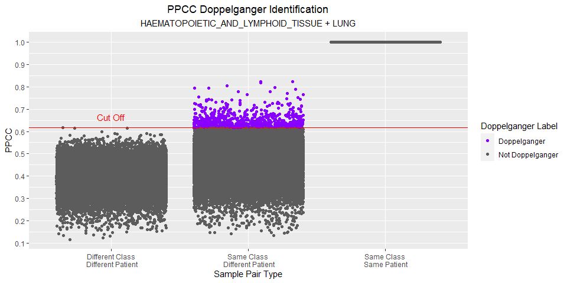

Exploring Doppelgangers in the CCLE Dataset
================
Wang Li Rong

# 0\. Importing Libraries and Useful Functions

## a) Importing libraries

``` r
if (!("doppelgangerIdentifier" %in% installed.packages())){
  install.packages('devtools')
  library(devtools)
  install_github('lr98769/doppelgangerIdentifier')
}
library("doppelgangerIdentifier")
```

## b) Importing Functions

``` r
functions_dir = "../functions"
source(file.path(functions_dir, "process_dataframes.R"))
source(file.path(functions_dir, "process_vectors.R"))
source(file.path(functions_dir, "process_lists.R"))
source(file.path(functions_dir, "output_functions.R"))
source(file.path(functions_dir, "planning_functions.R"))
```

## c) File Paths

``` r
dataset_url = "https://depmap.org/portal/download/api/download?file_name=ccle%2Fccle_2019%2FCCLE_RNAseq_rsem_genes_tpm_20180929.txt.gz&bucket=depmap-external-downloads"

dataset_dir = "../data"
processed_dataset_dir = "../cleaned_data"
planning_data_dir = "../planning_data"
experiment_plans_dir = "../experiment_plans"
images_dir = "../images"

dataset_filepath = file.path(dataset_dir, "CCLE_RNAseq_rsem_genes_tpm_20180929.txt.gz")

processed_ccle_filepath = file.path(processed_dataset_dir, 
                                    "ccle.rds")
processed_ccle_meta_filepath = file.path(processed_dataset_dir, 
                                    "ccle_meta.rds")

processed_lymph_lung_filepath = file.path(processed_dataset_dir,
                                          "lymph_lung.rds")
processed_lymph_lung_meta_filepath = file.path(processed_dataset_dir,
                                          "lymph_lung_meta.rds")
planning_data_lymph_lung_filepath = file.path(planning_data_dir,
                                              "lymph_lung_plan.xlsx")
ex_plan_lymph_lung_xlsx_filepath = file.path(experiment_plans_dir,
                                        "lymph_lung_ex_plan.xlsx")
ex_plan_lymph_lung_csv_filepath = file.path(experiment_plans_dir,
                                        "lymph_lung_ex_plan.csv")

processed_large_upper_filepath = file.path(processed_dataset_dir,
                                          "large_upper.rds")
processed_large_upper_meta_filepath = file.path(processed_dataset_dir,
                                          "large_upper_meta.rds")
planning_data_large_upper_filepath = file.path(planning_data_dir,
                                              "large_upper_plan.xlsx")
ex_plan_large_upper_xlsx_filepath = file.path(experiment_plans_dir,
                                        "large_upper_ex_plan.xlsx")
ex_plan_large_upper_csv_filepath = file.path(experiment_plans_dir,
                                        "large_upper_ex_plan.csv")

ddi_image_filepath= file.path(images_dir, "ccle_ddi.tiff")
dv_image_filepath= file.path(images_dir, "ccle_dv.tiff")
```

# d) Ensure directories and the proper files have been downloaded

``` r
directories = c(
  dataset_dir, processed_dataset_dir, planning_data_dir, 
  experiment_plans_dir, images_dir
)
for (directory in directories){
  if (!file.exists(directory)){
    dir.create(directory)
  }
}
if (!file.exists(dataset_filepath)){
  download.file(dataset_url, dataset_filepath, mode = "wb")
}
```

# 1\. Importing the Dataset

Data Set Statistics: - 57820 Genes - 1019 Samples

``` r
if (!file.exists(processed_ccle_filepath)){
  ccle = read.table(dataset_filepath, row.names = 1)
  ccle = set_first_row_as_header(ccle)
  ccle$transcript_ids = NULL
  ccle[] = lapply(ccle,as.numeric)
  saveRDS(ccle, processed_ccle_filepath)
} else {
  ccle = readRDS(processed_ccle_filepath)
}
```

Getting meta data for CCLE

``` r
if (!file.exists(processed_ccle_meta_filepath)){
  ccle_meta = generate_meta_data(ccle)
  saveRDS(ccle_meta, processed_ccle_meta_filepath)
} else {
  ccle_meta = readRDS(processed_ccle_meta_filepath)
}
```

Analysing classes in CCLE

``` r
View(table(ccle_meta$Class))
```

# 2\. Finding PPCC Doppelgangers Within CCLE

We chose 2 sets of cancer pairs to look for doppelgangers.

## a) “Haematopoietic and Lymphoid Tissue” and “Lung” Cancer

This cancer pair was chosen for its large size.

There are 173 HAEMATOPOIETIC\_AND\_LYMPHOID\_TISSUE samples and 188 LUNG
samples.

``` r
if (!file.exists(processed_lymph_lung_meta_filepath)){
  lymph_lung_meta = ccle_meta[ccle_meta$Class %in% c("HAEMATOPOIETIC_AND_LYMPHOID_TISSUE","LUNG"),]
  saveRDS(lymph_lung_meta, processed_lymph_lung_meta_filepath)
} else {
  lymph_lung_meta = readRDS(processed_lymph_lung_meta_filepath)
}

if (!file.exists(processed_lymph_lung_filepath)){
  lymph_lung = ccle[, row.names(lymph_lung_meta)]
  saveRDS(lymph_lung, processed_lymph_lung_filepath)
} else {
  lymph_lung = readRDS(processed_lymph_lung_filepath)
}
table(lymph_lung_meta$Class)
```

    ## 
    ## HAEMATOPOIETIC_AND_LYMPHOID_TISSUE                               LUNG 
    ##                                173                                188

Let’s observe if there are any doppelgangers within this data.

``` r
start_time = Sys.time()
lymph_lung_doppel = getPPCCDoppelgangers(
  raw_data = lymph_lung,
  meta_data = lymph_lung_meta,
  do_batch_corr = FALSE
)
```

    ## [1] "1. No batch correction since there is only 1 batch..."
    ## [1] "2. Calculating PPCC between samples of the same dataset..."
    ##   |                                                                              |=                                                                     |   1%  |                                                                              |                                                                      |   0%  |                                                                              |                                                                      |   1%  |                                                                              |=                                                                     |   1%  |                                                                              |=                                                                     |   2%  |                                                                              |==                                                                    |   2%  |                                                                              |==                                                                    |   3%  |                                                                              |==                                                                    |   4%  |                                                                              |===                                                                   |   4%  |                                                                              |===                                                                   |   5%  |                                                                              |====                                                                  |   5%  |                                                                              |====                                                                  |   6%  |                                                                              |=====                                                                 |   6%  |                                                                              |=====                                                                 |   7%  |                                                                              |=====                                                                 |   8%  |                                                                              |======                                                                |   8%  |                                                                              |======                                                                |   9%  |                                                                              |=======                                                               |   9%  |                                                                              |=======                                                               |  10%  |                                                                              |=======                                                               |  11%  |                                                                              |========                                                              |  11%  |                                                                              |========                                                              |  12%  |                                                                              |=========                                                             |  12%  |                                                                              |=========                                                             |  13%  |                                                                              |=========                                                             |  14%  |                                                                              |==========                                                            |  14%  |                                                                              |==========                                                            |  15%  |                                                                              |===========                                                           |  15%  |                                                                              |===========                                                           |  16%  |                                                                              |============                                                          |  16%  |                                                                              |============                                                          |  17%  |                                                                              |============                                                          |  18%  |                                                                              |=============                                                         |  18%  |                                                                              |=============                                                         |  19%  |                                                                              |==============                                                        |  19%  |                                                                              |==============                                                        |  20%  |                                                                              |==============                                                        |  21%  |                                                                              |===============                                                       |  21%  |                                                                              |===============                                                       |  22%  |                                                                              |================                                                      |  22%  |                                                                              |================                                                      |  23%  |                                                                              |================                                                      |  24%  |                                                                              |=================                                                     |  24%  |                                                                              |=================                                                     |  25%  |                                                                              |==================                                                    |  25%  |                                                                              |==================                                                    |  26%  |                                                                              |===================                                                   |  26%  |                                                                              |===================                                                   |  27%  |                                                                              |===================                                                   |  28%  |                                                                              |====================                                                  |  28%  |                                                                              |====================                                                  |  29%  |                                                                              |=====================                                                 |  29%  |                                                                              |=====================                                                 |  30%  |                                                                              |=====================                                                 |  31%  |                                                                              |======================                                                |  31%  |                                                                              |======================                                                |  32%  |                                                                              |=======================                                               |  32%  |                                                                              |=======================                                               |  33%  |                                                                              |=======================                                               |  34%  |                                                                              |========================                                              |  34%  |                                                                              |========================                                              |  35%  |                                                                              |=========================                                             |  35%  |                                                                              |=========================                                             |  36%  |                                                                              |==========================                                            |  36%  |                                                                              |==========================                                            |  37%  |                                                                              |==========================                                            |  38%  |                                                                              |===========================                                           |  38%  |                                                                              |===========================                                           |  39%  |                                                                              |============================                                          |  39%  |                                                                              |============================                                          |  40%  |                                                                              |============================                                          |  41%  |                                                                              |=============================                                         |  41%  |                                                                              |=============================                                         |  42%  |                                                                              |==============================                                        |  42%  |                                                                              |==============================                                        |  43%  |                                                                              |==============================                                        |  44%  |                                                                              |===============================                                       |  44%  |                                                                              |===============================                                       |  45%  |                                                                              |================================                                      |  45%  |                                                                              |================================                                      |  46%  |                                                                              |=================================                                     |  46%  |                                                                              |=================================                                     |  47%  |                                                                              |=================================                                     |  48%  |                                                                              |==================================                                    |  48%  |                                                                              |==================================                                    |  49%  |                                                                              |===================================                                   |  49%  |                                                                              |===================================                                   |  50%  |                                                                              |===================================                                   |  51%  |                                                                              |====================================                                  |  51%  |                                                                              |====================================                                  |  52%  |                                                                              |=====================================                                 |  52%  |                                                                              |=====================================                                 |  53%  |                                                                              |=====================================                                 |  54%  |                                                                              |======================================                                |  54%  |                                                                              |======================================                                |  55%  |                                                                              |=======================================                               |  55%  |                                                                              |=======================================                               |  56%  |                                                                              |========================================                              |  56%  |                                                                              |========================================                              |  57%  |                                                                              |========================================                              |  58%  |                                                                              |=========================================                             |  58%  |                                                                              |=========================================                             |  59%  |                                                                              |==========================================                            |  59%  |                                                                              |==========================================                            |  60%  |                                                                              |==========================================                            |  61%  |                                                                              |===========================================                           |  61%  |                                                                              |===========================================                           |  62%  |                                                                              |============================================                          |  62%  |                                                                              |============================================                          |  63%  |                                                                              |============================================                          |  64%  |                                                                              |=============================================                         |  64%  |                                                                              |=============================================                         |  65%  |                                                                              |==============================================                        |  65%  |                                                                              |==============================================                        |  66%  |                                                                              |===============================================                       |  66%  |                                                                              |===============================================                       |  67%  |                                                                              |===============================================                       |  68%  |                                                                              |================================================                      |  68%  |                                                                              |================================================                      |  69%  |                                                                              |=================================================                     |  69%  |                                                                              |=================================================                     |  70%  |                                                                              |=================================================                     |  71%  |                                                                              |==================================================                    |  71%  |                                                                              |==================================================                    |  72%  |                                                                              |===================================================                   |  72%  |                                                                              |===================================================                   |  73%  |                                                                              |===================================================                   |  74%  |                                                                              |====================================================                  |  74%  |                                                                              |====================================================                  |  75%  |                                                                              |=====================================================                 |  75%  |                                                                              |=====================================================                 |  76%  |                                                                              |======================================================                |  76%  |                                                                              |======================================================                |  77%  |                                                                              |======================================================                |  78%  |                                                                              |=======================================================               |  78%  |                                                                              |=======================================================               |  79%  |                                                                              |========================================================              |  79%  |                                                                              |========================================================              |  80%  |                                                                              |========================================================              |  81%  |                                                                              |=========================================================             |  81%  |                                                                              |=========================================================             |  82%  |                                                                              |==========================================================            |  82%  |                                                                              |==========================================================            |  83%  |                                                                              |==========================================================            |  84%  |                                                                              |===========================================================           |  84%  |                                                                              |===========================================================           |  85%  |                                                                              |============================================================          |  85%  |                                                                              |============================================================          |  86%  |                                                                              |=============================================================         |  86%  |                                                                              |=============================================================         |  87%  |                                                                              |=============================================================         |  88%  |                                                                              |==============================================================        |  88%  |                                                                              |==============================================================        |  89%  |                                                                              |===============================================================       |  89%  |                                                                              |===============================================================       |  90%  |                                                                              |===============================================================       |  91%  |                                                                              |================================================================      |  91%  |                                                                              |================================================================      |  92%  |                                                                              |=================================================================     |  92%  |                                                                              |=================================================================     |  93%  |                                                                              |=================================================================     |  94%  |                                                                              |==================================================================    |  94%  |                                                                              |==================================================================    |  95%  |                                                                              |===================================================================   |  95%  |                                                                              |===================================================================   |  96%  |                                                                              |====================================================================  |  96%  |                                                                              |====================================================================  |  97%  |                                                                              |====================================================================  |  98%  |                                                                              |===================================================================== |  98%  |                                                                              |===================================================================== |  99%  |                                                                              |======================================================================|  99%  |                                                                              |======================================================================| 100%
    ## [1] "3. Labelling Sample Pairs according to their Class and Patient Similarities..."
    ## [1] "4. Calculating PPCC cut off to identify PPCC data doppelgangers..."
    ## [1] "5. Identifying PPCC data doppelgangers..."

``` r
end_time = Sys.time()
end_time - start_time
```

    ## Time difference of 1.747665 mins

``` r
visualisePPCCDoppelgangers(lymph_lung_doppel) + ggtitle(label="PPCC Doppelganger Identification", subtitle="HAEMATOPOIETIC_AND_LYMPHOID_TISSUE + LUNG") + theme(plot.subtitle = element_text(hjust = 0.5))
```

<!-- -->

``` r
# There are 17 Doppelgangers
table(lymph_lung_doppel$PPCC_df$DoppelgangerLabel)
```

    ## 
    ##     Doppelganger Not Doppelganger 
    ##               17            65324

``` r
lymph_lung_doppel$PPCC_df[lymph_lung_doppel$PPCC_df$DoppelgangerLabel == "Doppelganger",]
```

    ##                                         Sample1
    ## 202                                  CALU3_LUNG
    ## 1057                                  DV90_LUNG
    ## 1554    GA10_HAEMATOPOIETIC_AND_LYMPHOID_TISSUE
    ## 4654   HUNS1_HAEMATOPOIETIC_AND_LYMPHOID_TISSUE
    ## 15737  MUTZ5_HAEMATOPOIETIC_AND_LYMPHOID_TISSUE
    ## 25161                             NCIH1930_LUNG
    ## 26587                             NCIH2029_LUNG
    ## 27394                             NCIH2073_LUNG
    ## 30859                             NCIH2196_LUNG
    ## 33950                              NCIH292_LUNG
    ## 38688                               NCIH69_LUNG
    ## 38691                               NCIH69_LUNG
    ## 38702                               NCIH69_LUNG
    ## 38725                               NCIH69_LUNG
    ## 48517 RCHACV_HAEMATOPOIETIC_AND_LYMPHOID_TISSUE
    ## 50007                            RERFLCAD2_LUNG
    ## 50031                            RERFLCAD2_LUNG
    ##                                           Sample2      PPCC
    ## 202                                      BEN_LUNG 0.9845066
    ## 1057                                 CHAGOK1_LUNG 0.9854987
    ## 1554      BL70_HAEMATOPOIETIC_AND_LYMPHOID_TISSUE 0.9850483
    ## 4654    HS611T_HAEMATOPOIETIC_AND_LYMPHOID_TISSUE 0.9863700
    ## 15737 MHHCALL4_HAEMATOPOIETIC_AND_LYMPHOID_TISSUE 0.9852337
    ## 25161                               NCIH1092_LUNG 0.9885829
    ## 26587                                CHAGOK1_LUNG 0.9842563
    ## 27394                                  KNS62_LUNG 0.9884717
    ## 30859                               NCIH2029_LUNG 0.9891796
    ## 33950                                  CALU3_LUNG 0.9864592
    ## 38688                               NCIH1092_LUNG 0.9848747
    ## 38691                               NCIH1184_LUNG 0.9846308
    ## 38702                                NCIH146_LUNG 0.9857310
    ## 38725                               NCIH1876_LUNG 0.9842472
    ## 48517      697_HAEMATOPOIETIC_AND_LYMPHOID_TISSUE 0.9852453
    ## 50007                               NCIH2085_LUNG 0.9847654
    ## 50031                                NCIH292_LUNG 0.9884793
    ##                         ClassPatient DoppelgangerLabel
    ## 202   Same Class\n Different Patient      Doppelganger
    ## 1057  Same Class\n Different Patient      Doppelganger
    ## 1554  Same Class\n Different Patient      Doppelganger
    ## 4654  Same Class\n Different Patient      Doppelganger
    ## 15737 Same Class\n Different Patient      Doppelganger
    ## 25161 Same Class\n Different Patient      Doppelganger
    ## 26587 Same Class\n Different Patient      Doppelganger
    ## 27394 Same Class\n Different Patient      Doppelganger
    ## 30859 Same Class\n Different Patient      Doppelganger
    ## 33950 Same Class\n Different Patient      Doppelganger
    ## 38688 Same Class\n Different Patient      Doppelganger
    ## 38691 Same Class\n Different Patient      Doppelganger
    ## 38702 Same Class\n Different Patient      Doppelganger
    ## 38725 Same Class\n Different Patient      Doppelganger
    ## 48517 Same Class\n Different Patient      Doppelganger
    ## 50007 Same Class\n Different Patient      Doppelganger
    ## 50031 Same Class\n Different Patient      Doppelganger

## b) “Large Intestine” and “Upper Aerodigestive Tract” Cancer

There are 56 LARGE\_INTESTINE samples and 31 UPPER\_AERODIGESTIVE\_TRACT
samples.

``` r
if (!file.exists(processed_large_upper_meta_filepath)){
  large_upper_meta = ccle_meta[ccle_meta$Class %in% c("LARGE_INTESTINE","UPPER_AERODIGESTIVE_TRACT"),]
  saveRDS(large_upper_meta, processed_large_upper_meta_filepath)
} else {
  large_upper_meta = readRDS(processed_large_upper_meta_filepath)
}

if (!file.exists(processed_large_upper_filepath)){
  large_upper = ccle[, row.names(large_upper_meta)]
  saveRDS(large_upper, processed_large_upper_filepath)
} else {
  large_upper = readRDS(processed_large_upper_filepath)
}
table(large_upper_meta$Class)
```

    ## 
    ##           LARGE_INTESTINE UPPER_AERODIGESTIVE_TRACT 
    ##                        56                        31

Let’s observe if there are any doppelgangers within this data.

``` r
start_time = Sys.time()
large_upper_doppel = getPPCCDoppelgangers(
  raw_data = large_upper,
  meta_data = large_upper_meta,
  do_batch_corr = FALSE
)
```

    ## [1] "1. No batch correction since there is only 1 batch..."
    ## [1] "2. Calculating PPCC between samples of the same dataset..."
    ##   |                                                                              |=                                                                     |   1%  |                                                                              |                                                                      |   0%  |                                                                              |                                                                      |   1%  |                                                                              |=                                                                     |   1%  |                                                                              |=                                                                     |   2%  |                                                                              |==                                                                    |   2%  |                                                                              |==                                                                    |   3%  |                                                                              |==                                                                    |   4%  |                                                                              |===                                                                   |   4%  |                                                                              |===                                                                   |   5%  |                                                                              |====                                                                  |   5%  |                                                                              |====                                                                  |   6%  |                                                                              |=====                                                                 |   6%  |                                                                              |=====                                                                 |   7%  |                                                                              |=====                                                                 |   8%  |                                                                              |======                                                                |   8%  |                                                                              |======                                                                |   9%  |                                                                              |=======                                                               |   9%  |                                                                              |=======                                                               |  10%  |                                                                              |=======                                                               |  11%  |                                                                              |========                                                              |  11%  |                                                                              |========                                                              |  12%  |                                                                              |=========                                                             |  12%  |                                                                              |=========                                                             |  13%  |                                                                              |=========                                                             |  14%  |                                                                              |==========                                                            |  14%  |                                                                              |==========                                                            |  15%  |                                                                              |===========                                                           |  15%  |                                                                              |===========                                                           |  16%  |                                                                              |============                                                          |  16%  |                                                                              |============                                                          |  17%  |                                                                              |============                                                          |  18%  |                                                                              |=============                                                         |  18%  |                                                                              |=============                                                         |  19%  |                                                                              |==============                                                        |  19%  |                                                                              |==============                                                        |  20%  |                                                                              |==============                                                        |  21%  |                                                                              |===============                                                       |  21%  |                                                                              |===============                                                       |  22%  |                                                                              |================                                                      |  22%  |                                                                              |================                                                      |  23%  |                                                                              |================                                                      |  24%  |                                                                              |=================                                                     |  24%  |                                                                              |=================                                                     |  25%  |                                                                              |==================                                                    |  25%  |                                                                              |==================                                                    |  26%  |                                                                              |===================                                                   |  26%  |                                                                              |===================                                                   |  27%  |                                                                              |===================                                                   |  28%  |                                                                              |====================                                                  |  28%  |                                                                              |====================                                                  |  29%  |                                                                              |=====================                                                 |  29%  |                                                                              |=====================                                                 |  30%  |                                                                              |=====================                                                 |  31%  |                                                                              |======================                                                |  31%  |                                                                              |======================                                                |  32%  |                                                                              |=======================                                               |  32%  |                                                                              |=======================                                               |  33%  |                                                                              |=======================                                               |  34%  |                                                                              |========================                                              |  34%  |                                                                              |========================                                              |  35%  |                                                                              |=========================                                             |  35%  |                                                                              |=========================                                             |  36%  |                                                                              |==========================                                            |  36%  |                                                                              |==========================                                            |  37%  |                                                                              |==========================                                            |  38%  |                                                                              |===========================                                           |  38%  |                                                                              |===========================                                           |  39%  |                                                                              |============================                                          |  39%  |                                                                              |============================                                          |  40%  |                                                                              |============================                                          |  41%  |                                                                              |=============================                                         |  41%  |                                                                              |=============================                                         |  42%  |                                                                              |==============================                                        |  42%  |                                                                              |==============================                                        |  43%  |                                                                              |==============================                                        |  44%  |                                                                              |===============================                                       |  44%  |                                                                              |===============================                                       |  45%  |                                                                              |================================                                      |  45%  |                                                                              |================================                                      |  46%  |                                                                              |=================================                                     |  46%  |                                                                              |=================================                                     |  47%  |                                                                              |=================================                                     |  48%  |                                                                              |==================================                                    |  48%  |                                                                              |==================================                                    |  49%  |                                                                              |===================================                                   |  49%  |                                                                              |===================================                                   |  50%  |                                                                              |===================================                                   |  51%  |                                                                              |====================================                                  |  51%  |                                                                              |====================================                                  |  52%  |                                                                              |=====================================                                 |  52%  |                                                                              |=====================================                                 |  53%  |                                                                              |=====================================                                 |  54%  |                                                                              |======================================                                |  54%  |                                                                              |======================================                                |  55%  |                                                                              |=======================================                               |  55%  |                                                                              |=======================================                               |  56%  |                                                                              |========================================                              |  56%  |                                                                              |========================================                              |  57%  |                                                                              |========================================                              |  58%  |                                                                              |=========================================                             |  58%  |                                                                              |=========================================                             |  59%  |                                                                              |==========================================                            |  59%  |                                                                              |==========================================                            |  60%  |                                                                              |==========================================                            |  61%  |                                                                              |===========================================                           |  61%  |                                                                              |===========================================                           |  62%  |                                                                              |============================================                          |  62%  |                                                                              |============================================                          |  63%  |                                                                              |============================================                          |  64%  |                                                                              |=============================================                         |  64%  |                                                                              |=============================================                         |  65%  |                                                                              |==============================================                        |  65%  |                                                                              |==============================================                        |  66%  |                                                                              |===============================================                       |  66%  |                                                                              |===============================================                       |  67%  |                                                                              |===============================================                       |  68%  |                                                                              |================================================                      |  68%  |                                                                              |================================================                      |  69%  |                                                                              |=================================================                     |  69%  |                                                                              |=================================================                     |  70%  |                                                                              |=================================================                     |  71%  |                                                                              |==================================================                    |  71%  |                                                                              |==================================================                    |  72%  |                                                                              |===================================================                   |  72%  |                                                                              |===================================================                   |  73%  |                                                                              |===================================================                   |  74%  |                                                                              |====================================================                  |  74%  |                                                                              |====================================================                  |  75%  |                                                                              |=====================================================                 |  75%  |                                                                              |=====================================================                 |  76%  |                                                                              |======================================================                |  76%  |                                                                              |======================================================                |  77%  |                                                                              |======================================================                |  78%  |                                                                              |=======================================================               |  78%  |                                                                              |=======================================================               |  79%  |                                                                              |========================================================              |  79%  |                                                                              |========================================================              |  80%  |                                                                              |========================================================              |  81%  |                                                                              |=========================================================             |  81%  |                                                                              |=========================================================             |  82%  |                                                                              |==========================================================            |  82%  |                                                                              |==========================================================            |  83%  |                                                                              |==========================================================            |  84%  |                                                                              |===========================================================           |  84%  |                                                                              |===========================================================           |  85%  |                                                                              |============================================================          |  85%  |                                                                              |============================================================          |  86%  |                                                                              |=============================================================         |  86%  |                                                                              |=============================================================         |  87%  |                                                                              |=============================================================         |  88%  |                                                                              |==============================================================        |  88%  |                                                                              |==============================================================        |  89%  |                                                                              |===============================================================       |  89%  |                                                                              |===============================================================       |  90%  |                                                                              |===============================================================       |  91%  |                                                                              |================================================================      |  91%  |                                                                              |================================================================      |  92%  |                                                                              |=================================================================     |  92%  |                                                                              |=================================================================     |  93%  |                                                                              |=================================================================     |  94%  |                                                                              |==================================================================    |  94%  |                                                                              |==================================================================    |  95%  |                                                                              |===================================================================   |  95%  |                                                                              |===================================================================   |  96%  |                                                                              |====================================================================  |  96%  |                                                                              |====================================================================  |  97%  |                                                                              |====================================================================  |  98%  |                                                                              |===================================================================== |  98%  |                                                                              |===================================================================== |  99%  |                                                                              |======================================================================|  99%  |                                                                              |======================================================================| 100%
    ## [1] "3. Labelling Sample Pairs according to their Class and Patient Similarities..."
    ## [1] "4. Calculating PPCC cut off to identify PPCC data doppelgangers..."
    ## [1] "5. Identifying PPCC data doppelgangers..."

``` r
end_time = Sys.time()
end_time - start_time
```

    ## Time difference of 2.829016 secs

``` r
visualisePPCCDoppelgangers(large_upper_doppel) + ggtitle(label="PPCC Doppelganger Identification", subtitle="LARGE_INTESTINE + UPPER_AERODIGESTIVE_TRACT") + theme(plot.subtitle = element_text(hjust = 0.5))
```

<!-- -->

``` r
large_upper_doppel$PPCC_df[large_upper_doppel$PPCC_df$DoppelgangerLabel == "Doppelganger",]
```

    ##                              Sample1                            Sample2
    ## 697            LS180_LARGE_INTESTINE               HT29_LARGE_INTESTINE
    ## 773            LS513_LARGE_INTESTINE               HT55_LARGE_INTESTINE
    ## 1371 SCC25_UPPER_AERODIGESTIVE_TRACT PECAPJ15_UPPER_AERODIGESTIVE_TRACT
    ## 1482  SCC9_UPPER_AERODIGESTIVE_TRACT    SCC15_UPPER_AERODIGESTIVE_TRACT
    ## 1483  SCC9_UPPER_AERODIGESTIVE_TRACT    SCC25_UPPER_AERODIGESTIVE_TRACT
    ##           PPCC                   ClassPatient DoppelgangerLabel
    ## 697  0.9906413 Same Class\n Different Patient      Doppelganger
    ## 773  0.9907542 Same Class\n Different Patient      Doppelganger
    ## 1371 0.9951153 Same Class\n Different Patient      Doppelganger
    ## 1482 0.9909151 Same Class\n Different Patient      Doppelganger
    ## 1483 0.9920588 Same Class\n Different Patient      Doppelganger

# 3\. Verifying the functionality of identified doppelgangers

## a) “Haematopoietic and Lymphoid Tissue” and “Lung” Cancer

Generating csv file with necessary data for experiment planning

``` r
lymph_lung_planning_list = generate_planning_dataframes(
  meta_data_df = lymph_lung_meta,
  doppel_results = lymph_lung_doppel)
output_list_of_df_to_excel(
  list_to_save=lymph_lung_planning_list,
  filename = planning_data_lymph_lung_filepath
)
```

Generating list of doppelganger validation samples

``` r
lymph_lung_doppel_sample_in_valid = find_largest_valid_doppel(
  planning_list = lymph_lung_planning_list)

lymph_lung_doppel_sample_in_valid
```

    ##  [1] "BL70_HAEMATOPOIETIC_AND_LYMPHOID_TISSUE"    
    ##  [2] "HS611T_HAEMATOPOIETIC_AND_LYMPHOID_TISSUE"  
    ##  [3] "MHHCALL4_HAEMATOPOIETIC_AND_LYMPHOID_TISSUE"
    ##  [4] "697_HAEMATOPOIETIC_AND_LYMPHOID_TISSUE"     
    ##  [5] "NCIH1092_LUNG"                              
    ##  [6] "NCIH1184_LUNG"                              
    ##  [7] "NCIH146_LUNG"                               
    ##  [8] "NCIH1876_LUNG"                              
    ##  [9] "BEN_LUNG"                                   
    ## [10] "NCIH292_LUNG"                               
    ## [11] "CHAGOK1_LUNG"                               
    ## [12] "NCIH2196_LUNG"                              
    ## [13] "NCIH2085_LUNG"                              
    ## [14] "KNS62_LUNG"

Highlighting doppelganger validation samples in the excel file for a
visual check

``` r
output_highlighted_planning_file(
  planning_list = lymph_lung_planning_list,
  highlighted_filename = planning_data_lymph_lung_filepath,
  doppel_samples_in_valid = lymph_lung_doppel_sample_in_valid
)
```

Generate experiment plan

``` r
lymph_lung_experiment_plan = generate_experiment_plan(
  planning_list = lymph_lung_planning_list,
  valid_doppel = lymph_lung_doppel_sample_in_valid,
  num_samples_added = 4)
```

    ## [1] "1. Loading data frames"
    ## [1] "2. Generating sample subsets"
    ## [1] "3. Splitting data set into 5 key groups"
    ## [1] "- Generating train_doppel"
    ## [1] "- Generating valid_doppel"
    ## [1] "- Generating valid_non_doppel"
    ## [1] "- Generating valid_non_doppel_extra"
    ## [1] "- Generating train_non_doppel"
    ## [1] "4. Creating the experiment plan list"
    ## [1] "5. Adding sample type information"
    ## [1] "Experiment plan generated!"

Output the experiment plan to an excel file (For a visual check)

``` r
highlight_style_list = list(
  train_doppel = createStyle(fgFill = "#d0adff"),
  train_non_doppel = createStyle(fgFill = "#ffffff"),
  valid_doppel = createStyle(fgFill = "#8d29ff"),
  valid_non_doppel = createStyle(fgFill = "#bdbdbd"),
  valid_non_doppel_extra = createStyle(fgFill = "#ffffff")
)

output_experiment_plan(
  experiment_plan = lymph_lung_experiment_plan,
  planning_list = lymph_lung_planning_list,
  ex_plan_csv_fp = ex_plan_lymph_lung_csv_filepath,
  ex_plan_xlsx_fp = ex_plan_lymph_lung_xlsx_filepath,
  highlight_style_list = highlight_style_list)
```

    ## [1] "1. Outputing plan to csv..."
    ## [1] "2. Outputing plan to xlsx"
    ## [1] "  a) Generating  planning xlsx"
    ## [1] "  b) Loading workbook"
    ## [1] "  c) Add in experiment plan"
    ## [1] "  d) Add in stats"
    ## [1] "  e) Highlighting all sheets in the workbook"
    ## [1] "  f) Saving the excel file"

Verifying the functionality of PPCC data doppelgangers

``` r
lymph_lung_veri = verifyDoppelgangers(
  experiment_plan_filename = ex_plan_lymph_lung_csv_filepath,
  raw_data = lymph_lung,
  meta_data = lymph_lung_meta,
  feature_set_portion = 0.1,
  do_batch_corr = FALSE,
  k=19,
  size_of_val_set = 20
)
```

    ## [1] "1. Preprocessing data..."
    ## [1] "- Skip batch correction"
    ## [1] "- Carrying out min-max normalisation"
    ## [1] "2. Generating Feature Sets..."
    ## [1] "3. Loading Experiment Plan..."
    ## [1] "4. Training KNN models..."
    ##   |                                                                              |=                                                                     |   1%  |                                                                              |==                                                                    |   3%  |                                                                              |===                                                                   |   4%  |                                                                              |====                                                                  |   6%  |                                                                              |=====                                                                 |   7%  |                                                                              |======                                                                |   8%  |                                                                              |=======                                                               |  10%  |                                                                              |========                                                              |  11%  |                                                                              |=========                                                             |  12%  |                                                                              |==========                                                            |  14%  |                                                                              |===========                                                           |  15%  |                                                                              |============                                                          |  17%  |                                                                              |=============                                                         |  18%  |                                                                              |==============                                                        |  19%  |                                                                              |===============                                                       |  21%  |                                                                              |================                                                      |  22%  |                                                                              |=================                                                     |  24%  |                                                                              |==================                                                    |  25%  |                                                                              |==================                                                    |  26%  |                                                                              |===================                                                   |  28%  |                                                                              |====================                                                  |  29%  |                                                                              |=====================                                                 |  31%  |                                                                              |======================                                                |  32%  |                                                                              |=======================                                               |  33%  |                                                                              |========================                                              |  35%  |                                                                              |=========================                                             |  36%  |                                                                              |==========================                                            |  38%  |                                                                              |===========================                                           |  39%  |                                                                              |============================                                          |  40%  |                                                                              |=============================                                         |  42%  |                                                                              |==============================                                        |  43%  |                                                                              |===============================                                       |  44%  |                                                                              |================================                                      |  46%  |                                                                              |=================================                                     |  47%  |                                                                              |==================================                                    |  49%  |                                                                              |===================================                                   |  50%  |                                                                              |====================================                                  |  51%  |                                                                              |=====================================                                 |  53%  |                                                                              |======================================                                |  54%  |                                                                              |=======================================                               |  56%  |                                                                              |========================================                              |  57%  |                                                                              |=========================================                             |  58%  |                                                                              |==========================================                            |  60%  |                                                                              |===========================================                           |  61%  |                                                                              |============================================                          |  62%  |                                                                              |=============================================                         |  64%  |                                                                              |==============================================                        |  65%  |                                                                              |===============================================                       |  67%  |                                                                              |================================================                      |  68%  |                                                                              |=================================================                     |  69%  |                                                                              |==================================================                    |  71%  |                                                                              |===================================================                   |  72%  |                                                                              |====================================================                  |  74%  |                                                                              |====================================================                  |  75%  |                                                                              |=====================================================                 |  76%  |                                                                              |======================================================                |  78%  |                                                                              |=======================================================               |  79%  |                                                                              |========================================================              |  81%  |                                                                              |=========================================================             |  82%  |                                                                              |==========================================================            |  83%  |                                                                              |===========================================================           |  85%  |                                                                              |============================================================          |  86%  |                                                                              |=============================================================         |  88%  |                                                                              |==============================================================        |  89%  |                                                                              |===============================================================       |  90%  |                                                                              |================================================================      |  92%  |                                                                              |=================================================================     |  93%  |                                                                              |==================================================================    |  94%  |                                                                              |===================================================================   |  96%  |                                                                              |====================================================================  |  97%  |                                                                              |===================================================================== |  99%  |                                                                              |======================================================================| 100%

Visualise the results

``` r
visualiseVerificationResults(lymph_lung_veri) + ggtitle(label="Accuracy of KNN Models", subtitle="HAEMATOPOIETIC_AND_LYMPHOID_TISSUE + LUNG\nValidation Set Size = 20 Samples") + theme(plot.subtitle = element_text(hjust = 0.5))
```

<!-- -->

## b) “Large Intestine” and “Upper Aerodigestive Tract” Cancer

Generating csv file with necessary data for experiment planning

``` r
large_upper_planning_list = generate_planning_dataframes(
  meta_data_df = large_upper_meta,
  doppel_results = large_upper_doppel)
```

Get largest possible set of doppelganger samples in validation

``` r
large_upper_valid_doppel = find_largest_valid_doppel(
  planning_list = large_upper_planning_list
)
large_upper_valid_doppel
```

    ## [1] "HT29_LARGE_INTESTINE"               "HT55_LARGE_INTESTINE"              
    ## [3] "PECAPJ15_UPPER_AERODIGESTIVE_TRACT" "SCC9_UPPER_AERODIGESTIVE_TRACT"

Get experiment plan with this list of doppelganger samples in validation

``` r
large_upper_experiment_plan = generate_experiment_plan(
  planning_list = large_upper_planning_list,
  valid_doppel = large_upper_valid_doppel,
  num_samples_added = 1
)
```

    ## [1] "1. Loading data frames"
    ## [1] "2. Generating sample subsets"
    ## [1] "3. Splitting data set into 5 key groups"
    ## [1] "- Generating train_doppel"
    ## [1] "- Generating valid_doppel"
    ## [1] "- Generating valid_non_doppel"
    ## [1] "- Generating valid_non_doppel_extra"
    ## [1] "- Generating train_non_doppel"
    ## [1] "4. Creating the experiment plan list"
    ## [1] "5. Adding sample type information"
    ## [1] "Experiment plan generated!"

Save experiment plans

``` r
output_experiment_plan(
  experiment_plan = large_upper_experiment_plan,
  planning_list = large_upper_planning_list,
  ex_plan_csv_fp = ex_plan_large_upper_csv_filepath,
  ex_plan_xlsx_fp = ex_plan_large_upper_xlsx_filepath,
  highlight_style_list = highlight_style_list
)
```

    ## [1] "1. Outputing plan to csv..."
    ## [1] "2. Outputing plan to xlsx"
    ## [1] "  a) Generating  planning xlsx"
    ## [1] "  b) Loading workbook"
    ## [1] "  c) Add in experiment plan"
    ## [1] "  d) Add in stats"
    ## [1] "  e) Highlighting all sheets in the workbook"
    ## [1] "  f) Saving the excel file"

Verify functionality of PPCC data doppelgangers

``` r
large_upper_veri = verifyDoppelgangers(
  experiment_plan_filename = ex_plan_large_upper_csv_filepath,
  raw_data = large_upper,
  meta_data = large_upper_meta,
  feature_set_portion = 0.1,
  do_batch_corr = FALSE,
  k=9,
  size_of_val_set = 4
)
```

    ## [1] "1. Preprocessing data..."
    ## [1] "- Skip batch correction"
    ## [1] "- Carrying out min-max normalisation"
    ## [1] "2. Generating Feature Sets..."
    ## [1] "3. Loading Experiment Plan..."
    ## [1] "4. Training KNN models..."
    ##   |                                                                              |=                                                                     |   1%  |                                                                              |==                                                                    |   3%  |                                                                              |===                                                                   |   4%  |                                                                              |====                                                                  |   6%  |                                                                              |=====                                                                 |   7%  |                                                                              |======                                                                |   8%  |                                                                              |=======                                                               |  10%  |                                                                              |========                                                              |  11%  |                                                                              |=========                                                             |  12%  |                                                                              |==========                                                            |  14%  |                                                                              |===========                                                           |  15%  |                                                                              |============                                                          |  17%  |                                                                              |=============                                                         |  18%  |                                                                              |==============                                                        |  19%  |                                                                              |===============                                                       |  21%  |                                                                              |================                                                      |  22%  |                                                                              |=================                                                     |  24%  |                                                                              |==================                                                    |  25%  |                                                                              |==================                                                    |  26%  |                                                                              |===================                                                   |  28%  |                                                                              |====================                                                  |  29%  |                                                                              |=====================                                                 |  31%  |                                                                              |======================                                                |  32%  |                                                                              |=======================                                               |  33%  |                                                                              |========================                                              |  35%  |                                                                              |=========================                                             |  36%  |                                                                              |==========================                                            |  38%  |                                                                              |===========================                                           |  39%  |                                                                              |============================                                          |  40%  |                                                                              |=============================                                         |  42%  |                                                                              |==============================                                        |  43%  |                                                                              |===============================                                       |  44%  |                                                                              |================================                                      |  46%  |                                                                              |=================================                                     |  47%  |                                                                              |==================================                                    |  49%  |                                                                              |===================================                                   |  50%  |                                                                              |====================================                                  |  51%  |                                                                              |=====================================                                 |  53%  |                                                                              |======================================                                |  54%  |                                                                              |=======================================                               |  56%  |                                                                              |========================================                              |  57%  |                                                                              |=========================================                             |  58%  |                                                                              |==========================================                            |  60%  |                                                                              |===========================================                           |  61%  |                                                                              |============================================                          |  62%  |                                                                              |=============================================                         |  64%  |                                                                              |==============================================                        |  65%  |                                                                              |===============================================                       |  67%  |                                                                              |================================================                      |  68%  |                                                                              |=================================================                     |  69%  |                                                                              |==================================================                    |  71%  |                                                                              |===================================================                   |  72%  |                                                                              |====================================================                  |  74%  |                                                                              |====================================================                  |  75%  |                                                                              |=====================================================                 |  76%  |                                                                              |======================================================                |  78%  |                                                                              |=======================================================               |  79%  |                                                                              |========================================================              |  81%  |                                                                              |=========================================================             |  82%  |                                                                              |==========================================================            |  83%  |                                                                              |===========================================================           |  85%  |                                                                              |============================================================          |  86%  |                                                                              |=============================================================         |  88%  |                                                                              |==============================================================        |  89%  |                                                                              |===============================================================       |  90%  |                                                                              |================================================================      |  92%  |                                                                              |=================================================================     |  93%  |                                                                              |==================================================================    |  94%  |                                                                              |===================================================================   |  96%  |                                                                              |====================================================================  |  97%  |                                                                              |===================================================================== |  99%  |                                                                              |======================================================================| 100%

View verification results

``` r
visualiseVerificationResults(large_upper_veri) + ggtitle(label="Accuracy of KNN Models", subtitle="LARGE_INTESTINE + UPPER_AERODIGESTIVE_TRACT\nValidation Set Size = 4 Samples") + theme(plot.subtitle = element_text(hjust = 0.5))
```

<!-- -->

# 4\. Arrange Plots

## a) DD Identification

``` r
if (!"ggpubr" %in% installed.packages()){
  install.packages("ggpubr")
}
library(ggpubr)

# Arrange both plots
ccle_ddi_plots = ggarrange(
          ggpar(visualisePPCCDoppelgangers(lymph_lung_doppel) +
            coord_cartesian(ylim = c(0, 1)),
            title="lymph_lung"),
          ggpar(visualisePPCCDoppelgangers(large_upper_doppel) +
            coord_cartesian(ylim = c(0, 1)),
            title="large_upper")+
          rremove("ylab") +
          rremove("y.ticks")+
          rremove("y.text"),
          align='h',
          labels=c('A', 'B'),
          common.legend = T,
          legend = "bottom"
          )
# Add big title above
ccle_ddi_plots = annotate_figure(
  ccle_ddi_plots,
  top = text_grob("PPCC DD Identification",
  color = "black",
  face = "bold",
  size = 18))
ccle_ddi_plots
```

<!-- -->

``` r
# Output
ggsave(filename = ddi_image_filepath, width = 8, height = 6, device='tiff')
```

## b) DD Verification

``` r
if (!"ggpubr" %in% installed.packages()){
  install.packages("ggpubr")
}
library(ggpubr)

# Arrange both plots
ccle_dv_plots = ggarrange(
  ggpar(visualiseVerificationResults(lymph_lung_veri,
    c("Doppel_0","Doppel_4", "Doppel_8", "Doppel_12", "Doppel_14", "Pos_Con_14", "Neg_Con"),
    c("0 Doppel", "4 Doppel", "8 Doppel", "12 Doppel", "14 Doppel", "14 Pos Con", "Neg Con")) +
    coord_cartesian(ylim = c(0, 1)),
    title="lymph_lung") +
    scale_y_continuous(breaks=seq(0,1,0.2)) +
    labs(subtitle="341 Training, 20 Validation") + 
      theme(plot.subtitle=element_text(size=11, hjust=0.5, color="#2e2e2e")) + 
      theme(plot.title=element_text(size=12, hjust=0.5, color="black", face="bold")),
  ggpar(visualiseVerificationResults(large_upper_veri,
    c("Doppel_0","Doppel_1", "Doppel_2", "Doppel_3", "Doppel_4", "Pos_Con_4", "Neg_Con"),
    c("0 Doppel", "1 Doppel", "2 Doppel", "3 Doppel", "4 Doppel", "4 Pos Con", "Neg Con")
    ) +
    coord_cartesian(ylim = c(0, 1.1)),
    title="large_upper") +
    scale_y_continuous(breaks=seq(0,1,0.2)) +
    labs(subtitle="83 Training, 4 Validation") + 
      theme(plot.subtitle=element_text(size=11, hjust=0.5, color="#2e2e2e")) + 
      theme(plot.title=element_text(size=12, hjust=0.5, color="black", face="bold")),
  align='v',
  labels=c('A', 'B'),
  common.legend = T,
  legend = "bottom",
  nrow=2
)
# Add big title above
ccle_dv_plots = annotate_figure(
  ccle_dv_plots,
  top = text_grob("Functional Doppelganger Verification",
  color = "black",
  face = "bold",
  size = 18))
ccle_dv_plots
```

<!-- -->

``` r
# Output
ggsave(filename = dv_image_filepath, width = 8, height = 7, device='tiff')
```
