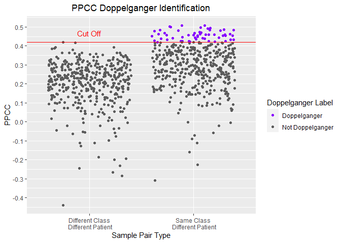
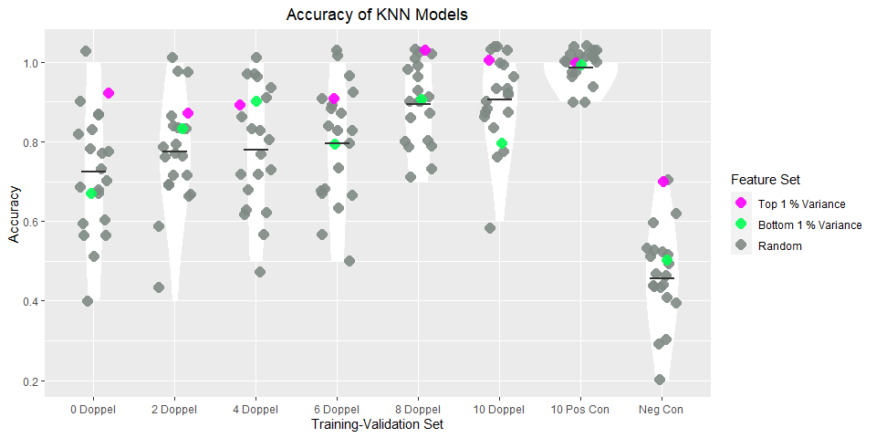

The Doppelganger Effect in Gene Expression Data sets
================

# 1\. Exploring the (Duchenne Muscular Dystrophy) DMD Datasets

## 0\) Import packages

File paths

``` r
data_dir = "../data"
cleaned_data_dir = "../cleaned_data"
functions_dir = "../functions"
images_dir = "../images"
output_dir = "../output"
```

Load functions for pre-processing and analysis:

``` r
source(file.path(functions_dir,"preprocessing_functions.R"))
source(file.path(functions_dir,"analysis_functions.R"))
```

## 1\) Import the DMD datasets

HaslettData - 12 DMD Samples - 12 Normal Samples

``` r
# Converts the affy probes to ensemble id
dmd_h = getDataFile(
  filename= file.path(data_dir, "data/DMD-HaslettData.csv"),
  affy_attribute = "affy_hg_u95av2",
  batch_name = "H")
#Forming The metadata dataframe 
dmd_h_meta = getMetaDataDataframe(df = dmd_h, batch_name = "H")
```

PescatoriData - 22 DMD Samples - 14 Normal Samples

``` r
dmd_p = getDataFile(filename = 
  file.path(data_dir, "DMD-PescatoriData.csv"),
  affy_attribute = "affy_hg_u133a",
  batch_name = "P")
#Forming The metadata dataframe 
dmd_p_meta = getMetaDataDataframe(df = dmd_p, batch_name = "P")
```

## 2\) Identify doppelgangers within and between both batches

### a) Doppelgangers within HaslettData

22 Doppelgangers found within HaslettData.

``` r
doppel_h = getPPCCDoppelgangers(dmd_h, dmd_h_meta)
```

    ## [1] "1. No batch correction since there is only 1 batch..."
    ## [1] "2. Calculating PPCC between samples of the same dataset..."
    ##   |                                                                              |=                                                                     |   1%  |                                                                              |                                                                      |   0%  |                                                                              |                                                                      |   1%  |                                                                              |=                                                                     |   1%  |                                                                              |=                                                                     |   2%  |                                                                              |==                                                                    |   2%  |                                                                              |==                                                                    |   3%  |                                                                              |===                                                                   |   4%  |                                                                              |===                                                                   |   5%  |                                                                              |====                                                                  |   5%  |                                                                              |====                                                                  |   6%  |                                                                              |=====                                                                 |   7%  |                                                                              |=====                                                                 |   8%  |                                                                              |======                                                                |   8%  |                                                                              |======                                                                |   9%  |                                                                              |=======                                                               |   9%  |                                                                              |=======                                                               |  10%  |                                                                              |=======                                                               |  11%  |                                                                              |========                                                              |  11%  |                                                                              |========                                                              |  12%  |                                                                              |=========                                                             |  12%  |                                                                              |=========                                                             |  13%  |                                                                              |==========                                                            |  14%  |                                                                              |==========                                                            |  15%  |                                                                              |===========                                                           |  15%  |                                                                              |===========                                                           |  16%  |                                                                              |============                                                          |  17%  |                                                                              |============                                                          |  18%  |                                                                              |=============                                                         |  18%  |                                                                              |=============                                                         |  19%  |                                                                              |==============                                                        |  19%  |                                                                              |==============                                                        |  20%  |                                                                              |==============                                                        |  21%  |                                                                              |===============                                                       |  21%  |                                                                              |===============                                                       |  22%  |                                                                              |================                                                      |  22%  |                                                                              |================                                                      |  23%  |                                                                              |=================                                                     |  24%  |                                                                              |=================                                                     |  25%  |                                                                              |==================                                                    |  25%  |                                                                              |==================                                                    |  26%  |                                                                              |===================                                                   |  27%  |                                                                              |===================                                                   |  28%  |                                                                              |====================                                                  |  28%  |                                                                              |====================                                                  |  29%  |                                                                              |=====================                                                 |  29%  |                                                                              |=====================                                                 |  30%  |                                                                              |=====================                                                 |  31%  |                                                                              |======================                                                |  31%  |                                                                              |======================                                                |  32%  |                                                                              |=======================                                               |  32%  |                                                                              |=======================                                               |  33%  |                                                                              |========================                                              |  34%  |                                                                              |========================                                              |  35%  |                                                                              |=========================                                             |  35%  |                                                                              |=========================                                             |  36%  |                                                                              |==========================                                            |  37%  |                                                                              |==========================                                            |  38%  |                                                                              |===========================                                           |  38%  |                                                                              |===========================                                           |  39%  |                                                                              |============================                                          |  39%  |                                                                              |============================                                          |  40%  |                                                                              |============================                                          |  41%  |                                                                              |=============================                                         |  41%  |                                                                              |=============================                                         |  42%  |                                                                              |==============================                                        |  42%  |                                                                              |==============================                                        |  43%  |                                                                              |===============================                                       |  44%  |                                                                              |===============================                                       |  45%  |                                                                              |================================                                      |  45%  |                                                                              |================================                                      |  46%  |                                                                              |=================================                                     |  47%  |                                                                              |=================================                                     |  48%  |                                                                              |==================================                                    |  48%  |                                                                              |==================================                                    |  49%  |                                                                              |===================================                                   |  49%  |                                                                              |===================================                                   |  50%  |                                                                              |===================================                                   |  51%  |                                                                              |====================================                                  |  51%  |                                                                              |====================================                                  |  52%  |                                                                              |=====================================                                 |  52%  |                                                                              |=====================================                                 |  53%  |                                                                              |======================================                                |  54%  |                                                                              |======================================                                |  55%  |                                                                              |=======================================                               |  55%  |                                                                              |=======================================                               |  56%  |                                                                              |========================================                              |  57%  |                                                                              |========================================                              |  58%  |                                                                              |=========================================                             |  58%  |                                                                              |=========================================                             |  59%  |                                                                              |==========================================                            |  59%  |                                                                              |==========================================                            |  60%  |                                                                              |==========================================                            |  61%  |                                                                              |===========================================                           |  61%  |                                                                              |===========================================                           |  62%  |                                                                              |============================================                          |  62%  |                                                                              |============================================                          |  63%  |                                                                              |=============================================                         |  64%  |                                                                              |=============================================                         |  65%  |                                                                              |==============================================                        |  65%  |                                                                              |==============================================                        |  66%  |                                                                              |===============================================                       |  67%  |                                                                              |===============================================                       |  68%  |                                                                              |================================================                      |  68%  |                                                                              |================================================                      |  69%  |                                                                              |=================================================                     |  69%  |                                                                              |=================================================                     |  70%  |                                                                              |=================================================                     |  71%  |                                                                              |==================================================                    |  71%  |                                                                              |==================================================                    |  72%  |                                                                              |===================================================                   |  72%  |                                                                              |===================================================                   |  73%  |                                                                              |====================================================                  |  74%  |                                                                              |====================================================                  |  75%  |                                                                              |=====================================================                 |  75%  |                                                                              |=====================================================                 |  76%  |                                                                              |======================================================                |  77%  |                                                                              |======================================================                |  78%  |                                                                              |=======================================================               |  78%  |                                                                              |=======================================================               |  79%  |                                                                              |========================================================              |  79%  |                                                                              |========================================================              |  80%  |                                                                              |========================================================              |  81%  |                                                                              |=========================================================             |  81%  |                                                                              |=========================================================             |  82%  |                                                                              |==========================================================            |  82%  |                                                                              |==========================================================            |  83%  |                                                                              |===========================================================           |  84%  |                                                                              |===========================================================           |  85%  |                                                                              |============================================================          |  85%  |                                                                              |============================================================          |  86%  |                                                                              |=============================================================         |  87%  |                                                                              |=============================================================         |  88%  |                                                                              |==============================================================        |  88%  |                                                                              |==============================================================        |  89%  |                                                                              |===============================================================       |  89%  |                                                                              |===============================================================       |  90%  |                                                                              |===============================================================       |  91%  |                                                                              |================================================================      |  91%  |                                                                              |================================================================      |  92%  |                                                                              |=================================================================     |  92%  |                                                                              |=================================================================     |  93%  |                                                                              |==================================================================    |  94%  |                                                                              |==================================================================    |  95%  |                                                                              |===================================================================   |  95%  |                                                                              |===================================================================   |  96%  |                                                                              |====================================================================  |  97%  |                                                                              |====================================================================  |  98%  |                                                                              |===================================================================== |  98%  |                                                                              |===================================================================== |  99%  |                                                                              |======================================================================|  99%  |                                                                              |======================================================================| 100%
    ## [1] "3. Labelling Sample Pairs according to their Class and Patient Similarities..."
    ## [1] "4. Calculating PPCC cut off to identify PPCC data doppelgangers..."
    ## [1] "5. Identifying PPCC data doppelgangers..."

``` r
table(doppel_h$PPCC_df$DoppelgangerLabel)
```

    ## 
    ##     Doppelganger Not Doppelganger 
    ##               22              278

``` r
visualisePPCCDoppelgangers(doppel_h)
```

<!-- -->

### b) Doppelgangers within PescatoriData

There are 16 doppelgangers within PescatoriData.

``` r
doppel_p = getPPCCDoppelgangers(dmd_p, dmd_p_meta)
```

    ## [1] "1. No batch correction since there is only 1 batch..."
    ## [1] "2. Calculating PPCC between samples of the same dataset..."
    ##   |                                                                              |=                                                                     |   1%  |                                                                              |                                                                      |   0%  |                                                                              |                                                                      |   1%  |                                                                              |=                                                                     |   1%  |                                                                              |=                                                                     |   2%  |                                                                              |==                                                                    |   2%  |                                                                              |==                                                                    |   3%  |                                                                              |===                                                                   |   4%  |                                                                              |===                                                                   |   5%  |                                                                              |====                                                                  |   5%  |                                                                              |====                                                                  |   6%  |                                                                              |=====                                                                 |   6%  |                                                                              |=====                                                                 |   7%  |                                                                              |=====                                                                 |   8%  |                                                                              |======                                                                |   8%  |                                                                              |======                                                                |   9%  |                                                                              |=======                                                               |   9%  |                                                                              |=======                                                               |  10%  |                                                                              |=======                                                               |  11%  |                                                                              |========                                                              |  11%  |                                                                              |========                                                              |  12%  |                                                                              |=========                                                             |  12%  |                                                                              |=========                                                             |  13%  |                                                                              |=========                                                             |  14%  |                                                                              |==========                                                            |  14%  |                                                                              |==========                                                            |  15%  |                                                                              |===========                                                           |  15%  |                                                                              |===========                                                           |  16%  |                                                                              |============                                                          |  17%  |                                                                              |============                                                          |  18%  |                                                                              |=============                                                         |  18%  |                                                                              |=============                                                         |  19%  |                                                                              |==============                                                        |  19%  |                                                                              |==============                                                        |  20%  |                                                                              |==============                                                        |  21%  |                                                                              |===============                                                       |  21%  |                                                                              |===============                                                       |  22%  |                                                                              |================                                                      |  22%  |                                                                              |================                                                      |  23%  |                                                                              |=================                                                     |  24%  |                                                                              |=================                                                     |  25%  |                                                                              |==================                                                    |  25%  |                                                                              |==================                                                    |  26%  |                                                                              |===================                                                   |  27%  |                                                                              |===================                                                   |  28%  |                                                                              |====================                                                  |  28%  |                                                                              |====================                                                  |  29%  |                                                                              |=====================                                                 |  29%  |                                                                              |=====================                                                 |  30%  |                                                                              |=====================                                                 |  31%  |                                                                              |======================                                                |  31%  |                                                                              |======================                                                |  32%  |                                                                              |=======================                                               |  32%  |                                                                              |=======================                                               |  33%  |                                                                              |========================                                              |  34%  |                                                                              |========================                                              |  35%  |                                                                              |=========================                                             |  35%  |                                                                              |=========================                                             |  36%  |                                                                              |==========================                                            |  36%  |                                                                              |==========================                                            |  37%  |                                                                              |==========================                                            |  38%  |                                                                              |===========================                                           |  38%  |                                                                              |===========================                                           |  39%  |                                                                              |============================                                          |  39%  |                                                                              |============================                                          |  40%  |                                                                              |============================                                          |  41%  |                                                                              |=============================                                         |  41%  |                                                                              |=============================                                         |  42%  |                                                                              |==============================                                        |  42%  |                                                                              |==============================                                        |  43%  |                                                                              |==============================                                        |  44%  |                                                                              |===============================                                       |  44%  |                                                                              |===============================                                       |  45%  |                                                                              |================================                                      |  45%  |                                                                              |================================                                      |  46%  |                                                                              |=================================                                     |  47%  |                                                                              |=================================                                     |  48%  |                                                                              |==================================                                    |  48%  |                                                                              |==================================                                    |  49%  |                                                                              |===================================                                   |  49%  |                                                                              |===================================                                   |  50%  |                                                                              |===================================                                   |  51%  |                                                                              |====================================                                  |  51%  |                                                                              |====================================                                  |  52%  |                                                                              |=====================================                                 |  52%  |                                                                              |=====================================                                 |  53%  |                                                                              |======================================                                |  54%  |                                                                              |======================================                                |  55%  |                                                                              |=======================================                               |  55%  |                                                                              |=======================================                               |  56%  |                                                                              |========================================                              |  56%  |                                                                              |========================================                              |  57%  |                                                                              |========================================                              |  58%  |                                                                              |=========================================                             |  58%  |                                                                              |=========================================                             |  59%  |                                                                              |==========================================                            |  59%  |                                                                              |==========================================                            |  60%  |                                                                              |==========================================                            |  61%  |                                                                              |===========================================                           |  61%  |                                                                              |===========================================                           |  62%  |                                                                              |============================================                          |  62%  |                                                                              |============================================                          |  63%  |                                                                              |============================================                          |  64%  |                                                                              |=============================================                         |  64%  |                                                                              |=============================================                         |  65%  |                                                                              |==============================================                        |  65%  |                                                                              |==============================================                        |  66%  |                                                                              |===============================================                       |  67%  |                                                                              |===============================================                       |  68%  |                                                                              |================================================                      |  68%  |                                                                              |================================================                      |  69%  |                                                                              |=================================================                     |  69%  |                                                                              |=================================================                     |  70%  |                                                                              |=================================================                     |  71%  |                                                                              |==================================================                    |  71%  |                                                                              |==================================================                    |  72%  |                                                                              |===================================================                   |  72%  |                                                                              |===================================================                   |  73%  |                                                                              |====================================================                  |  74%  |                                                                              |====================================================                  |  75%  |                                                                              |=====================================================                 |  75%  |                                                                              |=====================================================                 |  76%  |                                                                              |======================================================                |  77%  |                                                                              |======================================================                |  78%  |                                                                              |=======================================================               |  78%  |                                                                              |=======================================================               |  79%  |                                                                              |========================================================              |  79%  |                                                                              |========================================================              |  80%  |                                                                              |========================================================              |  81%  |                                                                              |=========================================================             |  81%  |                                                                              |=========================================================             |  82%  |                                                                              |==========================================================            |  82%  |                                                                              |==========================================================            |  83%  |                                                                              |===========================================================           |  84%  |                                                                              |===========================================================           |  85%  |                                                                              |============================================================          |  85%  |                                                                              |============================================================          |  86%  |                                                                              |=============================================================         |  86%  |                                                                              |=============================================================         |  87%  |                                                                              |=============================================================         |  88%  |                                                                              |==============================================================        |  88%  |                                                                              |==============================================================        |  89%  |                                                                              |===============================================================       |  89%  |                                                                              |===============================================================       |  90%  |                                                                              |===============================================================       |  91%  |                                                                              |================================================================      |  91%  |                                                                              |================================================================      |  92%  |                                                                              |=================================================================     |  92%  |                                                                              |=================================================================     |  93%  |                                                                              |=================================================================     |  94%  |                                                                              |==================================================================    |  94%  |                                                                              |==================================================================    |  95%  |                                                                              |===================================================================   |  95%  |                                                                              |===================================================================   |  96%  |                                                                              |====================================================================  |  97%  |                                                                              |====================================================================  |  98%  |                                                                              |===================================================================== |  98%  |                                                                              |===================================================================== |  99%  |                                                                              |======================================================================|  99%  |                                                                              |======================================================================| 100%
    ## [1] "3. Labelling Sample Pairs according to their Class and Patient Similarities..."
    ## [1] "4. Calculating PPCC cut off to identify PPCC data doppelgangers..."
    ## [1] "5. Identifying PPCC data doppelgangers..."

``` r
table(doppel_p$PPCC_df$DoppelgangerLabel)
```

    ## 
    ##     Doppelganger Not Doppelganger 
    ##               16              650

``` r
visualisePPCCDoppelgangers(doppel_p)
```

<!-- -->

### b) Doppelgangers Between Both Batches

Combining both data sets into one

``` r
dmd_meta = data.frame(rbind(dmd_h_meta, dmd_p_meta))
#8813 variables in common
shared_variables_dmd = intersect(rownames(dmd_h), rownames(dmd_p)) 
dmd = data.frame(cbind(dmd_h[shared_variables_dmd, ], 
                       dmd_p[shared_variables_dmd,]))
```

Finding doppelgangers between both datasets

``` r
doppel_hp = getPPCCDoppelgangers(dmd, dmd_meta)
```

    ## [1] "1. Batch correcting the 2 data sets with sva:ComBat..."

    ## Found2batches

    ## Adjusting for0covariate(s) or covariate level(s)

    ## Standardizing Data across genes

    ## Fitting L/S model and finding priors

    ## Finding parametric adjustments

    ## Adjusting the Data

    ## [1] "2. Calculating PPCC between samples of each batch..."
    ##   |                                                                              |=                                                                     |   1%  |                                                                              |                                                                      |   0%  |                                                                              |                                                                      |   1%  |                                                                              |=                                                                     |   1%  |                                                                              |=                                                                     |   2%  |                                                                              |==                                                                    |   2%  |                                                                              |==                                                                    |   3%  |                                                                              |===                                                                   |   4%  |                                                                              |===                                                                   |   5%  |                                                                              |====                                                                  |   5%  |                                                                              |====                                                                  |   6%  |                                                                              |=====                                                                 |   6%  |                                                                              |=====                                                                 |   7%  |                                                                              |=====                                                                 |   8%  |                                                                              |======                                                                |   8%  |                                                                              |======                                                                |   9%  |                                                                              |=======                                                               |   9%  |                                                                              |=======                                                               |  10%  |                                                                              |=======                                                               |  11%  |                                                                              |========                                                              |  11%  |                                                                              |========                                                              |  12%  |                                                                              |=========                                                             |  12%  |                                                                              |=========                                                             |  13%  |                                                                              |=========                                                             |  14%  |                                                                              |==========                                                            |  14%  |                                                                              |==========                                                            |  15%  |                                                                              |===========                                                           |  15%  |                                                                              |===========                                                           |  16%  |                                                                              |============                                                          |  16%  |                                                                              |============                                                          |  17%  |                                                                              |============                                                          |  18%  |                                                                              |=============                                                         |  18%  |                                                                              |=============                                                         |  19%  |                                                                              |==============                                                        |  19%  |                                                                              |==============                                                        |  20%  |                                                                              |==============                                                        |  21%  |                                                                              |===============                                                       |  21%  |                                                                              |===============                                                       |  22%  |                                                                              |================                                                      |  22%  |                                                                              |================                                                      |  23%  |                                                                              |=================                                                     |  24%  |                                                                              |=================                                                     |  25%  |                                                                              |==================                                                    |  25%  |                                                                              |==================                                                    |  26%  |                                                                              |===================                                                   |  27%  |                                                                              |===================                                                   |  28%  |                                                                              |====================                                                  |  28%  |                                                                              |====================                                                  |  29%  |                                                                              |=====================                                                 |  29%  |                                                                              |=====================                                                 |  30%  |                                                                              |=====================                                                 |  31%  |                                                                              |======================                                                |  31%  |                                                                              |======================                                                |  32%  |                                                                              |=======================                                               |  32%  |                                                                              |=======================                                               |  33%  |                                                                              |=======================                                               |  34%  |                                                                              |========================                                              |  34%  |                                                                              |========================                                              |  35%  |                                                                              |=========================                                             |  35%  |                                                                              |=========================                                             |  36%  |                                                                              |==========================                                            |  36%  |                                                                              |==========================                                            |  37%  |                                                                              |==========================                                            |  38%  |                                                                              |===========================                                           |  38%  |                                                                              |===========================                                           |  39%  |                                                                              |============================                                          |  39%  |                                                                              |============================                                          |  40%  |                                                                              |============================                                          |  41%  |                                                                              |=============================                                         |  41%  |                                                                              |=============================                                         |  42%  |                                                                              |==============================                                        |  42%  |                                                                              |==============================                                        |  43%  |                                                                              |==============================                                        |  44%  |                                                                              |===============================                                       |  44%  |                                                                              |===============================                                       |  45%  |                                                                              |================================                                      |  45%  |                                                                              |================================                                      |  46%  |                                                                              |=================================                                     |  47%  |                                                                              |=================================                                     |  48%  |                                                                              |==================================                                    |  48%  |                                                                              |==================================                                    |  49%  |                                                                              |===================================                                   |  49%  |                                                                              |===================================                                   |  50%  |                                                                              |===================================                                   |  51%  |                                                                              |====================================                                  |  51%  |                                                                              |====================================                                  |  52%  |                                                                              |=====================================                                 |  52%  |                                                                              |=====================================                                 |  53%  |                                                                              |======================================                                |  54%  |                                                                              |======================================                                |  55%  |                                                                              |=======================================                               |  55%  |                                                                              |=======================================                               |  56%  |                                                                              |========================================                              |  56%  |                                                                              |========================================                              |  57%  |                                                                              |========================================                              |  58%  |                                                                              |=========================================                             |  58%  |                                                                              |=========================================                             |  59%  |                                                                              |==========================================                            |  59%  |                                                                              |==========================================                            |  60%  |                                                                              |==========================================                            |  61%  |                                                                              |===========================================                           |  61%  |                                                                              |===========================================                           |  62%  |                                                                              |============================================                          |  62%  |                                                                              |============================================                          |  63%  |                                                                              |============================================                          |  64%  |                                                                              |=============================================                         |  64%  |                                                                              |=============================================                         |  65%  |                                                                              |==============================================                        |  65%  |                                                                              |==============================================                        |  66%  |                                                                              |===============================================                       |  66%  |                                                                              |===============================================                       |  67%  |                                                                              |===============================================                       |  68%  |                                                                              |================================================                      |  68%  |                                                                              |================================================                      |  69%  |                                                                              |=================================================                     |  69%  |                                                                              |=================================================                     |  70%  |                                                                              |=================================================                     |  71%  |                                                                              |==================================================                    |  71%  |                                                                              |==================================================                    |  72%  |                                                                              |===================================================                   |  72%  |                                                                              |===================================================                   |  73%  |                                                                              |====================================================                  |  74%  |                                                                              |====================================================                  |  75%  |                                                                              |=====================================================                 |  75%  |                                                                              |=====================================================                 |  76%  |                                                                              |======================================================                |  77%  |                                                                              |======================================================                |  78%  |                                                                              |=======================================================               |  78%  |                                                                              |=======================================================               |  79%  |                                                                              |========================================================              |  79%  |                                                                              |========================================================              |  80%  |                                                                              |========================================================              |  81%  |                                                                              |=========================================================             |  81%  |                                                                              |=========================================================             |  82%  |                                                                              |==========================================================            |  82%  |                                                                              |==========================================================            |  83%  |                                                                              |==========================================================            |  84%  |                                                                              |===========================================================           |  84%  |                                                                              |===========================================================           |  85%  |                                                                              |============================================================          |  85%  |                                                                              |============================================================          |  86%  |                                                                              |=============================================================         |  86%  |                                                                              |=============================================================         |  87%  |                                                                              |=============================================================         |  88%  |                                                                              |==============================================================        |  88%  |                                                                              |==============================================================        |  89%  |                                                                              |===============================================================       |  89%  |                                                                              |===============================================================       |  90%  |                                                                              |===============================================================       |  91%  |                                                                              |================================================================      |  91%  |                                                                              |================================================================      |  92%  |                                                                              |=================================================================     |  92%  |                                                                              |=================================================================     |  93%  |                                                                              |=================================================================     |  94%  |                                                                              |==================================================================    |  94%  |                                                                              |==================================================================    |  95%  |                                                                              |===================================================================   |  95%  |                                                                              |===================================================================   |  96%  |                                                                              |====================================================================  |  97%  |                                                                              |====================================================================  |  98%  |                                                                              |===================================================================== |  98%  |                                                                              |===================================================================== |  99%  |                                                                              |======================================================================|  99%  |                                                                              |======================================================================| 100%
    ## [1] "3. Labelling Sample Pairs according to their Class and Patient Similarities..."
    ## [1] "4. Calculating PPCC cut off to identify PPCC data doppelgangers..."
    ## [1] "5. Identifying PPCC data doppelgangers..."

20 Doppelgangers between HaslettData and PescatoriData.

``` r
table(doppel_hp$PPCC_df$DoppelgangerLabel)
```

    ## 
    ##     Doppelganger Not Doppelganger 
    ##               20              844

``` r
visualisePPCCDoppelgangers(doppel_hp)
```

<!-- -->

It seems that NOR\_12\_H is negatively correlated with all samples of
batch P. This seems to be the result of NOR\_12\_H having abnormally low
values and batch correction converting these low values to negative
values.

``` r
doppel_hp$PPCC_df[doppel_hp$PPCC_df$Sample1=="NOR_12_H" &
                    doppel_hp$PPCC_df$PPCC<0,]
```

    ##      Sample1  Sample2       PPCC                        ClassPatient
    ## 829 NOR_12_H  DMD_1_P -0.9915282 Different Class\n Different Patient
    ## 830 NOR_12_H  DMD_2_P -0.9916888 Different Class\n Different Patient
    ## 831 NOR_12_H  DMD_3_P -0.9934612 Different Class\n Different Patient
    ## 832 NOR_12_H  DMD_4_P -0.9938980 Different Class\n Different Patient
    ## 833 NOR_12_H  DMD_5_P -0.9930517 Different Class\n Different Patient
    ## 834 NOR_12_H  DMD_6_P -0.9900323 Different Class\n Different Patient
    ## 835 NOR_12_H  DMD_7_P -0.9931518 Different Class\n Different Patient
    ## 836 NOR_12_H  DMD_8_P -0.9936086 Different Class\n Different Patient
    ## 837 NOR_12_H  DMD_9_P -0.9931523 Different Class\n Different Patient
    ## 838 NOR_12_H DMD_10_P -0.9907831 Different Class\n Different Patient
    ## 839 NOR_12_H DMD_11_P -0.9933129 Different Class\n Different Patient
    ## 840 NOR_12_H DMD_12_P -0.9931083 Different Class\n Different Patient
    ## 841 NOR_12_H DMD_13_P -0.9932688 Different Class\n Different Patient
    ## 842 NOR_12_H DMD_14_P -0.9928198 Different Class\n Different Patient
    ## 843 NOR_12_H DMD_15_P -0.9905360 Different Class\n Different Patient
    ## 844 NOR_12_H DMD_16_P -0.9908205 Different Class\n Different Patient
    ## 845 NOR_12_H DMD_17_P -0.9910321 Different Class\n Different Patient
    ## 846 NOR_12_H DMD_18_P -0.9920405 Different Class\n Different Patient
    ## 847 NOR_12_H DMD_19_P -0.9937642 Different Class\n Different Patient
    ## 848 NOR_12_H DMD_20_P -0.9923738 Different Class\n Different Patient
    ## 849 NOR_12_H DMD_21_P -0.9918890 Different Class\n Different Patient
    ## 850 NOR_12_H DMD_22_P -0.9936137 Different Class\n Different Patient
    ## 851 NOR_12_H  NOR_1_P -0.9909809      Same Class\n Different Patient
    ## 852 NOR_12_H  NOR_2_P -0.9878068      Same Class\n Different Patient
    ## 853 NOR_12_H  NOR_3_P -0.9923758      Same Class\n Different Patient
    ## 854 NOR_12_H  NOR_4_P -0.9889088      Same Class\n Different Patient
    ## 855 NOR_12_H  NOR_5_P -0.9914117      Same Class\n Different Patient
    ## 856 NOR_12_H  NOR_6_P -0.9889400      Same Class\n Different Patient
    ## 857 NOR_12_H  NOR_7_P -0.9909994      Same Class\n Different Patient
    ## 858 NOR_12_H  NOR_8_P -0.9911073      Same Class\n Different Patient
    ## 859 NOR_12_H  NOR_9_P -0.9885088      Same Class\n Different Patient
    ## 860 NOR_12_H NOR_10_P -0.9904379      Same Class\n Different Patient
    ## 861 NOR_12_H NOR_11_P -0.9904210      Same Class\n Different Patient
    ## 862 NOR_12_H NOR_12_P -0.9913584      Same Class\n Different Patient
    ## 863 NOR_12_H NOR_13_P -0.9920837      Same Class\n Different Patient
    ## 864 NOR_12_H NOR_14_P -0.9879561      Same Class\n Different Patient
    ##     DoppelgangerLabel
    ## 829  Not Doppelganger
    ## 830  Not Doppelganger
    ## 831  Not Doppelganger
    ## 832  Not Doppelganger
    ## 833  Not Doppelganger
    ## 834  Not Doppelganger
    ## 835  Not Doppelganger
    ## 836  Not Doppelganger
    ## 837  Not Doppelganger
    ## 838  Not Doppelganger
    ## 839  Not Doppelganger
    ## 840  Not Doppelganger
    ## 841  Not Doppelganger
    ## 842  Not Doppelganger
    ## 843  Not Doppelganger
    ## 844  Not Doppelganger
    ## 845  Not Doppelganger
    ## 846  Not Doppelganger
    ## 847  Not Doppelganger
    ## 848  Not Doppelganger
    ## 849  Not Doppelganger
    ## 850  Not Doppelganger
    ## 851  Not Doppelganger
    ## 852  Not Doppelganger
    ## 853  Not Doppelganger
    ## 854  Not Doppelganger
    ## 855  Not Doppelganger
    ## 856  Not Doppelganger
    ## 857  Not Doppelganger
    ## 858  Not Doppelganger
    ## 859  Not Doppelganger
    ## 860  Not Doppelganger
    ## 861  Not Doppelganger
    ## 862  Not Doppelganger
    ## 863  Not Doppelganger
    ## 864  Not Doppelganger

``` r
doppel_hp_removed = doppel_hp
doppel_hp_removed$PPCC_df = 
  doppel_hp_removed$PPCC_df[
    doppel_hp_removed$PPCC_df$Sample1!="NOR_12_H",]
visualisePPCCDoppelgangers(doppel_hp_removed)
```

<!-- -->

## 3\) Batch Effect on Doppelganger Identification

### a) With batch imbalances

The above results show the case where batch imbalances exist.

``` r
table(dmd_meta$Batch)
```

    ## 
    ##  H  P 
    ## 24 36

### b) Without batch imbalance

Here we will be oversampling the data set before doppelganger
identification resolve batch imbalances.

``` r
# Oversampling data
oversample = oversample_batch(dmd, dmd_meta)
dmd_over = oversample$raw_data
dmd_meta_over = oversample$meta_data
table(dmd_meta_over$Batch)
```

    ## 
    ##  H  P 
    ## 36 36

``` r
table( dmd_meta_over$Class, dmd_meta_over$Batch)
```

    ##      
    ##        H  P
    ##   DMD 17 22
    ##   NOR 19 14

``` r
doppel_hp_over = getPPCCDoppelgangers(dmd_over, dmd_meta_over)
```

    ## [1] "1. Batch correcting the 2 data sets with sva:ComBat..."

    ## Found2batches

    ## Adjusting for0covariate(s) or covariate level(s)

    ## Standardizing Data across genes

    ## Fitting L/S model and finding priors

    ## Finding parametric adjustments

    ## Adjusting the Data

    ## [1] "2. Calculating PPCC between samples of each batch..."
    ##   |                                                                              |=                                                                     |   1%  |                                                                              |                                                                      |   0%  |                                                                              |                                                                      |   1%  |                                                                              |=                                                                     |   1%  |                                                                              |=                                                                     |   2%  |                                                                              |==                                                                    |   2%  |                                                                              |==                                                                    |   3%  |                                                                              |==                                                                    |   4%  |                                                                              |===                                                                   |   4%  |                                                                              |===                                                                   |   5%  |                                                                              |====                                                                  |   5%  |                                                                              |====                                                                  |   6%  |                                                                              |=====                                                                 |   6%  |                                                                              |=====                                                                 |   7%  |                                                                              |=====                                                                 |   8%  |                                                                              |======                                                                |   8%  |                                                                              |======                                                                |   9%  |                                                                              |=======                                                               |   9%  |                                                                              |=======                                                               |  10%  |                                                                              |=======                                                               |  11%  |                                                                              |========                                                              |  11%  |                                                                              |========                                                              |  12%  |                                                                              |=========                                                             |  12%  |                                                                              |=========                                                             |  13%  |                                                                              |=========                                                             |  14%  |                                                                              |==========                                                            |  14%  |                                                                              |==========                                                            |  15%  |                                                                              |===========                                                           |  15%  |                                                                              |===========                                                           |  16%  |                                                                              |============                                                          |  16%  |                                                                              |============                                                          |  17%  |                                                                              |============                                                          |  18%  |                                                                              |=============                                                         |  18%  |                                                                              |=============                                                         |  19%  |                                                                              |==============                                                        |  19%  |                                                                              |==============                                                        |  20%  |                                                                              |==============                                                        |  21%  |                                                                              |===============                                                       |  21%  |                                                                              |===============                                                       |  22%  |                                                                              |================                                                      |  22%  |                                                                              |================                                                      |  23%  |                                                                              |================                                                      |  24%  |                                                                              |=================                                                     |  24%  |                                                                              |=================                                                     |  25%  |                                                                              |==================                                                    |  25%  |                                                                              |==================                                                    |  26%  |                                                                              |===================                                                   |  26%  |                                                                              |===================                                                   |  27%  |                                                                              |===================                                                   |  28%  |                                                                              |====================                                                  |  28%  |                                                                              |====================                                                  |  29%  |                                                                              |=====================                                                 |  29%  |                                                                              |=====================                                                 |  30%  |                                                                              |=====================                                                 |  31%  |                                                                              |======================                                                |  31%  |                                                                              |======================                                                |  32%  |                                                                              |=======================                                               |  32%  |                                                                              |=======================                                               |  33%  |                                                                              |=======================                                               |  34%  |                                                                              |========================                                              |  34%  |                                                                              |========================                                              |  35%  |                                                                              |=========================                                             |  35%  |                                                                              |=========================                                             |  36%  |                                                                              |==========================                                            |  36%  |                                                                              |==========================                                            |  37%  |                                                                              |==========================                                            |  38%  |                                                                              |===========================                                           |  38%  |                                                                              |===========================                                           |  39%  |                                                                              |============================                                          |  39%  |                                                                              |============================                                          |  40%  |                                                                              |============================                                          |  41%  |                                                                              |=============================                                         |  41%  |                                                                              |=============================                                         |  42%  |                                                                              |==============================                                        |  42%  |                                                                              |==============================                                        |  43%  |                                                                              |==============================                                        |  44%  |                                                                              |===============================                                       |  44%  |                                                                              |===============================                                       |  45%  |                                                                              |================================                                      |  45%  |                                                                              |================================                                      |  46%  |                                                                              |=================================                                     |  46%  |                                                                              |=================================                                     |  47%  |                                                                              |=================================                                     |  48%  |                                                                              |==================================                                    |  48%  |                                                                              |==================================                                    |  49%  |                                                                              |===================================                                   |  49%  |                                                                              |===================================                                   |  50%  |                                                                              |===================================                                   |  51%  |                                                                              |====================================                                  |  51%  |                                                                              |====================================                                  |  52%  |                                                                              |=====================================                                 |  52%  |                                                                              |=====================================                                 |  53%  |                                                                              |=====================================                                 |  54%  |                                                                              |======================================                                |  54%  |                                                                              |======================================                                |  55%  |                                                                              |=======================================                               |  55%  |                                                                              |=======================================                               |  56%  |                                                                              |========================================                              |  56%  |                                                                              |========================================                              |  57%  |                                                                              |========================================                              |  58%  |                                                                              |=========================================                             |  58%  |                                                                              |=========================================                             |  59%  |                                                                              |==========================================                            |  59%  |                                                                              |==========================================                            |  60%  |                                                                              |==========================================                            |  61%  |                                                                              |===========================================                           |  61%  |                                                                              |===========================================                           |  62%  |                                                                              |============================================                          |  62%  |                                                                              |============================================                          |  63%  |                                                                              |============================================                          |  64%  |                                                                              |=============================================                         |  64%  |                                                                              |=============================================                         |  65%  |                                                                              |==============================================                        |  65%  |                                                                              |==============================================                        |  66%  |                                                                              |===============================================                       |  66%  |                                                                              |===============================================                       |  67%  |                                                                              |===============================================                       |  68%  |                                                                              |================================================                      |  68%  |                                                                              |================================================                      |  69%  |                                                                              |=================================================                     |  69%  |                                                                              |=================================================                     |  70%  |                                                                              |=================================================                     |  71%  |                                                                              |==================================================                    |  71%  |                                                                              |==================================================                    |  72%  |                                                                              |===================================================                   |  72%  |                                                                              |===================================================                   |  73%  |                                                                              |===================================================                   |  74%  |                                                                              |====================================================                  |  74%  |                                                                              |====================================================                  |  75%  |                                                                              |=====================================================                 |  75%  |                                                                              |=====================================================                 |  76%  |                                                                              |======================================================                |  76%  |                                                                              |======================================================                |  77%  |                                                                              |======================================================                |  78%  |                                                                              |=======================================================               |  78%  |                                                                              |=======================================================               |  79%  |                                                                              |========================================================              |  79%  |                                                                              |========================================================              |  80%  |                                                                              |========================================================              |  81%  |                                                                              |=========================================================             |  81%  |                                                                              |=========================================================             |  82%  |                                                                              |==========================================================            |  82%  |                                                                              |==========================================================            |  83%  |                                                                              |==========================================================            |  84%  |                                                                              |===========================================================           |  84%  |                                                                              |===========================================================           |  85%  |                                                                              |============================================================          |  85%  |                                                                              |============================================================          |  86%  |                                                                              |=============================================================         |  86%  |                                                                              |=============================================================         |  87%  |                                                                              |=============================================================         |  88%  |                                                                              |==============================================================        |  88%  |                                                                              |==============================================================        |  89%  |                                                                              |===============================================================       |  89%  |                                                                              |===============================================================       |  90%  |                                                                              |===============================================================       |  91%  |                                                                              |================================================================      |  91%  |                                                                              |================================================================      |  92%  |                                                                              |=================================================================     |  92%  |                                                                              |=================================================================     |  93%  |                                                                              |=================================================================     |  94%  |                                                                              |==================================================================    |  94%  |                                                                              |==================================================================    |  95%  |                                                                              |===================================================================   |  95%  |                                                                              |===================================================================   |  96%  |                                                                              |====================================================================  |  96%  |                                                                              |====================================================================  |  97%  |                                                                              |====================================================================  |  98%  |                                                                              |===================================================================== |  98%  |                                                                              |===================================================================== |  99%  |                                                                              |======================================================================|  99%  |                                                                              |======================================================================| 100%
    ## [1] "3. Labelling Sample Pairs according to their Class and Patient Similarities..."
    ## [1] "4. Calculating PPCC cut off to identify PPCC data doppelgangers..."
    ## [1] "5. Identifying PPCC data doppelgangers..."

``` r
# Remove excess sample pairs
doppel_hp_over = remove_all_dup(doppel_hp_over)
```

When there is an absence of batch imbalance, lesser doppelgangers were
identified

``` r
table(doppel_hp_over$PPCC_df$DoppelgangerLabel)
```

    ## 
    ##     Doppelganger Not Doppelganger 
    ##               19              845

One less pair was identified when batch imbalances were eliminated.

``` r
dfSetDifference(
  doppel_hp$PPCC_df[doppel_hp$PPCC_df$DoppelgangerLabel=="Doppelganger", ],
  doppel_hp_over$PPCC_df[doppel_hp_over$PPCC_df$DoppelgangerLabel=="Doppelganger", ]
  )
```

    ##      Sample1 Sample2      PPCC                   ClassPatient DoppelgangerLabel
    ## 361 DMD_11_H DMD_1_P 0.9766011 Same Class\n Different Patient      Doppelganger

The presence of batch imbalances decreased PPCC slightly in this case.

``` r
doppel_hp_over_rem = doppel_hp_over
doppel_hp_over_rem$PPCC_df = doppel_hp_over_rem$PPCC_df[doppel_hp_over_rem$PPCC_df$Sample1!="NOR_12_H",]
visualisePPCCDoppelgangers(doppel_hp_over_rem)
```

<!-- -->

``` r
summary(doppel_hp$PPCC_df$PPCC)
```

    ##    Min. 1st Qu.  Median    Mean 3rd Qu.    Max. 
    ## -0.9939  0.8767  0.9304  0.8366  0.9461  0.9812

``` r
summary(doppel_hp_over$PPCC_df$PPCC)
```

    ##    Min. 1st Qu.  Median    Mean 3rd Qu.    Max. 
    ## -0.9923  0.8992  0.9419  0.8512  0.9559  0.9830

With no batch imbalances, PPCC increased slightly.

### c) Batch imbalance on batch correction efficacy

``` r
if (!"ggfortify" %in% installed.packages()){
  install.packages("ggfortify")
}
library(ggfortify)
```

    ## Warning: package 'ggfortify' was built under R version 4.0.5

#### Before Batch Correction

``` r
pca_res = prcomp(t(dmd), scale. = TRUE)
autoplot(x=1, y=2, pca_res, data = dmd_meta, colour = 'Class', shape="Batch")
```

<!-- -->

``` r
autoplot(x=2, y=3, pca_res, data = dmd_meta, colour = 'Class', shape="Batch")
```

<!-- -->

#### With batch imbalance

``` r
pca_res = prcomp(t(doppel_hp$Batch_corrected), scale. = TRUE)
autoplot(x=1, y=2, pca_res, data = dmd_meta, colour = 'Class', shape="Batch")
```

<!-- -->

``` r
autoplot(x=2, y=3, pca_res, data = dmd_meta, colour = 'Class', shape="Batch")
```

<!-- -->

#### Without batch imbalance

``` r
pca_res = prcomp(t(doppel_hp_over$Batch_corrected), scale. = TRUE)
autoplot(x=1, y=2, pca_res, data = dmd_meta, colour = 'Class', shape="Batch")
```

<!-- -->

``` r
autoplot(x=2, y=3, pca_res, data = dmd_meta, colour = 'Class', shape="Batch")
```

<!-- -->

Output the doppelgangers for easier planning

``` r
if (!"openxlsx" %in% installed.packages()){
  install.packages("openxlsx")
}
library(openxlsx)
wb = createWorkbook()
addWorksheet(wb, "MetaData")
addWorksheet(wb, "DoppelgangerPairs")
addWorksheet(wb, "ExtraPairs_Unbal-Bal")
addWorksheet(wb, "DoppelgangerSamplesH")
addWorksheet(wb, "DoppelgangerSamplesP")

writeData(wb, 1, dmd_meta)
writeData(wb, 2, 
          doppel_hp_over$PPCC_df
          [doppel_hp_over$PPCC_df$DoppelgangerLabel=="Doppelganger",])
writeData(wb, 3, dfSetDifference(
  doppel_hp$PPCC_df
  [doppel_hp$PPCC_df$DoppelgangerLabel=="Doppelganger",],
  doppel_hp_over$PPCC_df
  [doppel_hp_over$PPCC_df$DoppelgangerLabel=="Doppelganger",]
  )
)
writeData(wb, 4, getDoppelnNonDoppelSamples(
  doppel_result = doppel_hp_over,
  metadata = dmd_meta,
  batchname = "H"))
writeData(wb, 5, getDoppelnNonDoppelSamples(
  doppel_result = doppel_hp_over,
  metadata = dmd_meta,
  batchname = "P"))
saveWorkbook(wb, file = "output/dmd_planning.xlsx", overwrite = TRUE)
```

## 4\) Testing the Doppelganger Effect

``` r
veri_results_dmd =  verifyDoppelgangers(
  file.path(cleaned_data_dir,"dmd_experiment_plan.csv"),
  doppel_hp_over$Batch_corrected,
  dmd_meta,
  do_batch_corr = FALSE,
  size_of_val_set = 6
  )
```

    ## [1] "1. Preprocessing data..."
    ## [1] "- Skip batch correction"
    ## [1] "- Carrying out min-max normalisation"
    ## [1] "2. Generating Feature Sets..."
    ## [1] "3. Loading Experiment Plan..."
    ## [1] "4. Training KNN models..."
    ##   |                                                                              |=                                                                     |   1%  |                                                                              |=                                                                     |   2%  |                                                                              |==                                                                    |   3%  |                                                                              |====                                                                  |   5%  |                                                                              |=====                                                                 |   7%  |                                                                              |======                                                                |   8%  |                                                                              |=======                                                               |  10%  |                                                                              |========                                                              |  12%  |                                                                              |=========                                                             |  13%  |                                                                              |==========                                                            |  15%  |                                                                              |============                                                          |  17%  |                                                                              |=============                                                         |  18%  |                                                                              |==============                                                        |  20%  |                                                                              |===============                                                       |  22%  |                                                                              |================                                                      |  23%  |                                                                              |==================                                                    |  25%  |                                                                              |===================                                                   |  27%  |                                                                              |====================                                                  |  28%  |                                                                              |=====================                                                 |  30%  |                                                                              |======================                                                |  32%  |                                                                              |=======================                                               |  33%  |                                                                              |========================                                              |  35%  |                                                                              |==========================                                            |  37%  |                                                                              |===========================                                           |  38%  |                                                                              |============================                                          |  40%  |                                                                              |=============================                                         |  42%  |                                                                              |==============================                                        |  43%  |                                                                              |================================                                      |  45%  |                                                                              |=================================                                     |  47%  |                                                                              |==================================                                    |  48%  |                                                                              |===================================                                   |  50%  |                                                                              |====================================                                  |  52%  |                                                                              |=====================================                                 |  53%  |                                                                              |=======================================                               |  55%  |                                                                              |========================================                              |  57%  |                                                                              |=========================================                             |  58%  |                                                                              |==========================================                            |  60%  |                                                                              |===========================================                           |  62%  |                                                                              |============================================                          |  63%  |                                                                              |==============================================                        |  65%  |                                                                              |===============================================                       |  67%  |                                                                              |================================================                      |  68%  |                                                                              |=================================================                     |  70%  |                                                                              |==================================================                    |  72%  |                                                                              |===================================================                   |  73%  |                                                                              |====================================================                  |  75%  |                                                                              |======================================================                |  77%  |                                                                              |=======================================================               |  78%  |                                                                              |========================================================              |  80%  |                                                                              |=========================================================             |  82%  |                                                                              |==========================================================            |  83%  |                                                                              |============================================================          |  85%  |                                                                              |=============================================================         |  87%  |                                                                              |==============================================================        |  88%  |                                                                              |===============================================================       |  90%  |                                                                              |================================================================      |  92%  |                                                                              |=================================================================     |  93%  |                                                                              |==================================================================    |  95%  |                                                                              |====================================================================  |  97%  |                                                                              |===================================================================== |  98%  |                                                                              |======================================================================| 100%

``` r
originalTrainValidNames =  c("Doppel_0", "Doppel_1","Doppel_2","Doppel_3", "Pos_Con_3", "Neg_Con")

newTrainValidNames =  c("0 Doppel", "1 Doppel", "2 Doppel", "3 Doppel", "Pos Con 3", "Neg Con")

visualiseVerificationResults(veri_results_dmd,
                originalTrainValidNames,
                newTrainValidNames)
```

<!-- -->

## Extra Analysis

Exploring PPCC values without batch correction

``` r
temp = getPPCCDoppelgangers(dmd, 
                            dmd_meta, 
                            do_batch_corr = FALSE)
```

    ## [1] "1. Skip batch correction"
    ## [1] "2. Calculating PPCC between samples of each batch..."
    ##   |                                                                              |=                                                                     |   1%  |                                                                              |                                                                      |   0%  |                                                                              |                                                                      |   1%  |                                                                              |=                                                                     |   1%  |                                                                              |=                                                                     |   2%  |                                                                              |==                                                                    |   2%  |                                                                              |==                                                                    |   3%  |                                                                              |===                                                                   |   4%  |                                                                              |===                                                                   |   5%  |                                                                              |====                                                                  |   5%  |                                                                              |====                                                                  |   6%  |                                                                              |=====                                                                 |   6%  |                                                                              |=====                                                                 |   7%  |                                                                              |=====                                                                 |   8%  |                                                                              |======                                                                |   8%  |                                                                              |======                                                                |   9%  |                                                                              |=======                                                               |   9%  |                                                                              |=======                                                               |  10%  |                                                                              |=======                                                               |  11%  |                                                                              |========                                                              |  11%  |                                                                              |========                                                              |  12%  |                                                                              |=========                                                             |  12%  |                                                                              |=========                                                             |  13%  |                                                                              |=========                                                             |  14%  |                                                                              |==========                                                            |  14%  |                                                                              |==========                                                            |  15%  |                                                                              |===========                                                           |  15%  |                                                                              |===========                                                           |  16%  |                                                                              |============                                                          |  16%  |                                                                              |============                                                          |  17%  |                                                                              |============                                                          |  18%  |                                                                              |=============                                                         |  18%  |                                                                              |=============                                                         |  19%  |                                                                              |==============                                                        |  19%  |                                                                              |==============                                                        |  20%  |                                                                              |==============                                                        |  21%  |                                                                              |===============                                                       |  21%  |                                                                              |===============                                                       |  22%  |                                                                              |================                                                      |  22%  |                                                                              |================                                                      |  23%  |                                                                              |=================                                                     |  24%  |                                                                              |=================                                                     |  25%  |                                                                              |==================                                                    |  25%  |                                                                              |==================                                                    |  26%  |                                                                              |===================                                                   |  27%  |                                                                              |===================                                                   |  28%  |                                                                              |====================                                                  |  28%  |                                                                              |====================                                                  |  29%  |                                                                              |=====================                                                 |  29%  |                                                                              |=====================                                                 |  30%  |                                                                              |=====================                                                 |  31%  |                                                                              |======================                                                |  31%  |                                                                              |======================                                                |  32%  |                                                                              |=======================                                               |  32%  |                                                                              |=======================                                               |  33%  |                                                                              |=======================                                               |  34%  |                                                                              |========================                                              |  34%  |                                                                              |========================                                              |  35%  |                                                                              |=========================                                             |  35%  |                                                                              |=========================                                             |  36%  |                                                                              |==========================                                            |  36%  |                                                                              |==========================                                            |  37%  |                                                                              |==========================                                            |  38%  |                                                                              |===========================                                           |  38%  |                                                                              |===========================                                           |  39%  |                                                                              |============================                                          |  39%  |                                                                              |============================                                          |  40%  |                                                                              |============================                                          |  41%  |                                                                              |=============================                                         |  41%  |                                                                              |=============================                                         |  42%  |                                                                              |==============================                                        |  42%  |                                                                              |==============================                                        |  43%  |                                                                              |==============================                                        |  44%  |                                                                              |===============================                                       |  44%  |                                                                              |===============================                                       |  45%  |                                                                              |================================                                      |  45%  |                                                                              |================================                                      |  46%  |                                                                              |=================================                                     |  47%  |                                                                              |=================================                                     |  48%  |                                                                              |==================================                                    |  48%  |                                                                              |==================================                                    |  49%  |                                                                              |===================================                                   |  49%  |                                                                              |===================================                                   |  50%  |                                                                              |===================================                                   |  51%  |                                                                              |====================================                                  |  51%  |                                                                              |====================================                                  |  52%  |                                                                              |=====================================                                 |  52%  |                                                                              |=====================================                                 |  53%  |                                                                              |======================================                                |  54%  |                                                                              |======================================                                |  55%  |                                                                              |=======================================                               |  55%  |                                                                              |=======================================                               |  56%  |                                                                              |========================================                              |  56%  |                                                                              |========================================                              |  57%  |                                                                              |========================================                              |  58%  |                                                                              |=========================================                             |  58%  |                                                                              |=========================================                             |  59%  |                                                                              |==========================================                            |  59%  |                                                                              |==========================================                            |  60%  |                                                                              |==========================================                            |  61%  |                                                                              |===========================================                           |  61%  |                                                                              |===========================================                           |  62%  |                                                                              |============================================                          |  62%  |                                                                              |============================================                          |  63%  |                                                                              |============================================                          |  64%  |                                                                              |=============================================                         |  64%  |                                                                              |=============================================                         |  65%  |                                                                              |==============================================                        |  65%  |                                                                              |==============================================                        |  66%  |                                                                              |===============================================                       |  66%  |                                                                              |===============================================                       |  67%  |                                                                              |===============================================                       |  68%  |                                                                              |================================================                      |  68%  |                                                                              |================================================                      |  69%  |                                                                              |=================================================                     |  69%  |                                                                              |=================================================                     |  70%  |                                                                              |=================================================                     |  71%  |                                                                              |==================================================                    |  71%  |                                                                              |==================================================                    |  72%  |                                                                              |===================================================                   |  72%  |                                                                              |===================================================                   |  73%  |                                                                              |====================================================                  |  74%  |                                                                              |====================================================                  |  75%  |                                                                              |=====================================================                 |  75%  |                                                                              |=====================================================                 |  76%  |                                                                              |======================================================                |  77%  |                                                                              |======================================================                |  78%  |                                                                              |=======================================================               |  78%  |                                                                              |=======================================================               |  79%  |                                                                              |========================================================              |  79%  |                                                                              |========================================================              |  80%  |                                                                              |========================================================              |  81%  |                                                                              |=========================================================             |  81%  |                                                                              |=========================================================             |  82%  |                                                                              |==========================================================            |  82%  |                                                                              |==========================================================            |  83%  |                                                                              |==========================================================            |  84%  |                                                                              |===========================================================           |  84%  |                                                                              |===========================================================           |  85%  |                                                                              |============================================================          |  85%  |                                                                              |============================================================          |  86%  |                                                                              |=============================================================         |  86%  |                                                                              |=============================================================         |  87%  |                                                                              |=============================================================         |  88%  |                                                                              |==============================================================        |  88%  |                                                                              |==============================================================        |  89%  |                                                                              |===============================================================       |  89%  |                                                                              |===============================================================       |  90%  |                                                                              |===============================================================       |  91%  |                                                                              |================================================================      |  91%  |                                                                              |================================================================      |  92%  |                                                                              |=================================================================     |  92%  |                                                                              |=================================================================     |  93%  |                                                                              |=================================================================     |  94%  |                                                                              |==================================================================    |  94%  |                                                                              |==================================================================    |  95%  |                                                                              |===================================================================   |  95%  |                                                                              |===================================================================   |  96%  |                                                                              |====================================================================  |  97%  |                                                                              |====================================================================  |  98%  |                                                                              |===================================================================== |  98%  |                                                                              |===================================================================== |  99%  |                                                                              |======================================================================|  99%  |                                                                              |======================================================================| 100%
    ## [1] "3. Labelling Sample Pairs according to their Class and Patient Similarities..."
    ## [1] "4. Calculating PPCC cut off to identify PPCC data doppelgangers..."
    ## [1] "5. Identifying PPCC data doppelgangers..."

``` r
visualisePPCCDoppelgangers(temp)
```

<!-- --> \#\# Arrange
plots

``` r
if (!"ggpubr" %in% installed.packages()){
  install.packages("ggpubr")
}
library(ggpubr)

dmd_plot1 = ggarrange(
          ggpar(visualisePPCCDoppelgangers(doppel_hp_removed) +
            coord_cartesian(ylim = c(0.77, 1)),
            title="Unbalanced Batches"), 
          ggpar(visualisePPCCDoppelgangers(doppel_hp_over_rem) +
            coord_cartesian(ylim = c(0.77, 1)),
            title="Balanced Batches")+ 
          rremove("ylab") +
          rremove("y.ticks")+
          rremove("y.text"), 
          align='h', 
          labels=c('A', 'B'),
          common.legend = T,
          legend = "bottom"
          )
dmd_plot1 = annotate_figure(dmd_plot1, 
                            top = text_grob("DMD PPCC Distribution & Doppelganger identification", 
               color = "black",
               face = "bold", 
               size = 18))
dmd_plot1
```

<!-- -->

``` r
ggsave(filename = file.path(images_dir,"dmd_PPCC.tiff"), width = 8, height = 4, device='tiff')
```

``` r
originalTrainValidNames =  c("Doppel_0", "Doppel_1","Doppel_2","Doppel_3", "Pos_Con_3", "Neg_Con")

newTrainValidNames =  c("0 Doppel", "1 Doppel", "2 Doppel", "3 Doppel", "3 Pos Con", "Neg Con")

dmd_plot2 = visualiseVerificationResults(
                veri_results_dmd,
                originalTrainValidNames,
                newTrainValidNames)
dmd_plot2 = ggpar(dmd_plot2, title="Validation Accuracy of KNN Models (DMD)") + 
  font("title", size = 18, color = "black", face = "bold") +
  font("xlab", size = 14, color = "black") +
  font("xylab", size = 14, color = "black") +
  font("xy.text", size = 11, color = "black") +
  font("legend.title", size = 14, color = "black") +
  font("legend.text", size = 11, color = "black")
dmd_plot2
```

<!-- -->

``` r
ggsave(filename = file.path(images_dir,"dmd_veri.tiff"), width = 10, height = 5, device='tiff')
```
