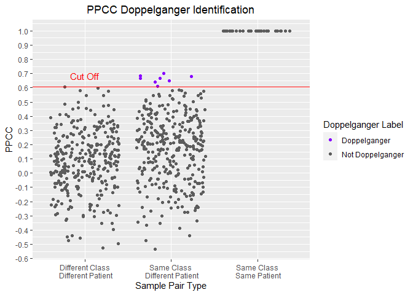
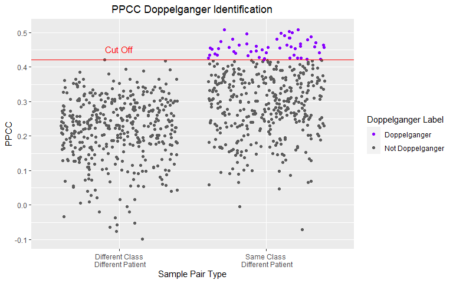
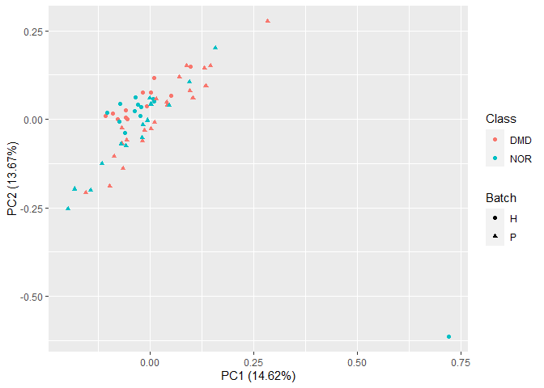
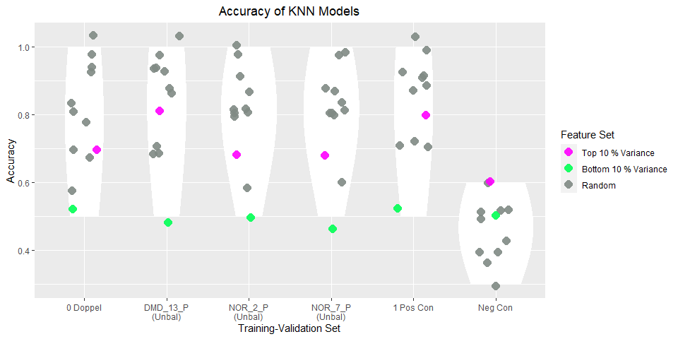

The Doppelganger Effect in Gene Expression Data sets
================
Wang Li Rong

# 1\. Exploring the (Duchenne Muscular Dystrophy) DMD Datasets

## 0\) Import packages

File paths

``` r
data_dir = "../data"
cleaned_data_dir = "../cleaned_data"
images_dir = "../images"
planning_data_dir = "../planning_data"
experiment_plans_dir = "../experiment_plans"
```

Load functions for pre-processing and analysis:

``` r
functions_dir = "../functions"
source(file.path(functions_dir,"preprocessing_functions.R"))
source(file.path(functions_dir,"analysis_functions.R"))
source(file.path(functions_dir,"planning_functions.R"))
source(file.path(functions_dir,"process_vectors.R"))
source(file.path(functions_dir,"process_lists.R"))
```

## 1\) Import the DMD datasets

HaslettData - 12 DMD Samples - 12 Normal Samples

``` r
# Converts the affy probes to ensemble id
dmd_h = getDataFile(
  filename= file.path(data_dir, "DMD-HaslettData.csv"),
  affy_attribute = "affy_hg_u95av2",
  batch_name = "H")
#Forming The metadata dataframe 
dmd_h_meta = getMetaDataDataframe(df = dmd_h, batch_name = "H")
```

PescatoriData - 22 DMD Samples - 14 Normal Samples

``` r
dmd_p = getDataFile(filename = 
  file.path(data_dir, "DMD-PescatoriData.csv"),
  affy_attribute = "affy_hg_u133a",
  batch_name = "P")
#Forming The metadata dataframe 
dmd_p_meta = getMetaDataDataframe(df = dmd_p, batch_name = "P")
```

## 2\) Identify doppelgangers within and between both batches

### a) Doppelgangers within HaslettData

33 Doppelgangers found within HaslettData.

``` r
doppel_h = getPPCCDoppelgangers(dmd_h, dmd_h_meta, do_min_max = TRUE)
```

    ## [1] "1. No batch correction since there is only 1 batch..."
    ## [1] "- Data is min-max normalized"
    ## [1] "2. Calculating PPCC between samples of the same dataset..."
    ##   |                                                                              |=                                                                     |   1%  |                                                                              |                                                                      |   0%  |                                                                              |                                                                      |   1%  |                                                                              |=                                                                     |   1%  |                                                                              |=                                                                     |   2%  |                                                                              |==                                                                    |   2%  |                                                                              |==                                                                    |   3%  |                                                                              |===                                                                   |   4%  |                                                                              |===                                                                   |   5%  |                                                                              |====                                                                  |   5%  |                                                                              |====                                                                  |   6%  |                                                                              |=====                                                                 |   7%  |                                                                              |=====                                                                 |   8%  |                                                                              |======                                                                |   8%  |                                                                              |======                                                                |   9%  |                                                                              |=======                                                               |   9%  |                                                                              |=======                                                               |  10%  |                                                                              |=======                                                               |  11%  |                                                                              |========                                                              |  11%  |                                                                              |========                                                              |  12%  |                                                                              |=========                                                             |  12%  |                                                                              |=========                                                             |  13%  |                                                                              |==========                                                            |  14%  |                                                                              |==========                                                            |  15%  |                                                                              |===========                                                           |  15%  |                                                                              |===========                                                           |  16%  |                                                                              |============                                                          |  17%  |                                                                              |============                                                          |  18%  |                                                                              |=============                                                         |  18%  |                                                                              |=============                                                         |  19%  |                                                                              |==============                                                        |  19%  |                                                                              |==============                                                        |  20%  |                                                                              |==============                                                        |  21%  |                                                                              |===============                                                       |  21%  |                                                                              |===============                                                       |  22%  |                                                                              |================                                                      |  22%  |                                                                              |================                                                      |  23%  |                                                                              |=================                                                     |  24%  |                                                                              |=================                                                     |  25%  |                                                                              |==================                                                    |  25%  |                                                                              |==================                                                    |  26%  |                                                                              |===================                                                   |  27%  |                                                                              |===================                                                   |  28%  |                                                                              |====================                                                  |  28%  |                                                                              |====================                                                  |  29%  |                                                                              |=====================                                                 |  29%  |                                                                              |=====================                                                 |  30%  |                                                                              |=====================                                                 |  31%  |                                                                              |======================                                                |  31%  |                                                                              |======================                                                |  32%  |                                                                              |=======================                                               |  32%  |                                                                              |=======================                                               |  33%  |                                                                              |========================                                              |  34%  |                                                                              |========================                                              |  35%  |                                                                              |=========================                                             |  35%  |                                                                              |=========================                                             |  36%  |                                                                              |==========================                                            |  37%  |                                                                              |==========================                                            |  38%  |                                                                              |===========================                                           |  38%  |                                                                              |===========================                                           |  39%  |                                                                              |============================                                          |  39%  |                                                                              |============================                                          |  40%  |                                                                              |============================                                          |  41%  |                                                                              |=============================                                         |  41%  |                                                                              |=============================                                         |  42%  |                                                                              |==============================                                        |  42%  |                                                                              |==============================                                        |  43%  |                                                                              |===============================                                       |  44%  |                                                                              |===============================                                       |  45%  |                                                                              |================================                                      |  45%  |                                                                              |================================                                      |  46%  |                                                                              |=================================                                     |  47%  |                                                                              |=================================                                     |  48%  |                                                                              |==================================                                    |  48%  |                                                                              |==================================                                    |  49%  |                                                                              |===================================                                   |  49%  |                                                                              |===================================                                   |  50%  |                                                                              |===================================                                   |  51%  |                                                                              |====================================                                  |  51%  |                                                                              |====================================                                  |  52%  |                                                                              |=====================================                                 |  52%  |                                                                              |=====================================                                 |  53%  |                                                                              |======================================                                |  54%  |                                                                              |======================================                                |  55%  |                                                                              |=======================================                               |  55%  |                                                                              |=======================================                               |  56%  |                                                                              |========================================                              |  57%  |                                                                              |========================================                              |  58%  |                                                                              |=========================================                             |  58%  |                                                                              |=========================================                             |  59%  |                                                                              |==========================================                            |  59%  |                                                                              |==========================================                            |  60%  |                                                                              |==========================================                            |  61%  |                                                                              |===========================================                           |  61%  |                                                                              |===========================================                           |  62%  |                                                                              |============================================                          |  62%  |                                                                              |============================================                          |  63%  |                                                                              |=============================================                         |  64%  |                                                                              |=============================================                         |  65%  |                                                                              |==============================================                        |  65%  |                                                                              |==============================================                        |  66%  |                                                                              |===============================================                       |  67%  |                                                                              |===============================================                       |  68%  |                                                                              |================================================                      |  68%  |                                                                              |================================================                      |  69%  |                                                                              |=================================================                     |  69%  |                                                                              |=================================================                     |  70%  |                                                                              |=================================================                     |  71%  |                                                                              |==================================================                    |  71%  |                                                                              |==================================================                    |  72%  |                                                                              |===================================================                   |  72%  |                                                                              |===================================================                   |  73%  |                                                                              |====================================================                  |  74%  |                                                                              |====================================================                  |  75%  |                                                                              |=====================================================                 |  75%  |                                                                              |=====================================================                 |  76%  |                                                                              |======================================================                |  77%  |                                                                              |======================================================                |  78%  |                                                                              |=======================================================               |  78%  |                                                                              |=======================================================               |  79%  |                                                                              |========================================================              |  79%  |                                                                              |========================================================              |  80%  |                                                                              |========================================================              |  81%  |                                                                              |=========================================================             |  81%  |                                                                              |=========================================================             |  82%  |                                                                              |==========================================================            |  82%  |                                                                              |==========================================================            |  83%  |                                                                              |===========================================================           |  84%  |                                                                              |===========================================================           |  85%  |                                                                              |============================================================          |  85%  |                                                                              |============================================================          |  86%  |                                                                              |=============================================================         |  87%  |                                                                              |=============================================================         |  88%  |                                                                              |==============================================================        |  88%  |                                                                              |==============================================================        |  89%  |                                                                              |===============================================================       |  89%  |                                                                              |===============================================================       |  90%  |                                                                              |===============================================================       |  91%  |                                                                              |================================================================      |  91%  |                                                                              |================================================================      |  92%  |                                                                              |=================================================================     |  92%  |                                                                              |=================================================================     |  93%  |                                                                              |==================================================================    |  94%  |                                                                              |==================================================================    |  95%  |                                                                              |===================================================================   |  95%  |                                                                              |===================================================================   |  96%  |                                                                              |====================================================================  |  97%  |                                                                              |====================================================================  |  98%  |                                                                              |===================================================================== |  98%  |                                                                              |===================================================================== |  99%  |                                                                              |======================================================================|  99%  |                                                                              |======================================================================| 100%
    ## [1] "3. Labelling Sample Pairs according to their Class and Patient Similarities..."
    ## [1] "4. Calculating PPCC cut off to identify PPCC data doppelgangers..."
    ## [1] "5. Identifying PPCC data doppelgangers..."

``` r
table(doppel_h$PPCC_df$DoppelgangerLabel)
```

    ## 
    ##     Doppelganger Not Doppelganger 
    ##               33              267

``` r
visualisePPCCDoppelgangers(doppel_h)
```

<!-- -->

### b) Doppelgangers within PescatoriData

There are 8 doppelgangers within PescatoriData.

``` r
doppel_p = getPPCCDoppelgangers(dmd_p, dmd_p_meta, do_min_max = TRUE)
```

    ## [1] "1. No batch correction since there is only 1 batch..."
    ## [1] "- Data is min-max normalized"
    ## [1] "2. Calculating PPCC between samples of the same dataset..."
    ##   |                                                                              |=                                                                     |   1%  |                                                                              |                                                                      |   0%  |                                                                              |                                                                      |   1%  |                                                                              |=                                                                     |   1%  |                                                                              |=                                                                     |   2%  |                                                                              |==                                                                    |   2%  |                                                                              |==                                                                    |   3%  |                                                                              |===                                                                   |   4%  |                                                                              |===                                                                   |   5%  |                                                                              |====                                                                  |   5%  |                                                                              |====                                                                  |   6%  |                                                                              |=====                                                                 |   6%  |                                                                              |=====                                                                 |   7%  |                                                                              |=====                                                                 |   8%  |                                                                              |======                                                                |   8%  |                                                                              |======                                                                |   9%  |                                                                              |=======                                                               |   9%  |                                                                              |=======                                                               |  10%  |                                                                              |=======                                                               |  11%  |                                                                              |========                                                              |  11%  |                                                                              |========                                                              |  12%  |                                                                              |=========                                                             |  12%  |                                                                              |=========                                                             |  13%  |                                                                              |=========                                                             |  14%  |                                                                              |==========                                                            |  14%  |                                                                              |==========                                                            |  15%  |                                                                              |===========                                                           |  15%  |                                                                              |===========                                                           |  16%  |                                                                              |============                                                          |  17%  |                                                                              |============                                                          |  18%  |                                                                              |=============                                                         |  18%  |                                                                              |=============                                                         |  19%  |                                                                              |==============                                                        |  19%  |                                                                              |==============                                                        |  20%  |                                                                              |==============                                                        |  21%  |                                                                              |===============                                                       |  21%  |                                                                              |===============                                                       |  22%  |                                                                              |================                                                      |  22%  |                                                                              |================                                                      |  23%  |                                                                              |=================                                                     |  24%  |                                                                              |=================                                                     |  25%  |                                                                              |==================                                                    |  25%  |                                                                              |==================                                                    |  26%  |                                                                              |===================                                                   |  27%  |                                                                              |===================                                                   |  28%  |                                                                              |====================                                                  |  28%  |                                                                              |====================                                                  |  29%  |                                                                              |=====================                                                 |  29%  |                                                                              |=====================                                                 |  30%  |                                                                              |=====================                                                 |  31%  |                                                                              |======================                                                |  31%  |                                                                              |======================                                                |  32%  |                                                                              |=======================                                               |  32%  |                                                                              |=======================                                               |  33%  |                                                                              |========================                                              |  34%  |                                                                              |========================                                              |  35%  |                                                                              |=========================                                             |  35%  |                                                                              |=========================                                             |  36%  |                                                                              |==========================                                            |  36%  |                                                                              |==========================                                            |  37%  |                                                                              |==========================                                            |  38%  |                                                                              |===========================                                           |  38%  |                                                                              |===========================                                           |  39%  |                                                                              |============================                                          |  39%  |                                                                              |============================                                          |  40%  |                                                                              |============================                                          |  41%  |                                                                              |=============================                                         |  41%  |                                                                              |=============================                                         |  42%  |                                                                              |==============================                                        |  42%  |                                                                              |==============================                                        |  43%  |                                                                              |==============================                                        |  44%  |                                                                              |===============================                                       |  44%  |                                                                              |===============================                                       |  45%  |                                                                              |================================                                      |  45%  |                                                                              |================================                                      |  46%  |                                                                              |=================================                                     |  47%  |                                                                              |=================================                                     |  48%  |                                                                              |==================================                                    |  48%  |                                                                              |==================================                                    |  49%  |                                                                              |===================================                                   |  49%  |                                                                              |===================================                                   |  50%  |                                                                              |===================================                                   |  51%  |                                                                              |====================================                                  |  51%  |                                                                              |====================================                                  |  52%  |                                                                              |=====================================                                 |  52%  |                                                                              |=====================================                                 |  53%  |                                                                              |======================================                                |  54%  |                                                                              |======================================                                |  55%  |                                                                              |=======================================                               |  55%  |                                                                              |=======================================                               |  56%  |                                                                              |========================================                              |  56%  |                                                                              |========================================                              |  57%  |                                                                              |========================================                              |  58%  |                                                                              |=========================================                             |  58%  |                                                                              |=========================================                             |  59%  |                                                                              |==========================================                            |  59%  |                                                                              |==========================================                            |  60%  |                                                                              |==========================================                            |  61%  |                                                                              |===========================================                           |  61%  |                                                                              |===========================================                           |  62%  |                                                                              |============================================                          |  62%  |                                                                              |============================================                          |  63%  |                                                                              |============================================                          |  64%  |                                                                              |=============================================                         |  64%  |                                                                              |=============================================                         |  65%  |                                                                              |==============================================                        |  65%  |                                                                              |==============================================                        |  66%  |                                                                              |===============================================                       |  67%  |                                                                              |===============================================                       |  68%  |                                                                              |================================================                      |  68%  |                                                                              |================================================                      |  69%  |                                                                              |=================================================                     |  69%  |                                                                              |=================================================                     |  70%  |                                                                              |=================================================                     |  71%  |                                                                              |==================================================                    |  71%  |                                                                              |==================================================                    |  72%  |                                                                              |===================================================                   |  72%  |                                                                              |===================================================                   |  73%  |                                                                              |====================================================                  |  74%  |                                                                              |====================================================                  |  75%  |                                                                              |=====================================================                 |  75%  |                                                                              |=====================================================                 |  76%  |                                                                              |======================================================                |  77%  |                                                                              |======================================================                |  78%  |                                                                              |=======================================================               |  78%  |                                                                              |=======================================================               |  79%  |                                                                              |========================================================              |  79%  |                                                                              |========================================================              |  80%  |                                                                              |========================================================              |  81%  |                                                                              |=========================================================             |  81%  |                                                                              |=========================================================             |  82%  |                                                                              |==========================================================            |  82%  |                                                                              |==========================================================            |  83%  |                                                                              |===========================================================           |  84%  |                                                                              |===========================================================           |  85%  |                                                                              |============================================================          |  85%  |                                                                              |============================================================          |  86%  |                                                                              |=============================================================         |  86%  |                                                                              |=============================================================         |  87%  |                                                                              |=============================================================         |  88%  |                                                                              |==============================================================        |  88%  |                                                                              |==============================================================        |  89%  |                                                                              |===============================================================       |  89%  |                                                                              |===============================================================       |  90%  |                                                                              |===============================================================       |  91%  |                                                                              |================================================================      |  91%  |                                                                              |================================================================      |  92%  |                                                                              |=================================================================     |  92%  |                                                                              |=================================================================     |  93%  |                                                                              |=================================================================     |  94%  |                                                                              |==================================================================    |  94%  |                                                                              |==================================================================    |  95%  |                                                                              |===================================================================   |  95%  |                                                                              |===================================================================   |  96%  |                                                                              |====================================================================  |  97%  |                                                                              |====================================================================  |  98%  |                                                                              |===================================================================== |  98%  |                                                                              |===================================================================== |  99%  |                                                                              |======================================================================|  99%  |                                                                              |======================================================================| 100%
    ## [1] "3. Labelling Sample Pairs according to their Class and Patient Similarities..."
    ## [1] "4. Calculating PPCC cut off to identify PPCC data doppelgangers..."
    ## [1] "5. Identifying PPCC data doppelgangers..."

``` r
table(doppel_p$PPCC_df$DoppelgangerLabel)
```

    ## 
    ##     Doppelganger Not Doppelganger 
    ##                8              658

``` r
visualisePPCCDoppelgangers(doppel_p)
```

<!-- -->

### b) Doppelgangers Between Both Batches

Combining both data sets into one

``` r
dmd_meta = data.frame(rbind(dmd_h_meta, dmd_p_meta))
#8813 variables in common
shared_variables_dmd = intersect(rownames(dmd_h), rownames(dmd_p)) 
dmd = data.frame(cbind(dmd_h[shared_variables_dmd, ], 
                       dmd_p[shared_variables_dmd,]))
```

Finding doppelgangers between both datasets

``` r
doppel_hp = getPPCCDoppelgangers(dmd, dmd_meta, do_min_max = TRUE)
```

    ## [1] "1. Batch correcting the 2 data sets with sva:ComBat..."

    ## Found2batches

    ## Adjusting for0covariate(s) or covariate level(s)

    ## Standardizing Data across genes

    ## Fitting L/S model and finding priors

    ## Finding parametric adjustments

    ## Adjusting the Data

    ## [1] "- Data is min-max normalized"
    ## [1] "2. Calculating PPCC between samples of each batch..."
    ##   |                                                                              |=                                                                     |   1%  |                                                                              |                                                                      |   0%  |                                                                              |                                                                      |   1%  |                                                                              |=                                                                     |   1%  |                                                                              |=                                                                     |   2%  |                                                                              |==                                                                    |   2%  |                                                                              |==                                                                    |   3%  |                                                                              |===                                                                   |   4%  |                                                                              |===                                                                   |   5%  |                                                                              |====                                                                  |   5%  |                                                                              |====                                                                  |   6%  |                                                                              |=====                                                                 |   6%  |                                                                              |=====                                                                 |   7%  |                                                                              |=====                                                                 |   8%  |                                                                              |======                                                                |   8%  |                                                                              |======                                                                |   9%  |                                                                              |=======                                                               |   9%  |                                                                              |=======                                                               |  10%  |                                                                              |=======                                                               |  11%  |                                                                              |========                                                              |  11%  |                                                                              |========                                                              |  12%  |                                                                              |=========                                                             |  12%  |                                                                              |=========                                                             |  13%  |                                                                              |=========                                                             |  14%  |                                                                              |==========                                                            |  14%  |                                                                              |==========                                                            |  15%  |                                                                              |===========                                                           |  15%  |                                                                              |===========                                                           |  16%  |                                                                              |============                                                          |  16%  |                                                                              |============                                                          |  17%  |                                                                              |============                                                          |  18%  |                                                                              |=============                                                         |  18%  |                                                                              |=============                                                         |  19%  |                                                                              |==============                                                        |  19%  |                                                                              |==============                                                        |  20%  |                                                                              |==============                                                        |  21%  |                                                                              |===============                                                       |  21%  |                                                                              |===============                                                       |  22%  |                                                                              |================                                                      |  22%  |                                                                              |================                                                      |  23%  |                                                                              |=================                                                     |  24%  |                                                                              |=================                                                     |  25%  |                                                                              |==================                                                    |  25%  |                                                                              |==================                                                    |  26%  |                                                                              |===================                                                   |  27%  |                                                                              |===================                                                   |  28%  |                                                                              |====================                                                  |  28%  |                                                                              |====================                                                  |  29%  |                                                                              |=====================                                                 |  29%  |                                                                              |=====================                                                 |  30%  |                                                                              |=====================                                                 |  31%  |                                                                              |======================                                                |  31%  |                                                                              |======================                                                |  32%  |                                                                              |=======================                                               |  32%  |                                                                              |=======================                                               |  33%  |                                                                              |=======================                                               |  34%  |                                                                              |========================                                              |  34%  |                                                                              |========================                                              |  35%  |                                                                              |=========================                                             |  35%  |                                                                              |=========================                                             |  36%  |                                                                              |==========================                                            |  36%  |                                                                              |==========================                                            |  37%  |                                                                              |==========================                                            |  38%  |                                                                              |===========================                                           |  38%  |                                                                              |===========================                                           |  39%  |                                                                              |============================                                          |  39%  |                                                                              |============================                                          |  40%  |                                                                              |============================                                          |  41%  |                                                                              |=============================                                         |  41%  |                                                                              |=============================                                         |  42%  |                                                                              |==============================                                        |  42%  |                                                                              |==============================                                        |  43%  |                                                                              |==============================                                        |  44%  |                                                                              |===============================                                       |  44%  |                                                                              |===============================                                       |  45%  |                                                                              |================================                                      |  45%  |                                                                              |================================                                      |  46%  |                                                                              |=================================                                     |  47%  |                                                                              |=================================                                     |  48%  |                                                                              |==================================                                    |  48%  |                                                                              |==================================                                    |  49%  |                                                                              |===================================                                   |  49%  |                                                                              |===================================                                   |  50%  |                                                                              |===================================                                   |  51%  |                                                                              |====================================                                  |  51%  |                                                                              |====================================                                  |  52%  |                                                                              |=====================================                                 |  52%  |                                                                              |=====================================                                 |  53%  |                                                                              |======================================                                |  54%  |                                                                              |======================================                                |  55%  |                                                                              |=======================================                               |  55%  |                                                                              |=======================================                               |  56%  |                                                                              |========================================                              |  56%  |                                                                              |========================================                              |  57%  |                                                                              |========================================                              |  58%  |                                                                              |=========================================                             |  58%  |                                                                              |=========================================                             |  59%  |                                                                              |==========================================                            |  59%  |                                                                              |==========================================                            |  60%  |                                                                              |==========================================                            |  61%  |                                                                              |===========================================                           |  61%  |                                                                              |===========================================                           |  62%  |                                                                              |============================================                          |  62%  |                                                                              |============================================                          |  63%  |                                                                              |============================================                          |  64%  |                                                                              |=============================================                         |  64%  |                                                                              |=============================================                         |  65%  |                                                                              |==============================================                        |  65%  |                                                                              |==============================================                        |  66%  |                                                                              |===============================================                       |  66%  |                                                                              |===============================================                       |  67%  |                                                                              |===============================================                       |  68%  |                                                                              |================================================                      |  68%  |                                                                              |================================================                      |  69%  |                                                                              |=================================================                     |  69%  |                                                                              |=================================================                     |  70%  |                                                                              |=================================================                     |  71%  |                                                                              |==================================================                    |  71%  |                                                                              |==================================================                    |  72%  |                                                                              |===================================================                   |  72%  |                                                                              |===================================================                   |  73%  |                                                                              |====================================================                  |  74%  |                                                                              |====================================================                  |  75%  |                                                                              |=====================================================                 |  75%  |                                                                              |=====================================================                 |  76%  |                                                                              |======================================================                |  77%  |                                                                              |======================================================                |  78%  |                                                                              |=======================================================               |  78%  |                                                                              |=======================================================               |  79%  |                                                                              |========================================================              |  79%  |                                                                              |========================================================              |  80%  |                                                                              |========================================================              |  81%  |                                                                              |=========================================================             |  81%  |                                                                              |=========================================================             |  82%  |                                                                              |==========================================================            |  82%  |                                                                              |==========================================================            |  83%  |                                                                              |==========================================================            |  84%  |                                                                              |===========================================================           |  84%  |                                                                              |===========================================================           |  85%  |                                                                              |============================================================          |  85%  |                                                                              |============================================================          |  86%  |                                                                              |=============================================================         |  86%  |                                                                              |=============================================================         |  87%  |                                                                              |=============================================================         |  88%  |                                                                              |==============================================================        |  88%  |                                                                              |==============================================================        |  89%  |                                                                              |===============================================================       |  89%  |                                                                              |===============================================================       |  90%  |                                                                              |===============================================================       |  91%  |                                                                              |================================================================      |  91%  |                                                                              |================================================================      |  92%  |                                                                              |=================================================================     |  92%  |                                                                              |=================================================================     |  93%  |                                                                              |=================================================================     |  94%  |                                                                              |==================================================================    |  94%  |                                                                              |==================================================================    |  95%  |                                                                              |===================================================================   |  95%  |                                                                              |===================================================================   |  96%  |                                                                              |====================================================================  |  97%  |                                                                              |====================================================================  |  98%  |                                                                              |===================================================================== |  98%  |                                                                              |===================================================================== |  99%  |                                                                              |======================================================================|  99%  |                                                                              |======================================================================| 100%
    ## [1] "3. Labelling Sample Pairs according to their Class and Patient Similarities..."
    ## [1] "4. Calculating PPCC cut off to identify PPCC data doppelgangers..."
    ## [1] "5. Identifying PPCC data doppelgangers..."

54 Doppelgangers between HaslettData and PescatoriData.

``` r
table(doppel_hp$PPCC_df$DoppelgangerLabel)
```

    ## 
    ##     Doppelganger Not Doppelganger 
    ##               54              810

``` r
visualisePPCCDoppelgangers(doppel_hp)
```

<!-- -->

It seems that NOR\_12\_H is negatively correlated with all samples of
batch P. This seems to be the result of NOR\_12\_H having abnormally low
values and batch correction converting these low values to negative
values.

``` r
doppel_hp$PPCC_df[doppel_hp$PPCC_df$Sample1=="NOR_12_H" &
                    doppel_hp$PPCC_df$PPCC<0,]
```

    ##      Sample1  Sample2         PPCC                        ClassPatient
    ## 829 NOR_12_H  DMD_1_P -0.193818929 Different Class\n Different Patient
    ## 832 NOR_12_H  DMD_4_P -0.265191558 Different Class\n Different Patient
    ## 833 NOR_12_H  DMD_5_P -0.285539384 Different Class\n Different Patient
    ## 834 NOR_12_H  DMD_6_P -0.186336439 Different Class\n Different Patient
    ## 838 NOR_12_H DMD_10_P -0.438349388 Different Class\n Different Patient
    ## 839 NOR_12_H DMD_11_P -0.054235145 Different Class\n Different Patient
    ## 840 NOR_12_H DMD_12_P -0.003457192 Different Class\n Different Patient
    ## 841 NOR_12_H DMD_13_P -0.112458098 Different Class\n Different Patient
    ## 842 NOR_12_H DMD_14_P -0.127644337 Different Class\n Different Patient
    ## 844 NOR_12_H DMD_16_P -0.110840331 Different Class\n Different Patient
    ## 845 NOR_12_H DMD_17_P -0.232451165 Different Class\n Different Patient
    ## 846 NOR_12_H DMD_18_P -0.043457106 Different Class\n Different Patient
    ## 847 NOR_12_H DMD_19_P -0.198922641 Different Class\n Different Patient
    ## 848 NOR_12_H DMD_20_P -0.244731165 Different Class\n Different Patient
    ## 852 NOR_12_H  NOR_2_P -0.021051213      Same Class\n Different Patient
    ## 854 NOR_12_H  NOR_4_P -0.002168578      Same Class\n Different Patient
    ## 855 NOR_12_H  NOR_5_P -0.309138215      Same Class\n Different Patient
    ## 858 NOR_12_H  NOR_8_P -0.226838483      Same Class\n Different Patient
    ## 860 NOR_12_H NOR_10_P -0.091138460      Same Class\n Different Patient
    ## 861 NOR_12_H NOR_11_P -0.111979073      Same Class\n Different Patient
    ## 862 NOR_12_H NOR_12_P -0.058761130      Same Class\n Different Patient
    ## 863 NOR_12_H NOR_13_P -0.159085515      Same Class\n Different Patient
    ##     DoppelgangerLabel
    ## 829  Not Doppelganger
    ## 832  Not Doppelganger
    ## 833  Not Doppelganger
    ## 834  Not Doppelganger
    ## 838  Not Doppelganger
    ## 839  Not Doppelganger
    ## 840  Not Doppelganger
    ## 841  Not Doppelganger
    ## 842  Not Doppelganger
    ## 844  Not Doppelganger
    ## 845  Not Doppelganger
    ## 846  Not Doppelganger
    ## 847  Not Doppelganger
    ## 848  Not Doppelganger
    ## 852  Not Doppelganger
    ## 854  Not Doppelganger
    ## 855  Not Doppelganger
    ## 858  Not Doppelganger
    ## 860  Not Doppelganger
    ## 861  Not Doppelganger
    ## 862  Not Doppelganger
    ## 863  Not Doppelganger

``` r
doppel_hp_rem = remove_sample_from_doppel_result(
  doppel_result = doppel_hp,
  sample = "NOR_12_H"
)
visualisePPCCDoppelgangers(doppel_hp_rem)
```

<!-- -->

## 3\) Batch Effect on Doppelganger Identification

### a) With batch imbalances

The above results show the case where batch imbalances exist.

``` r
table(dmd_meta$Batch)
```

    ## 
    ##  H  P 
    ## 24 36

### b) Without batch imbalance

Here we will be oversampling the data set before doppelganger
identification resolve batch imbalances.

``` r
# Oversampling data
oversample = oversample_batch(dmd, dmd_meta)
dmd_over = oversample$raw_data
dmd_meta_over = oversample$meta_data
table(dmd_meta_over$Batch)
```

    ## 
    ##  H  P 
    ## 36 36

``` r
table( dmd_meta_over$Class, dmd_meta_over$Batch)
```

    ##      
    ##        H  P
    ##   DMD 17 22
    ##   NOR 19 14

``` r
doppel_hp_over = getPPCCDoppelgangers(dmd_over, dmd_meta_over,
                                      do_min_max = TRUE)
```

    ## [1] "1. Batch correcting the 2 data sets with sva:ComBat..."

    ## Found2batches

    ## Adjusting for0covariate(s) or covariate level(s)

    ## Standardizing Data across genes

    ## Fitting L/S model and finding priors

    ## Finding parametric adjustments

    ## Adjusting the Data

    ## [1] "- Data is min-max normalized"
    ## [1] "2. Calculating PPCC between samples of each batch..."
    ##   |                                                                              |=                                                                     |   1%  |                                                                              |                                                                      |   0%  |                                                                              |                                                                      |   1%  |                                                                              |=                                                                     |   1%  |                                                                              |=                                                                     |   2%  |                                                                              |==                                                                    |   2%  |                                                                              |==                                                                    |   3%  |                                                                              |==                                                                    |   4%  |                                                                              |===                                                                   |   4%  |                                                                              |===                                                                   |   5%  |                                                                              |====                                                                  |   5%  |                                                                              |====                                                                  |   6%  |                                                                              |=====                                                                 |   6%  |                                                                              |=====                                                                 |   7%  |                                                                              |=====                                                                 |   8%  |                                                                              |======                                                                |   8%  |                                                                              |======                                                                |   9%  |                                                                              |=======                                                               |   9%  |                                                                              |=======                                                               |  10%  |                                                                              |=======                                                               |  11%  |                                                                              |========                                                              |  11%  |                                                                              |========                                                              |  12%  |                                                                              |=========                                                             |  12%  |                                                                              |=========                                                             |  13%  |                                                                              |=========                                                             |  14%  |                                                                              |==========                                                            |  14%  |                                                                              |==========                                                            |  15%  |                                                                              |===========                                                           |  15%  |                                                                              |===========                                                           |  16%  |                                                                              |============                                                          |  16%  |                                                                              |============                                                          |  17%  |                                                                              |============                                                          |  18%  |                                                                              |=============                                                         |  18%  |                                                                              |=============                                                         |  19%  |                                                                              |==============                                                        |  19%  |                                                                              |==============                                                        |  20%  |                                                                              |==============                                                        |  21%  |                                                                              |===============                                                       |  21%  |                                                                              |===============                                                       |  22%  |                                                                              |================                                                      |  22%  |                                                                              |================                                                      |  23%  |                                                                              |================                                                      |  24%  |                                                                              |=================                                                     |  24%  |                                                                              |=================                                                     |  25%  |                                                                              |==================                                                    |  25%  |                                                                              |==================                                                    |  26%  |                                                                              |===================                                                   |  26%  |                                                                              |===================                                                   |  27%  |                                                                              |===================                                                   |  28%  |                                                                              |====================                                                  |  28%  |                                                                              |====================                                                  |  29%  |                                                                              |=====================                                                 |  29%  |                                                                              |=====================                                                 |  30%  |                                                                              |=====================                                                 |  31%  |                                                                              |======================                                                |  31%  |                                                                              |======================                                                |  32%  |                                                                              |=======================                                               |  32%  |                                                                              |=======================                                               |  33%  |                                                                              |=======================                                               |  34%  |                                                                              |========================                                              |  34%  |                                                                              |========================                                              |  35%  |                                                                              |=========================                                             |  35%  |                                                                              |=========================                                             |  36%  |                                                                              |==========================                                            |  36%  |                                                                              |==========================                                            |  37%  |                                                                              |==========================                                            |  38%  |                                                                              |===========================                                           |  38%  |                                                                              |===========================                                           |  39%  |                                                                              |============================                                          |  39%  |                                                                              |============================                                          |  40%  |                                                                              |============================                                          |  41%  |                                                                              |=============================                                         |  41%  |                                                                              |=============================                                         |  42%  |                                                                              |==============================                                        |  42%  |                                                                              |==============================                                        |  43%  |                                                                              |==============================                                        |  44%  |                                                                              |===============================                                       |  44%  |                                                                              |===============================                                       |  45%  |                                                                              |================================                                      |  45%  |                                                                              |================================                                      |  46%  |                                                                              |=================================                                     |  46%  |                                                                              |=================================                                     |  47%  |                                                                              |=================================                                     |  48%  |                                                                              |==================================                                    |  48%  |                                                                              |==================================                                    |  49%  |                                                                              |===================================                                   |  49%  |                                                                              |===================================                                   |  50%  |                                                                              |===================================                                   |  51%  |                                                                              |====================================                                  |  51%  |                                                                              |====================================                                  |  52%  |                                                                              |=====================================                                 |  52%  |                                                                              |=====================================                                 |  53%  |                                                                              |=====================================                                 |  54%  |                                                                              |======================================                                |  54%  |                                                                              |======================================                                |  55%  |                                                                              |=======================================                               |  55%  |                                                                              |=======================================                               |  56%  |                                                                              |========================================                              |  56%  |                                                                              |========================================                              |  57%  |                                                                              |========================================                              |  58%  |                                                                              |=========================================                             |  58%  |                                                                              |=========================================                             |  59%  |                                                                              |==========================================                            |  59%  |                                                                              |==========================================                            |  60%  |                                                                              |==========================================                            |  61%  |                                                                              |===========================================                           |  61%  |                                                                              |===========================================                           |  62%  |                                                                              |============================================                          |  62%  |                                                                              |============================================                          |  63%  |                                                                              |============================================                          |  64%  |                                                                              |=============================================                         |  64%  |                                                                              |=============================================                         |  65%  |                                                                              |==============================================                        |  65%  |                                                                              |==============================================                        |  66%  |                                                                              |===============================================                       |  66%  |                                                                              |===============================================                       |  67%  |                                                                              |===============================================                       |  68%  |                                                                              |================================================                      |  68%  |                                                                              |================================================                      |  69%  |                                                                              |=================================================                     |  69%  |                                                                              |=================================================                     |  70%  |                                                                              |=================================================                     |  71%  |                                                                              |==================================================                    |  71%  |                                                                              |==================================================                    |  72%  |                                                                              |===================================================                   |  72%  |                                                                              |===================================================                   |  73%  |                                                                              |===================================================                   |  74%  |                                                                              |====================================================                  |  74%  |                                                                              |====================================================                  |  75%  |                                                                              |=====================================================                 |  75%  |                                                                              |=====================================================                 |  76%  |                                                                              |======================================================                |  76%  |                                                                              |======================================================                |  77%  |                                                                              |======================================================                |  78%  |                                                                              |=======================================================               |  78%  |                                                                              |=======================================================               |  79%  |                                                                              |========================================================              |  79%  |                                                                              |========================================================              |  80%  |                                                                              |========================================================              |  81%  |                                                                              |=========================================================             |  81%  |                                                                              |=========================================================             |  82%  |                                                                              |==========================================================            |  82%  |                                                                              |==========================================================            |  83%  |                                                                              |==========================================================            |  84%  |                                                                              |===========================================================           |  84%  |                                                                              |===========================================================           |  85%  |                                                                              |============================================================          |  85%  |                                                                              |============================================================          |  86%  |                                                                              |=============================================================         |  86%  |                                                                              |=============================================================         |  87%  |                                                                              |=============================================================         |  88%  |                                                                              |==============================================================        |  88%  |                                                                              |==============================================================        |  89%  |                                                                              |===============================================================       |  89%  |                                                                              |===============================================================       |  90%  |                                                                              |===============================================================       |  91%  |                                                                              |================================================================      |  91%  |                                                                              |================================================================      |  92%  |                                                                              |=================================================================     |  92%  |                                                                              |=================================================================     |  93%  |                                                                              |=================================================================     |  94%  |                                                                              |==================================================================    |  94%  |                                                                              |==================================================================    |  95%  |                                                                              |===================================================================   |  95%  |                                                                              |===================================================================   |  96%  |                                                                              |====================================================================  |  96%  |                                                                              |====================================================================  |  97%  |                                                                              |====================================================================  |  98%  |                                                                              |===================================================================== |  98%  |                                                                              |===================================================================== |  99%  |                                                                              |======================================================================|  99%  |                                                                              |======================================================================| 100%
    ## [1] "3. Labelling Sample Pairs according to their Class and Patient Similarities..."
    ## [1] "4. Calculating PPCC cut off to identify PPCC data doppelgangers..."
    ## [1] "5. Identifying PPCC data doppelgangers..."

``` r
# Remove excess sample pairs
doppel_hp_over = remove_all_dup(doppel_hp_over)
```

When there is an absence of batch imbalance, lesser doppelgangers were
identified

``` r
table(doppel_hp_over$PPCC_df$DoppelgangerLabel)
```

    ## 
    ##     Doppelganger Not Doppelganger 
    ##               47              817

2 more pairs were identified

``` r
dfSetDifference(
  doppel_hp_over$PPCC_df[doppel_hp_over$PPCC_df$DoppelgangerLabel=="Doppelganger", ],
  doppel_hp$PPCC_df[doppel_hp$PPCC_df$DoppelgangerLabel=="Doppelganger", ]
)
```

    ##      Sample1  Sample2      PPCC                   ClassPatient
    ## 818 NOR_11_H  NOR_4_P 0.4343084 Same Class\n Different Patient
    ## 826 NOR_11_H NOR_12_P 0.4292384 Same Class\n Different Patient
    ##     DoppelgangerLabel
    ## 818      Doppelganger
    ## 826      Doppelganger

9 pairs were not identified the the batch balanced case

``` r
dfSetDifference(
  doppel_hp$PPCC_df[doppel_hp$PPCC_df$DoppelgangerLabel=="Doppelganger", ],
  doppel_hp_over$PPCC_df[doppel_hp_over$PPCC_df$DoppelgangerLabel=="Doppelganger", ]
 )
```

    ##      Sample1  Sample2      PPCC                   ClassPatient
    ## 157  DMD_5_H DMD_13_P 0.4263697 Same Class\n Different Patient
    ## 193  DMD_6_H DMD_13_P 0.4276440 Same Class\n Different Patient
    ## 268  DMD_8_H DMD_16_P 0.4323147 Same Class\n Different Patient
    ## 271  DMD_8_H DMD_19_P 0.4378936 Same Class\n Different Patient
    ## 600  NOR_5_H  NOR_2_P 0.4342293 Same Class\n Different Patient
    ## 606  NOR_5_H  NOR_8_P 0.4254020 Same Class\n Different Patient
    ## 608  NOR_5_H NOR_10_P 0.4226252 Same Class\n Different Patient
    ## 749  NOR_9_H  NOR_7_P 0.4224532 Same Class\n Different Patient
    ## 786 NOR_10_H  NOR_8_P 0.4206518 Same Class\n Different Patient
    ##     DoppelgangerLabel
    ## 157      Doppelganger
    ## 193      Doppelganger
    ## 268      Doppelganger
    ## 271      Doppelganger
    ## 600      Doppelganger
    ## 606      Doppelganger
    ## 608      Doppelganger
    ## 749      Doppelganger
    ## 786      Doppelganger

The presence of batch imbalances decreased PPCC slightly in this case.

``` r
doppel_hp_over_rem = remove_sample_from_doppel_result(
  doppel_result = doppel_hp_over,
  sample = "NOR_12_H"
)
visualisePPCCDoppelgangers(doppel_hp_over_rem)
```

<!-- -->

``` r
summary(doppel_hp$PPCC_df$PPCC)
```

    ##    Min. 1st Qu.  Median    Mean 3rd Qu.    Max. 
    ## -0.4383  0.1854  0.2610  0.2506  0.3317  0.5083

``` r
summary(doppel_hp_over$PPCC_df$PPCC)
```

    ##    Min. 1st Qu.  Median    Mean 3rd Qu.    Max. 
    ## -0.4411  0.1871  0.2530  0.2473  0.3268  0.5056

With no batch imbalances, PPCC increased slightly.

### c) Batch imbalance on batch correction efficacy

``` r
if (!"ggfortify" %in% installed.packages()){
  install.packages("ggfortify")
}
library(ggfortify)
```

    ## Warning: package 'ggfortify' was built under R version 4.0.5

#### Before Batch Correction

``` r
pca_res = prcomp(t(dmd), scale. = TRUE)
autoplot(x=1, y=2, pca_res, data = dmd_meta, colour = 'Class', shape="Batch")
```

<!-- -->

``` r
autoplot(x=2, y=3, pca_res, data = dmd_meta, colour = 'Class', shape="Batch")
```

<!-- -->

#### With batch imbalance

``` r
pca_res = prcomp(t(doppel_hp$Processed_data), scale. = TRUE)
autoplot(x=1, y=2, pca_res, data = dmd_meta, colour = 'Class', shape="Batch")
```

<!-- -->

``` r
autoplot(x=2, y=3, pca_res, data = dmd_meta, colour = 'Class', shape="Batch")
```

<!-- -->

#### Without batch imbalance

``` r
pca_res = prcomp(t(doppel_hp_over$Processed_data), scale. = TRUE)
autoplot(x=1, y=2, pca_res, data = dmd_meta, colour = 'Class', shape="Batch")
```

<!-- -->

``` r
autoplot(x=2, y=3, pca_res, data = dmd_meta, colour = 'Class', shape="Batch")
```

<!-- -->

Output the doppelgangers for easier planning

``` r
output_cross_batch_planning_xlsx(
  meta_data_df = dmd_meta,
  doppel_results_bal = doppel_hp_over_rem,
  doppel_results_unbal = doppel_hp_rem,
  filename = "dmd_planning.xlsx"
)
```

    ## [1] "0. Load openxlsx library"
    ## [1] "1. Preprocessing data"
    ## [1] " a. Preprocess meta data df"
    ## [1] " b. Convert balanced doppelganger to easy to view df"
    ## [1] " c. Convert unbalanced doppelganger to easy to view df"
    ## [1] " d. Get doppelgangers in balanced but not in unbalanced"
    ## [1] " e. Get doppelgangers in unbalanced but not in balanced"
    ## [1] " f. Get doppel and non_doppel samples for each data set"
    ## [1] "  - Data set: H"
    ## [1] "  - Data set: P"
    ## [1] " g. Get additional doppel samples in bal and unbal case"
    ## [1] "2. Creating workbook"
    ## [1] "3. Saving workbook"

## 4\) Testing the Doppelganger Effect

Here we test the doppelganger effects of PPCC data doppelgangers
identified in the balanced case

``` r
veri_results_dmd =  verifyDoppelgangers(
  file.path(experiment_plans_dir,"dmd_experiment_plan.csv"),
  doppel_hp_over$Processed_data,
  dmd_meta,
  do_batch_corr = FALSE,
  size_of_val_set = 10,
  k=5
)
```

    ## [1] "1. Preprocessing data..."
    ## [1] "- Skip batch correction"
    ## [1] "- Carrying out min-max normalisation"
    ## [1] "2. Generating Feature Sets..."
    ## [1] "3. Loading Experiment Plan..."
    ## [1] "4. Training KNN models..."
    ##   |                                                                              |=                                                                     |   1%  |                                                                              |==                                                                    |   2%  |                                                                              |==                                                                    |   4%  |                                                                              |===                                                                   |   5%  |                                                                              |====                                                                  |   6%  |                                                                              |=====                                                                 |   7%  |                                                                              |======                                                                |   8%  |                                                                              |=======                                                               |  10%  |                                                                              |========                                                              |  11%  |                                                                              |========                                                              |  12%  |                                                                              |=========                                                             |  13%  |                                                                              |==========                                                            |  14%  |                                                                              |===========                                                           |  15%  |                                                                              |============                                                          |  17%  |                                                                              |============                                                          |  18%  |                                                                              |=============                                                         |  19%  |                                                                              |==============                                                        |  20%  |                                                                              |===============                                                       |  21%  |                                                                              |================                                                      |  23%  |                                                                              |=================                                                     |  24%  |                                                                              |==================                                                    |  25%  |                                                                              |==================                                                    |  26%  |                                                                              |===================                                                   |  27%  |                                                                              |====================                                                  |  29%  |                                                                              |=====================                                                 |  30%  |                                                                              |======================                                                |  31%  |                                                                              |======================                                                |  32%  |                                                                              |=======================                                               |  33%  |                                                                              |========================                                              |  35%  |                                                                              |=========================                                             |  36%  |                                                                              |==========================                                            |  37%  |                                                                              |===========================                                           |  38%  |                                                                              |============================                                          |  39%  |                                                                              |============================                                          |  40%  |                                                                              |=============================                                         |  42%  |                                                                              |==============================                                        |  43%  |                                                                              |===============================                                       |  44%  |                                                                              |================================                                      |  45%  |                                                                              |================================                                      |  46%  |                                                                              |=================================                                     |  48%  |                                                                              |==================================                                    |  49%  |                                                                              |===================================                                   |  50%  |                                                                              |====================================                                  |  51%  |                                                                              |=====================================                                 |  52%  |                                                                              |======================================                                |  54%  |                                                                              |======================================                                |  55%  |                                                                              |=======================================                               |  56%  |                                                                              |========================================                              |  57%  |                                                                              |=========================================                             |  58%  |                                                                              |==========================================                            |  60%  |                                                                              |==========================================                            |  61%  |                                                                              |===========================================                           |  62%  |                                                                              |============================================                          |  63%  |                                                                              |=============================================                         |  64%  |                                                                              |==============================================                        |  65%  |                                                                              |===============================================                       |  67%  |                                                                              |================================================                      |  68%  |                                                                              |================================================                      |  69%  |                                                                              |=================================================                     |  70%  |                                                                              |==================================================                    |  71%  |                                                                              |===================================================                   |  73%  |                                                                              |====================================================                  |  74%  |                                                                              |====================================================                  |  75%  |                                                                              |=====================================================                 |  76%  |                                                                              |======================================================                |  77%  |                                                                              |=======================================================               |  79%  |                                                                              |========================================================              |  80%  |                                                                              |=========================================================             |  81%  |                                                                              |==========================================================            |  82%  |                                                                              |==========================================================            |  83%  |                                                                              |===========================================================           |  85%  |                                                                              |============================================================          |  86%  |                                                                              |=============================================================         |  87%  |                                                                              |==============================================================        |  88%  |                                                                              |==============================================================        |  89%  |                                                                              |===============================================================       |  90%  |                                                                              |================================================================      |  92%  |                                                                              |=================================================================     |  93%  |                                                                              |==================================================================    |  94%  |                                                                              |===================================================================   |  95%  |                                                                              |====================================================================  |  96%  |                                                                              |====================================================================  |  98%  |                                                                              |===================================================================== |  99%  |                                                                              |======================================================================| 100%

``` r
originalTrainValidNames =  c("Doppel_0", "Doppel_2","Doppel_4","Doppel_6", "Doppel_8", "Doppel_10", "Pos_Con_10", "Neg_Con")

newTrainValidNames =  c("0 Doppel", "2 Doppel", "2 Doppel", "6 Doppel","8 Doppel", "10 Doppel", "10 Pos Con", "Neg Con")

visualiseVerificationResults(veri_results_dmd,
                originalTrainValidNames,
                newTrainValidNames)
```

<!-- -->

``` r
check_veri_stats(
  meta_data_df = dmd_meta,
  veri_results = veri_results_dmd,
  doppel_results = doppel_hp_over_rem
)
```

    ##            train_DMD train_NOR valid_DMD valid_NOR num_doppel_pairs
    ## Doppel_0          12        11         5         5                0
    ## Doppel_2          12        11         5         5                9
    ## Doppel_4          12        11         5         5               12
    ## Doppel_6          12        11         5         5               19
    ## Doppel_8          12        11         5         5               23
    ## Doppel_10         12        11         5         5               33
    ## Pos_Con_10        12        11         5         5                0
    ##            num_valid_doppel_samples
    ## Doppel_0                          0
    ## Doppel_2                          2
    ## Doppel_4                          4
    ## Doppel_6                          6
    ## Doppel_8                          8
    ## Doppel_10                        10
    ## Pos_Con_10                        0

Here we test the doppelganger effects of the additionally identified
PPCC data doppelgangers

``` r
veri_results_dmd_add =  verifyDoppelgangers(
  file.path(experiment_plans_dir,"dmd_experiment_plan_additional.csv"),
  doppel_hp_over$Processed_data,
  dmd_meta,
  do_batch_corr = FALSE,
  size_of_val_set = 10,
  k=5
)
```

    ## [1] "1. Preprocessing data..."
    ## [1] "- Skip batch correction"
    ## [1] "- Carrying out min-max normalisation"
    ## [1] "2. Generating Feature Sets..."
    ## [1] "3. Loading Experiment Plan..."
    ## [1] "4. Training KNN models..."
    ##   |                                                                              |=                                                                     |   1%  |                                                                              |=                                                                     |   2%  |                                                                              |==                                                                    |   3%  |                                                                              |====                                                                  |   5%  |                                                                              |=====                                                                 |   7%  |                                                                              |======                                                                |   8%  |                                                                              |=======                                                               |  10%  |                                                                              |========                                                              |  12%  |                                                                              |=========                                                             |  13%  |                                                                              |==========                                                            |  15%  |                                                                              |============                                                          |  17%  |                                                                              |=============                                                         |  18%  |                                                                              |==============                                                        |  20%  |                                                                              |===============                                                       |  22%  |                                                                              |================                                                      |  23%  |                                                                              |==================                                                    |  25%  |                                                                              |===================                                                   |  27%  |                                                                              |====================                                                  |  28%  |                                                                              |=====================                                                 |  30%  |                                                                              |======================                                                |  32%  |                                                                              |=======================                                               |  33%  |                                                                              |========================                                              |  35%  |                                                                              |==========================                                            |  37%  |                                                                              |===========================                                           |  38%  |                                                                              |============================                                          |  40%  |                                                                              |=============================                                         |  42%  |                                                                              |==============================                                        |  43%  |                                                                              |================================                                      |  45%  |                                                                              |=================================                                     |  47%  |                                                                              |==================================                                    |  48%  |                                                                              |===================================                                   |  50%  |                                                                              |====================================                                  |  52%  |                                                                              |=====================================                                 |  53%  |                                                                              |=======================================                               |  55%  |                                                                              |========================================                              |  57%  |                                                                              |=========================================                             |  58%  |                                                                              |==========================================                            |  60%  |                                                                              |===========================================                           |  62%  |                                                                              |============================================                          |  63%  |                                                                              |==============================================                        |  65%  |                                                                              |===============================================                       |  67%  |                                                                              |================================================                      |  68%  |                                                                              |=================================================                     |  70%  |                                                                              |==================================================                    |  72%  |                                                                              |===================================================                   |  73%  |                                                                              |====================================================                  |  75%  |                                                                              |======================================================                |  77%  |                                                                              |=======================================================               |  78%  |                                                                              |========================================================              |  80%  |                                                                              |=========================================================             |  82%  |                                                                              |==========================================================            |  83%  |                                                                              |============================================================          |  85%  |                                                                              |=============================================================         |  87%  |                                                                              |==============================================================        |  88%  |                                                                              |===============================================================       |  90%  |                                                                              |================================================================      |  92%  |                                                                              |=================================================================     |  93%  |                                                                              |==================================================================    |  95%  |                                                                              |====================================================================  |  97%  |                                                                              |===================================================================== |  98%  |                                                                              |======================================================================| 100%

``` r
originalTrainValidNames_add =  c("Doppel_0", "DMD_13_P","NOR_2_P","NOR_7_P", "Pos_Con_1", "Neg_Con")

newTrainValidNames_add =  c("0 Doppel", "DMD_13_P\n(Unbal)","NOR_2_P\n(Unbal)","NOR_7_P\n(Unbal)", "1 Pos Con", "Neg Con")

visualiseVerificationResults(veri_results_dmd_add,
                originalTrainValidNames_add,
                newTrainValidNames_add)
```

<!-- -->

``` r
check_veri_stats(
  meta_data_df = dmd_meta,
  veri_results = veri_results_dmd_add,
  doppel_results = doppel_hp
)
```

    ##           train_DMD train_NOR valid_DMD valid_NOR num_doppel_pairs
    ## Doppel_0         12        11         5         5                0
    ## DMD_13_P         12        11         5         5                2
    ## NOR_2_P          12        11         5         5                1
    ## NOR_7_P          12        11         5         5                1
    ## Pos_Con_1        12        11         5         5                0
    ##           num_valid_doppel_samples
    ## Doppel_0                         0
    ## DMD_13_P                         1
    ## NOR_2_P                          1
    ## NOR_7_P                          1
    ## Pos_Con_1                        0

``` r
check_veri_stats(
  meta_data_df = dmd_meta,
  veri_results = veri_results_dmd_add,
  doppel_results = doppel_hp_over
)
```

    ##           train_DMD train_NOR valid_DMD valid_NOR num_doppel_pairs
    ## Doppel_0         12        11         5         5                0
    ## DMD_13_P         12        11         5         5                0
    ## NOR_2_P          12        11         5         5                0
    ## NOR_7_P          12        11         5         5                0
    ## Pos_Con_1        12        11         5         5                0
    ##           num_valid_doppel_samples
    ## Doppel_0                         0
    ## DMD_13_P                         0
    ## NOR_2_P                          0
    ## NOR_7_P                          0
    ## Pos_Con_1                        0
